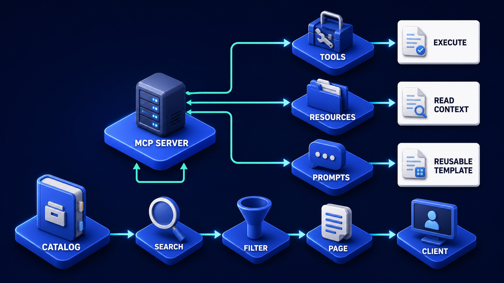

# Diagram 84 — Cache, Subscription, Extension, and Deprecation Policy

![Four labelled rows on dark navy converging on a large blue POLICY GATE shield. MCP SERVER: CACHE RESULT leads to a card showing TTL with a clock and SCOPE with a globe. SUBSCRIPTIONS LISTEN leads to an EVENT TYPES card. EXTENSION MAP leads to a REVERSE-DOMAIN IDS card listing com.example, org.tools and io.sample. DEPRECATION RAMP leads to an OLD TO NEW card with a coral REMOVAL DATE row. On the right, four outcomes — a checked database, a broadcast tower, a teal puzzle piece and a calendar with a red check — with green return lines running back along the bottom to each left-hand row.](../diagrams/84-cache-subscription-extension-policy.png)

**Module:** MCP at scale
**Role in the course:** the four policies a server publishes about its own behaviour
**Layout:** four policy rows converging on one gate, with outcomes on the right and returns beneath

---

## At a glance

Four things a server must have a stated policy about: **caching**, **subscriptions**, **extensions**, and **deprecation**. All four pass through one **POLICY GATE** and produce four corresponding outcomes.

None of these is about what the server *does*. All four are about what the server *promises*, and the diagram's argument is that promises left unstated become assumptions clients make wrongly.

---

## What the diagram teaches

### 1. Cache policy is two values, and both are required

The first card shows **TTL** with a clock and **SCOPE** with a globe.

**TTL** — how long this response remains valid. A duration, stated by the server, not guessed by the client.

**SCOPE** — who this response is valid for. Server-wide, tenant-wide, or caller-specific.

Two dimensions, and clients get the second one wrong constantly. A response cached by URL alone is shared across callers. When the response contents depend on the caller — which for any permission-filtered catalogue they do — that is a disclosure.

The globe icon is slightly misleading and worth flagging: scope is not geographic, it is *audience*.

Catalogue responses are where audience matters most, because filtering is per-caller:

The **FILTER** stage there is what makes a catalogue response caller-specific. A response cached without scope is that filter's output served to someone it was not filtered for.

### 2. Subscription policy means declaring event types, not just offering a stream

The second card is headed **EVENT TYPES** and lists coloured rows.

A server offering subscriptions must say **which events it emits**. Not "you can subscribe" — a typed enumeration.

Two reasons.

**Clients must handle unknown events.** If the set is enumerated, a client knows what it is committing to handle, and can decide what to do about additions.

**Opt-in becomes possible.** A client interested in three of eleven event types can subscribe to three, rather than receiving eleven and discarding eight.

An unenumerated stream forces clients to receive everything and guess at what arrives.

### 3. Extension IDs use reverse-domain names, and the examples are shown

The third card lists **com.example**, **org.tools**, **io.sample**.

Reverse-domain naming solves collision. Two organisations can define an extension serving a similar purpose without their identifiers clashing, because each is namespaced under a domain they control.

It also makes provenance readable. An extension identified as `com.acme.billing.v1` announces who defined it. An extension called `billing` announces nothing and will eventually collide with someone else's `billing`.

The convention is cheap and it is the difference between an ecosystem where extensions compose and one where they conflict.

### 4. The deprecation ramp is the only card with coral, and the coral is on the removal date

The fourth card shows **OLD → NEW** and, in a coral band beneath, **REMOVAL DATE**.

Three components in a deprecation policy, and the diagram shows all three.

**The old thing**, still working.
**The new thing**, available now.
**A date**, after which the old thing stops.

The coral is on the date because the date is what makes it a ramp rather than a wish. A deprecation with no removal date is a permanent maintenance obligation announced as a temporary one.

The overlap period is what makes migration possible. Both work; clients move at their own pace; the date bounds it.

### 5. All four converge on one gate, and that is a claim about consistency

Four different policies, one **POLICY GATE**.

The gate is where they are enforced consistently. A server that decides caching per endpoint, subscriptions per feature, and extension naming per whoever added it produces a surface clients cannot reason about.

One gate means one place where the answers are given, and one place to change them.

### 6. The four outcomes are the client-visible effects

On the right: a **checked database** (a cache the client may trust), a **broadcast tower** (a subscription the client may open), a **teal puzzle piece** (an extension the client may use), a **calendar with a red check** (a deadline the client must act on).

Each outcome corresponds to something a client does differently because the policy exists.

Note that the fourth outcome is the only one requiring client *action* rather than granting client *permission*. A removal date is an obligation, not an affordance — which is why it is the one with red on it.

### 7. The green returns close the loop, and they are per-policy

Green lines run from each outcome back along the base to its originating row.

Each policy is verified in use. A cache TTL that turns out to be too long produces stale-data incidents that should change the TTL. An event type nobody subscribes to should be reconsidered. An extension nobody adopts, likewise. A removal date that arrives with clients still using the old thing means the ramp was too short.

Policies are not set once. The returns say so.

---

## Case study — Grendon Systems, the deprecation that never ended

Grendon operates an MCP platform used by about 120 integrating organisations. Their server exposes 80 capabilities and has been running for four years.

They had no stated policy on any of the four. Each had accumulated a de facto behaviour instead.

### What "no policy" actually meant

**Caching.** Their list responses carried no cache headers. Clients did whatever they wanted. Some cached for a session, some for an hour, one cached indefinitely and only refreshed on restart.

When Grendon changed a capability, propagation took between zero and several weeks depending on the client. They had no way to predict or influence it.

**Subscriptions.** They offered a stream. It emitted whatever their implementation happened to emit — at last count 23 event types, of which 6 were documented.

A client upgrade in one integrating organisation broke when Grendon added a new event type the client's exhaustive switch statement did not handle.

**Extensions.** Eleven extensions existed. Names included `billing`, `advanced`, `v2` and `custom`.

Two integrating organisations had independently defined extensions named `billing` with incompatible semantics. Grendon discovered this when a third party tried to support both.

**Deprecation.** Grendon had deprecated 14 things over four years. **All 14 were still supported.**

Every deprecation had been announced with "will be removed in a future release." No dates. Nothing was ever removed, because removing something with no announced date would have broken clients without notice.

The maintenance cost of 14 permanently-deprecated features was, by their own estimate, about 20% of their platform team's capacity.

### The rebuild

**Cache policy published per response type.**

*Tool catalogue:* TTL 300 seconds, scope per-caller.
*Resource catalogue:* TTL 900 seconds, scope per-caller.
*Prompt catalogue:* TTL 3600 seconds, scope server-wide.
*Individual resource content:* TTL varies by resource, scope per-caller.

The prompt catalogue being server-wide was a deliberate exception: prompts are not permission-filtered in their system, so the response is identical for every caller.

Making that explicit forced them to verify it was true. It was, but it took a conversation, and the conversation was worth having.

**Event types enumerated and versioned.** 23 events documented, grouped into 5 categories. Clients subscribe by category or by individual type.

New event types are added to a category; a client subscribed to a category receives them. A client subscribed to individual types does not, unless it opts in. This gave them a way to add events without breaking exhaustive handlers.

**Extensions renamed to reverse-domain identifiers.** `billing` became `com.grendon.billing.v1` for theirs, and the two conflicting third-party ones became `com.northfield.billing.v1` and `io.marchgate.billing.v1`.

The rename was announced with a twelve-month overlap. Both old and new identifiers were accepted; the old ones logged a deprecation warning.

**A deprecation policy with mandatory dates.** Nothing may be deprecated without a removal date. The minimum overlap is nine months for anything in the core surface and six for extensions.

The 14 legacy deprecations were assigned dates for the first time. Two were un-deprecated — on review, they were fine and had been deprecated by someone who preferred a different approach. Twelve were given dates between nine and eighteen months out.

**Client usage was measured per deprecated feature.** This was the thing that made removal possible. Grendon could see, per integrating organisation, which deprecated features were still in use.

They contacted the users of each. Most migrated within three months of being told a date existed.

### The removal

Eighteen months later, **all twelve had been removed.**

Three organisations required extensions to their deadlines, granted individually. One organisation had gone out of business and their integration was disabled.

The platform team's estimate of maintenance capacity recovered: about 15% of their total.

### What they learned about the ramp length

Nine months turned out to be longer than necessary for most clients and not long enough for two.

Their revised policy is nine months as standard, with an extension process for clients who can demonstrate a scheduled migration. That has been used four times and refused once.

The refusal was for an organisation that had made no attempt to migrate in nine months and requested an extension three days before the deadline.

### Results

- **Deprecated features still supported:** 14 permanently → 0.
- **Platform capacity recovered:** ~15%.
- **Extension name collisions:** 1 known → structurally impossible.
- **Client breakage from added event types:** 1 incident → 0, via category subscription.
- **Catalogue change propagation:** 0 to several weeks → bounded by published TTL.

### The line in their platform policy

*A deprecation without a removal date is not a deprecation. It is a second thing to maintain forever, announced politely.*

---

## Composition

Four horizontal rows on the left converging on a central gate, with four outcomes on the right and green returns beneath.

**Left labels, top to bottom:** **MCP SERVER: CACHE RESULT**, **SUBSCRIPTIONS LISTEN**, **EXTENSION MAP**, **DEPRECATION RAMP** — each a blue platform with an icon.

**Each row:** a cyan arrow to a white policy card, then a **teal line** rightward into the **POLICY GATE**.

**POLICY GATE** — a tall blue shield-bearing monolith at centre.

**Right outcomes, top to bottom:** a **database with a teal check**, a **teal broadcast tower**, a **teal puzzle piece**, a **calendar with a red check** — each on a blue platform, reached by cyan arrows from the gate.

**Green return lines** run from each outcome along the base of the frame back to its originating left-hand platform.

## Element by element

**CACHE RESULT** — a server unit with a teal database. Card: **TTL** (blue clock) over **SCOPE** (blue globe).

**SUBSCRIPTIONS LISTEN** — a blue bell with signal arcs. Card: **EVENT TYPES** with three coloured square markers and text rows.

**EXTENSION MAP** — a blue puzzle piece. Card: **REVERSE-DOMAIN IDS** listing three pill tags — **com.example**, **org.tools**, **io.sample**.

**DEPRECATION RAMP** — a bar chart with a rising coral arrow. Card: **OLD TO NEW** with a coral **OLD** pill, an arrow, a teal **NEW** pill, above a coral band reading **REMOVAL DATE** with a calendar icon.

**POLICY GATE** — a large blue upright slab carrying a shield with a check.

## Colour and flow semantics

- **Cyan arrows** carry each row to its policy card and carry the gate's outputs to the outcomes.
- **Teal lines** carry the policy cards into the gate.
- **Green lines** carry the returns along the base — verification of each policy in use.
- **Coral** appears only twice, both in the deprecation card: the **OLD** pill and the **REMOVAL DATE** band.
- The **single gate** receiving all four rows asserts consistent enforcement.

## How to present it

**Ask what their server promises about caching.** Most have no stated TTL and no scope. Then ask what their clients actually do — the answer is usually "we don't know," which is the problem.

**Point at the two cache values.** Duration and audience. Ask which one gets forgotten. Scope, every time, and a catalogue cached by URL alone is a disclosure.

**Ask whether their event stream is enumerated.** If not, ask what a client is committing to handle. Then tell the Grendon breakage: a new event type broke a client's exhaustive switch.

**Give them the category solution.** Subscribe by category and receive additions; subscribe by individual type and opt in. That is how you add events without breaking handlers.

**Read the three reverse-domain examples.** Then tell the Grendon collision: two organisations with incompatible extensions both called `billing`, discovered by a third party trying to support both.

**Spend the most time on deprecation.** Ask how many deprecated things their system still supports. Then give them Grendon's number: 14, all of them, for four years, at about 20% of their platform team's capacity.

**Point at the coral removal date.** The date is what makes it a ramp. Without it you have announced a permanent maintenance obligation politely.

**Ask what made removal possible.** Per-client usage measurement. Grendon could see who was still using what and contact them. Most migrated within three months of learning a date existed.

**Note the two un-deprecations.** On review, two of the fourteen were fine and had been deprecated by someone who preferred a different approach. Writing down a date forces a review that "deprecated indefinitely" never triggers.

**Trace the green returns.** Policies are verified in use and revised. A TTL that produces stale-data incidents is wrong. A ramp that ends with clients still on the old thing was too short.

**Timing.** Twenty-five minutes. Thirty-five if you draft the four policies for the room's own server, which usually stalls on the deprecation date.

---

## Lab and checkpoint

**Lab:** Draft four policies for one server you own: cache policy with TTL and scope, subscription policy with event categories and types, extension policy with reverse-domain IDs, and deprecation policy with a removal date. For each, write the client-visible effect and the metric you would use to verify the policy is working.

**Checkpoint:** Why is the removal date in the deprecation policy marked in coral?

**Answer:** Because the removal date is the point at which support ends, and missing it turns a deprecation into a permanent maintenance obligation. The coral marks the date as the critical commitment in the policy.

## Glossary

- **Cache policy** — the rule that declares how long and for whom a catalogue may be cached.
- **Category** — a grouping of event types that lets clients subscribe to a family of events.
- **Deprecation** — the process of marking a feature or extension as going away.
- **Event type** — a specific kind of event a server can emit.
- **Extension** — an optional addition to the protocol, identified by a reverse-domain name.
- **Policy gate** — the point where all four policies are checked for consistency.
- **Removal date** — the date by which a deprecated feature will no longer be supported.
- **Reverse-domain name** — a namespaced identifier that avoids collision.
- **Scope** — the audience or caller group for which a cache entry is valid.
- **Subscription policy** — the rule declaring which event types a server offers and how clients subscribe.
- **TTL** — time-to-live, how long a cache entry remains valid.

## Sources

- MCP cache, subscription, and extension policy design
- Deprecation ramps and removal-date policies
- Reverse-domain naming and namespace collision avoidance
