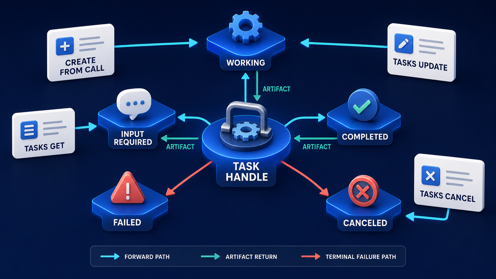

# Diagram 85 — Multi Round-Trip Requests and Input Required

![A two-tier layout on dark navy. A CLIENT laptop sends TOOL REQUEST to a dark SERVER stack. The server produces RESULT TYPE INPUT REQUIRED with REQUEST 1 and REQUEST 2 cards leading to a REQUEST STATE clipboard. A cyan arrow drops to HUMAN INPUT, a person with a headset, which returns INPUT RESPONSES to the server and also connects right to the request state. A coral arrow from a red TIMEOUT alarm clock points at the server. Below, a second CLIENT sends ORIGINAL CALL (RETRY) to the server, producing a FINAL RESULT card with a teal check. A dashed blue line connects the upper client to the lower one.](../diagrams/85-mrtr-input-required-loop.png)

**Module:** MCP at scale
**Role in the course:** a stateless call that spans a human decision
**Layout:** an upper pause cycle and a lower retry, linked by a dashed client line

---

## At a glance

A tool request returns **RESULT TYPE INPUT REQUIRED** rather than a result. Questions go to a human. The human's answers, plus the **REQUEST STATE** the server had accumulated, are carried by the **ORIGINAL CALL (RETRY)** — which produces the final result.

A coral **TIMEOUT** hangs over the upper tier, pointing at the server.

The layout is doing something subtle: the client appears **twice**, upper and lower, joined by a dashed line. Same client, two moments in time — before the pause and after it.

---

## What the diagram teaches

### 1. INPUT REQUIRED is a result type, not an error

The label is precise: **RESULT TYPE INPUT REQUIRED**.

It is one of the values the result field can take. Not an error branch, not an exception, not a failure code.

That classification determines everything downstream. A client library that treats it as an error will surface it to an operator as a failure, and the operator will re-submit the identical call — which fails identically, because nothing about the call was wrong.

The classification also means the response is well-formed and carries structured content, which the next point depends on.

### 2. The questions are numbered and plural

**REQUEST 1** and **REQUEST 2** — two cards, each with a question glyph.

A pause may need more than one thing answered. Numbering them means a human can answer both in one interaction rather than in two round trips.

It also means the answers are **attributable**. Two questions and two answers need pairing, and an unnumbered list of answers to an unnumbered list of questions is ambiguous.

### 3. REQUEST STATE is what the server had established before it paused

The clipboard card at the right, fed both by the questions and by the human's answers.

This is the work already done — parsed inputs, resolved entities, computed candidates, prior lookups. Everything the server would otherwise have to redo.

Two reasons it must travel with the retry.

**Cost.** Recomputing may involve expensive lookups. For a pause of twenty minutes, redoing them is waste.

**Correctness.** Recomputation may produce *different* results. A candidate set derived from data that has since changed means the human answered a question about options that no longer exist.

That second reason is the one teams underestimate. It converts a performance optimisation into a correctness requirement.

### 4. The human's answers go to two places

Follow the arrows from **HUMAN INPUT**: one runs left, labelled **INPUT RESPONSES**, back to the server. Another runs right into **REQUEST STATE**.

The answers are both a message to the server and part of the state the retry carries.

That dual routing is what makes the retry self-contained. It does not depend on the server having remembered anything; it brings the answers and the accumulated state with it.

### 5. The coral TIMEOUT is aimed at the server, and it is the failure this design must handle

A red alarm clock with a coral arrow pointing at the server.

The timeout is the thing that makes naive designs fail. A human takes minutes; a request has a timeout measured in seconds. The connection dies while the human is thinking.

Which is precisely why the retry exists as a separate call rather than as a held-open connection. The pause is not a long request; it is a completed response, a human interval, and a new request.

The timeout arrow pointing *at the server* rather than at the client is worth noticing: it is the server's in-flight handling that must survive, and the design's answer is that nothing needs to survive because nothing is held.

### 6. The client appears twice, and the dashed line is the key to reading the diagram

Upper **CLIENT** and lower **CLIENT**, joined by a **dashed blue line** running down the left side.

Same client. Two moments. The dashed line is a time relationship, not a data flow.

This is the diagram's cleverest device and its easiest misreading. Learners frequently see two clients and ask which one is which. The answer is that the vertical axis here is time, not topology.

### 7. The retry is labelled ORIGINAL CALL, and that word choice matters

**ORIGINAL CALL (RETRY)** — not "follow-up call," not "continuation."

It is the same logical operation being attempted again, now with what it needed. The method is the same. The intent is the same. What has changed is that the missing information is present.

That framing matters for idempotency: the retry carries the same operation identity, so a server that has partially acted must recognise it as a repeat rather than as a new request.

This is one of two answers to work that outlasts a request. The other promotes the call into a durable object:

The difference is where the state lives. Here the **client** carries it on the retry; there the **server** holds it against a handle. Multi round-trip suits pauses measured in minutes; tasks suit work measured in hours.

---

## Case study — Corbridge Chemical, the classification that stalled

Corbridge manufactures speciality chemicals and ships internationally. Every outbound shipment needs a hazard classification — UN number, packing group, transport category — which determines packaging, documentation, and which carriers can take it.

Their logistics assistant calls a classification capability. About 22% of shipments are ambiguous.

### The first implementation

`classify_hazard(product_code, quantity, destination)` returned a classification.

For ambiguous cases — typically mixtures where the classification depends on concentration, or products where the destination's regulations differ from the origin's — the capability had no way to ask. It returned its best guess.

Over fourteen months this produced **six misclassified shipments**. Four were caught at the carrier. Two were not.

One of the two was a mixture classified one packing group too low. It shipped, arrived, and was identified during a customer's incoming inspection. Corbridge reported it to the regulator themselves.

### Why the naive fixes failed

**Attempt one: hold the connection open.** The capability paused and waited for a human answer on the same connection.

Their gateway timed out at 30 seconds. A logistics coordinator takes between one and fifteen minutes to resolve a classification question, often needing to check a specification sheet.

Every pause timed out. The work continued server-side, the coordinator's answer arrived at a connection that no longer existed, and the shipment sat unclassified.

**Attempt two: return an error and re-submit.** The capability returned an error indicating more information was needed.

Coordinators received an error, read "classification failed," and re-submitted the identical request. It failed identically. Their support queue filled with "the classifier is broken."

The error framing was the whole problem. Nothing was broken; a question had been asked and rendered as a failure.

### The rebuild as a multi round-trip

**INPUT REQUIRED as a result type.** The capability returns a well-formed result whose type is `input_required`, carrying structured questions.

Their client library was updated to render this as a question, not an error. That single change eliminated the re-submission behaviour.

**Numbered, structured questions.** A typical ambiguous case produces two:

> **Request 1:** Concentration of component B in this batch? Classification differs above and below 25%. Options: <25%, 25–50%, >50%.
> **Request 2:** Is this shipment travelling by air at any leg? Air transport applies a stricter packing group for this substance class.

A coordinator answers both in one interaction, typically in under two minutes.

**Request state carried on the retry.** The state includes the parsed product composition, the resolved regulatory jurisdiction for the destination, the applicable regulation version, and the candidate classifications already computed.

That last item is what made it correct rather than merely fast. Regulations are updated periodically, and their classification database is refreshed monthly. Recomputing candidates after a pause that spanned an update produced, in testing, a case where a coordinator had answered a question about three options and the recomputation offered four.

Carrying the state means the retry resolves against the candidate set the coordinator actually saw.

**A pause expiry.** Pauses expire after four hours. On expiry the shipment is flagged for manual classification by their regulatory affairs team, and the booking cannot proceed to documentation.

Expiry produces a defined outcome, not a silent default to the best guess — which is what the original system effectively did.

### The idempotency detail

Their retry carries the same operation identity as the original call.

This mattered because the classification capability writes an audit record on every classification performed, for regulatory traceability. Without operation identity, the pause-and-retry cycle produced two audit records for one classification — one for the paused attempt and one for the completed retry.

The regulator's expectation is one record per classification decision. The identity lets the capability recognise the retry and update the existing record rather than creating a second.

### Results

- **Misclassified shipments:** 6 in fourteen months → 0 in the following eighteen.
- **Pause rate:** ~22% of shipments, median answered in 3 minutes.
- **Expired pauses:** ~1.5%, all routed to regulatory affairs.
- **Support tickets saying "the classifier is broken":** eliminated.
- **Duplicate audit records:** eliminated by operation identity.

### The line in their integration guide

*Input required is not a failure. It is the capability doing its job — telling you it cannot answer without something only you know.*

---

## Composition

Two tiers with a dashed vertical link on the left.

**Upper tier:** **CLIENT** (laptop with a person) → labelled arrow **TOOL REQUEST** → **SERVER** (dark stacked unit). From the server, a cyan arrow rises right under the heading **RESULT TYPE INPUT REQUIRED** to two white cards, **REQUEST 1** and **REQUEST 2**, then a teal line to a white **REQUEST STATE** clipboard card.

A cyan arrow drops from the server area to **HUMAN INPUT** — a teal person figure with a headset and a message bubble. From it, a **teal arrow** labelled **INPUT RESPONSES** runs left and up into the server; a **teal line** runs right and up into the request state card.

A **red alarm clock** labelled **TIMEOUT** sits at centre-left with a **coral arrow** pointing up at the server.

**Lower tier:** a second **CLIENT** laptop → labelled arrow **ORIGINAL CALL (RETRY)** → a second **SERVER** stack → cyan arrow → a white **FINAL RESULT** card with a teal check disc.

A **dashed blue line** runs from the upper client down to the lower client.

## Element by element

**CLIENT** (both) — a blue person figure at a laptop showing `</>`.

**SERVER** (both) — a dark stacked server unit with blue indicator lights.

**REQUEST 1 / REQUEST 2** — white cards each with a blue document-and-question icon.

**REQUEST STATE** — a white card with a teal clipboard showing checked rows.

**HUMAN INPUT** — a teal person figure wearing a headset, with a teal message bubble.

**TIMEOUT** — a red alarm clock with bells, on a blue platform, labelled in coral.

**FINAL RESULT** — a white card with a large teal check disc.

## Colour and flow semantics

- **Cyan arrows** carry the request, the pause, and the retry.
- **Teal arrows** carry the human's responses and the accumulated state — returns rather than forward work.
- **Coral** appears once, on the timeout, pointing at the server.
- The **dashed blue line** between the two clients marks a time relationship, not a data flow.
- **REQUEST STATE is fed from two directions** — from the questions and from the answers — which is what makes the retry self-contained.

## How to present it

**Ask what a tool does when it needs something only a human knows.** Guess, or fail. Then show the third option and stress the label: **result type**, not error type.

**Tell the Corbridge error-framing failure.** Coordinators reading "classification failed" and re-submitting the identical request. Their support queue filled with "the classifier is broken" when nothing was broken.

**Ask why the connection cannot just be held open.** A human takes minutes; a gateway times out in seconds. Then point at the coral timeout arrow.

**Explain the two clients.** This is where rooms get stuck. Same client, two moments, vertical axis is time. Say it before someone asks.

**Ask what REQUEST STATE is for.** Push past cost to correctness: recomputation after a pause can produce a different candidate set, meaning the human answered a question about options that no longer exist. Corbridge found this in testing.

**Point at the two arrows from HUMAN INPUT.** Answers go to the server *and* into the state. That dual routing is what makes the retry carry everything.

**Read the two Corbridge questions aloud.** Concentration band, and air transport leg — each with the reason it matters. Ask whether a coordinator with no regulatory training could answer them. Then contrast with "more information required."

**Ask about expiry.** Four hours, then flagged for regulatory affairs. Not a silent default to the best guess, which is what the original system effectively did.

**Raise the idempotency point.** The retry is the *original call*. Corbridge's audit records were being written twice until they carried operation identity — one for the pause, one for the completion, where the regulator expects one per decision.

**Timing.** Twenty-five minutes. Thirty if you draft the questions and request state for one of the room's own ambiguous operations.

---

## Lab and checkpoint

**Lab:** Identify one operation in your system that needs human input before it can continue. Design it as an INPUT REQUIRED result: write the pause state, the numbered questions, where the human's answers go, the timeout and expiry rule, and how the retry carries the original call identity without duplicating records.

**Checkpoint:** Why is INPUT REQUIRED a result, not an error?

**Answer:** Because an error implies something went wrong and the request can be resubmitted. INPUT REQUIRED is a normal, expected state that pauses the workflow and asks for more information. Calling it an error makes clients retry the same request instead of gathering the needed input.

## Glossary

- **Error** — a result that indicates the request failed due to a problem.
- **Expiry** — the time after which the paused request is abandoned or escalated.
- **Human input** — the answers provided by a person to resolve the input-required pause.
- **Idempotency** — the property that the same request, sent again, produces the same effect.
- **Input required** — a result that pauses the request and asks for more information.
- **Original call** — the retry that carries the same operation identity as the first attempt.
- **Pause** — the state where the server stops and waits for the client or human.
- **Request state** — what the server had established before the pause, so the retry can resume correctly.
- **Result** — the response to a call, including success, error, and input-required.
- **Timeout** — the time limit for the human or client to respond.

## Sources

- MCP multi-round-trip requests and input-required
- Paused workflow state and idempotent retries
- Human-in-the-loop request design
