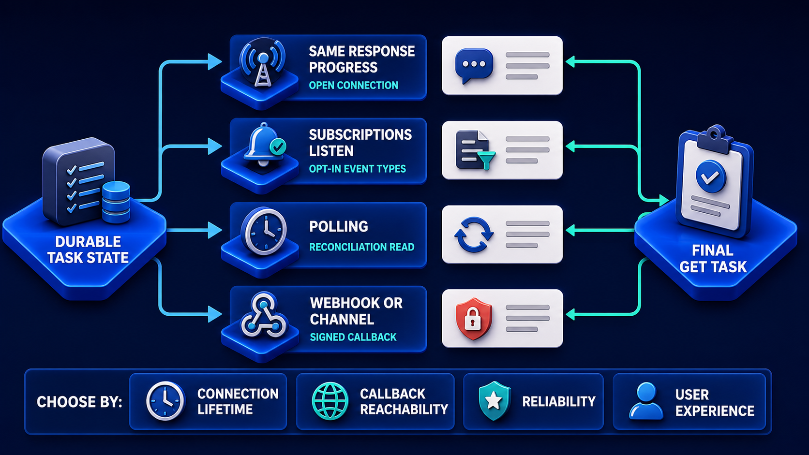

# Diagram 86 — The MCP Tasks Extension Lifecycle

![A radial layout on dark navy with a TASK HANDLE padlock-and-gear at centre. CREATE FROM CALL feeds WORKING at the top; TASKS UPDATE feeds it from the right. TASKS GET feeds INPUT REQUIRED on the left. The handle connects outward to WORKING, INPUT REQUIRED and COMPLETED, with teal ARTIFACT arrows returning from each. Coral arrows run from the handle to FAILED and CANCELED, and TASKS CANCEL feeds CANCELED from the right. A legend reads FORWARD PATH in cyan, ARTIFACT RETURN in teal, TERMINAL FAILURE PATH in coral.](../diagrams/86-mcp-tasks-extension-lifecycle.png)

**Module:** MCP at scale
**Role in the course:** the durable object a long call becomes
**Layout:** a central task handle with five states around it and three control operations entering from outside

---

## At a glance

A **TASK HANDLE** at the centre — drawn as a padlock over a gear — with five states around it and three control operations entering from the edges: **TASKS GET**, **TASKS UPDATE**, **TASKS CANCEL**.

The legend at the bottom names three path types: **FORWARD PATH** (cyan), **ARTIFACT RETURN** (teal), **TERMINAL FAILURE PATH** (coral).

The handle at the centre rather than at the start is the composition's argument. This is not a pipeline with a handle at one end. The handle is the object; everything else is something that happens to it.

---

## What the diagram teaches

### 1. The handle is a lock and a gear, and both halves are meaningful

The central icon pairs a **padlock shackle** with a **gear**.

The gear is the work. The lock is the identity — a handle is something you hold that grants access to that work and to nothing else.

That framing matters for authorisation. A task handle is a capability reference: possession of it should not by itself grant access. The lock says the handle is bound to something, and the binding is what a server checks when a handle is presented.

### 2. CREATE FROM CALL is how tasks come into existence

Top left, feeding **WORKING**.

The label is precise. A task is not created by a separate "create task" operation. It is created **from a call** — an ordinary tool invocation that the server determines will take too long to answer inline.

The client did not ask for a task. It made a call and received a handle instead of a result.

That is why a client must handle both response shapes, and why the decision belongs to the server, which knows its own durations.

### 3. Three control operations enter from outside the ring

**TASKS GET** (left) feeds **INPUT REQUIRED**. **TASKS UPDATE** (right) feeds **WORKING**. **TASKS CANCEL** (right) feeds **CANCELED**.

They enter from the edges rather than from the handle, which is the right rendering: they are things a client does *to* the task, not transitions the task makes on its own.

**TASKS GET** — read state. Drawn feeding input-required because that is the state a client most needs to discover; a task waiting for an answer is invisible unless someone asks.

**TASKS UPDATE** — supply what the task asked for. This is what resolves an input-required state and returns the task to working.

**TASKS CANCEL** — stop it. Produces the canceled terminal state.

### 4. ARTIFACT returns from three states, not one

Teal arrows labelled **ARTIFACT** run from **WORKING**, **INPUT REQUIRED** and **COMPLETED** back toward the handle.

That is the detail most easily missed and it is a real capability claim: **artifacts are not exclusive to completion**.

A task can produce a deliverable while still working. A task pausing for input can attach what it has produced so far, so the human answering the question can see it.

Systems that only surface artifacts at completion make users wait for work already done, and make input-required questions harder to answer than they need to be.

### 5. The two terminal failures are coral and they leave the handle directly

**FAILED** (red triangle) and **CANCELED** (red cross) are reached by **coral arrows from the handle itself**, not from working.

Drawing them from the handle says these are terminal states of the task object, reachable from wherever it currently is. A task can fail while working, while waiting for input, or during finalisation.

The two are visually distinguished by shape — triangle for failure, circle-cross for cancellation — reinforcing that they mean different things. Failure is the work not succeeding; cancellation is a decision to stop.

### 6. The legend names three path types, and that is unusual enough to notice

Most diagrams in this library rely on colour convention without stating it. This one spells it out: forward, artifact return, terminal failure.

The explicitness is appropriate because this diagram is radial rather than linear. In a left-to-right flow, direction carries meaning. In a radial one it does not, so the colours have to do more work and naming them removes ambiguity.

### 7. The extension is optional, and clients must discover whether it exists

The word **extension** in the title is load-bearing.

Tasks are not part of the core protocol surface. A server may or may not support them, and a client must discover which.

Two obligations follow. A client must handle a server that does not offer tasks — which means its long-running work either blocks or is not available. And a server offering tasks must still serve clients that do not understand them.

That second one is the harder constraint, and it is why the create-from-call framing exists: a task-unaware client making a call that becomes a task receives something it cannot interpret, so a server must either not promote that client's calls or must degrade gracefully.

Once a task exists, how a client learns about its progress is a separate choice:

**TASKS GET** in this diagram is that diagram's polling path — and its convergence on a final task read is why polling remains the guarantee whichever mechanism delivers the news first.

---

## Case study — Nithsdale Genomics, the pipeline that had no handle

Nithsdale provides genomic analysis to research institutions and clinical laboratories. Their MCP layer exposes analysis capabilities — variant calling, annotation, cohort comparison — to their customers' research assistants.

A variant-calling run takes between eight minutes and four hours depending on sample depth and reference genome.

### What they had

`run_variant_analysis(sample_id, reference, parameters)` as a plain tool call.

Their gateway timed out at 60 seconds. Every analysis timed out. The job continued on their compute cluster.

Their workaround was a second capability: `get_analysis_result(sample_id)`, which a client polled.

It worked, badly, for four reasons.

**Sample ID was not run identity.** Two analyses of the same sample with different parameters collided. A client polling by sample ID could receive the wrong run's result.

**No state beyond done-or-not.** The polling capability returned a result or nothing. A client could not distinguish queued, running, failed, or a run that had never started because the submission had silently failed.

**No cancellation.** An analysis started with wrong parameters ran to completion. At up to four hours of cluster time per run, and roughly 8% of runs started with a parameter error, this was measurable money.

**No way to ask a question.** Some analyses encounter ambiguity — a sample whose reference genome assignment is inconsistent with its metadata. The pipeline guessed. Three clinical results were produced against the wrong reference before anyone noticed.

### The rebuild on the tasks extension

**Create from call.** `run_variant_analysis` now returns a task handle when the server estimates the run will exceed 45 seconds. About 96% of runs. Short validation-only runs still return inline.

The estimate uses sample depth and reference size, and it is deliberately conservative — a call that returns inline is better than a handle for something that finishes immediately.

**The handle is the identity.** Not the sample ID. Two analyses of the same sample with different parameters are two tasks with two handles, and they cannot collide.

**tasks/get returns real state.** `queued`, `working` with percentage and current phase, `input_required`, `completed`, `failed` with a reason, `canceled`.

The `queued` state alone resolved a recurring support pattern. Their cluster queues during peak periods, and researchers had been reporting analyses as "stuck" when they were waiting for capacity. Distinguishing queued from working eliminated that category of ticket.

**tasks/cancel.** Analyses started with wrong parameters are cancelled. About 8% of runs, at an average of 40 minutes of cluster time reclaimed each.

Their compute cost fell about 6% from cancellation alone.

**tasks/update for the reference ambiguity.** When a sample's reference assignment is inconsistent with its metadata, the task moves to `input_required` with the specific conflict and the candidate references.

A researcher resolves it. The task resumes from where it paused rather than restarting — which for a run that paused at minute thirty of a two-hour analysis is the difference between a four-minute delay and a two-hour one.

### The artifact-before-completion finding

The capability they had not anticipated was artifacts from non-terminal states.

A variant-calling run produces intermediate outputs — an alignment summary at about 20% and a quality report at about 60% — that researchers use to decide whether the run is worth continuing.

Under the old design these were only visible at completion, by which point the decision was moot.

Now the task attaches them as artifacts as they are produced. Researchers check the alignment summary at 20% and cancel roughly 3% of runs that show poor alignment, rather than waiting two hours to discover it.

That combination — early artifacts plus cancellation — is worth more than either alone.

### The task-unaware client problem

One of their customers ran an older client that did not understand task handles.

Their solution was to make promotion conditional on the client declaring task support in its capabilities. A client that does not declare it gets the old behaviour: the call blocks, and if it exceeds the gateway timeout, it fails.

That is worse for that customer, and it is correct — a server must not return something a client cannot interpret. The customer upgraded within two months once the trade was explained.

### Results

- **Analyses lost to timeout:** effectively all → none.
- **Cluster cost:** down ~6% from cancellation, plus a further ~2% from early-artifact cancellation.
- **Wrong-reference clinical results:** 3 → 0.
- **"Stuck analysis" support tickets:** eliminated by the queued state.
- **Resume rather than restart on input-required:** saved an average of 50 minutes per paused run.

### The line in their client integration guide

*The handle is the run. Not the sample, not the parameters, not the submission. If you are polling by anything else, two runs will eventually collide.*

---

## Composition

A radial layout with a central object, five states around it, three control cards entering from outside, and a legend beneath.

**Centre:** **TASK HANDLE** — a metallic padlock shackle over a blue gear, on a large blue platform.

**Around it:** **WORKING** (blue gear, top), **INPUT REQUIRED** (white speech bubble, left), **COMPLETED** (green check disc, right), **FAILED** (red warning triangle, lower left), **CANCELED** (red circular cross, lower right).

**Control cards entering from outside:** **CREATE FROM CALL** (upper left, white card with a blue plus) → cyan arrow into **WORKING**. **TASKS UPDATE** (upper right, white card with a blue pencil) → cyan arrow into **WORKING**. **TASKS GET** (left, white card with a blue list) → cyan arrow into **INPUT REQUIRED**. **TASKS CANCEL** (right, white card with a blue ✗) → cyan arrow into **CANCELED**.

**Teal ARTIFACT arrows** run from **WORKING**, **COMPLETED** and **INPUT REQUIRED** toward the handle.

**Coral arrows** run from the handle outward to **FAILED** and **CANCELED**.

**Legend:** a bordered strip reading **FORWARD PATH** (cyan arrow), **ARTIFACT RETURN** (teal arrow), **TERMINAL FAILURE PATH** (coral arrow).

## Element by element

**TASK HANDLE** — a padlock shackle over a gear. Identity and work.

**WORKING** — a blue gear. Active processing.
**INPUT REQUIRED** — a white speech bubble with dots. Paused, awaiting an answer.
**COMPLETED** — a green check disc. Successful terminal state.
**FAILED** — a red warning triangle. Terminal.
**CANCELED** — a red circular cross. Terminal.

**CREATE FROM CALL** — white card with a blue plus tile.
**TASKS GET** — white card with a blue list tile.
**TASKS UPDATE** — white card with a blue pencil tile.
**TASKS CANCEL** — white card with a blue ✗ tile.

## Colour and flow semantics

- **Cyan** carries creation and the three control operations inward.
- **Teal** carries artifact returns from three states, not only from completion.
- **Coral** carries the two terminal failures outward from the handle.
- The **legend names all three**, which is unusual in this library and appropriate for a radial layout where direction carries no meaning.
- The **handle at centre** asserts that the task is an object rather than a stage.

## How to present it

**Point at the centre and ask why the handle is there rather than at the start.** It is the object. Everything else happens to it.

**Read CREATE FROM CALL carefully.** The client made an ordinary call and got a handle. It did not ask for a task. Then ask what that means for client code — handle both response shapes.

**Ask where the three control operations enter from.** Outside the ring. They are things a client does to the task, not transitions the task makes.

**Point at the three ARTIFACT arrows.** From working, from input-required, from completed. Ask why artifacts are not exclusive to completion, then give the Nithsdale example: an alignment summary at 20% that lets a researcher cancel a two-hour run.

**Note where the failure arrows originate.** From the handle, not from working. A task can fail from any state.

**Tell the Nithsdale sample-ID collision.** Polling by sample ID meant two analyses of the same sample with different parameters could return each other's results. The handle is the run identity, and nothing else is.

**Ask what the queued state bought them.** Distinguishing waiting-for-capacity from running eliminated a whole support category. Ask whether the room's long-running work distinguishes them.

**Do the cancellation arithmetic.** 8% of runs at 40 minutes of cluster time each. About 6% of their compute cost, from one operation they had not implemented.

**Raise the task-unaware client obligation.** A server must not return something a client cannot interpret. Nithsdale made promotion conditional on declared capability, which is worse for that customer and correct.

**Timing.** Twenty-five minutes. Thirty-five if you map the room's own long-running work onto the five states and identify which control operations they lack.

---

## Lab and checkpoint

**Lab:** Map one long-running process in your system onto the five states of the MCP tasks lifecycle: created/queued, working, input-required, completed, failed. For each, write what artifacts are produced, what control operations are allowed, and what the client must know. Then design the handle and the promoted-by-capability response.

**Checkpoint:** Why is the handle the right identity for a task, not the original sample or request ID?

**Answer:** Because the same sample or request can trigger multiple tasks with different parameters. The handle identifies a single run. Polling by sample ID can return results from a different run, leading to collisions and wrong conclusions.

## Glossary

- **Artifact** — a produced object that may be available before the task completes.
- **Cancel** — the control operation that stops a task.
- **Create from call** — the way a long-running task is created from a normal call that returns a handle.
- **Failed** — the terminal state when the task cannot complete.
- **Handle** — the task identity returned to the client.
- **Input-required** — the state where the task pauses for more information.
- **Lifecycle** — the set of states and transitions a task can go through.
- **Queued** — the state where the task is waiting for capacity.
- **Task** — the long-running unit of work managed by the MCP tasks extension.
- **Working** — the state where the task is actively executing.

## Sources

- MCP tasks extension and lifecycle
- Long-running task handles and polling
- Task state machines and artifact delivery
