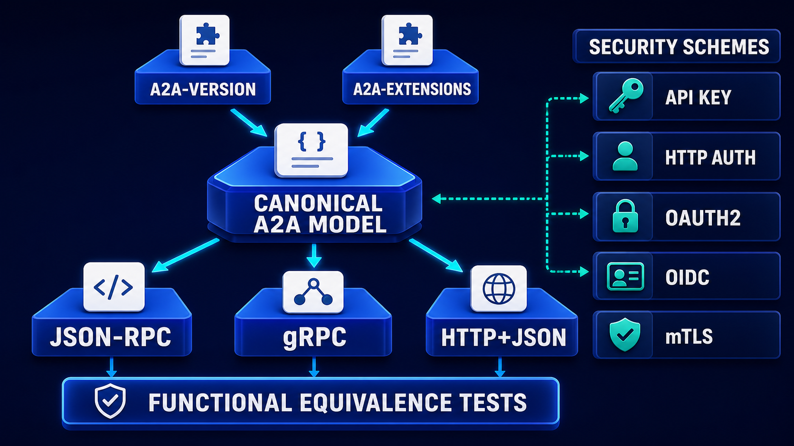

# Diagram 89 — A2A Agent Card and Trust

![A client at a laptop on dark navy sends DISCOVER to an AGENT CARD, which EXPLODEs via dashed blue lines into seven white cards — PROVIDER, CAPABILITIES, SKILLS, INTERFACES highlighted with a blue outline, EXTENSIONS, SECURITY and SIGNATURES. A cyan arrow from INTERFACES leads to TRUST POLICY, a blue arch containing a teal shield, then SELECT INTERFACE to MESSAGE SEND, a speech bubble with a paper plane. Two coral arrows drop from trust policy to UNKNOWN ISSUER, a hooded figure with a red cross, and ALGORITHM, a padlock over 1010 0101 with a red cross. A teal dashed line runs from those back to the client.](../diagrams/89-a2a-agent-card-trust.png)

**Module:** A2A in depth
**Role in the course:** what an agent card contains and what a trust policy does with it
**Layout:** discovery exploding into seven sections, one feeding a trust gate with two named rejections

---

## At a glance

An agent card **explodes into seven sections**, of which exactly one — **INTERFACES**, highlighted with a blue outline — feeds the **TRUST POLICY**.

The policy either **selects an interface** and proceeds to send a message, or rejects for one of two named reasons: **UNKNOWN ISSUER** or **ALGORITHM**.

Two things to notice. The card is much richer than the trust decision needs. And the two rejections are named specifically, not lumped as "trust failed."

---

## What the diagram teaches

### 1. Seven sections, and they serve different consumers

**PROVIDER** (building) — who operates this agent. The legal entity, not the software.

**CAPABILITIES** (cubes) — what protocol-level features it supports.

**SKILLS** (brain) — what it can actually do, in domain terms. Distinct from capabilities: capabilities are protocol features, skills are competences.

**INTERFACES** (plug) — how to connect. Transports, endpoints, bindings.

**EXTENSIONS** (puzzle) — optional additions.

**SECURITY** (padlock shield) — what authentication schemes it accepts.

**SIGNATURES** (pen) — cryptographic attestation of the card itself.

Different sections answer different questions, and they are consumed at different moments. A human evaluating whether to work with an agent reads provider and skills. A client deciding how to connect reads interfaces and security. A validator reads signatures.

### 2. Skills and capabilities are separate, and conflating them is a real error

Worth dwelling on because the two words are used loosely.

**Capabilities** — protocol features. Does it support streaming? Does it support push notifications? Does it support the tasks model?

**Skills** — what it does. Can it adjudicate a credit decision? Can it translate to Portuguese? Can it classify a hazardous shipment?

A client selecting an agent for a job needs skills. A client deciding how to talk to it needs capabilities. An agent card that merges them forces every consumer to filter the combined list for what they care about.

### 3. Only INTERFACES feeds the trust policy, and the highlight says so

Of the seven exploded cards, **INTERFACES is outlined in blue** and it is the only one with a solid cyan arrow into **TRUST POLICY**. The other six connect by **dashed lines** to the explosion point and go no further.

That is a claim about what a trust decision is *about*.

The trust policy is not evaluating whether the agent is good at its job, or whether its provider is reputable, or whether its skills match the need. Those are decisions made elsewhere — by a human, at allowlisting time.

The trust policy is evaluating **how you are about to connect**: which interface, over which transport, with which security scheme, attested by which signature. It is a connection-time decision, and interfaces is the section that describes the connection.

### 4. SELECT INTERFACE is the output, and selection implies plurality

The arrow leaving the trust policy is labelled **SELECT INTERFACE**.

An agent card typically declares several. The same agent may be reachable over multiple transports with different security schemes.

The trust policy's job is to pick one — the one that satisfies your requirements. If your policy requires mutual TLS and the card declares three interfaces of which one supports it, that is the one selected.

If none satisfies your policy, the correct outcome is a rejection, not a downgrade to whatever is available.

### 5. The two rejections are named, and they are different failures

**UNKNOWN ISSUER** — a hooded figure with a red cross. The card's signature chains to an issuer you do not accept.

This is an identity failure. The card may be perfectly valid; you have no basis for believing it describes who it claims to describe.

**ALGORITHM** — a padlock over binary digits, with a red cross. The signature uses an algorithm your policy does not permit.

This is a cryptographic-policy failure. The issuer may be entirely acceptable; the signature is not made with something you are willing to rely on.

Naming both separately matters operationally. An unknown issuer is resolved by an onboarding conversation. A rejected algorithm is resolved by the other party changing their signing configuration. Reporting both as "trust failed" means neither gets resolved.

### 6. The teal dashed return goes to the client, and rejections are information

A **teal dashed line** runs from the rejection area back along the base to the **CLIENT**.

Rejections return. The client learns which of the two occurred, and can act on it.

A trust policy that silently declines produces an integration nobody can debug. One that names the reason produces one the other party can fix.

### 7. Signatures cover the card, which is why the card can be fetched from anywhere

The **SIGNATURES** section is what makes the rest of the card trustworthy independent of how it was obtained.

A signed card fetched from a mirror, a cache, or a registry is as good as one fetched from the agent directly, provided the signature validates.

That property is what makes agent discovery workable at ecosystem scale. Without it, every consumer would need a trusted channel to every agent.

It also means **a card that changes must be re-validated**, because the signature covers a specific content. A changed card with a valid signature over the new content is a new claim, and it should re-enter the trust policy rather than being accepted as an update.

What the selected interface may offer is drawn from a fixed set of schemes:

The card's **SECURITY** section declares which of those five an interface accepts, and the trust policy's job is to select an interface whose scheme satisfies your requirements — not to accept whichever is offered.

---

## Case study — Calderbank Clearing, the algorithm nobody had a policy about

Calderbank operates a clearing and settlement platform connecting about 200 financial institutions. They introduced A2A so that institutions' own agents could interact with Calderbank's settlement agents directly.

Trust was the entire project. Every counterparty is a regulated entity, and a mistaken identity has consequences measured in millions.

### The onboarding process they built

A counterparty registers, proves control of a domain, and publishes an agent card at a well-known location under it.

Calderbank fetches the card, validates it, and — if the trust policy passes — adds the agent to an allowlist after a human review of the provider and skills sections.

### What the trust policy checks

**Signature validity** — the card is signed and the signature verifies over the card's content.

**Issuer** — the signing certificate chains to one of four certificate authorities Calderbank accepts. Three are public CAs; one is a financial-sector CA their regulator recognises.

**Algorithm** — the signature algorithm is on Calderbank's permitted list.

**Interface selection** — Calderbank requires mutual TLS on any interface it will use. A card declaring only interfaces without it is rejected.

**Freshness** — the card carries a timestamp within 30 days, re-fetched daily.

### The algorithm rejection that mattered

Eight months in, a mid-sized institution's card began failing with an algorithm rejection.

Their integration had been working. Their signing certificate had been rotated as part of a routine renewal, and the new certificate used a signing algorithm that had been permitted when their platform was configured years earlier and had since been deprecated in Calderbank's policy.

**The specific error is what made this a two-hour problem rather than a two-week one.**

Calderbank's rejection said: *card signature uses RSASSA-PKCS1-v1_5 with SHA-1; permitted algorithms are [list]; your certificate was issued 2026-08-14 by [issuer].*

The institution's platform team read it, identified their signing configuration, reissued with a permitted algorithm, and republished. Total elapsed time from rejection to restoration: about two hours.

Under a generic "trust validation failed" message, their own estimate was that it would have taken a week of back-and-forth to establish that the problem was the algorithm and not the certificate, the chain, the domain, or the card contents.

### The unknown-issuer case they got wrong first

Their initial policy treated unknown issuer and invalid signature identically.

A counterparty using an internal CA — legitimate for their own infrastructure, unknown to Calderbank — received a message indicating their signature was invalid.

Their team spent nine days investigating a signing problem that did not exist. Their signature was perfectly valid; Calderbank simply did not accept the authority that issued it.

The distinction is: *your signature does not verify* versus *your signature verifies and I do not accept who vouched for you*. Those are entirely different conversations.

Separating them turned a nine-day investigation into a one-email onboarding request.

### The interface selection finding

A counterparty's card declared four interfaces: JSON-RPC over mutual TLS, JSON-RPC over an API key, gRPC over mutual TLS, and HTTP+JSON over OAuth2.

Calderbank's policy selected the first. The counterparty's engineers had expected the fourth, because it was the one they had documented and tested most thoroughly.

Nothing was wrong — Calderbank selected an interface the card declared and the counterparty supported. It simply was not the one they had focused on, and it exposed a bug in their less-exercised path.

**The change:** Calderbank now reports the selected interface back to the counterparty at onboarding, so both sides know which path is live.

That report has produced four similar conversations, each identifying a path the counterparty had declared and not exercised.

### The card-change finding

A counterparty updated their card to add a skill. The signature was valid over the new content.

Calderbank's initial implementation treated a validly-signed card as acceptable and applied the update.

Their security review objected: a valid signature proves the card was signed by the accepted issuer, not that the change was intended by the counterparty's governance.

**The change:** a material card change suspends the counterparty pending re-approval. Adding a skill, changing an interface, or changing the security section all require it. Cosmetic changes — a description edit — do not.

This has fired 31 times in a year, with a median approval time of four hours.

### Results

- **Time to resolve an algorithm rejection:** ~2 hours, from an estimated week.
- **Time to resolve an unknown-issuer case:** 9 days → one email.
- **Unexercised interface paths found:** 4, via selection reporting.
- **Card changes requiring re-approval:** 31 in a year.

### The line in their counterparty integration guide

*If we reject your card we will tell you which of the two things went wrong. They have completely different fixes and we are not going to make you guess.*

---

## Composition

A left-to-right flow with a seven-way explosion at centre and a two-way rejection beneath.

**CLIENT** (person at a laptop) → labelled arrow **DISCOVER** → **AGENT CARD** (white card with a robot glyph on a blue platform) → labelled arrow **EXPLODE** → a vertical stack of seven white cards, reached by **dashed blue lines** from a common branch point.

**INTERFACES** — outlined in blue — sends a **cyan arrow** to **TRUST POLICY** (a blue arch containing a teal shield with a check).

From the trust policy: a **cyan arrow** labelled **SELECT INTERFACE** to **MESSAGE SEND** (a white speech bubble with a paper plane); and **two coral arrows** down to **UNKNOWN ISSUER** (white card with a hooded figure and a red ✗) and **ALGORITHM** (white card with a padlock over `1010 0101` and a red ✗), both on red-tinted platforms.

A **teal dashed line** runs from the rejection area leftward along the base to the **CLIENT**.

## Element by element

**AGENT CARD** — a white card with a blue robot face and text lines.

**The seven sections**, top to bottom: **PROVIDER** (building), **CAPABILITIES** (cubes), **SKILLS** (brain), **INTERFACES** (plug, blue-outlined), **EXTENSIONS** (puzzle), **SECURITY** (padlock shield), **SIGNATURES** (pen).

**TRUST POLICY** — a blue archway with a **teal shield** containing a white check.

**MESSAGE SEND** — a white speech bubble beside a paper plane.

**UNKNOWN ISSUER** — a hooded figure glyph with a red circular ✗.
**ALGORITHM** — a red padlock over `1010 0101` with a red circular ✗.

## Colour and flow semantics

- **Dashed blue lines** carry the card's explosion into seven sections without implying flow.
- A **solid cyan arrow** runs only from **INTERFACES** to the trust policy — the single section the decision depends on.
- **Coral arrows** carry the two named rejections.
- A **teal dashed line** returns rejection information to the client.
- The **blue outline on INTERFACES** is the only emphasis in the seven-card stack.

## How to present it

**Read the seven sections and ask who reads each.** A human evaluating the agent reads provider and skills. A client deciding how to connect reads interfaces and security. A validator reads signatures. Different consumers, different moments.

**Separate skills from capabilities.** Capabilities are protocol features; skills are competences. Ask the room which their own service catalogue conflates.

**Ask why only INTERFACES feeds the trust policy.** The policy is not deciding whether the agent is good at its job — that was decided at allowlisting. It is deciding how you are about to connect.

**Point at SELECT INTERFACE and ask what selection implies.** Several declared, one chosen. Then ask what should happen if none satisfies your policy. A rejection, not a downgrade.

**Ask why the two rejections are named separately.** Different fixes. Unknown issuer is an onboarding conversation; a rejected algorithm is a signing-configuration change. Reporting both as "trust failed" resolves neither.

**Tell the Calderbank nine-day story.** A counterparty with a perfectly valid signature from an internal CA, told their signature was invalid, investigating a problem that did not exist. Then the algorithm case: two hours, because the error named the algorithm and the permitted list.

**Read the specific error message aloud.** Algorithm used, permitted list, certificate issue date and issuer. Ask how long a competent team needs to act on that.

**Raise the interface-selection reporting idea.** Calderbank tells counterparties which interface was selected, and it has found four unexercised paths that counterparties had declared and never tested.

**Ask what a valid signature on a changed card proves.** That it was signed by an accepted issuer — not that the change was intended by the counterparty's governance. Calderbank suspends on material change, 31 times a year, median four hours to approve.

**Timing.** Twenty-five minutes. Thirty-five if you draft the two rejection messages for the room's own trust policy.

---

## Lab and checkpoint

**Lab:** Draft an A2A agent card for one of your own services. Include the seven sections, with skills and capabilities separated, interfaces listed, and a signature. Then write the trust policy that checks the card, the two named rejection messages, and the rule for suspending on material change.

**Checkpoint:** Why are skills and capabilities separate?

**Answer:** Because capabilities are protocol features, such as whether the agent supports tasks or streaming, while skills are competences the agent can exercise. Conflating them makes a client choose an interface based on the wrong criterion and can lead to connecting to an agent that lacks the needed competence.

## Glossary

- **Agent card** — the document that describes an agent and its interfaces.
- **Algorithm** — the cryptographic signing algorithm used on the card.
- **Capability** — a protocol feature the agent supports.
- **Interface** — a concrete endpoint and protocol binding.
- **Issuer** — the party that signed the agent card.
- **Provider** — the organisation that runs the agent.
- **Security** — the section that declares security properties.
- **Select interface** — the chosen interface from the card that the client will use.
- **Signature** — the cryptographic proof that the card was issued by a trusted party.
- **Skill** — a competence the agent can exercise.
- **Trust policy** — the rules a client uses to decide whether to trust and connect to an agent.

## Sources

- A2A agent cards and trust policy
- Agent discovery, interfaces, and selection
- Digital signatures and certificate validation
