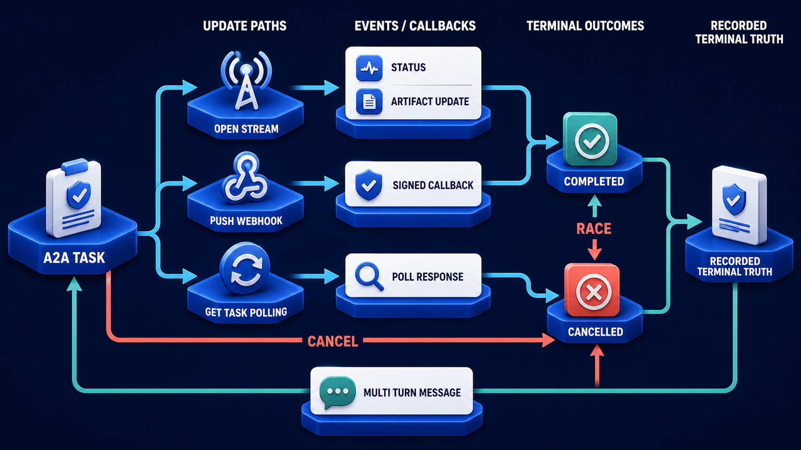

# Diagram 90 — Message, Task, and Artifact Anatomy

![Three groups on dark navy. PARTS shows three document cards labelled TEXT, FILE and DATA. TASK shows a white card listing TASK ID, CONTEXT ID and STATUS. STATUS PATH shows SUBMITTED with a paper plane, WORKING with a gear, and COMPLETED as a green check. On the right, five outcome tiles branch from the status path — INPUT REQUIRED in orange, AUTH REQUIRED in amber, FAILED, CANCELED and REJECTED in red. Teal dashed lines run from completed and rejected down to AGENT MESSAGE and ARTIFACTS, and back up into the task.](../diagrams/90-a2a-message-task-artifact-anatomy.png)

**Module:** A2A in depth
**Role in the course:** the three objects and the states they move through
**Layout:** parts into a task, a status path with five branch outcomes, and two return objects beneath

---

## At a glance

**PARTS** — text, file, data — compose into a **TASK** carrying three fields: **TASK ID**, **CONTEXT ID**, **STATUS**.

The status path runs **SUBMITTED → WORKING → COMPLETED**, and branches to five other outcomes on the right, colour-graded from orange through amber to red.

Beneath, two things the task produces: an **AGENT MESSAGE** and **ARTIFACTS**.

The detail worth arriving at first is **CONTEXT ID**, sitting beside task ID. Two identifiers, and the second is the one most implementations omit.

---

## What the diagram teaches

### 1. Parts are typed, and the three types are not interchangeable

**TEXT** (a `T` document), **FILE** (a green document), **DATA** (a document with stacked database discs).

A message is composed of parts, and each part declares what it is.

**Text** is content for reading — instructions, descriptions, questions.
**File** is a document with a type and a name, transferred as a unit.
**Data** is structured content with a schema.

Typing them means a receiving agent can handle each appropriately without guessing. Structured data arriving as text has to be parsed heuristically; the same content as a data part arrives with its shape declared.

### 2. TASK ID and CONTEXT ID are two identifiers with two scopes

The task card lists three fields, and the first two are both identifiers.

**TASK ID** — this task. One unit of delegated work, from submission to a terminal state.

**CONTEXT ID** — the wider conversation or case this task belongs to. Several tasks can share one context.

That second identifier is what makes multi-task interactions coherent. A caller delegating three related pieces of work — an assessment, a verification, and a recommendation — creates three tasks under one context.

Without it, the three are unrelated units and nothing connects them. Reconstructing what happened means correlating by timestamp and hoping.

### 3. Status is a field on the task, not a separate object

The third row of the task card is **STATUS**.

The status path to its right is not a separate lifecycle running alongside the task — it is the values that field takes.

That framing keeps the task as the single object. There is one thing, and it has a current state, and you read the state by reading the task.

### 4. Three states are the main path; five more branch off

**SUBMITTED** (paper plane, blue) → **WORKING** (gear, blue) → **COMPLETED** (check, green).

Then five tiles on the right, reached by teal arrows from the path:

**INPUT REQUIRED** (orange, person with a question) — the task needs something from the caller.
**AUTH REQUIRED** (amber, padlock) — the task needs additional authorisation.
**FAILED** (red, ✗) — it could not be completed.
**CANCELED** (red, prohibition sign) — it was stopped.
**REJECTED** (red, thumbs down) — the agent declined to accept it.

Eight states in total, and the colour grading is doing real work.

### 5. The colour grading separates three kinds of non-completion

**Orange** for input required. Not a failure — a pause needing the caller to act.

**Amber** for auth required. Also not a failure — a pause needing an authorisation step.

**Red** for failed, canceled and rejected. Terminal.

Three colours for three categories: *you need to supply something*, *you need to authorise something*, *this is over*.

Implementations that collapse these into a single error state lose the distinction between a task waiting for the caller and a task that has ended.

### 6. REJECTED is distinct from FAILED, and the distinction matters

**FAILED** — the agent accepted the task, attempted it, and could not complete it.

**REJECTED** — the agent declined to accept it at all.

Different meanings, different responses. A failure may be worth retrying, or may indicate a problem with the inputs. A rejection means this agent will not do this work — because it is out of scope, because the caller is not entitled, or because the task is malformed.

Retrying a rejection is pointless. Retrying a failure may not be. Conflating them produces clients that retry things that will never succeed.

### 7. AUTH REQUIRED is the state most implementations lack

Amber, with a padlock, and it is genuinely distinctive to delegated work.

A task may reach a point where proceeding needs an authorisation the caller has not provided — a step-up authentication, a consent, a higher-privilege approval.

That is neither a failure nor an ordinary input request. It is specifically an *authorisation* gap, and separating it lets the caller respond correctly: not by supplying data, but by obtaining permission.

### 8. Artifacts and agent messages both return, and both link back to the task

The two objects beneath — **AGENT MESSAGE** (a speech bubble card) and **ARTIFACTS** (a document with a download badge) — are reached by teal dashed lines from **COMPLETED** and **REJECTED**, and both send dashed lines back up into **TASK**.

Two return types, and they are different.

**An agent message** is communication — an explanation, a question, a note about what was done.
**An artifact** is a deliverable — a produced object with a type, storable and referenceable.

Note that **REJECTED** also produces returns. A rejection should carry a message explaining why. A rejection with no explanation is a dead end for the caller.

Reaching a terminal state is not the same as a caller knowing which one:

The eight states here are what a task can be. That diagram is about how a caller finds out — and about the race that occurs when a cancel and a completion are in flight together.

---

## Case study — Elverton Underwriting, the three tasks nobody could connect

Elverton underwrites commercial property insurance. Their submission assessment delegates three pieces of work to specialist agents: a surveyor agent that assesses building risk, a compliance agent that checks the applicant against sanctions and adverse media, and a pricing agent that produces a premium indication.

Three tasks, three agents, one submission.

### What was missing

Their implementation created three tasks with three task IDs. Nothing connected them.

The submission record held all three IDs, so the *application* knew they were related. Nothing in the protocol did.

Four consequences, discovered over about a year.

**Traces could not be assembled.** Each task produced its own trace. Reconstructing a submission's full assessment meant querying three traces and joining them in the application layer, using a mapping only the application held.

**Partial failure had no representation.** If the compliance task rejected and the other two completed, there was no protocol-level object representing "this submission's assessment is incomplete." The application inferred it.

**Agents could not reference each other's context.** The pricing agent's premium depends on the surveyor's risk assessment. Elverton passed the assessment as a message part — copying the content into the pricing task — rather than referencing it.

That copying meant the pricing agent worked from a snapshot. When a surveyor updated an assessment after a re-inspection, the pricing task had already used the old one and nothing indicated a mismatch.

**Audit reconstruction was manual.** A regulator asking how a premium was arrived at required assembling three separate task records by hand.

### The rebuild with context ID

Every submission creates a **context**. All three tasks carry that context ID.

**Traces assemble automatically.** The context ID is the join key. A submission's full assessment is one query.

**Partial state became representable.** Elverton can now ask: what is the state of every task in this context? Two completed and one rejected is a describable condition, and their assessment logic operates on it directly rather than inferring it.

**Agents reference rather than copy.** The pricing task references the surveyor's artifact by its identifier within the shared context, rather than carrying a copy.

That change fixed the stale-assessment problem. When a surveyor's artifact is superseded, the pricing task's reference resolves to the current version, and a pricing task that completed against a superseded artifact is now detectable.

They found **eleven historical cases** where a premium had been calculated against a surveyor assessment that was later revised, and where nobody had noticed. Two had material premium implications.

### The rejected-versus-failed finding

Their compliance agent had been returning **failed** for two quite different situations: an applicant matching a sanctions list, and an applicant whose identity data was insufficient to check.

The first is a rejection — the compliance agent will not clear this applicant, and no retry will change that.

The second is a failure — the check could not be performed with what was supplied, and supplying better data would allow it.

Their orchestrator retried both. For sanctions matches this meant repeated checks producing identical results, and — because each check was logged to the sanctions provider — an audit trail suggesting Elverton had checked the same applicant fourteen times.

Separating the states meant sanctions matches were routed to a human immediately, and insufficient-data cases routed to a data-collection step.

### The auth-required addition

Their surveyor agent occasionally needs access to a building's structural survey held by a third party, which requires the applicant's authorisation.

Previously this produced a failure with a message explaining what was needed. The orchestrator had no way to distinguish it from any other failure, so it surfaced as "assessment failed."

Now it produces **auth required**, and the orchestrator initiates the authorisation flow with the applicant.

About 6% of surveys hit this state. Under the old handling, most of those submissions had been abandoned.

### Results

- **Trace assembly for one submission:** three queries plus an application-layer join → one query.
- **Stale-assessment pricing cases:** 11 found historically, detectable going forward.
- **Duplicate sanctions checks:** eliminated by the rejected/failed split.
- **Submissions abandoned at survey-authorisation:** ~6% recovered by the auth-required state.

### The line in their integration standard

*Two tasks that belong to the same piece of work share a context. If they do not, only your application knows they are related, and your application is not what the regulator asks.*

---

## Composition

Three labelled groups across the top with a branch group at the right and two return objects beneath.

**PARTS** — three document cards on a wide blue platform, labelled **TEXT**, **FILE**, **DATA**.

Cyan arrow → **TASK** — a white card listing **TASK ID** (blue check tile), **CONTEXT ID** (purple `#` tile), **STATUS** (blue lines tile).

Cyan arrow → **STATUS PATH** — three tiles connected by cyan arrows: **SUBMITTED** (blue, paper plane), **WORKING** (blue, gear), **COMPLETED** (green, check).

**Right:** five tiles reached by **teal arrows** from a vertical spine: **INPUT REQUIRED** (orange, person with question), **AUTH REQUIRED** (amber, padlock), **FAILED** (red, ✗), **CANCELED** (red, prohibition), **REJECTED** (red, thumbs down).

**Beneath:** **teal dashed lines** from **COMPLETED** and from **REJECTED** run down to **AGENT MESSAGE** (white card with a blue speech bubble and person) and **ARTIFACTS** (white document with an image tile and a blue download badge), and dashed lines run back up into **TASK**.

## Element by element

**TEXT** — a white document with a blue `T`.
**FILE** — a white document with a green marker.
**DATA** — a white document with stacked orange database discs.

**TASK** — a white card with three labelled rows.

**SUBMITTED** — a blue tile with a paper plane.
**WORKING** — a blue tile with a gear.
**COMPLETED** — a green tile with a check.

**INPUT REQUIRED** — orange, a person with a question mark.
**AUTH REQUIRED** — amber, a padlock.
**FAILED** — red, a circular ✗.
**CANCELED** — red, a prohibition sign.
**REJECTED** — red, a thumbs-down.

**AGENT MESSAGE** — a white card with a blue speech bubble and a person row.
**ARTIFACTS** — a white document with an image block and a blue download badge.

## Colour and flow semantics

- **Cyan arrows** carry parts into the task and the task along its status path.
- **Teal arrows** branch to the five non-main-path outcomes.
- **Teal dashed lines** carry the two return objects and link them back to the task.
- **Colour grading** — orange, amber, red — separates caller-action pauses from authorisation pauses from terminal states.
- **CONTEXT ID is the only purple tile** in the task card, distinguishing it from the task's own identifier.

## How to present it

**Ask what identifies a task.** Most rooms say a task ID. Then point at the second row and ask what a context ID is for.

**Tell the Elverton three-task problem.** Three tasks, three IDs, nothing connecting them at protocol level — so only the application knew they were related, and traces had to be joined by hand.

**Give them the reference-versus-copy consequence.** Passing an assessment as a copied message part means the pricing agent works from a snapshot. Elverton found eleven cases where a premium was calculated against a later-revised assessment.

**Read the eight states and ask about the colours.** Orange, amber, red. Three categories: supply something, authorise something, this is over.

**Ask the difference between failed and rejected.** Attempted and could not complete, versus declined to accept. Then give the sanctions example: retrying a rejection produced fourteen identical checks and an audit trail that looked bad.

**Ask who has an auth-required state.** Almost nobody. Then give Elverton's 6% of surveys, most of which had been abandoned because the state surfaced as a generic failure.

**Point out that REJECTED produces returns too.** A rejection should carry a message explaining why. A rejection with no explanation is a dead end.

**Ask why parts are typed.** Structured data arriving as text is parsed heuristically; the same content as a data part arrives with its shape declared.

**Close on the integration standard.** *Two tasks that belong to the same piece of work share a context.* Then ask whether the room's related tasks do.

**Timing.** Twenty-five minutes. Thirty-five if you map a multi-task operation from the room's own system onto contexts and states.

---

## Lab and checkpoint

**Lab:** Take a multi-step operation in your system and model it with A2A tasks and messages. Define the task ID for each step, the context ID that connects related steps, the message parts and their types, the artifact for each step, and the states each task can enter including auth-required and rejected.

**Checkpoint:** Why are task ID and context ID separate?

**Answer:** Because a task ID identifies a single task, and a context ID connects tasks that belong to the same piece of work. Without a context ID, multiple related tasks appear unrelated at the protocol level, and tracing and correlation become manual.

## Glossary

- **Artifact** — a produced object returned by a task.
- **Auth required** — the state where the task needs authorisation to continue.
- **Context ID** — the identifier shared by related tasks.
- **Failed** — the state where the task was attempted but could not complete.
- **Message** — the envelope carrying typed parts between agents.
- **Message part** — a typed segment of a message, such as text or data.
- **Rejected** — the state where the agent declined to accept the task.
- **State** — the lifecycle condition of a task.
- **Status** — the field on the task that reports its state.
- **Task ID** — the unique identifier for a single task.

## Sources

- A2A task and message anatomy
- Context IDs and multi-task operations
- Typed message parts and artifact delivery
