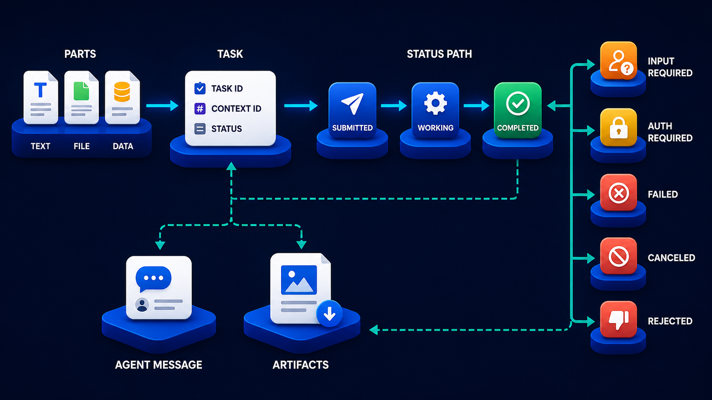

# Diagram 91 — Stream, Push, Poll, and Cancel

![An A2A TASK clipboard on the left of a dark navy frame fans to three UPDATE PATHS — OPEN STREAM with a broadcast tower, PUSH WEBHOOK with a webhook glyph, GET TASK POLLING with refresh arrows. Each leads to an EVENTS/CALLBACKS card: STATUS and ARTIFACT UPDATE, SIGNED CALLBACK, POLL RESPONSE. These lead to TERMINAL OUTCOMES — a teal COMPLETED check and a red CANCELLED cross — with a coral RACE label and double arrow between them. Both feed RECORDED TERMINAL TRUTH, a white document with a shield. A coral CANCEL arrow runs from the task across to cancelled, and a MULTI TURN MESSAGE card at the bottom returns teal to the task and coral to cancelled.](../diagrams/91-a2a-stream-push-cancel.png)

**Module:** A2A in depth
**Role in the course:** three update paths, two terminal outcomes, and the race between them
**Layout:** one task fanning to three delivery paths converging on two outcomes, resolved by one recorded truth

---

## At a glance

Three update paths from one task. Two terminal outcomes. And between those two outcomes, a **coral RACE label with a double-headed arrow**.

Everything resolves at **RECORDED TERMINAL TRUTH** — a document with a shield.

The race is the diagram's subject. A cancel request and a completion can be in flight simultaneously, and something has to decide which one is real.

---

## What the diagram teaches

### 1. Three update paths, and they can run concurrently

**OPEN STREAM**, **PUSH WEBHOOK**, **GET TASK POLLING** — all three leave the same task.

They are not alternatives selected at task creation. A caller can hold a stream open, have a webhook registered, and poll as a fallback, all for the same task.

That concurrency is deliberate and it is what creates the race condition the diagram exists to address. Three paths delivering news about one task means three opportunities to learn about a state change, arriving in an order nobody controls.

### 2. Each path carries a different payload shape

**OPEN STREAM** → a card listing **STATUS** and **ARTIFACT UPDATE**. Incremental, typed, ordered within the stream.

**PUSH WEBHOOK** → a card reading **SIGNED CALLBACK**. A single notification, signed, delivered once (or more).

**GET TASK POLLING** → a card reading **POLL RESPONSE**. A complete current-state read.

The third is the only one that is *complete* rather than incremental. That property is why it ends up being the arbiter.

### 3. CANCEL is coral and it bypasses the update paths entirely

A **coral arrow** runs from the **A2A TASK** platform directly across the frame to **CANCELLED**, passing beneath the three update paths.

Cancellation is not an update; it is an instruction. It travels its own route, and it can arrive at any moment relative to whatever the task is doing.

Drawing it as a long horizontal line under everything else conveys that it is orthogonal to the delivery mechanism. You can cancel a task whether you are streaming, polling, or waiting for a webhook.

### 4. The RACE is between completed and cancelled, and it is real

Between **COMPLETED** (teal check) and **CANCELLED** (red cross) sits a **coral RACE** label with a **double-headed arrow**.

The scenario: a caller sends a cancel. Simultaneously, the agent finishes the work. Both events are genuine. Both are in flight.

Four things can then happen depending on timing and delivery path:

- The caller's stream delivers completion; their webhook delivers cancellation confirmation.
- The caller's poll returns completed; their cancel returns accepted.
- The webhook fires completion after the caller has already updated its own state to cancelled.
- Two of the caller's own components disagree.

Every one of these produces a caller whose belief about the task is wrong, unless something arbitrates.

### 5. RECORDED TERMINAL TRUTH is the arbiter, and it is drawn as a document with a shield

Both outcomes feed a single white document bearing a shield.

The name is precise. **Recorded** — written down, durable. **Terminal** — the final state, not an intermediate one. **Truth** — authoritative, overriding what any delivery path said.

The resolution rule: **the task's recorded terminal state is what happened.** Not the first notification received, not the most recent one, not the one that arrived on the most reliable channel.

Practically this means a caller that receives conflicting news performs a final task read, and that read is definitive.

The shield marks it as protected — it is written once, and it is not revised by late-arriving notifications.

### 6. MULTI TURN MESSAGE has two arrows and they go to different places

At the bottom, a **MULTI TURN MESSAGE** card sends a **teal arrow back to the A2A TASK** and a **coral arrow up to CANCELLED**.

Two possible effects of a message sent to a task mid-flight.

**Teal to the task** — the message is accepted and the task continues, now with additional input. This is the multi-turn case: a caller supplying information the task asked for, or adding context.

**Coral to cancelled** — the message causes cancellation. Either because it explicitly requests it, or because its content makes the task's remaining work invalid.

That second arrow is easy to miss and it is a real behaviour: sending a message to a task can terminate it.

### 7. The three paths are for latency; the task read is for truth

The general rule this diagram establishes.

Streams, webhooks and polling all exist to reduce the time between something happening and the caller knowing. They are latency optimisations.

None of them is authoritative. A caller that treats a delivered notification as final will eventually act on a state that was superseded.

The task read is slow and correct. The delivery paths are fast and provisional. A well-built caller uses both.

What that read returns is the task's state field, which has eight possible values:

Only two of those eight are the terminal outcomes racing in this diagram. The other six are states a delivery path may report on the way there, and none of them needs arbitration.

---

## Case study — Wrayburn Logistics, the shipment that was both cancelled and dispatched

Wrayburn arranges expedited freight. Their booking orchestrator delegates carrier allocation to a specialist agent that negotiates with carriers, books capacity, and returns a confirmed allocation.

Allocation takes between 40 seconds and 12 minutes.

### Their delivery setup

They used all three paths, correctly, for good reasons.

**A stream**, because a booking coordinator watches the allocation happen and partial progress is useful — seeing which carriers have been approached.

**A webhook**, because allocation can outlast a coordinator's session and their downstream documentation service needs to know.

**Polling**, as a fallback for both.

### The incident

A coordinator started an allocation for an urgent shipment. Two minutes in, the customer called to cancel.

The coordinator clicked cancel. At approximately the same moment, the allocation agent completed — it had secured capacity with a carrier and confirmed the booking.

**The stream delivered completion** to the coordinator's screen about 400ms after they clicked cancel. The interface showed the allocation as complete.

**The cancel was accepted** by the allocation agent, which recorded the task as cancelled.

**The webhook fired** to the documentation service — with completion, because the notification had been queued before the cancellation was processed.

Three components with three beliefs. The coordinator's screen said complete. The allocation agent's record said cancelled. The documentation service said complete, and generated shipping documentation.

**The carrier had genuinely been booked.** A vehicle was dispatched to a collection that had been cancelled. Wrayburn paid a failed-collection charge, and the carrier's slot was wasted.

### The diagnosis

There was no arbiter. Each component acted on the notification it received.

Wrayburn's orchestrator had treated the stream as authoritative for the coordinator's view, the webhook as authoritative for the documentation service, and polling as a fallback that only ran when the other two produced nothing.

Three authorities means no authority.

### The rebuild

**A single recorded terminal state.** The allocation agent records the task's terminal state once, atomically, and it is not revised.

**All components read it before acting on a terminal outcome.** A stream event or webhook saying "completed" triggers a task read, and the read is what components act on.

That adds a round trip and about 80ms to the terminal transition. Wrayburn measured it and accepted it.

**Non-terminal updates are still acted on directly.** Progress events, artifact updates and status changes are consumed from the stream without a confirming read. Only terminal transitions require arbitration.

That distinction is what keeps the cost bounded — the confirming read happens once per task, not once per event.

**Cancellation returns the recorded state.** A cancel request now returns what the task's terminal state actually became. If cancellation won, it returns cancelled. If the task had already completed, it returns completed with a note that cancellation arrived too late.

That second case is the one their coordinators most needed. Under the old system, a cancel returned "cancellation accepted" regardless, so a coordinator believed they had stopped something that had already happened.

### The compensation question

The rebuild raised something the diagram does not address: what happens when cancellation loses.

A completed allocation means a carrier is booked. Cancelling afterwards is not a protocol operation; it is a business operation with a cost.

Wrayburn's flow now presents this explicitly:

> Allocation completed at 14:22:07 before your cancellation was processed. Carrier BXN-4 is booked for collection at 16:00. Cancelling this booking incurs a failed-collection charge of £180. Cancel booking / Keep booking.

Coordinators keep the booking about 30% of the time, usually by calling the customer back.

### The multi-turn finding

Their allocation agent supports mid-flight messages — a coordinator can add a constraint, such as excluding a carrier the customer has had problems with.

They discovered that some such messages **invalidate work already done**. Excluding a carrier that has already been booked means the allocation must be redone.

Their initial implementation applied the constraint and continued, producing an allocation that violated the constraint it had just been given.

Now a message that invalidates completed work either cancels the task explicitly — the coral arrow in the diagram — or is refused with an explanation. It does not silently continue.

### Results

- **Conflicting terminal beliefs across components:** eliminated.
- **Failed-collection charges from cancel/complete races:** 3 in the preceding year → 0.
- **Cost of arbitration:** ~80ms per task, on terminal transition only.
- **Cancellations that arrived too late:** now visible to the coordinator with the cost stated.
- **Constraint-violating allocations:** eliminated by refusing invalidating messages.

### The line in their orchestrator documentation

*The stream tells you fast. The task tells you true. On a terminal state, always ask the task.*

---

## Composition

A left-to-right fan-out and convergence with a cancel line beneath and a message card at the base.

**A2A TASK** (clipboard with a shield) → three cyan arrows to **UPDATE PATHS**: **OPEN STREAM** (broadcast tower), **PUSH WEBHOOK** (webhook glyph), **GET TASK POLLING** (refresh arrows).

Each sends a cyan arrow to an **EVENTS / CALLBACKS** card: **STATUS** and **ARTIFACT UPDATE** (stacked rows); **SIGNED CALLBACK** (shield with a check); **POLL RESPONSE** (magnifier).

Cyan arrows from these converge on **TERMINAL OUTCOMES**: **COMPLETED** (teal tile with a white check) and **CANCELLED** (red tile with a white ✗). A **coral RACE label with a double-headed arrow** sits between them.

**Teal arrows** from both outcomes converge on **RECORDED TERMINAL TRUTH** — a white document with a blue shield.

A **coral arrow** runs from the task platform horizontally across the frame, labelled **CANCEL**, into **CANCELLED**.

At the base, a **MULTI TURN MESSAGE** card sends a **teal line** left and up into **A2A TASK**, and a **coral arrow** up into **CANCELLED**.

## Element by element

**A2A TASK** — a white clipboard with a blue shield on a blue platform.

**OPEN STREAM** — a broadcast tower with signal arcs.
**PUSH WEBHOOK** — a three-node webhook glyph.
**GET TASK POLLING** — circular refresh arrows.

**STATUS / ARTIFACT UPDATE** — a white card with two labelled rows.
**SIGNED CALLBACK** — a white card with a blue shield and check.
**POLL RESPONSE** — a white card with a magnifier.

**COMPLETED** — a teal rounded tile with a white check.
**CANCELLED** — a red rounded tile with a white ✗.

**RECORDED TERMINAL TRUTH** — a white document with a blue shield.

**MULTI TURN MESSAGE** — a white card with a teal speech bubble.

## Colour and flow semantics

- **Cyan arrows** carry the three update paths and their events toward the outcomes.
- **Teal arrows** carry both outcomes into the recorded truth, and the multi-turn message back to the task.
- **Coral** marks the cancel instruction, the race, and the message path that terminates a task.
- The **RACE label with a double-headed arrow** is the only bidirectional relationship in the frame.
- **RECORDED TERMINAL TRUTH bears a shield**, marking it as protected and authoritative.

## How to present it

**Ask whether the three update paths are alternatives.** They are not — a caller can use all three for one task. Then ask what that creates.

**Set up the race concretely.** A caller sends cancel; the agent finishes the work; both are genuine and both are in flight. Ask what each of their components would believe.

**Tell the Wrayburn incident.** Stream said complete, agent recorded cancelled, webhook delivered complete to the documentation service, and a vehicle was dispatched to a cancelled collection.

**Name the root cause.** Three authorities means no authority. Ask which of their own notification channels they treat as final.

**Give them the arbitration rule.** Non-terminal updates are consumed directly; terminal transitions trigger a task read. That bounds the cost — one confirming read per task, not per event.

**Ask what a cancel should return.** Under the old system, "cancellation accepted" regardless, so coordinators believed they had stopped something already done. Now it returns the actual terminal state.

**Raise the compensation question the diagram omits.** When cancellation loses, a carrier is already booked. That is a business operation with a cost. Wrayburn presents it explicitly, and coordinators keep the booking 30% of the time.

**Point at the multi-turn message's two arrows.** A message can continue a task or terminate it. Then give the constraint example: excluding an already-booked carrier invalidates completed work, and applying it silently produced an allocation that violated its own constraint.

**Close on the line.** *The stream tells you fast. The task tells you true.*

**Timing.** Twenty-five minutes. Thirty-five if you work out what arbitration would cost in the room's own system and where the confirming read would sit.

---

## Lab and checkpoint

**Lab:** For one of your own multi-channel interactions, draw the three update paths (push, stream, multi-turn message) and the task read. Write the rule for resolving a race between completed and cancelled. Then define the compensation path for when a cancellation loses and what the user is told.

**Checkpoint:** Why is the task read the arbiter, not the stream or the cancel confirmation?

**Answer:** Because the stream is for low-latency updates and the cancel is a request, but the recorded task state is the durable truth. Multiple channels can race; the task read returns the single terminal state that all consumers should trust.

## Glossary

- **Arbiter** — the single source of truth that resolves a race.
- **Cancel** — the request to stop a task before it completes.
- **Completed** — the terminal state where the task finished successfully.
- **Cancelled** — the terminal state where the task was stopped before completion.
- **Compensation** — the business action that offsets the cost of a failed cancellation.
- **Multi-turn message** — a message exchange that can continue or terminate a task.
- **Push** — a direct notification about a task change.
- **Recorded terminal truth** — the durable task state that resolves races.
- **Stream** — a continuous flow of task updates.
- **Task read** — the authoritative read that returns the durable state.

## Sources

- A2A streaming, push, and cancel semantics
- Race conditions and terminal-state arbitration
- Task lifecycle and compensation design
