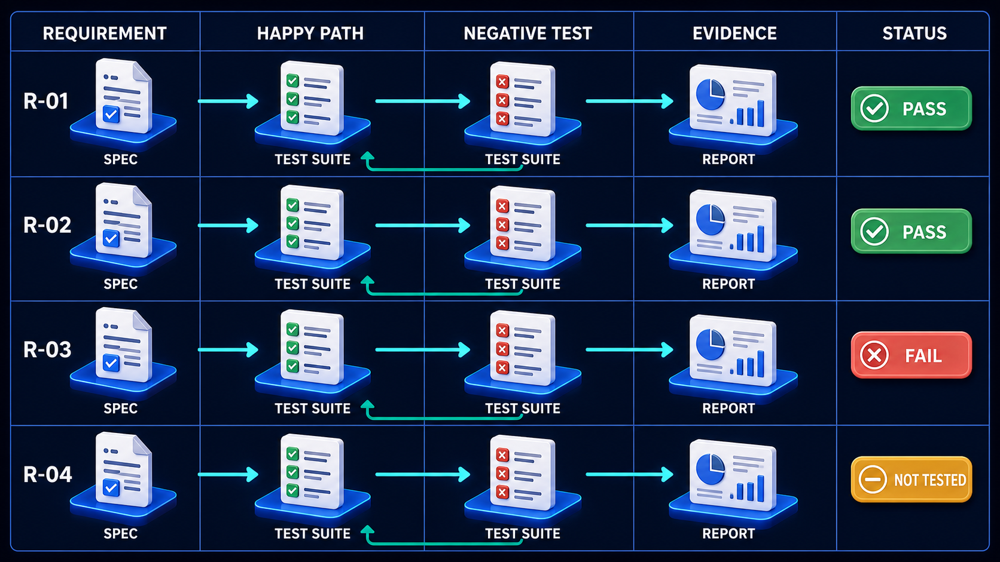

# Diagram 92 — Bindings, Version, and Security Schemes

**Module:** A2A in depth
**Role in the course:** one model, three transports, five security schemes
**Layout:** headers into a canonical model, fanning to three bindings, verified by one test suite, with security schemes attached separately

---

## At a glance

One **CANONICAL A2A MODEL** at the centre, fed by two headers, expressed through **three bindings** — JSON-RPC, gRPC, HTTP+JSON — all verified by one **FUNCTIONAL EQUIVALENCE TESTS** banner.

To the side, five **SECURITY SCHEMES** attaching to the model rather than to any particular binding.

Two structural claims. The model is the thing; transports are expressions of it. And security is orthogonal to transport — any scheme with any binding.

---

## What the diagram teaches

### 1. The canonical model is at the centre, and everything else is derived

A `{ }` card on a raised platform, with three arrows leaving it downward.

The bindings do not each define their own semantics. There is one model — one definition of what a task is, what a message contains, what states exist — and three ways of putting it on a wire.

That ordering matters for specification and for implementation. A behaviour is specified once, in the model. A binding says how to encode it, not what it means.

The failure this prevents is semantic drift between transports: the same operation meaning subtly different things depending on how you invoked it.

### 2. Version and extensions are headers on the model, not on the bindings

**A2A-VERSION** and **A2A-EXTENSIONS** enter from above, both carrying puzzle-piece icons, both arrowing into the canonical model.

They apply at the model level. A version identifies which revision of the *semantics* is in play. An extension adds to the *model*, and is then expressible in whatever binding is being used.

An extension defined for one transport and not others would fragment the ecosystem. Defining them against the model means an extension works everywhere the model does.

### 3. Three bindings, and their differences are real

**JSON-RPC** (`</>`) — method-and-params over a simple envelope. Broadly implementable, human-readable on the wire, and the default in much of the ecosystem.

**gRPC** (node graph) — binary, schema-first, with generated stubs and efficient streaming. Attractive where performance matters and where both sides are under coordinated control.

**HTTP+JSON** (globe) — resource-oriented, conventional REST shapes. Easiest to consume from environments with limited tooling, and the most familiar to teams who have never touched the other two.

They are not equivalent in convenience. A team choosing among them is choosing tooling, performance, and familiarity — and the diagram's point is that they should not also be choosing semantics.

### 4. FUNCTIONAL EQUIVALENCE TESTS is the mechanism that makes the claim true

All three bindings feed one bordered banner with a shield.

The claim "these are three expressions of one model" is an assertion until something verifies it.

Functional equivalence tests take a behaviour defined in the model and exercise it through each binding, asserting the same outcome. Not the same bytes — the same *outcome*.

That distinction is what makes the tests possible at all. A gRPC message and a JSON-RPC message for the same operation look nothing alike. What must match is the state the operation produces, the artifacts it yields, the errors it raises.

Without these tests, "three bindings of one model" becomes three protocols that were once related.

### 5. The five security schemes attach to the model, and the dashed arrows say so

**API KEY**, **HTTP AUTH**, **OAUTH2**, **OIDC**, **mTLS** — five rows on the right, with **teal dashed arrows** running back to the canonical model rather than to any binding.

Security is orthogonal to transport. Any of the five can be used with any of the three.

That orthogonality is worth stating because it is often violated in practice. Teams assume gRPC means mTLS, or that HTTP+JSON means OAuth2, because that is how they first encountered each.

The agent card declares which schemes an interface supports, and the trust policy selects one — which is where this diagram connects to agent-card discovery.

### 6. The five schemes are not equivalent in strength, and the ordering hints at it

Reading down: **API KEY**, **HTTP AUTH**, **OAUTH2**, **OIDC**, **mTLS**.

Roughly ascending in what they establish.

**API key** — a shared secret. Proves possession, nothing more. No expiry, no delegation, no identity beyond "whoever holds this."

**HTTP auth** — basic or bearer. Marginally more structured, same essential property.

**OAuth2** — delegated authorisation with scopes and expiry. Establishes what the holder may do, and bounds it in time.

**OIDC** — OAuth2 plus identity. Establishes *who*, not just *what they may do*.

**mTLS** — mutual certificate authentication at the transport layer. Both parties prove identity before any application data flows.

A policy requiring mTLS and finding only API key on offer is not being fussy; the two establish materially different things.

### 7. Choosing a binding is a deployment decision; choosing a scheme is a trust decision

The two axes are independent and are decided by different people for different reasons.

Binding: chosen by the team building the integration, on tooling, performance and familiarity.

Scheme: chosen by whoever owns the trust boundary, on what must be established before data flows.

Conflating them — "we use gRPC so we get mTLS" — means a trust decision is being made by a tooling preference.

Functional equivalence is a claim that needs the same evidence as any other requirement:

Every behaviour in the canonical model becomes a row, and each row is exercised once per binding. A behaviour tested through one binding and not the others is **NOT TESTED** for the other two, however green the overall figure looks.

---

## Case study — Ravenscliffe Exchange, the three bindings that diverged

Ravenscliffe operates a B2B marketplace connecting about 800 suppliers with roughly 2,000 buying organisations. They adopted A2A so that buyers' procurement agents could negotiate directly with suppliers' sales agents.

Their platform offers all three bindings, because their participant base is wide: large suppliers with modern platforms, mid-sized ones with conventional REST tooling, and a long tail with very limited engineering capacity.

### Why three bindings was correct

**gRPC** for their fifteen largest suppliers, who handle high volume and value the efficiency.

**JSON-RPC** as the default, used by roughly 60% of participants.

**HTTP+JSON** for the long tail, many of whom integrate using tools that can make an HTTP request and little else.

Offering one binding would have excluded a third of their market.

### How they diverged

The three bindings were implemented by three different squads over eighteen months, against the same specification document.

**Task state transitions differed.** The gRPC binding permitted a transition from `input_required` directly to `cancelled`. The JSON-RPC binding required passing through `working` first. The HTTP+JSON binding permitted both.

Nobody had noticed, because no test compared them.

**Artifact ordering differed.** When a task produced several artifacts, gRPC returned them in production order, JSON-RPC in identifier order, and HTTP+JSON in an order determined by an internal map iteration — which was effectively arbitrary.

**Error semantics differed.** A malformed message produced a validation error over JSON-RPC, a `INVALID_ARGUMENT` status over gRPC, and — the significant one — a **200 response with an error object in the body** over HTTP+JSON.

That last was the one that caused harm.

### The incident

A buyer's agent integrated over HTTP+JSON. Their client checked the HTTP status code and, on 200, parsed the body as a successful response.

Ravenscliffe's HTTP+JSON binding returned 200 with an error body for validation failures.

The buyer's client read a field that did not exist, got a null, and treated it as an accepted quotation at a null price. Their procurement system recorded 47 line items as accepted at zero cost before anyone noticed.

Unwinding it took nine days and involved four suppliers who had received purchase orders they had not quoted.

### The rebuild

**A functional equivalence suite.** 340 behaviours from the specification, each exercised through all three bindings, asserting identical outcomes.

The first run found **61 divergences**.

Twenty-two were the state-transition and ordering differences above. Eighteen were error-semantics differences. Fourteen were field-presence differences — an optional field populated in one binding and omitted in another. Seven were genuine bugs in one binding that the others did not have.

**The suite runs on every change to any binding.** A change to the gRPC binding that alters a behaviour now fails the equivalence test against the other two, before merge.

**Error semantics were made uniform at the model level.** An error is an error in all three. The HTTP+JSON binding now returns appropriate status codes, and the model defines the error taxonomy that each binding maps to its own conventions.

That mapping is itself tested: the suite asserts that a given model-level error produces the correct expression in each binding.

### The security-scheme finding

Their audit also found that binding and scheme had been coupled by accident.

Their gRPC binding supported only mTLS. Their HTTP+JSON binding supported only API key. Their JSON-RPC binding supported OAuth2 and API key.

None of this was specified. Each squad had implemented what they were familiar with.

The consequence: a large supplier who wanted gRPC for performance **and** OAuth2 for their existing identity infrastructure could not have both, and was told it was a protocol limitation. It was not.

**The rebuild decoupled them.** All five schemes are now available across all three bindings, and the agent card declares the actual combinations offered per interface.

Eleven participants changed their binding or scheme within three months of the options becoming real.

### Results

- **Divergences found by the first equivalence run:** 61.
- **Divergences reaching production since:** 0.
- **The zero-cost purchase-order incident:** 1, cause eliminated by uniform error semantics.
- **Binding/scheme combinations available:** 3 fixed pairings → 15 combinations.
- **Participants changing binding or scheme once decoupled:** 11.

### The line in their binding implementation guide

*Three bindings, one model. If the same operation produces a different outcome depending on how you invoked it, you have three protocols and a shared document.*

---

## Composition

A central model with inputs above, outputs below, a test banner beneath, and a security panel to the right.

**Above:** two white cards on blue platforms — **A2A-VERSION** and **A2A-EXTENSIONS**, each with a blue puzzle-piece icon — sending **cyan arrows** down into the model.

**Centre:** **CANONICAL A2A MODEL** — a white `{ }` card on a raised blue hexagonal platform.

**Below:** three **cyan arrows** fan to three platforms — **JSON-RPC** (`</>` card), **gRPC** (node-graph card), **HTTP+JSON** (globe card).

**Beneath those:** three blue arrows descend into a bordered banner reading **FUNCTIONAL EQUIVALENCE TESTS** with a shield glyph.

**Right:** a panel headed **SECURITY SCHEMES** listing five rows with teal icons — **API KEY** (key), **HTTP AUTH** (person), **OAUTH2** (padlock), **OIDC** (ID card), **mTLS** (shield with check) — with **teal dashed arrows** running left into the canonical model.

## Element by element

**A2A-VERSION** — a white card with a blue puzzle piece. Which revision of the semantics.
**A2A-EXTENSIONS** — a white card with a blue puzzle piece. Additions to the model.

**CANONICAL A2A MODEL** — a white card showing `{ }` on a large blue platform.

**JSON-RPC** — a white card with a blue `</>`.
**gRPC** — a white card with a blue node graph.
**HTTP+JSON** — a white card with a blue globe.

**FUNCTIONAL EQUIVALENCE TESTS** — a wide bordered banner with a shield and a check.

**Security schemes** — five bordered rows with teal glyphs, ascending roughly in strength.

## Colour and flow semantics

- **Cyan arrows** carry version and extensions into the model, and the model out to the three bindings.
- **Blue arrows** carry the bindings into the test banner.
- **Teal dashed arrows** attach the security schemes to the model rather than to any binding — the orthogonality claim.
- The **model sits above the bindings**, marking derivation.
- The **test banner spans all three bindings**, marking one suite verifying all of them.

## How to present it

**Ask what a binding is.** Push toward: a way of putting a model on a wire, not a definition of what the model means. Then ask what happens when three teams implement three bindings from one document.

**Tell the Ravenscliffe 61 divergences.** State transitions, artifact ordering, error semantics, field presence. None found until something compared them.

**Tell the 200-with-an-error-body incident.** A buyer's client checking HTTP status, getting 200, parsing an error body as success, and recording 47 line items as accepted at zero cost.

**Ask what functional equivalence means.** Not the same bytes — the same outcome. A gRPC and a JSON-RPC message for one operation look nothing alike. What must match is the state produced.

**Point at the teal dashed arrows from the security panel.** They go to the model, not to a binding. Then ask what combinations their own system actually offers.

**Tell the accidental coupling finding.** gRPC only with mTLS, HTTP+JSON only with API key — not specified, just what each squad knew. A supplier wanting gRPC and OAuth2 was told it was a protocol limitation. It was not.

**Walk the five schemes and ask what each establishes.** API key proves possession. OAuth2 bounds what you may do and for how long. OIDC establishes who. mTLS proves both parties before data flows. A policy requiring mTLS and finding an API key is not being fussy.

**Separate the two decisions.** Binding is a deployment choice made on tooling and performance. Scheme is a trust choice made by whoever owns the boundary. Conflating them means a trust decision made by tooling preference.

**Close on the line.** *If the same operation produces a different outcome depending on how you invoked it, you have three protocols and a shared document.*

**Timing.** Twenty-five minutes. Thirty-five if the room implements more than one binding, in which case ask what compares them.

---

## Lab and checkpoint

**Lab:** If your system has more than one binding, write a functional-equivalence test for one operation across them. Define the canonical model, the expected state outcomes, and the test that checks the same result regardless of binding. If you have only one binding, write the security scheme each endpoint uses and whether the choice is a deployment decision or a trust decision.

**Checkpoint:** Why must version and extensions be headers on the model, not the binding?

**Answer:** Because the canonical model is the single source of truth. Bindings are just wire formats. If version and extensions live on the binding, each binding can diverge, and the same operation can produce different outcomes. Keeping them on the model ensures all bindings share the same semantics.

## Glossary

- **Binding** — a wire format for the canonical model, such as HTTP+JSON or gRPC.
- **Canonical model** — the single source of truth for the operation's meaning.
- **Functional equivalence** — the property that different bindings produce the same outcome.
- **gRPC** — a binary RPC binding.
- **HTTP+JSON** — a textual HTTP binding.
- **mTLS** — mutual TLS, a security scheme that authenticates both parties.
- **OAuth2** — a security scheme that bounds what a caller may do and for how long.
- **OIDC** — a security scheme that establishes identity.
- **Security scheme** — the method of authentication and trust on a connection.
- **Version** — the model revision, not the binding revision.

## Sources

- A2A transport bindings and canonical model
- Functional equivalence testing across transports
- Security schemes and trust boundary decisions
