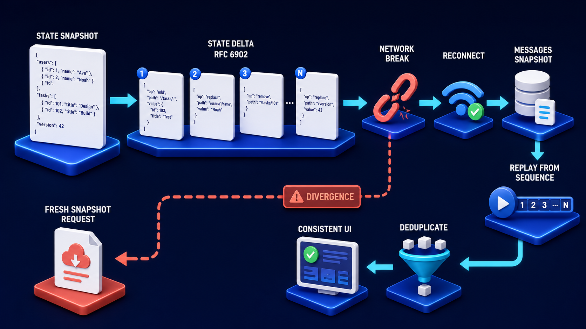

# Diagram 93 — Typed Event Lifecycle

![An event stream on dark navy running from RUN STARTED with a play disc to RUN FINISHED with a check. Between them, three grouped bands each containing white JSON cards — STEP STARTED and STEP FINISHED; TEXT MESSAGE START, CONTENT and END; TOOL CALL START, ARGS, END and RESULT. Teal lines from beneath each band converge on labelled tags ID: S1, ID: M1 and ID: T1. A coral arrow branches from the stream's end down to RUN ERROR, a red warning tile. A legend reads FORWARD: EVENT ORDER IN STREAM, RETURN: IDs CONNECT RELATED EVENTS, TERMINATION: STREAM ENDS IN FINISHED OR ERROR.](../diagrams/93-agui-typed-event-lifecycle.png)

**Module:** AG-UI in depth
**Role in the course:** how typed events group into meaningful units
**Layout:** a linear stream with three bracketed groups, each bound by a shared identifier, terminating two ways

---

## At a glance

A stream from **RUN STARTED** to **RUN FINISHED**, with three **grouped bands** in between — a step, a text message, a tool call — each band's events tied together by a shared identifier: **S1**, **M1**, **T1**.

A coral branch leads to **RUN ERROR**.

The legend names three relationships explicitly: **forward** is order, **return** is identity, **termination** is one of two outcomes.

The grouping is the diagram's content. Events are not a flat sequence — they nest, and the identifiers are what make the nesting recoverable.

---

## What the diagram teaches

### 1. Events come in start-and-end pairs, and the pairing is explicit

**STEP STARTED / STEP FINISHED.**
**TEXT MESSAGE START / CONTENT / END.**
**TOOL CALL START / ARGS / END / RESULT.**

Every group opens and closes. Nothing is implied by the arrival of the next thing.

That explicitness is what lets a client render correctly. A text message that has started but not ended is *streaming* — the client shows it accumulating. One that has ended is complete. Without an end event, the client cannot distinguish "still arriving" from "finished and short."

### 2. The identifiers are what make concurrency survivable

**ID: S1**, **ID: M1**, **ID: T1** — each tag connected by teal lines to every event in its band.

This is the mechanism that matters. Real agent runs interleave. Two tool calls can be in flight simultaneously, their events arriving mixed together.

Without identifiers, a client receiving `TOOL CALL ARGS` has no way to know which call it belongs to. With them, every event names its group, and the client routes it correctly regardless of arrival order.

The teal lines running *back* from the events to the tags — rather than forward — is the right rendering. The identifier is not part of the sequence; it is a property each event carries that connects it to its siblings.

### 3. The three group types have different internal shapes

**Step** — two events: started, finished. A step is a phase marker. It has no content of its own; it brackets other things.

**Text message** — three: start, content, end. The content event is where the incremental text arrives, and there may be many of them.

**Tool call** — four: start, args, end, result. Args and result are separate because they arrive at different times and mean different things. The call is described, then it ends, then its result comes back.

That third shape is the interesting one. **END and RESULT are separate events**, which says the tool call finished being *issued* before its result existed.

### 4. Every event is a JSON card, and that is the typing claim

All ten event cards are drawn identically: white, with `{` and `}` braces around content lines.

Same shape, different type. Each event is a structured object with a declared type, not a line of text.

That is what "typed event stream" means, and it is what separates this from streaming prose. A client can switch on the type and handle each appropriately, without parsing natural language.

### 5. The stream terminates two ways, and the legend names it

**RUN FINISHED** — a blue tile with a check, reached by a cyan arrow.
**RUN ERROR** — a red warning tile, reached by a coral arrow.

The legend's third line: *termination: stream ends in finished or error.*

A stream always ends, and it ends in exactly one of two ways. A stream that simply stops — no finished, no error — is a broken stream, and a client should treat it as such rather than assuming completion.

That is a real failure mode: a connection dropping mid-stream looks, to a naive client, like a stream that ended. The distinction between "ended" and "stopped arriving" only exists if termination is an explicit event.

### 6. Run started and run finished bracket everything

The outermost pair. Every other event occurs between them.

That bracketing gives the client a definite beginning and end for the whole run, within which groups open and close.

It also means the run itself is a group, with the run identifier as its binding tag — implied by the structure rather than drawn.

### 7. The legend is unusual and it is doing necessary work

Three relationships named: forward is order, return is identity, termination is outcome.

Most diagrams in this library rely on colour convention. This one states it, because the teal lines here mean something different from teal elsewhere — they are not returns of data, they are *identity bindings*.

Naming that prevents the misreading that events flow backward to the identifier tags.

A stream that ends in neither outcome is a stream that stopped, and recovering from that is its own mechanism:

The sequence numbers there are what let a reconnecting client resume in the middle of a group rather than restarting the run. Typed events make the stream renderable; sequence numbers make it recoverable.

---

## Case study — Thurlby Analytics, the interleaved tool calls

Thurlby builds a data analysis assistant used by about 700 analysts across financial-services clients. It answers questions by querying warehouses, running calculations, and producing charts and narrative.

A complex question triggers several tool calls, and they run in parallel.

### The original stream

Their first implementation streamed events without group identifiers. Events carried a type and a payload, and the client assumed sequential arrival.

That assumption held while tool calls were sequential. When they parallelised tool execution to reduce latency — a change that took median response time from 14 seconds to 5 — the interface broke.

### What broke

An analyst asking a question that triggered three concurrent queries saw:

**Arguments attributed to the wrong call.** The tool card for query A displayed the arguments of query C, because the `ARGS` event for C arrived while A's card was the most recently opened.

**Results attached to the wrong tool.** Same mechanism, worse consequence: a result showing revenue figures appeared under a card labelled as a headcount query.

**Text interleaving.** Two narrative messages generated concurrently produced a single garbled paragraph with sentences from both.

None of it errored. The interface rendered confidently and wrongly.

### The severity

One analyst produced a client deliverable containing a chart whose caption came from a different query.

It was caught in review. Thurlby's own assessment was that it would not always be caught, because a plausible caption on a plausible chart looks correct.

### The rebuild with typed, identified events

**Every event carries a group identifier.** Tool calls carry a tool-call ID, messages carry a message ID, steps carry a step ID.

**The client routes by identifier, not by recency.** A tool card is created when its start event arrives, and every subsequent event bearing that identifier updates that card, regardless of what else arrived in between.

This eliminated all three symptoms structurally. Interleaving became a non-event.

**Start and end are explicit.** A message that has started renders with a streaming indicator; one that has ended renders as complete. Previously the client had inferred completion from the arrival of an unrelated event.

**Args and result separated.** Their original implementation had carried arguments and result in one event, emitted at completion. Separating them meant the interface could show *what was being asked* while the query ran — which analysts immediately reported as the most useful change, because a slow query whose arguments are visible is diagnosable.

### The termination finding

Their client had treated a stream that stopped arriving as a completed run.

A connection drop mid-run produced an interface showing a run that appeared finished, with partial results, and no indication anything was missing.

Analysts had been reporting occasional "incomplete answers." The answers were not incomplete; the runs had not finished, and the interface had said they had.

**The fix:** a run is finished only on an explicit `RUN FINISHED` or `RUN ERROR` event. A stream that stops without either produces a distinct interface state — *connection lost, run may still be in progress* — with a reconnect action.

That state occurs on about 3% of runs, mostly analysts closing laptops. Before the fix, every one of those had rendered as a completed run with partial content.

### The measurement they added

Because events are typed and identified, they could measure group durations: how long a step takes, how long a tool call takes from start to result.

This surfaced something unrelated to the interface: one of their warehouse connectors had a 4-second connection setup on every call, which was invisible in aggregate latency because it was amortised across parallel calls.

Fixing it took another 1.8 seconds off median response time.

### Results

- **Misattributed tool arguments and results:** eliminated structurally.
- **Garbled concurrent narrative:** eliminated.
- **Runs rendered as complete when the connection had dropped:** ~3% → 0.
- **Median response time:** 14s → 5s from parallelisation, then → 3.2s from the connector finding.
- **Client deliverables with mismatched captions:** 1 known, 0 since.

### The line in their client implementation guide

*Route by identifier, never by recency. The moment two things run at once, recency is a guess.*

---

## Composition

A horizontal stream with three bracketed groups, identity tags beneath, and a two-way termination.

**RUN STARTED** (blue tile with a play disc) → cyan arrow → an **EVENT STREAM** boundary containing three blue-bordered bands, each holding white JSON cards connected by cyan arrows:

- **STEP STARTED** (play hexagon) and **STEP FINISHED** (check hexagon) — two cards.
- **TEXT MESSAGE START** (speech-bubble hexagon), **CONTENT**, **END** — three cards.
- **TOOL CALL START** (wrench hexagon), **ARGS**, **END**, **RESULT** — four cards.

**Teal lines** descend from beneath each card in a band and converge on a teal-bordered tag: **ID: S1**, **ID: M1**, **ID: T1**.

From the stream's right edge: a **cyan arrow** to **RUN FINISHED** (blue tile with a check disc), and a **coral arrow** down to **RUN ERROR** (red warning tile).

**Legend**, lower left: a cyan arrow with **FORWARD: EVENT ORDER IN STREAM**; a teal arrow with **RETURN: IDs CONNECT RELATED EVENTS**; a coral arrow with **TERMINATION: STREAM ENDS IN FINISHED OR ERROR**.

## Element by element

**RUN STARTED** — a blue rounded tile with a white play triangle.
**RUN FINISHED** — a blue rounded tile with a white check.
**RUN ERROR** — a red rounded tile with a white exclamation.

**The event cards** — ten identical white cards, each showing `{`, content lines, and `}`.

**The group headers** — small blue hexagons with white glyphs: play, check, speech bubble, wrench.

**The identity tags** — teal-bordered rounded labels reading **ID: S1**, **ID: M1**, **ID: T1**.

## Colour and flow semantics

- **Cyan arrows** carry event order along the stream.
- **Teal lines** carry identity binding downward from events to their group tag — not a data return, which is why the legend names it.
- **Coral** marks the error termination.
- **All event cards are drawn identically**, asserting that they are the same kind of object with different types.
- The **three bands** are visually grouped by blue borders, showing nesting within the stream.

## How to present it

**Ask what a client does when two tool calls run at once.** If the answer involves the most recent card, that is the Thurlby bug.

**Tell the Thurlby parallelisation story.** Latency 14s → 5s, and the interface broke — arguments on the wrong card, results under the wrong label, two narratives merged into one garbled paragraph. None of it errored.

**Point at the three identity tags.** Then give the rule: route by identifier, never by recency. The moment two things run at once, recency is a guess.

**Ask why start and end are both events.** A message that has started but not ended is streaming; one that has ended is complete. Without an end event you cannot distinguish "still arriving" from "finished and short."

**Ask why tool call has four events rather than two.** Args and result arrive at different times. Then give the Thurlby finding: separating them meant analysts could see what was being asked while a slow query ran, which they reported as the most useful change.

**Read the legend's third line.** A stream ends in finished or error. Then ask what their client does when a stream simply stops.

**Tell the connection-drop finding.** Analysts reporting "incomplete answers" that were actually unfinished runs rendered as complete. 3% of runs, every one of them wrong.

**Point out the measurement side-effect.** Typed, identified events let Thurlby measure group durations and find a 4-second connector setup that was invisible in aggregate latency. Instrumentation falls out of the event design.

**Timing.** Twenty minutes. Thirty if you enumerate the event types the room's own interface would need and identify which lack explicit ends.

---

## Lab and checkpoint

**Lab:** Enumerate the event types your own agent UI would need: run start/end, message start/end, tool call start/args/result/end, step start/end, artifact, and error. For each, define the JSON schema, the start-and-end pairing, and the identifier that routes it. Then write the reducer rule that uses the identifier, not recency, to update the UI.

**Checkpoint:** Why must events come in start-and-end pairs?

**Answer:** Because a start event without an end means the message is still streaming; an end event means it is complete. Without both, the client cannot tell whether the stream is unfinished or simply short, and it may render an incomplete run as complete.

## Glossary

- **AG-UI** — the user-experience protocol for agent interfaces.
- **Args** — the arguments sent to a tool call.
- **End event** — the event that marks the completion of a started thing.
- **Error** — the terminal state when a run or step fails.
- **Event** — a typed, JSON-encoded update in the agent UI stream.
- **Group** — a set of related events, such as a tool call or message.
- **Identifier** — the value that routes events to the right UI element.
- **Result** — the output of a tool call or step.
- **Run finished** — the terminal event that ends a successful run.
- **Run started** — the event that begins a run.
- **Start event** — the event that begins a group or action.
- **Stream** — the continuous flow of events from the agent to the UI.

## Sources

- AG-UI typed events and lifecycle
- Agent UI streaming and event identification
- Reducer patterns for event-driven interfaces
