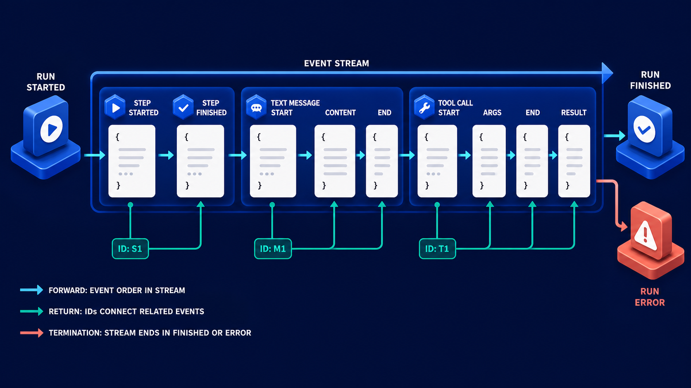

# Diagram 94 — Snapshot, Delta, and Replay

![A left-to-right flow on dark navy. STATE SNAPSHOT shows a JSON card with users, tasks and version 42. STATE DELTA RFC 6902 shows four numbered JSON patch cards using add, replace and remove operations. A blue arrow leads to NETWORK BREAK, a broken red chain, then RECONNECT with a wifi symbol and green check, then MESSAGES SNAPSHOT, then REPLAY FROM SEQUENCE with a play button and numbered boxes, then DEDUPLICATE, a blue funnel, then CONSISTENT UI, a monitor with a green check. A coral dashed path from the network break through a DIVERGENCE badge leads to FRESH SNAPSHOT REQUEST, a red document with a download arrow.](../diagrams/94-agui-snapshot-delta-replay.png)

**Module:** AG-UI in depth
**Role in the course:** keeping a client's state correct across a broken connection
**Layout:** snapshot and deltas, a break, a recovery sequence, and a divergence escape hatch

---

## At a glance

A **STATE SNAPSHOT** carrying `"version": 42`, followed by **RFC 6902 patches** that transform it. A **NETWORK BREAK**. Then **RECONNECT → MESSAGES SNAPSHOT → REPLAY FROM SEQUENCE → DEDUPLICATE → CONSISTENT UI**.

And a coral escape: **DIVERGENCE → FRESH SNAPSHOT REQUEST**.

The version number in the snapshot and the final patch that sets `"/version": 43` are the mechanism. Everything else is what you build around it.

---

## What the diagram teaches

### 1. The snapshot is complete and versioned, and both properties are load-bearing

The first card shows a full state object: a `users` array, a `tasks` array, and `"version": 42`.

**Complete** — it is the whole state, not a fragment. A client receiving it can discard whatever it held and adopt this.

**Versioned** — it carries a number that identifies this state exactly.

That version is what every subsequent operation is relative to. A patch is not "apply this change"; it is "apply this change to version 42."

### 2. The deltas are RFC 6902, and naming the standard matters

The band is labelled **STATE DELTA RFC 6902**, and the four cards show real patch operations:

```
{ "op": "add",     "path": "/tasks/-",       "value": { "id": 103, "title": "Test" } }
{ "op": "replace", "path": "/users/1/name",  "value": "Noah" }
{ "op": "remove",  "path": "/tasks/101" }
{ "op": "replace", "path": "/version",       "value": 43 }
```

Using a standard rather than a bespoke format buys three things: existing libraries on every platform, unambiguous semantics for edge cases like array insertion, and a specification to point at when two implementations disagree.

The `"/tasks/-"` path in the first patch is the JSON Pointer convention for appending to an array — exactly the kind of detail a bespoke format gets wrong.

### 3. The fourth patch updates the version, and that is the whole protocol

The last operation replaces `/version` with `43`.

The version is **inside the state**, and it is updated by a patch like any other field.

That means a client can always answer "what version am I on?" by reading its own state. There is no separate bookkeeping to get out of sync.

It also means a patch that arrives for version 42 when the client is on 43 is detectably wrong — which is what makes divergence detectable at all.

### 4. The recovery sequence is four stages and each is necessary

**RECONNECT** — the connection is re-established. On its own this achieves nothing; the client's state is still stale by however many events it missed.

**MESSAGES SNAPSHOT** — the client obtains the current message state from the server.

**REPLAY FROM SEQUENCE** — the play button with numbered boxes `1 2 3 … N`. The server replays events from the point the client reached.

**DEDUPLICATE** — the funnel. Events the client already applied are discarded.

Deduplication is required because the replay boundary is imprecise. A client that received event 7 and then broke may or may not have applied it. Replaying from 7 is safe only if applying 7 twice is harmless — which patches generally are not, since applying an `add` twice produces two entries.

The funnel is where that is resolved, by sequence number.

### 5. DIVERGENCE is the coral escape hatch, and it exists because replay is not always possible

A **coral dashed path** from the network break, through a **DIVERGENCE** badge, to a **FRESH SNAPSHOT REQUEST** on a red platform.

Replay works when the client knows where it was and the server can replay from there. Both can fail.

**The client may not know.** A patch may have been partially applied. State may have been mutated locally.

**The server may not be able to replay.** Event retention is bounded. A client offline for an hour may be asking for events the server no longer holds.

**The versions may be irreconcilable.** A client on version 38 asking a server on version 91 to replay 53 events is worse than a fresh snapshot.

In all three cases the answer is the same: **discard and restart from a complete state.**

The coral colouring is right — divergence is a failure of the efficient path, handled by an expensive but always-correct fallback.

### 6. Deltas are an optimisation; snapshots are the guarantee

The relationship between the two halves of the diagram.

Deltas are small, frequent and efficient. They are also fragile — they depend on the recipient being exactly where the sender thinks.

Snapshots are large, infrequent and robust. They depend on nothing.

A system with only deltas cannot recover. A system with only snapshots is wasteful. The design uses deltas for the common case and snapshots for recovery, and the version number is what lets it detect which case it is in.

### 7. Consistent UI is the outcome, and it is drawn with a check

The final platform is a monitor with a **green check**.

The claim being made: after the recovery sequence, the client's rendered state is **provably** the same as the server's, not approximately so.

That provability comes from the version number. The client can assert it is on version 43, the server can confirm 43 is current, and the assertion is checkable rather than hopeful.

What is being replayed is a typed event stream, and its grouping survives the break:



A client resuming mid-group relies on the identifiers there. Without them, a replay that lands halfway through a tool call cannot attach the remaining events to the card that was already open.

---

## Case study — Kirkwall Trading, the order book that drifted

Kirkwall provides a trading interface for commodity markets. Their agent monitors positions, executes orders, and maintains a live view of an order book that traders watch continuously.

Sessions last a full trading day. Connections do not.

### The original design

State was streamed as deltas over a WebSocket. No snapshot beyond the initial one at session start. No version numbers.

On reconnect, the client requested a full state refresh.

That worked, and it worked badly for one reason: a full refresh of an active order book was about 900 KB, took 2–3 seconds to generate, and traders reconnected an average of eleven times a day — moving between networks, laptop sleeps, VPN cycles.

Eleven refreshes a day per trader, across 340 traders, was a measurable load and a visible interruption. Traders reported the interface "freezing" on reconnect.

### The first optimisation, which introduced the real bug

To avoid full refreshes, they added replay: on reconnect, the client sent the timestamp of the last event it had received, and the server replayed everything since.

**Timestamps were the mistake.** Two events could share a timestamp. Clock skew between servers meant a replay boundary was approximate.

The result was silent drift. A client could miss an event whose timestamp equalled its boundary, or apply one twice.

For an order book, a duplicated `add` meant a phantom order. A missed `remove` meant a filled order still displayed as live.

### How it surfaced

A trader acted on a position the interface showed as open. It had been filled forty minutes earlier; the `remove` had been lost on a reconnect.

The trade was reversed at a loss of about £11,000. Kirkwall covered it.

Their investigation found that **drift was routine**. Comparing client state against server state across a sample of sessions found discrepancies in roughly 4% of them, most of which were cosmetic and had never been noticed.

### The rebuild

**Version numbers in the state.** Every state carries a version. Every delta increments it as its final operation, exactly as the diagram shows.

**RFC 6902 patches.** They had been using a bespoke delta format that handled array operations ambiguously. Moving to the standard eliminated a class of ordering bugs and let them use a maintained library on both sides.

**Sequence-based replay, not timestamps.** Each event carries a monotonic sequence number. A client reconnecting sends its last applied sequence. The server replays from there.

**Deduplication by sequence.** Replayed events with a sequence at or below the client's last applied are discarded. This makes the replay boundary safe to be imprecise, which it will be.

**Divergence detection.** A client that receives a patch whose base version does not match its own current version raises divergence and requests a fresh snapshot.

This fires on about 0.2% of reconnects. In every observed case it was a client that had been offline long enough for the server's event retention to have elapsed.

**Bounded retention with a stated policy.** The server retains 15 minutes of events. A client reconnecting after longer gets a snapshot rather than a replay, and knows in advance that it will.

### The measured effect

**Reconnect cost.** A typical reconnect after a 20-second interruption now replays about 40 events, roughly 8 KB, in under 200ms. Traders stopped reporting freezes.

**Full snapshots** now occur on session start and on the 0.2% divergence path, rather than eleven times a day per trader.

**Drift.** Their state-comparison sampling now finds discrepancies in 0% of sessions. They continue to run it as a regression check.

### The check they kept

The most valuable thing they built was not part of the fix: a **background state comparison** that periodically asks a client to hash its state and compares it against the server's hash for the same version.

A mismatch means something is wrong that the version mechanism did not catch.

It has fired twice since the rebuild. Both were client-side bugs — code mutating the state object directly rather than through the patch applier. Neither would have been detectable without it.

### Results

- **Full refreshes per trader per day:** 11 → ~1.
- **Reconnect payload:** ~900 KB → ~8 KB typical.
- **Sessions with state drift:** ~4% → 0%.
- **Divergence fallbacks:** 0.2% of reconnects.
- **Client-side mutation bugs found by hash comparison:** 2.

### The line in their client SDK documentation

*Never mutate state directly. Apply patches, track the version, and if the version does not match, throw it away and ask for a fresh one.*

---

## Composition

A left-to-right recovery flow with a coral escape path descending from the break.

**STATE SNAPSHOT** — a white card showing a JSON object with `users`, `tasks` and `"version": 42`.

Cyan arrow → **STATE DELTA RFC 6902** — four numbered white cards on a wide platform, each showing a JSON patch operation.

Cyan arrow → **NETWORK BREAK** — a **broken red chain** on a blue platform.

Cyan arrow → **RECONNECT** — a wifi symbol with a **green check**.

Cyan arrow → **MESSAGES SNAPSHOT** — a white database stack with a document.

Cyan arrow down → **REPLAY FROM SEQUENCE** — a blue play disc beside numbered boxes reading `1 2 3 … N`.

Cyan arrow → **DEDUPLICATE** — a blue funnel with cubes above and below.

Cyan arrow → **CONSISTENT UI** — a monitor with a **green check**.

**Coral dashed path:** from beneath the network break, through a **DIVERGENCE** badge with a warning triangle, leftward to **FRESH SNAPSHOT REQUEST** — a red document with a download arrow on a red platform.

## Element by element

**STATE SNAPSHOT** — a white card with a complete JSON state object, version 42.

**The four patch cards** — numbered 1 to N, showing `add`, `replace`, `remove` and a final `replace` of `/version` to 43.

**NETWORK BREAK** — a red chain link snapped in two.

**RECONNECT** — a blue wifi arc with a green check disc.

**MESSAGES SNAPSHOT** — a white database stack beside a document card.

**REPLAY FROM SEQUENCE** — a blue play disc with a row of numbered boxes.

**DEDUPLICATE** — a blue funnel with white cubes entering above and one leaving below.

**CONSISTENT UI** — a monitor showing content blocks with a green check.

**DIVERGENCE** — a coral badge with a white warning triangle.

**FRESH SNAPSHOT REQUEST** — a white document with a red download cloud, on a red platform.

## Colour and flow semantics

- **Cyan arrows** carry the main flow through break, recovery and consistency.
- **Coral dashed** carries the divergence escape from the break to the fresh-snapshot request.
- **Red** marks the break itself and the fresh-snapshot platform — both are failures of the efficient path.
- **Green checks** appear on reconnect and on the consistent UI, marking verified states.
- The **version numbers 42 and 43** are the only numeric values in the frame, and they are the mechanism.

## How to present it

**Point at `"version": 42` and the final patch setting 43.** The version is inside the state and updated by a patch. Ask what that buys — a client can always answer what version it is on by reading its own state.

**Ask why RFC 6902 rather than a bespoke format.** Libraries everywhere, unambiguous array semantics, and a specification to point at when two implementations disagree. Then show the `"/tasks/-"` append path as the kind of thing bespoke formats get wrong.

**Walk the four recovery stages and ask what each does.** Reconnect achieves nothing alone. Snapshot establishes a base. Replay fills the gap. Deduplicate makes the boundary safe to be imprecise.

**Ask why deduplication is needed at all.** Because the replay boundary is approximate — a client that received event 7 may or may not have applied it. Then tell the Kirkwall timestamp bug: two events sharing a timestamp, clock skew, silent drift.

**Tell the £11,000 trade.** A position shown as open that had been filled forty minutes earlier, because a `remove` was lost on reconnect. Then the finding: drift was routine, in about 4% of sessions, mostly unnoticed.

**Ask when replay is impossible.** Client does not know where it was; server no longer holds the events; versions too far apart. All three resolve the same way — discard and restart.

**Give them the retention policy point.** Kirkwall retains 15 minutes and tells clients so. A client reconnecting after longer knows in advance it will get a snapshot.

**Raise the hash comparison.** Not part of the fix, and the most valuable thing they built. It found two client-side bugs where code mutated state directly rather than through the patch applier — undetectable by the version mechanism.

**Close on the SDK line.** *Never mutate state directly. Apply patches, track the version, and if the version does not match, throw it away.*

**Timing.** Twenty-five minutes. Thirty-five if you work through what the room's own reconnect currently does, which frequently turns out to be a full refresh.

---

## Lab and checkpoint

**Lab:** Design a reconnect flow for one of your real-time UIs. Specify the snapshot format with a version, the RFC 6902 delta patches, the replay range, the deduplication rule, the divergence fallback, and the retention policy. Then write the test that would catch a client mutating state directly instead of applying patches.

**Checkpoint:** Why must the version live inside the state and be updated by a patch?

**Answer:** Because then the client can always read its own state and know exactly which version it is on. If the version is external, it can drift from the state. An in-state version that is updated by a patch makes the state self-describing and lets recovery detect divergence.

## Glossary

- **Delta** — an incremental patch describing a change to state.
- **Deduplicate** — the step that removes already-applied events from a replay.
- **Divergence** — the state where the client and server versions no longer match, requiring a restart.
- **Patch** — an RFC 6902 operation that updates state.
- **Replay** — the process of sending missed events after a snapshot.
- **RFC 6902** — the JSON Patch standard for delta operations.
- **Snapshot** — a complete, versioned copy of state used to recover after a disconnect.
- **State** — the client-side model of the run or workspace.
- **Version** — the counter inside state that is updated by every patch.

## Sources

- AG-UI snapshots, deltas, and replay
- RFC 6902 JSON Patch
- Real-time UI reconnect and state divergence
