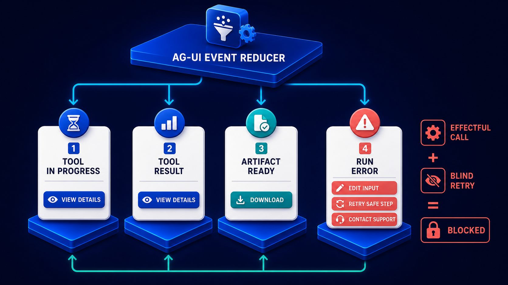

# Diagram 95 — Interrupt, Approval, and Steering

![A flow on dark navy. NEW RUN STARTED with a play disc carries a PARENT RUN ID badge and leads to RUN FINISHED with a clipboard, then to OUTCOME INTERRUPT, a red octagon. Three cyan arrows branch right to EXPIRED with a clock, REJECTED with a red cross, and STEERING MESSAGE with a speech bubble. Two INTERRUPT CARD tiles descend to a wide amber DRAFT CONTRACT banner, which leads down through HUMAN REVIEW to a second NEW RUN STARTED carrying its own PARENT RUN ID. A RESUME PAYLOAD card feeds human review, and a teal line runs from the banner back up to the first run.](../diagrams/95-agui-interrupt-approval-steering.png)

**Module:** AG-UI in depth
**Role in the course:** pausing for a human without breaking the run model
**Layout:** a run terminating in an interrupt, producing draft contracts, resumed as a new run with a parent reference

---

## At a glance

A run **finishes**. Its outcome is an **INTERRUPT**. That interrupt produces **interrupt cards** which become a **DRAFT CONTRACT**, reviewed by a human, and resumed as a **NEW RUN** carrying a **PARENT RUN ID**.

Three other outcomes branch off: **EXPIRED**, **REJECTED**, **STEERING MESSAGE**.

The structural move is the one to notice: **the run ends**. It does not pause. A human interruption terminates one run and starts another, and the parent run ID is what connects them.

---

## What the diagram teaches

### 1. RUN FINISHED comes before OUTCOME INTERRUPT, and the ordering is the design

Read the sequence carefully: **NEW RUN STARTED → RUN FINISHED → OUTCOME INTERRUPT.**

The run reaches a proper terminal state. Its outcome happens to be "interrupt" rather than "completed."

That is different from a run that suspends. A suspended run is still in flight — it holds resources, it has an open lifecycle, and something must eventually resume it or clean it up.

A run that finishes with an interrupt outcome is **closed**. Its events are complete, its state is final, and the interface has a definite end to render.

The cost is that resuming means starting something new. The benefit is that nothing is left hanging, and a human taking three days to respond does not leave a run open for three days.

### 2. PARENT RUN ID appears twice, and it is the thread

Both **NEW RUN STARTED** tiles carry a **PARENT RUN ID** badge.

The first has one because it may itself be a continuation. The second has one pointing at the run that was interrupted.

That identifier is what makes a chain of interrupted-and-resumed runs reconstructable. Without it, three runs that are really one piece of work look like three unrelated pieces.

It is the same role the context ID plays in A2A tasks — a second identifier binding related units into one coherent whole.

### 3. The DRAFT CONTRACT is amber, is the widest object in the frame, and is the heart of the diagram

A wide **amber banner** with document glyphs, spanning most of the width.

Amber rather than coral or teal. Not a failure, not a completed thing — a **proposal awaiting a decision**.

Its width says everything passes through it. Both interrupt cards feed it; the human review reads it; the resumed run is built from it.

The word *contract* is doing real work. What the human is reviewing is not a suggestion or a status update — it is a **specific, bounded proposal** stating what will happen if approved. It has terms.

The word *draft* is doing equal work. It is not yet in effect. Approval is what makes it binding.

### 4. Interrupt cards are plural, and they compose into one contract

**INTERRUPT CARD 1** and **INTERRUPT CARD 2**, both descending into the banner.

A single interruption may raise several things needing decision. Rather than presenting them as separate approvals, they compose into one contract the human reviews as a unit.

That composition matters for coherence. Two related decisions presented separately can be answered inconsistently. Presented as one contract, they are decided together.

### 5. The three right-hand branches are the outcomes that are not approval

**EXPIRED** (clock) — the interrupt was not answered in time. A defined outcome, not an absence.

**REJECTED** (red cross) — the human declined the proposal.

**STEERING MESSAGE** (speech bubble) — the human neither approved nor rejected; they redirected.

That third one is distinct and important. Steering is not a verdict on the proposal. It is the human supplying direction — additional context, a changed priority, a different approach — which produces a resumed run with different instructions rather than an approved or refused contract.

### 6. RESUME PAYLOAD is what the human's decision becomes

A card feeding **HUMAN REVIEW**, which then produces the new run.

The resume payload carries the decision plus whatever the human supplied — approval, edits, steering content, additional context.

It is the input to the resumed run. The new run is not a re-run of the old one; it is a fresh run that begins with the accumulated outcome of the previous one plus the human's contribution.

### 7. The teal line back to the first run is the audit link

A **teal line** runs from the draft contract area back up to **NEW RUN STARTED**.

The relationship is recorded in both directions. The resumed run knows its parent; the parent run's record knows it was interrupted and what contract was produced.

That bidirectional linkage is what makes a chain auditable. Given any run in a chain, you can walk to both ends.

The interrupt is one of four surfaces the reducer drives, and the other three are what the human reviews against:

A human deciding on a draft contract needs the artifacts and tool results already surfaced. An approval screen that shows only the proposal, with the evidence one click away on another surface, is an approval made on less than the interface already knows.

---

## Case study — Alderney Claims, the approvals that expired into nothing

Alderney handles motor claims for several insurers. Their claims assistant assesses liability, calculates settlements, and proposes actions — settlement offers, engineer instructions, total-loss determinations.

Anything with a financial consequence requires human approval.

### The original design

Their runs **suspended** at approval points. A run reached a proposal, entered a paused state, and waited.

Three problems accumulated.

**Runs stayed open indefinitely.** An approval raised on a Friday afternoon sat until Monday. Their orchestrator held the run's context in memory, and a deploy dropped it. Roughly 40 suspended runs were lost per month, each requiring a claim to be reassessed from scratch.

**The interface had no terminal state.** A claims handler looking at a claim saw an assessment "in progress" that had been in progress for three days. There was no way to distinguish work still running from work waiting on them.

**Expiry did nothing.** They had a timeout. When it fired, the run was discarded and nothing replaced it. The claim reverted to unassessed, silently, and the handler discovered it when they eventually looked.

That last one was the serious problem. Claims were quietly falling out of the process.

### The rebuild on the run model

**Runs finish.** A run reaching an approval point terminates with outcome `interrupt`. Its events are complete. Its assessment output is final and stored.

Nothing is held open. A deploy loses nothing.

**Parent run ID chains them.** The resumed run references the interrupted one. A claim's full assessment history is a chain of runs, walkable in both directions.

Their audit reconstruction went from "assemble from logs" to "walk the chain."

**A draft contract per interruption.** Where the old system raised approvals individually, the new one composes them.

A total-loss determination typically raises three related decisions: accept the engineer's valuation, apply the pre-accident value adjustment, and authorise the settlement figure. Previously these were three approvals, and handlers sometimes approved the valuation and declined the settlement — an inconsistent pair that had to be unpicked.

Now they are one contract:

> **Draft: total loss settlement — claim MC-88214**
> Engineer valuation accepted at £8,400.
> Pre-accident value adjustment: −£350 (mileage above band).
> Settlement authorised at £8,050.
> Expires in 4 hours.
> **Approve · Reject · Edit · Steer**

Decided as a unit.

**Expiry became an outcome with a consequence.** An expired interrupt produces a resumed run whose payload records the expiry and routes the claim to a supervisor queue.

The claim does not revert to unassessed. It moves to a defined place where someone will see it.

That single change eliminated the falling-out-of-process problem entirely.

### The steering finding

Their original design had two responses: approve and reject.

Handlers frequently wanted a third: *the approach is wrong, do it differently*. With only two options, they rejected — which discarded the assessment and forced a full re-run — and then manually re-triggered with a note.

**Steering** gave them the third option. A handler can supply direction — "treat this as a fault claim, the third-party statement is contradicted by the dashcam" — and the resumed run begins with that context.

About 14% of interruptions are steered rather than approved or rejected. Under the old model, all of those had been rejections followed by manual re-work.

### The expiry duration finding

They set four hours initially, matching their internal service standard.

It was wrong for one category. Total-loss determinations often need a handler to speak to the customer, which cannot reliably happen within four hours.

They now set expiry per contract type: four hours for routine settlements, 24 hours for total loss, 72 hours for anything requiring third-party contact.

Expiry rate fell from about 11% to under 2%.

### Results

- **Suspended runs lost to deploys:** ~40/month → 0.
- **Claims silently reverting to unassessed:** eliminated by expiry-with-consequence.
- **Inconsistent partial approvals:** eliminated by composing interrupt cards into one contract.
- **Rejections followed by manual re-work:** ~14% of interruptions → replaced by steering.
- **Expiry rate:** ~11% → under 2%, after per-type durations.

### The line in their orchestrator documentation

*A run that is waiting for a person is not running. Finish it, record what it produced, and start a new one when they answer.*

---

## Composition

An upper flow with three right-hand branches, a central banner, and a lower resume path.

**NEW RUN STARTED** (blue play disc, with a blue **PARENT RUN ID** badge beneath) → cyan arrow → **RUN FINISHED** (white clipboard with a blue check) → cyan arrow → **OUTCOME INTERRUPT** (red octagon with an exclamation).

**Three cyan arrows** branch right from the interrupt to white cards: **EXPIRED** (red clock), **REJECTED** (red circular ✗), **STEERING MESSAGE** (blue speech bubble).

**Two teal arrows** descend from the interrupt to **INTERRUPT CARD 1** and **INTERRUPT CARD 2**, both white cards with red warning triangles.

Both, plus a **teal line from RUN FINISHED**, feed a wide **amber DRAFT CONTRACT banner** with document glyphs at each end.

Below: a cyan arrow from the banner to **HUMAN REVIEW** (a teal person tile), fed from the left by a **RESUME PAYLOAD** card and a teal arrow. From human review, a teal arrow leads right to a second **NEW RUN STARTED** with its own **PARENT RUN ID** badge.

A **teal dashed line** runs from the resume payload area leftward and up into the first **NEW RUN STARTED**.

## Element by element

**NEW RUN STARTED** — a blue rounded tile with a white play triangle, above a dark label with a blue **PARENT RUN ID** badge.

**RUN FINISHED** — a white clipboard with a blue check.

**OUTCOME INTERRUPT** — a **red octagon** with a white exclamation.

**EXPIRED** — a white card with a red clock.
**REJECTED** — a white card with a red circular ✗.
**STEERING MESSAGE** — a white card with a blue speech bubble.

**INTERRUPT CARD 1 / 2** — white cards with red warning triangles.

**DRAFT CONTRACT** — a wide amber banner with amber document glyphs.

**RESUME PAYLOAD** — a white card with a teal document glyph.

**HUMAN REVIEW** — a teal rounded tile with a white person glyph.

## Colour and flow semantics

- **Cyan arrows** carry the run forward and branch to the three non-approval outcomes.
- **Teal arrows** carry the interrupt cards into the contract and the resume payload into the new run.
- **Amber** marks the draft contract — neither failure nor completion, a proposal awaiting decision.
- **Red** marks the interrupt octagon, the two interrupt cards, and the expired and rejected outcomes.
- The **PARENT RUN ID badges** on both run tiles are the chaining mechanism.

## How to present it

**Point at the ordering and ask what is unusual.** The run **finishes** before the interrupt outcome. It does not pause. Ask what a suspended run costs — held resources, an open lifecycle, and something lost on every deploy.

**Tell the Alderney 40-runs-a-month.** Suspended runs held in orchestrator memory, dropped by deploys, each one a claim reassessed from scratch.

**Ask what connects the runs if they are separate.** Parent run ID, on both tiles. Then note the parallel with context ID in A2A tasks — a second identifier binding related units.

**Read the word "contract" carefully.** Not a suggestion, not a status update — a bounded proposal with terms. And "draft" — not yet in effect.

**Ask why two interrupt cards compose into one contract.** Coherence. Then give Alderney's total-loss example: three related decisions that handlers sometimes answered inconsistently when presented separately.

**Read the draft contract aloud.** Valuation, adjustment, settlement, expiry, four actions. Ask whether a handler could decide that as a unit in under a minute.

**Ask what happens on expiry.** If the answer is "the run is discarded," that is Alderney's silent-reversion bug. An expired interrupt must produce a resumed run with a defined consequence — a supervisor queue, not nothing.

**Introduce steering as the third option.** Neither approve nor reject — redirect. 14% of Alderney's interruptions, all of which had previously been rejections followed by manual re-work.

**Give them the per-type expiry finding.** Four hours everywhere produced an 11% expiry rate. Four, 24 and 72 hours by contract type took it under 2%.

**Close on the documentation line.** *A run that is waiting for a person is not running.*

**Timing.** Twenty-five minutes. Thirty-five if you draft a contract for one of the room's own approval points, which usually reveals it should be composed from several.

---

## Lab and checkpoint

**Lab:** Design an interrupt contract for one of your own approval points. Define the run that finishes before the interrupt, the parent run ID that links them, the draft contract with several related decisions, the outcome branches (approve, reject, steer, expire), and the resume payload with a defined expiry per contract type.

**Checkpoint:** Why does the run finish before the interrupt, rather than pausing?

**Answer:** Because a suspended run holds resources and can be lost on deploys or restarts. Finishing the run and starting a new interrupt run linked by parent run ID keeps the original run complete and durable, and it avoids losing state in the orchestrator.

## Glossary

- **Approve** — the outcome that accepts the draft contract.
- **Draft contract** — the bounded proposal composed of one or more interrupt cards.
- **Expire** — the outcome when the human does not respond in time.
- **Interrupt** — the point where a human must make a decision before work can resume.
- **Interrupt card** — one decision within a contract.
- **Outcome** — the result of the interrupt: approve, reject, steer, or expire.
- **Parent run ID** — the identifier linking the original run and the interrupt run.
- **Reject** — the outcome that refuses the contract.
- **Resume payload** — the structured result that feeds back into the next run.
- **Steer** — the outcome that redirects the work without rejecting it.

## Sources

- AG-UI interrupts, approvals, and steering
- Run lifecycle and parent/child run IDs
- Draft contract and expiry design
