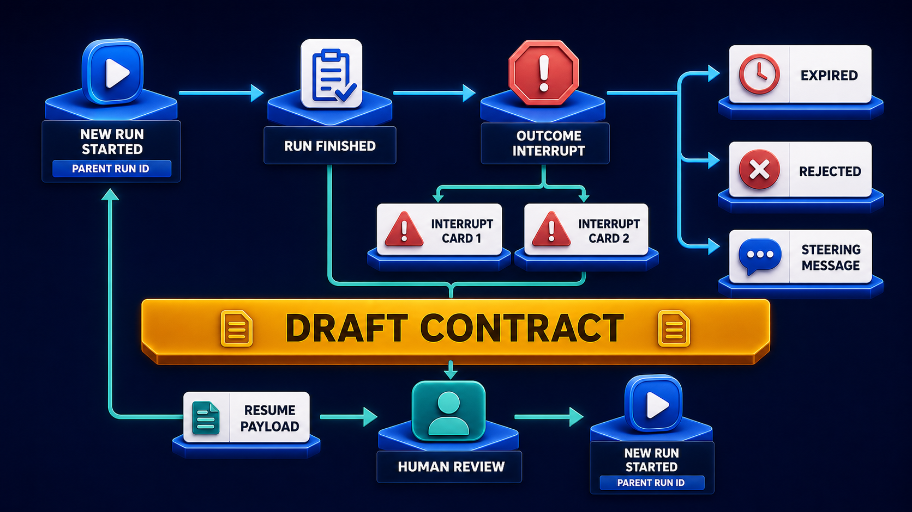

# Diagram 96 — Tool, Artifact, and Recovery Surfaces

![An AG-UI EVENT REDUCER platform at the top of a dark navy frame fans down to four white cards — 1 TOOL IN PROGRESS with an hourglass and a VIEW DETAILS button, 2 TOOL RESULT with a bar chart and VIEW DETAILS, 3 ARTIFACT READY with a teal document check and a DOWNLOAD button, and 4 RUN ERROR with a red warning triangle and three coral buttons reading EDIT INPUT, RETRY SAFE STEP and CONTACT SUPPORT. To the right, a coral equation reads EFFECTFUL CALL plus BLIND RETRY equals BLOCKED with a padlock. A teal line runs along the base back into the cards.](../diagrams/96-agui-tool-artifact-recovery.png)

**Module:** AG-UI in depth
**Role in the course:** the four surfaces a user sees, and the retry that must not happen
**Layout:** one reducer fanning to four cards, with a coral equation stating a prohibition

---

## At a glance

Four cards fed by one reducer: **TOOL IN PROGRESS**, **TOOL RESULT**, **ARTIFACT READY**, **RUN ERROR**.

To the right, an equation in coral:

**EFFECTFUL CALL + BLIND RETRY = BLOCKED**

The four cards are the surfaces. The equation is the rule that governs the fourth one's buttons, and it is stated as an equation because it admits no exceptions.

---

## What the diagram teaches

### 1. One reducer, four surfaces — state derived once

The **AG-UI EVENT REDUCER** sits above all four, with cyan arrows fanning down.

Four cards, one source of state. They cannot disagree, because they are views of the same object.

The alternative — four components each subscribing to the event stream and maintaining their own view — produces surfaces that drift. A tool card showing a call in flight beside a run showing completion is a symptom of independent subscribers.

### 2. The first two cards look the same and mean different things

**TOOL IN PROGRESS** — an **hourglass**, a **VIEW DETAILS** button.
**TOOL RESULT** — a **bar chart**, a **VIEW DETAILS** button.

Same button, different content behind it.

In progress, *view details* shows **what is being asked** — the tool name and the arguments. That is the diagnostic view: a slow call whose arguments are visible is a call you can reason about.

Complete, *view details* shows **what came back**. The bar chart says the result has structure worth looking at.

Offering the same affordance in both states is deliberate. A user does not have to learn two interactions, and the same instinct — click to see more — works throughout.

### 3. ARTIFACT READY has a different button, and the difference is the point

**DOWNLOAD**, in teal, rather than **VIEW DETAILS** in blue.

An artifact is not something you inspect; it is something you **take**. It is a produced deliverable with an existence outside the run.

The colour change reinforces it. Three blue interactions and one teal one, and the teal is the only one that removes something from the interface into the user's possession.

### 4. RUN ERROR has three buttons, and each addresses a different cause

**EDIT INPUT** — the failure was caused by what was supplied. Change it and proceed.

**RETRY SAFE STEP** — the failure was transient and the step is safe to repeat.

**CONTACT SUPPORT** — neither of the above; escalate with context.

Three options because three situations. An error surface offering only "try again" covers one of them, and offers it for cases where retrying is wrong.

Note the ordering: edit first, retry second, escalate last. That is roughly ascending in cost and descending in likelihood of user resolution.

### 5. The equation is the diagram's rule, and every word is load-bearing

**EFFECTFUL CALL + BLIND RETRY = BLOCKED**

**Effectful call** — a call that changed something outside the run. A payment, a message sent, a record written.

**Blind retry** — repeating it without knowing whether the first attempt took effect.

**Blocked** — the combination is not offered. Not warned about, not confirmed. The button does not appear.

The three coral elements — a gear, a crossed-out eye, a padlock — say it visually. Effect, blindness, prohibition.

### 6. Which is why the button says RETRY SAFE STEP

The word **safe** is not reassurance. It is a qualifier restricting what the button applies to.

The interface must know, per step, whether retry is safe. That requires the run's steps to carry that property — which means it is a protocol-level concern, not a UI one.

A step that took a payment is not safe. A step that read a record is. A step that wrote with an idempotency key is safe, because the key makes the repeat detectable.

An interface that offers retry on an effectful step is offering the user a way to cause a duplicate, and doing so in the state where the user is most likely to click it.

### 7. The teal return along the base closes the loop

A **teal line** runs from the right, along the base, and up into the four cards.

Recovery actions feed back. An edited input, a safe retry, or a support escalation all produce new state, which flows through the reducer and re-renders the cards.

The user is not taken to a different screen. The surfaces update in place.

Where a recovery action requires a human decision rather than a retry, it becomes a contract:

**CONTACT SUPPORT** on the error card is the escalation route; that diagram is what the escalation becomes. The three buttons here handle what the user can resolve; the contract handles what needs someone else.

---

## Case study — Barrowfield Payments, the retry button that cost £340,000

Barrowfield processes payments for about 4,000 merchants. Their operations assistant handles payment investigations, refunds, chargeback responses and settlement adjustments.

Their interface had a generic error surface with one button: **Retry**.

### What the button did

It re-executed the failed step.

For most steps that was harmless — a lookup, a report generation, a status check.

For one class it was not: steps that submitted an instruction to their payment processor.

### The incident

Their processor had a 25-minute degradation. Requests were accepted and processed; responses timed out.

Operations staff saw runs failing at the submission step. They clicked Retry. The interface offered it, so it looked like the right thing to do.

Over the window, **1,180 refund submissions** were retried. Most of the originals had succeeded.

**£340,000 of duplicate refunds** were issued to merchants' customers.

Recovering it took eleven weeks of merchant-by-merchant reconciliation. Roughly £290,000 was recovered. The remainder was written off, along with the reconciliation cost.

### Why the interface was the cause

The failure was not in the payment layer, which behaved correctly. It was not in the staff, who did what the interface invited.

The interface offered a retry on a step where retry was unsafe, at exactly the moment a user would take it, with no information about whether the original had succeeded.

Their post-incident review's conclusion was that **the button should not have existed for that step**.

### The rebuild

**Every step carries a safety classification.** Set at the protocol level, on the tool definition, not in the interface.

*Safe* — idempotent, or with no external effect. Retry offered.
*Unsafe* — effectful and not idempotent. Retry never offered.
*Conditionally safe* — effectful with an idempotency key. Retry offered, and the key makes the repeat detectable.

Auditing their 60 tools found **14 unsafe**, of which 9 had been retryable through the interface.

**The error surface became three options, conditioned on the step.**

For an unsafe step, the buttons are **Check status** and **Contact support**. There is no retry.

**Check status** is the correct action for an unknown outcome: query whether the operation took effect. It is what a person should do, and the interface now makes it the obvious action instead of retry.

**Idempotency keys were added to eleven of the fourteen unsafe steps**, moving them to conditionally safe.

Three could not be — they submit to external systems that do not support them. Those remain unsafe permanently, and their error surface offers only status-check and escalation.

**The error message states what is known.**

> Submission to processor timed out. **We do not know whether this refund was issued.** Check status to find out before taking any further action.

That sentence in bold is the one their operations lead considers most valuable. The previous message said "submission failed," which was not true and which invited exactly the wrong response.

### The artifact finding

Their rebuild also separated artifacts from results properly.

Previously, a generated settlement report appeared as a tool result with a *view details* link that opened a modal. Staff who needed the file screenshotted the modal.

Making it an artifact with a **download** action seems trivial and eliminated a recurring support request. Roughly 200 support contacts a year had been "how do I get this report out."

### The in-progress details finding

Adding *view details* to the in-progress state produced an unexpected benefit.

Staff could see the arguments of a running call. When a settlement calculation ran slowly, they could see which merchant and date range it was processing.

That let them distinguish "this is a large merchant, it will take a while" from "this is wrong, it is processing the whole year." The second case had previously been discovered only after completion.

### Results

- **Duplicate payment operations from interface retries:** 1,180 in one incident → 0.
- **Unsafe steps retryable through the interface:** 9 → 0.
- **Unsafe steps made conditionally safe with idempotency keys:** 11 of 14.
- **Support contacts about extracting reports:** ~200/year → near zero.
- **Slow-calculation misconfigurations caught during execution:** newly possible.

### The line in their interface guidelines

*Do not offer an action the user should not take. A confirmation dialog is not a substitute for not having the button.*

---

## Composition

A single reducer platform fanning to four cards, with an equation to the right and a return along the base.

**AG-UI EVENT REDUCER** — a wide blue platform with a funnel-and-gear glyph, at top centre.

**Four cyan arrows** descend to four white cards, each with a circular icon badge above it:

**1 TOOL IN PROGRESS** — blue hourglass badge, a blue **VIEW DETAILS** button with an eye glyph.
**2 TOOL RESULT** — blue bar-chart badge, a blue **VIEW DETAILS** button.
**3 ARTIFACT READY** — teal document-with-check badge, a **teal DOWNLOAD** button.
**4 RUN ERROR** — red warning-triangle badge, three **coral buttons**: **EDIT INPUT** (pencil), **RETRY SAFE STEP** (refresh), **CONTACT SUPPORT** (headset).

**Right:** a coral-outlined equation — a **gear** tile labelled **EFFECTFUL CALL**, a coral **+**, a **crossed-out eye** tile labelled **BLIND RETRY**, a coral **=**, and a **padlock** tile labelled **BLOCKED**.

**Base:** a **teal line** running left from the error card along the bottom, with arrows rising into the first three cards.

## Element by element

**AG-UI EVENT REDUCER** — a blue platform with a white funnel and gear.

**TOOL IN PROGRESS** — an hourglass. Details show the arguments.
**TOOL RESULT** — a bar chart. Details show the return.
**ARTIFACT READY** — a teal document with a check. Download takes it.
**RUN ERROR** — a red warning triangle. Three conditioned actions.

**The equation** — gear, crossed-out eye, padlock, in coral outline.

## Colour and flow semantics

- **Cyan arrows** carry state from the reducer to all four surfaces.
- **Blue buttons** for inspection; **teal** for taking possession; **coral** for recovery actions.
- The **equation is entirely coral**, marking it as a prohibition rather than guidance.
- The **teal return line** feeds recovery outcomes back into the surfaces.
- **One reducer above four cards** asserts single-source state.

## How to present it

**Ask what their error surface offers.** If the answer is a retry button, ask which steps it appears on.

**Read the equation aloud.** Effectful call plus blind retry equals blocked. Then stress *blocked* — not warned, not confirmed. The button does not appear.

**Tell the Barrowfield incident with the number.** 1,180 retries during a 25-minute processor degradation, £340,000 of duplicate refunds, eleven weeks of reconciliation, £50,000 unrecovered.

**Make the attribution clear.** The payment layer behaved correctly. The staff did what the interface invited. The interface offered an action that should not have been offered.

**Ask where the safety classification belongs.** On the tool definition, at protocol level — not in the interface. The interface cannot know which steps are safe unless the protocol tells it.

**Walk the three classifications.** Safe, unsafe, conditionally safe with an idempotency key. Then give Barrowfield's audit: 14 unsafe of 60 tools, 9 of them retryable.

**Read the rewritten error message.** *We do not know whether this refund was issued.* Ask what the previous message said — "submission failed" — and what response that invited.

**Point at the different button on the artifact card.** Inspect versus take. Then give the screenshot finding: 200 support contacts a year from staff photographing a modal because there was no download.

**Ask what in-progress details are for.** Barrowfield's staff could see which merchant and date range a slow calculation was processing, distinguishing a large job from a misconfigured one. Previously discoverable only after completion.

**Close on the guideline.** *Do not offer an action the user should not take. A confirmation dialog is not a substitute for not having the button.*

**Timing.** Twenty-five minutes. Thirty-five if you classify the retry-safety of the room's own steps, which reliably finds one that should not be retryable and is.

---

## Lab and checkpoint

**Lab:** Classify one tool in your system as safe, unsafe, or conditionally safe. Write the tool definition that reports this classification, the error surface that appears if the call fails, and the button the user sees. Ensure effectful tools do not show a blind retry button. Add an artifact-ready surface with inspect and take actions.

**Checkpoint:** Why must retry-safety be declared by the tool, not left to the UI?

**Answer:** Because the UI cannot reliably know which operations are safe to repeat. The tool or protocol must declare it. Otherwise, an unsafe operation gets a retry button, and a user can cause duplicate effects by clicking what the interface invited them to click.

## Glossary

- **Artifact** — a produced object that is ready before the run finishes.
- **Artifact ready** — the event that signals an artifact is available.
- **Blind retry** — a retry offered without knowing whether the previous call succeeded.
- **Effectful call** — an operation that has side effects, such as a payment or a write.
- **Error surface** — the UI shown when a step or run fails.
- **Inspect** — the action that lets the user look at an artifact before taking it.
- **Reducer** — the function that derives UI state from events.
- **Retry safe step** — the action that re-executes a step known to be safe.
- **Run error** — the terminal failure of a run.
- **Safe/unsafe/conditionally safe** — the classification of a step's retryability.
- **Take** — the action that accepts an artifact.

## Sources

- AG-UI tool artifacts and recovery UX
- Retry-safety classification and tool definitions
- Effectful operation UI and error messaging
