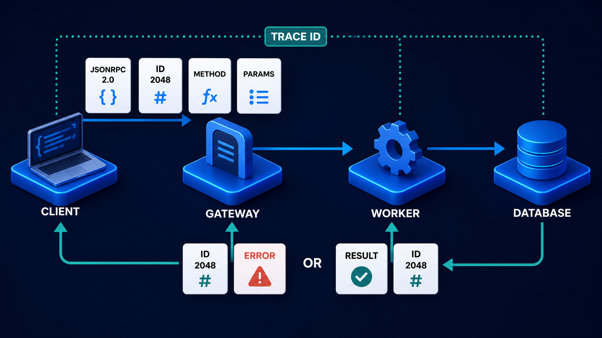

# Diagram 98 — Adapters, Correlation, and Contract Maps

![An AG-UI EVENT tile on dark navy feeds an ORCHESTRATOR drawn as a segmented cube. Two cyan arrows branch to MCP ADAPTER and A2A ADAPTER, both white puzzle pieces, each leading to a CONTRACT MAP card and then to POLICY SERVER with a shield and PAYMENT AGENT, a robot holding a card. Beneath the orchestrator, a CORRELATION SPINE panel lists five teal tags — TRACE ID with a fingerprint, CASE ID with a folder, TASK ID with a checklist, TOOL CALL ID with a terminal, IDEMPOTENCY KEY with a key — each sending teal lines up into both adapters. Coral arrows drop from both contract maps to LOSSY MAPPINGS warning tiles.](../diagrams/98-adapter-correlation-contract.png)

**Module:** Choosing boundaries
**Role in the course:** what an adapter must carry and what it must declare it loses
**Layout:** one orchestrator feeding two adapters, both threaded by a correlation spine, both declaring lossy mappings

---

## At a glance

An orchestrator drives two adapters — one for MCP, one for A2A — each translating through a **CONTRACT MAP** into a different protocol.

Threading through both, a **CORRELATION SPINE** carrying five identifiers.

And dropping from both contract maps, in coral: **LOSSY MAPPINGS**.

Two claims. Correlation must survive every translation. And every translation loses something, which must be declared rather than discovered.

---

## What the diagram teaches

### 1. The orchestrator is a segmented cube, and the segmentation is apt

Drawn as a cube made of smaller cubes in mixed colours.

An orchestrator is not one thing. It is an assembly of routing decisions, state, and adapter selection — and the rendering conveys composition rather than monolith.

It is also the only component touching both adapters, which makes it the place where correlation originates.

### 2. Five identifiers, five scopes, and they are not interchangeable

**TRACE ID** (fingerprint) — the whole distributed operation, across every component and protocol.

**CASE ID** (folder) — the business unit of work. Several tasks and many tool calls belong to one case.

**TASK ID** (checklist) — one delegated unit of work in A2A.

**TOOL CALL ID** (terminal) — one capability invocation in MCP.

**IDEMPOTENCY KEY** (key) — one intended effect, used to make a repeat detectable.

Five scopes, nesting roughly from widest to narrowest — except the idempotency key, which is not a scope at all but an assertion about an operation's identity.

Conflating any two produces a specific failure. A trace ID used as a tool call ID cannot distinguish concurrent calls. A case ID used as an idempotency key means two legitimate operations on one case are treated as duplicates.

### 3. The spine feeds both adapters, and that is the whole point of drawing it

Teal lines run from every identifier tag up into **both** the MCP adapter and the A2A adapter.

The identifiers are protocol-independent. They exist above the adapters and are carried through them.

That is what makes cross-protocol correlation possible. A trace that begins with an AG-UI event, passes through an MCP tool call and an A2A task, and ends in an audit record is one trace — because the same identifier travelled through three different protocols.

An adapter that generates its own identifiers, or drops the ones it received, breaks the spine at that point and everything downstream becomes uncorrelatable.

### 4. The word "spine" is doing work

Not "correlation context" or "metadata." A **spine** — the structural element everything attaches to.

It runs through the system rather than alongside it. Components hang off it. Remove it and the thing collapses into disconnected parts.

### 5. Adapters are puzzle pieces, and the metaphor is honest

Both adapters are drawn as **white puzzle pieces**.

A puzzle piece fits between two shapes that were not designed for each other. It is a connector whose form is dictated by what it joins.

That is what an adapter is, and it carries the implication the next point makes explicit: **a piece that fits two different shapes rarely fits both perfectly.**

### 6. The contract map is where translation is written down

Each adapter leads to a **CONTRACT MAP** — a white card showing rows of arrows from left symbols to right symbols.

The map is the explicit statement of what maps to what: this concept in the orchestrator's model becomes that concept in the target protocol.

Making it an artefact rather than logic buried in adapter code has three consequences.

**It is reviewable.** Someone can read what the translation asserts.

**It is testable.** Each mapping is a case.

**Its gaps are visible.** A concept with no mapping is an empty row, not a silent omission.

### 7. LOSSY MAPPINGS is coral, appears twice, and is the diagram's most important element

A coral warning tile drops from **each** contract map.

Every translation between models loses something. That is not a flaw in these particular adapters; it is a property of translation.

What gets lost, typically:

**Precision.** A source model with eight task states mapping to a target with five means three states collapse.

**Structure.** Nested data flattened, or typed parts merged into text.

**Semantics.** Two concepts that are distinct in one model and identical in the other.

**Metadata.** Fields with no counterpart, silently dropped.

The design position: **loss is acceptable and must be declared.** An adapter that documents "our `input_required` and `auth_required` both map to the target's `waiting` state, and the distinction is not recoverable" is honest. One that maps them silently produces callers who cannot understand why a distinction they rely on has vanished.

### 8. Two adapters, two contract maps, two loss declarations

Not one shared map. Each adapter has its own, because each translates into a different model with different gaps.

That separation prevents a common shortcut: a single "translation layer" that handles both protocols and accumulates conditionals until nobody can say what it does to any particular field.

Two of the five identifiers on the spine already exist inside the protocols themselves:

The **ID 2048** there is a protocol-scoped identifier that must not be reused as a trace, and the dotted line is the trace that must not be reused as a protocol ID. The spine's job is to keep all five distinct while carrying them through translations that have no native place for most of them.

---

## Case study — Ferrisburgh Group, the state that vanished in translation

Ferrisburgh operates a claims and payments platform for a group of insurers. Their orchestrator drives an internal policy MCP server and an external payments A2A agent operated by a banking partner.

Two protocols, two adapters, one correlation problem and one loss problem.

### The correlation failure

Their adapters each generated their own identifiers.

The MCP adapter created a call ID per tool invocation. The A2A adapter created a task ID per delegation. Neither carried the orchestrator's trace ID or case ID forward.

The consequence: three separate identifier spaces with nothing joining them.

**Reconstructing one claim's processing** meant querying the orchestrator's logs for a case, extracting the timestamps, querying the MCP server's logs for calls in that window, querying the payment partner's records for tasks in that window, and correlating by inference.

For a claim processed during a quiet period this worked. During peak, with 40 claims per minute, "in that window" contained dozens of candidates.

**A regulator asked a specific question:** for a disputed payment, which policy version had been used to authorise it?

The answer existed. Assembling it took nine days and involved their banking partner producing records manually.

### The rebuild of the spine

All five identifiers are now generated by the orchestrator and carried through both adapters.

**Trace ID** — one per user-initiated operation, propagated everywhere including to the banking partner.

**Case ID** — the claim. Every tool call and every task carries it.

**Task ID** — assigned by the A2A adapter but *recorded against* the case and trace, not replacing them.

**Tool call ID** — same relationship on the MCP side.

**Idempotency key** — derived from the intended effect, carried on any operation with consequences.

The banking partner's agent accepts the trace and case identifiers as task metadata and echoes them in artifacts and status events.

That echo was the negotiation that took longest — about six weeks — and it is what made cross-organisation correlation possible.

**The same regulator question now takes under a minute.**

### The lossy mapping that caused an incident

Their orchestrator's internal model has six payment states. The banking partner's A2A model has four.

Their adapter mapped:

- `submitted` → `submitted`
- `authorised` → `working`
- `processing` → `working`
- `settled` → `completed`
- `returned` → `failed`
- `recalled` → `failed`

Two collapses. `authorised` and `processing` both became `working`. `returned` and `recalled` both became `failed`.

The second collapse mattered.

**A returned payment** is one the receiving bank rejected — wrong account details, closed account. The correct response is to correct the details and resubmit.

**A recalled payment** is one Ferrisburgh withdrew, typically because of a fraud indicator. The correct response is emphatically *not* to resubmit.

Their adapter mapped both to `failed`. Their retry logic, seeing `failed`, resubmitted.

**Fourteen recalled payments were resubmitted**, of which eleven completed. Three were subsequently confirmed as fraudulent, totalling about £47,000, of which £31,000 was recovered.

### Why nobody caught it

The mapping was three lines in adapter code. It had been written by someone implementing the integration against the partner's four-state model, doing the reasonable thing of mapping their six onto it.

Nothing declared that two distinct outcomes had become one. The retry logic was written by a different person, months later, against a state field that looked complete.

### What they built

**Contract maps as reviewed artefacts.** Each adapter has an explicit map, in a format that is reviewed and versioned, not inline code.

**A lossy-mapping declaration.** Every collapse is stated:

> `returned` and `recalled` both map to the partner's `failed` state. **The distinction is not recoverable from the partner's state field.** Consumers must read the `ferrisburgh.internal_state` metadata field, which the adapter preserves, before deciding whether to retry.

That preserved metadata field was the fix. Where a mapping is lossy and the distinction matters, the adapter carries the source value alongside the translated one.

**Retry logic reads the internal state.** Not the translated one.

**Every lossy mapping is a test case.** The suite asserts that both source states produce the correct translated value *and* that the internal state is preserved.

### The audit that followed

Reviewing all mappings across both adapters found **19 lossy mappings**, of which **4 were consequential** — cases where the lost distinction affected a decision.

Three were fixed by preserving source metadata. One was fixed by negotiating an additional state with the banking partner, which took four months and was worth it.

The remaining 15 were declared and accepted.

### Results

- **Cross-organisation correlation:** inference by timestamp → one query.
- **Time to answer a regulator's specific question:** nine days → under a minute.
- **Resubmitted recalled payments:** 14 → 0.
- **Lossy mappings:** 19 found, 4 consequential, all now declared.

### The line in their adapter standard

*Every adapter declares what it loses. If you cannot say what a mapping drops, you have not finished writing it.*

---

## Composition

A left-to-right flow branching into two protocol paths, with a correlation panel beneath and loss warnings dropping from each path.

**AG-UI EVENT** (blue tile with a document glyph) → cyan arrow → **ORCHESTRATOR** (a segmented cube of blue and white blocks on a blue platform).

Two cyan arrows branch: upward to **MCP ADAPTER** (a white puzzle piece on a blue platform), downward to **A2A ADAPTER** (an identical white puzzle piece).

Each adapter → cyan arrow → a white **CONTRACT MAP** card showing rows of small arrows between coloured markers → cyan arrow → a destination: **POLICY SERVER** (a dark server with a teal shield) and **PAYMENT AGENT** (a white robot holding a payment card).

**Beneath the orchestrator:** a **CORRELATION SPINE** header above five teal-bordered tags — **TRACE ID** (fingerprint), **CASE ID** (folder), **TASK ID** (checklist), **TOOL CALL ID** (terminal `>_`), **IDEMPOTENCY KEY** (key) — each sending **teal lines** rightward and upward into both adapters.

**Coral arrows** drop from each contract map to a **LOSSY MAPPINGS** tile with a warning triangle.

## Element by element

**AG-UI EVENT** — a blue tile with a white document-and-pen glyph.

**ORCHESTRATOR** — a cube assembled from smaller blue and white cubes. Composition, not monolith.

**MCP ADAPTER / A2A ADAPTER** — identical white puzzle pieces with blue notches.

**CONTRACT MAP** — a white card with three rows, each showing a dot, an arrow, and a coloured square.

**POLICY SERVER** — a dark server unit with a **teal shield**.

**PAYMENT AGENT** — a white robot with blue eyes, holding a payment card.

**The five identifier tags** — teal-bordered rounded panels with teal glyphs.

**LOSSY MAPPINGS** — coral tiles with white warning triangles.

## Colour and flow semantics

- **Cyan arrows** carry the operation from event through orchestrator, adapters and contract maps to destinations.
- **Teal lines** carry the five identifiers from the spine up into both adapters — a different kind of connection from the flow arrows.
- **Coral** appears twice, once per contract map, marking declared loss.
- The **two adapters are drawn identically**, marking them as the same kind of component with different targets.
- The **spine sits beneath and feeds upward**, structurally supporting both paths.

## How to present it

**Read the five identifiers and ask for the scope of each.** Whole operation, business unit, one delegated task, one capability call, one intended effect. Then ask what conflating any two produces.

**Ask which their system carries across protocol boundaries.** Usually a trace ID, sometimes. Rarely all five, and rarely through an adapter.

**Tell the Ferrisburgh correlation failure.** Three identifier spaces, nothing joining them, and a regulator's specific question taking nine days with the banking partner producing records by hand.

**Point at the teal lines going into both adapters.** Identifiers live above the protocols. An adapter that generates its own and drops what it received breaks the spine at that point.

**Ask why the adapters are puzzle pieces.** A piece that fits two shapes it did not design rarely fits both perfectly. That is the setup for the coral.

**Ask what a contract map is for.** Reviewable, testable, and its gaps are visible as empty rows rather than silent omissions.

**Spend the most time on lossy mappings.** Ask the room what their own adapters lose. Most have never asked.

**Tell the returned-versus-recalled incident.** Six states into four, two collapses, and retry logic that resubmitted fourteen recalled payments — three of them fraudulent.

**Ask why nobody caught it.** Three lines of code written by someone doing the reasonable thing, and retry logic written months later by someone else against a field that looked complete.

**Give them the fix.** Where a mapping is lossy and the distinction matters, preserve the source value alongside the translated one, and declare it. Ferrisburgh found 19 lossy mappings, 4 consequential.

**Close on the standard.** *If you cannot say what a mapping drops, you have not finished writing it.*

**Timing.** Twenty-five minutes. Thirty-five if you audit one of the room's own adapters for lossy mappings, which reliably finds several nobody had listed.

---

## Lab and checkpoint

**Lab:** Audit one adapter in your system. List the identifiers it receives and the ones it produces. Build a contract map showing source fields, target fields, and any lossy mappings. For each lossy mapping, decide whether the distinction matters and, if so, how to preserve the original value alongside the translated one.

**Checkpoint:** Why must identifiers live above the protocol adapters?

**Answer:** Because an adapter that generates its own identifiers and drops the ones it received breaks the correlation spine. Identifiers such as trace ID, context ID, and task ID must flow through the adapter so the whole operation remains traceable across protocol boundaries.

## Glossary

- **Adapter** — the component that translates one protocol or model into another.
- **Contract map** — the documented mapping between source and target fields.
- **Correlation** — the ability to connect events and records across a system.
- **Correlation spine** — the chain of identifiers that runs through all adapters.
- **Effect ID** — the identifier for a single intended side effect.
- **Lossy mapping** — a translation that collapses or drops information from the source.
- **Orchestrator** — the central component that coordinates the operation.
- **Protocol boundary** — the point where one protocol ends and another begins.
- **Scope** — the range of meaning of an identifier.
- **Trace ID** — the identifier that spans the whole operation.

## Sources

- Protocol adapter and contract mapping
- Identifier correlation across boundaries
- Lossy mapping detection and preservation
