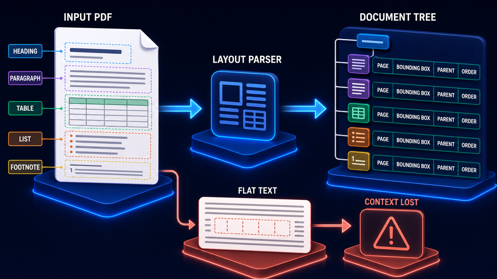

# Diagram 103 — OCR, Images, Attachments, and Multimodal Evidence

![Three input platforms on dark navy — SCANNED PDF, SCREENSHOT and CHART — feed two processing tiles. OCR AND LAYOUT shows a text-recognition frame with layout regions; VISUAL PAGE EMBEDDING shows an image tile connecting by dots to a blue cube. Both converge on MULTIMODAL EVIDENCE, a wide platform holding five white cards labelled TEXT, IMAGE, PAGE, BBOX and CONFIDENCE. A coral arrow from the confidence card passes through a LOW CONFIDENCE tile to HUMAN REVIEW, a red platform showing a person at a screen.](../diagrams/103-multimodal-evidence-intake.png)

**Module:** Document engineering
**Role in the course:** evidence that is not text, and knowing when you are unsure
**Layout:** three input types into two processing paths, converging on a five-field record with a confidence escape

---

## At a glance

Three visual input types feed **two different processing paths** — one that reads text out of images, one that embeds the image itself — and both converge on a **MULTIMODAL EVIDENCE** record carrying five fields.

The fifth field is **CONFIDENCE**, and it is the only one with an outgoing path: a coral route through **LOW CONFIDENCE** to **HUMAN REVIEW**.

That confidence field is the diagram's subject. Extraction from images is probabilistic, and a system that does not record how sure it is cannot know when to ask.

---

## What the diagram teaches

### 1. Two processing paths, and they are complementary rather than alternative

**OCR AND LAYOUT** — recognises characters and reconstructs structure. It produces text you can search lexically, chunk, and quote.

**VISUAL PAGE EMBEDDING** — embeds the page as an image. It produces a representation you can search by visual similarity without ever converting to text.

Notice the routing. The **SCANNED PDF** feeds OCR. The **CHART** feeds visual embedding. The **SCREENSHOT** feeds **both**.

That is the honest allocation. A scanned text document is text that needs recognising. A chart's meaning is in its shape and its relationships, much of which OCR cannot recover. A screenshot is both — it has readable text and a visual arrangement that matters.

### 2. Charts are the case that justifies visual embedding

Feed a bar chart to OCR and you get the axis labels, the legend, and the title. You do not get the thing the chart says.

The trend, the relative magnitudes, the outlier — those are spatial relationships between marks. A visual embedding can match a query like "the chart showing the drop in Q3" because the drop is a visual feature.

That is a genuinely different retrieval capability, not a fallback for when OCR fails.

### 3. Five fields, and the first four are the citation chain

**TEXT** — what was read.
**IMAGE** — the visual content itself, retained.
**PAGE** — which page.
**BBOX** — where on it.

Those four are the same properties the layout parsing diagram establishes, extended to visual evidence. Retaining the **IMAGE** alongside the text is what makes a visual citation possible: you can show the region rather than quoting a possibly-imperfect transcription.

For OCR'd content that matters more than for born-digital text, because the transcription may be wrong and the image is not.

### 4. CONFIDENCE is the fifth field and the diagram's real content

A gauge icon, and the only field with an outgoing path.

Every other stage in this volume produces something either correct or refused. OCR produces something **probably** correct, and the probability varies enormously — from near-certainty on clean printed text to guesswork on a faded fax of a handwritten form.

Recording that variation per extraction is what allows the system to behave differently. High-confidence extraction proceeds. Low-confidence extraction routes to a person.

Without the field, all extractions are treated identically, which means the guesswork is indexed with the same authority as the certainty.

### 5. HUMAN REVIEW is drawn in red, and the colour is deliberate

The review platform is **red**, matching the low-confidence tile.

Elsewhere in this library human review is teal or blue — a normal, healthy stage. Here it is red, because reaching it means the automated path could not produce trustworthy evidence.

It is not a failure of the system; it is the system correctly declining to guess. But it has a cost — human attention — and colouring it as an exception rather than a routine path is right.

### 6. Confidence should be per-region, not per-document

Worth stating because the diagram's single gauge can be misread.

A scanned page typically has regions of very different quality — a clean printed header and a faded handwritten annotation on the same page.

A document-level confidence score averages those, which means either the good regions are held back or the bad ones pass. Per-region confidence lets a page be partly indexed and partly reviewed.

### 7. What the threshold should be is a domain question

The diagram shows a route and not a number.

Where the threshold sits depends on what a wrong extraction costs. A knowledge base of marketing material can tolerate a low bar. A pension rule book cannot.

Setting it also requires knowing your review capacity. A threshold that routes 40% of pages to humans is a threshold nobody will honour.

The **PAGE** and **BBOX** fields here are the same properties born-digital documents carry through layout parsing:

That diagram's four node properties and this one's five evidence fields overlap on page and bounding box deliberately. Scanned and born-digital content must arrive downstream in the same shape, or every later stage needs two code paths.

---

## Case study — Corrance Land Registry Services, the handwritten annotation

Corrance provides title research and conveyancing support. Their corpus is roughly 2.4 million pages of historical land records — deeds, plans, covenants, and registers — spanning about 140 years.

Perhaps 60% is scanned. Much of the older material is handwritten, and a significant proportion carries handwritten annotations on printed forms.

### What they built first

OCR over everything, indexed as text. No confidence recording, no visual retention, no review path.

Their assessment was that OCR quality was "generally good," based on spot checks of twentieth-century typed material.

### The problem with that assessment

Their corpus is not uniform. Sampling by decade showed:

**Post-1990 typed documents:** character accuracy above 99%.
**1950–1990 typed documents:** around 96%.
**Pre-1950 typed documents:** around 88%.
**Handwritten material of any period:** between 40% and 70%, wildly variable.
**Handwritten annotations on printed forms:** worst case, frequently below 50%.

That last category is small — perhaps 4% of pages — and disproportionately important. Annotations are where restrictions, variations and corrections are recorded.

### The incident

A conveyancing firm relied on a Corrance title summary that reported no restrictive covenants affecting a property.

There was one. It was a handwritten annotation on a 1963 printed register page, restricting building height. OCR had rendered it as an unintelligible string, and the indexed text contained nothing recognisable as a covenant.

The purchaser began a loft conversion. The covenant was discovered by a neighbour's solicitor.

The resulting dispute cost the purchaser about £70,000 in legal costs and abandoned works. Corrance's professional indemnity insurer settled a claim.

### The audit

They sampled 5,000 pages containing handwritten content and compared OCR output against manual transcription.

**On 31% of those pages, the OCR output was so degraded that no meaningful retrieval was possible.** The text was indexed. It was gibberish.

**On a further 22%, the OCR output was partially correct in a way that was worse than gibberish** — plausible words in place of the actual ones. A page reading "shall not erect" had been rendered "shall not effect" on one sample, which changes the meaning and reads as legitimate text.

Nothing in the system distinguished these from the 47% that had extracted well.

### The rebuild

**Confidence recorded per region, not per page.** Their OCR engine reports per-region confidence, and they had been discarding it.

A 1963 printed register page now carries high confidence on the printed form fields and low confidence on the handwritten annotation, and the two are handled differently.

**Visual retention for everything.** The page image is retained and linked to every extracted region by bounding box. A citation shows the original.

For handwritten material this is the primary evidence. The transcription is a search aid; the image is the source.

**Visual page embedding added.** Their historical plans and boundary drawings are not text at all, and had been effectively unsearchable. Visual embedding made queries like "the plan showing the strip of land to the rear" possible for the first time.

This was not part of the remediation plan. It was added because the visual pipeline existed once images were retained, and it turned out to open a category of query their researchers had been doing manually.

**A confidence threshold with a review queue.** Regions below the threshold are flagged. A page containing any flagged region is marked as requiring verification before its content is relied upon in a title summary.

**The threshold was set by cost, not by convenience.** Corrance's exposure on a missed covenant is measured in tens of thousands of pounds. They set the threshold high, which routes about 9% of pages to review.

Nine percent of 2.4 million pages is a large number, and they did not attempt to review them all up front. Review is triggered on retrieval: a flagged region entering an evidence packet routes that title research to a human transcriptionist before the summary is issued.

That deferred model made the volume manageable — about 400 pages a week reach a human, rather than 216,000 up front.

### The finding they did not expect

Once confidence was recorded, they could measure it by source characteristic.

**Documents scanned before 2011 had systematically lower confidence** than the same material rescanned. Their scanning process had been upgraded, and about 340,000 pages had been scanned on the old equipment at a resolution that OCR handled poorly.

Rescanning those pages raised average confidence enough to drop about 40,000 of them below the review threshold — a direct reduction in ongoing human cost, funded by a one-off scanning project.

Nobody had known the old scans were worse, because nothing had been measuring.

### Results

- **Pages with unusable OCR indexed as text:** ~31% of handwritten material → flagged rather than silently indexed.
- **Plausible-but-wrong transcriptions:** now flagged by confidence rather than indistinguishable.
- **Historical plans searchable:** effectively 0 → searchable by visual similarity.
- **Pages routed to human review:** ~9%, deferred to retrieval, ~400/week.
- **Old-equipment scans identified and reprocessed:** ~340,000.
- **Missed covenants in issued summaries:** 1 known, 0 since.

### The line in their quality manual

*OCR does not tell you it was wrong. It tells you what it read. Recording how sure it was is the only difference between evidence and a guess.*

---

## Composition

Three inputs at the top, two processing paths in the middle, a five-field record beneath, and a review escape to the right.

**Top:** three blue platforms with labelled tags — **SCANNED PDF** (white page with a red PDF badge and an image block), **SCREENSHOT** (browser window with content blocks and an image), **CHART** (white card with a bar chart and pie chart).

**Cyan arrows** route: scanned PDF and screenshot down-left to **OCR AND LAYOUT**; screenshot and chart down-right to **VISUAL PAGE EMBEDDING**.

**Middle:** two bordered blue tiles — **OCR AND LAYOUT** showing a text-recognition frame beside layout region glyphs; **VISUAL PAGE EMBEDDING** showing an image tile connected by teal dots to a blue cube.

**Teal arrows** from both converge downward into **MULTIMODAL EVIDENCE** — a wide bordered platform holding five white cards: **TEXT** (blue `T`), **IMAGE** (a picture), **PAGE** (a document with an image), **BBOX** (a teal dashed selection frame), **CONFIDENCE** (a teal gauge).

**Right:** a **coral arrow** from the confidence card to a **LOW CONFIDENCE** tile, then a coral arrow to **HUMAN REVIEW** — a red platform showing a person at a screen.

## Element by element

**SCANNED PDF** — a white page with a red PDF badge. Feeds OCR only.
**SCREENSHOT** — a browser window. Feeds both paths.
**CHART** — a white card with bar and pie charts. Feeds visual embedding only.

**OCR AND LAYOUT** — a character-recognition frame with layout region glyphs.
**VISUAL PAGE EMBEDDING** — an image tile connected to a blue cube by teal dots.

**The five evidence cards** — TEXT, IMAGE, PAGE, BBOX, CONFIDENCE.

**LOW CONFIDENCE** — a coral-bordered tile.
**HUMAN REVIEW** — a red platform with a person at a screen.

## Colour and flow semantics

- **Cyan arrows** carry inputs into the two processing paths.
- **Teal arrows** carry both processing outputs into the evidence record.
- **Coral** marks the low-confidence escape and the human review platform — an exception path, not a routine one.
- The **screenshot feeding both paths** is the only input with two routes, and it is the only one whose content is genuinely both textual and visual.
- **CONFIDENCE is the only evidence field with an outgoing arrow.**

## How to present it

**Ask what happens when a document is an image.** Most rooms say OCR. Then ask what OCR does with a chart, and let them work out that it returns the axis labels and not the finding.

**Point at the screenshot feeding both paths.** Text and visual arrangement both matter. Ask what their own system does with screenshots.

**Read the five fields and ask which is unusual.** Confidence. Then ask what it is for, and note that it is the only field with an outgoing path.

**Make the probabilistic point.** Every other stage produces something correct or refused. OCR produces something *probably* correct, varying from near-certain to guesswork. A system that does not record the variation indexes guesswork with the same authority as certainty.

**Tell the Corrance covenant.** A handwritten annotation on a 1963 register, OCR'd to gibberish, a loft conversion begun, £70,000 in costs.

**Give them the two audit categories.** 31% unusable — bad and detectable by a human reading it. 22% plausible-but-wrong — "shall not erect" rendered "shall not effect", which reads as legitimate. The second category is worse.

**Argue for per-region confidence.** A page with a clean printed header and a faded annotation has one average score that serves neither. Ask what granularity their extraction reports at.

**Ask where the threshold goes.** A domain question about the cost of a wrong extraction, bounded by review capacity. A threshold routing 40% to humans is one nobody honours.

**Give them the deferred-review model.** Corrance flag at ingestion and review at retrieval — 400 pages a week rather than 216,000 up front. That is what made a high threshold affordable.

**Tell the old-scanner finding.** Confidence measured by source characteristic revealed 340,000 pages scanned on superseded equipment. Rescanning dropped 40,000 below the review threshold. Nobody had known, because nothing had been measuring.

**Timing.** Twenty-five minutes. Thirty-five if the room has scanned material and you sample its confidence distribution, which is usually worse than expected.

---

## Lab and checkpoint

**Lab:** Pick an image-based document in your corpus and process it through both OCR and a vision embedding. For each region, record text, visual embedding, confidence, source, and page. Set a confidence threshold and define what happens below it: refuse, human review, or flag at retrieval. Then write the review workflow for deferred review.

**Checkpoint:** Why should confidence be per-region rather than per-document?

**Answer:** Because a page can have regions with very different confidence — a clean printed header and a faded, handwritten annotation. A single document score would either over-flag the clean region or under-flag the poor one. Per-region confidence lets the system route only the uncertain regions for review.

## Glossary

- **Chart** — a visual element whose meaning depends on spatial arrangement.
- **Citation chain** — the record of source, page, region, and confidence that supports a piece of evidence.
- **Confidence** — the model's estimate of how likely an extraction is correct.
- **Deferred review** — flagging low-confidence regions at ingestion and reviewing them when they are retrieved.
- **Human review** — the path for extractions below the confidence threshold.
- **Multimodal** — using both text and visual information.
- **OCR** — optical character recognition for text in images.
- **Region** — a bounded part of a page.
- **Threshold** — the confidence level below which extraction is refused or reviewed.
- **Visual embedding** — a vector representation of the visual arrangement of a region.

## Sources

- Multimodal document extraction and OCR
- Visual embedding and chart understanding
- Confidence scoring and human review in RAG
