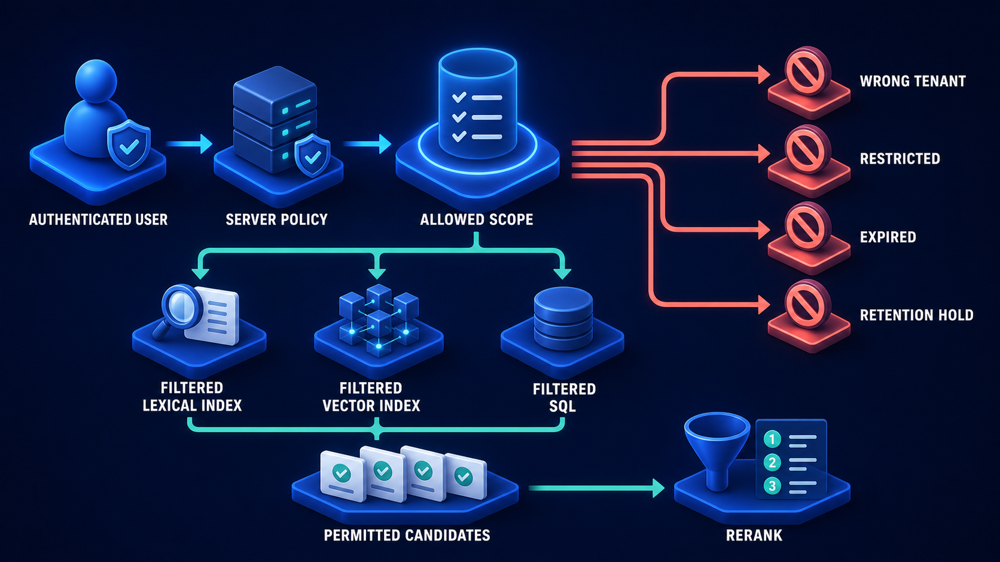

# Diagram 104 — Provenance, Permission, and Retention

**Module:** Document engineering
**Role in the course:** the seven fields every chunk carries forever
**Layout:** an ingestion chain into a seven-field record, gated before search, with three refusal outcomes

---

## At a glance

Original, parse, chunk — and then a **seven-field evidence record** that everything downstream depends on: **SOURCE ID, VERSION ID, TENANT, ACL, VALID FROM, RETAIN UNTIL, HASH.**

Past it, an **AUTHORIZATION GATE** and then **SEARCH**.

And beneath it, three coral drops: **EXPIRED, REVOKED, WRONG TENANT.**

The record sits between chunking and search, which is the diagram's structural claim. A chunk is not searchable until it carries these seven things, and three of them exist solely to refuse it.

---

## What the diagram teaches

### 1. Seven fields, and they answer three different kinds of question

**Provenance:** **SOURCE ID**, **VERSION ID**, **HASH**. Where did this come from, which version, and is it unaltered.

**Permission:** **TENANT**, **ACL**. Whose is it, and who may see it.

**Retention:** **VALID FROM**, **RETAIN UNTIL**. When did it become true, and when must it go.

Three concerns, seven fields, one record. Splitting them across separate stores is possible and produces a system where a chunk can be retrieved without its permissions being available — which is the failure the single-record design exists to prevent.

### 2. The record sits after CHUNK and before the gate, and that ordering is load-bearing

The chain reads **ORIGINAL → PARSE → CHUNK → EVIDENCE RECORD → AUTHORIZATION GATE → SEARCH**.

The record is created at chunk time, not at search time. Every chunk carries its own copy of all seven fields.

That duplication is deliberate. The alternative — resolving permissions by looking up the parent document at query time — means an extra lookup per candidate, and it means a chunk whose parent has been deleted is in an undefined state.

Carrying the fields on the chunk makes each chunk self-describing, which is what allows the gate to filter before search rather than after.

### 3. HASH is the field that makes the others trustworthy

A `#` icon, last in the list.

The hash covers the chunk's content. It answers a question the other six cannot: **is this still what was ingested?**

Two uses.

**Tamper detection.** A chunk whose content no longer matches its hash has been altered outside the ingestion path.

**Change detection.** During re-ingestion, a chunk whose hash is unchanged does not need re-embedding. This is what makes incremental ingestion affordable, and the change-capture diagram later in the volume depends on it.

### 4. VALID FROM and RETAIN UNTIL are different clocks

Easy to conflate and they measure different things.

**VALID FROM** is about the world: when this content became true. A policy effective from April has a valid-from of April regardless of when it was ingested.

**RETAIN UNTIL** is about your obligations: when you must stop holding it. Driven by regulation, contract, or consent.

They are independent. Content can be valid and past retention. Content can be within retention and not yet valid.

The temporal retrieval diagram later in the volume builds entirely on valid-from; the retention half is a deletion obligation that has nothing to do with retrieval quality.

### 5. Three refusal paths, and they are three different conditions

**EXPIRED** — a clock. Past **RETAIN UNTIL**. This chunk should no longer exist, and until deletion runs, it must not be returned.

**REVOKED** — a barred person. The **ACL** no longer permits this caller. Access that existed has been withdrawn.

**WRONG TENANT** — a barred building. The **TENANT** does not match. This is not a permission question at all; it is a boundary question, and it is the most serious of the three.

Three separate outcomes rather than one generic denial. That distinction matters operationally: an expiry is a retention job that has not run, a revocation is working as intended, and a wrong-tenant hit is a bug that needs investigating immediately.

### 6. The gate sits before search, not after

**AUTHORIZATION GATE** is drawn as a shield with a turnstile, between the record and the magnifier.

Filtering before search rather than after is the same principle the authorization diagram develops in detail: what a caller may not see should not influence what they receive, including result counts and relevance scores.

Placing the gate here, in the ingestion-side diagram, establishes that the fields exist *for* that filtering. They are not audit metadata that happens to be useful; they are the inputs to a control that runs on every query.

The query-side view of that gate shows what it does with them:

Three of that diagram's four exclusion categories read fields from this record: tenant, ACL and retain-until. The fourth — retention hold — is the one this record does not yet carry, and adding it is a common second iteration.

### 7. The three refusals hang off the record, not off the gate

Follow the coral arrows. They originate at the **EVIDENCE RECORD** platform, not at the gate.

That is precise. The conditions are properties of the record — its retention date, its ACL, its tenant. The gate reads them and acts; it does not own them.

A chunk is expired whether or not anyone queries it. The record knows; the gate enforces.

---

## Case study — Wendover Legal Technology, the chunks that outlived their matters

Wendover provides document review and disclosure services to law firms. Their platform ingests client documents for a matter, indexes them, and supports search and analysis during litigation.

Three properties make this a hard case: documents belong to a specific client and matter, access is controlled at a granular level, and there are strict obligations to destroy material when a matter closes.

### What their first architecture did

Chunks carried a document ID. Everything else — tenant, permissions, retention — lived on the parent document record and was resolved at query time.

It worked, and it produced three failures over eighteen months.

### Failure one — the orphaned chunks

A matter closed. The destruction process deleted the document records and the source files.

**It did not delete the chunks.** The deletion job operated on documents, and chunks were a separate store whose relationship was by foreign key.

About 340,000 chunks from 41 closed matters remained in the index. Their parent documents no longer existed, so permission resolution failed — and the failure mode was to return the chunk with no permission constraints applied.

For fourteen months, chunks from closed matters were retrievable by any user of the platform.

They were not found by a user. They were found during a capacity review that noticed the index was larger than the document count justified.

### Failure two — the revocation lag

A solicitor moved between firms. Their access to a matter was revoked in the permission system.

Because permissions were resolved at query time against a cached document record, and the cache had a fifteen-minute TTL, the revocation took effect fifteen minutes later.

That was known and accepted. What was not known was that one code path cached at the *session* level, and a session lasted until the browser closed.

The solicitor retained access for the remainder of their working day. There was no evidence they used it improperly, and Wendover disclosed the incident to the client firm.

### Failure three — the cross-matter retrieval

The most serious. A query in matter A returned a chunk from matter B.

The cause was a document that had been associated with two matters — legitimately, as it was relevant to both — and whose chunk-level records did not distinguish which matter's permission set applied.

The retrieved chunk carried matter A's context and matter B's content. It was noticed by the reviewing solicitor, who recognised the content as belonging to a different case.

### The rebuild on self-describing chunks

**All seven fields on every chunk.** Duplicated, deliberately.

Their storage grew about 11%. Nobody objected once the failures were on the table.

**TENANT is matter-scoped, not client-scoped.** A document associated with two matters produces two chunk sets, each carrying its own tenant value. They are separate records with separate permissions, and a cross-matter retrieval is structurally impossible rather than defended against.

**ACL is denormalised onto the chunk and updated by an event.** Permission changes publish an event; the chunk records are updated. Median propagation is under two seconds.

They kept a query-time check as well — a belt-and-braces verification that the chunk's ACL still matches the authoritative record — but it is a verification rather than the primary mechanism.

**RETAIN UNTIL is on the chunk and drives its own deletion.** The retention job operates on chunks directly. A chunk past its retention date is deleted whether or not its parent document still exists.

That single change would have prevented the 340,000 orphans.

**HASH enabled incremental re-ingestion**, which was an unintended benefit. When a matter's documents are reprocessed — for instance after a parser upgrade — only chunks whose hash changed are re-embedded. Their reprocessing cost fell about 70%.

### The three refusal outcomes, instrumented separately

Wendover monitor all three, and the distinction earns its keep.

**EXPIRED hits** should be zero. A non-zero count means the retention job has not run. It has fired three times, each a scheduling problem caught within hours.

**REVOKED hits** are expected and routine — roughly 40 a day across the platform, each one the system correctly refusing a withdrawn access.

**WRONG TENANT hits** should be structurally impossible. Any non-zero value pages the on-call engineer.

It has fired twice. Both were bugs in a bulk import path that constructed chunk records without a tenant value, defaulting to empty. Both were caught before any query returned a cross-matter result.

That third alarm is the one they consider most valuable, because it detects a condition that should not be able to occur.

### Results

- **Orphaned chunks:** 340,000 → 0, and structurally prevented.
- **Revocation propagation:** up to a full working day → under 2 seconds.
- **Cross-matter retrieval:** possible → structurally impossible.
- **Reprocessing cost:** down ~70% via hash-based change detection.
- **Storage cost:** up ~11%.

### The line in their platform documentation

*A chunk that cannot answer who owns it, who may see it, and when it must be destroyed is not evidence. It is a liability with an embedding.*

---

## Composition

A horizontal chain with a central record card, a gate, and three refusal drops.

**Left to right:** **ORIGINAL** (white document on a blue platform) → teal arrow → **PARSE** (blue tile with `{ }`) → teal arrow → **CHUNK** (a cluster of blue cubes) → teal line → **EVIDENCE RECORD**.

**Centre:** **EVIDENCE RECORD** — a large white card on a blue hexagonal platform, listing seven rows each with a blue square icon: **SOURCE ID** (document), **VERSION ID** (tag), **TENANT** (building), **ACL** (people), **VALID FROM** (calendar), **RETAIN UNTIL** (calendar), **HASH** (`#`).

**Right:** teal arrow → **AUTHORIZATION GATE** (a teal shield with a person and check, beside a dark turnstile) → teal arrow → **SEARCH** (a blue magnifying glass).

**Beneath:** three **coral arrows** drop from the record platform to three red platforms — **EXPIRED** (red clock), **REVOKED** (red person with a prohibition sign), **WRONG TENANT** (red building with a prohibition sign).

## Element by element

**ORIGINAL** — a white document with a folded corner.
**PARSE** — a blue tile showing `{ }`.
**CHUNK** — a cluster of blue cubes.

**EVIDENCE RECORD** — a white card with seven labelled rows.

**AUTHORIZATION GATE** — a teal shield with a person and check, beside a turnstile.
**SEARCH** — a blue magnifying glass.

**EXPIRED** — a red clock face.
**REVOKED** — a red person glyph with a prohibition sign.
**WRONG TENANT** — a red building with a prohibition sign.

## Colour and flow semantics

- **Teal arrows** carry the ingestion chain and the authorised path to search — provenance and validation, per the volume's palette.
- **Coral arrows** carry all three refusals, and they originate at the **record**, not at the gate.
- **Red** marks the three refusal outcomes, each with a distinct glyph.
- The **record is the largest object in the frame**, sitting between chunking and the gate.
- The **gate precedes search**, establishing filter-before-search at ingestion-design time.

## How to present it

**Ask what a chunk carries besides its text.** Most rooms name an ID and perhaps a document reference. Then show seven fields and group them: provenance, permission, retention.

**Ask why the fields are on the chunk rather than the parent document.** Self-describing chunks allow filtering before search and survive parent deletion. Then tell the Wendover orphans — 340,000 chunks from 41 closed matters, retrievable by anyone for fourteen months, found by a capacity review.

**Separate VALID FROM from RETAIN UNTIL.** One is about the world, one about your obligations. They are independent clocks and content can be past one and inside the other.

**Ask what HASH is for.** Tamper detection, and change detection during re-ingestion. Then give Wendover's 70% reprocessing saving — a field added for integrity that paid for itself in compute.

**Walk the three refusals and ask how they differ operationally.** Expired means a job did not run. Revoked means the system is working. Wrong tenant means a bug. Ask whether their system distinguishes them.

**Tell the cross-matter retrieval.** A document legitimately associated with two matters, chunks that could not distinguish which permission set applied, and content from one case surfacing in another.

**Give them the structural fix.** Tenant scoped to matter, two chunk sets for a dual-associated document. Cross-matter retrieval becomes impossible rather than defended against.

**Raise the revocation lag.** A fifteen-minute cache TTL that was accepted, and a session-level cache path that nobody had noticed, giving a departed solicitor access for a working day.

**Point at the WRONG TENANT alarm.** It detects a condition that should not be able to occur, and has fired twice on bulk-import bugs. Ask what their equivalent impossible-condition alarm would be.

**Timing.** Twenty-five minutes. Thirty-five if you enumerate what the room's own chunks carry, which usually finds three or four of the seven missing.

---

## Lab and checkpoint

**Lab:** Take one chunk from your vector store and write the seven fields it should carry: source, page, hash, valid from, retain until, tenant, and permission. For each, explain what question it answers and what would break if it were missing. Then design the gate that refuses chunks before search and the three refusal outcomes: expired, revoked, wrong tenant.

**Checkpoint:** Why are the seven fields on the chunk rather than the parent document?

**Answer:** Because self-describing chunks allow filtering before search, survive parent document deletion or movement, and can carry matter-specific permissions. If the fields are only on the document, chunks become orphans and can leak across matters or remain after the document is gone.

## Glossary

- **Chunk** — a unit of indexed content.
- **Expired** — the chunk is past its retention date.
- **Hash** — the value that lets the system detect tampering or re-ingestion changes.
- **Permission** — the rule about who may see the chunk.
- **Provenance** — the source and page the chunk came from.
- **Retain until** — the date by which the chunk must be deleted.
- **Revoked** — the chunk has been withdrawn from use.
- **Self-describing chunk** — a chunk that carries all its own metadata.
- **Tenant** — the organisation or matter the chunk belongs to.
- **Valid from** — the date from which the chunk is valid.
- **Wrong tenant** — a security alarm triggered when a chunk is requested by a different tenant.

## Sources

- Chunk-level provenance and permission
- Retention and revocation in retrieval systems
- Cross-matter leakage prevention
