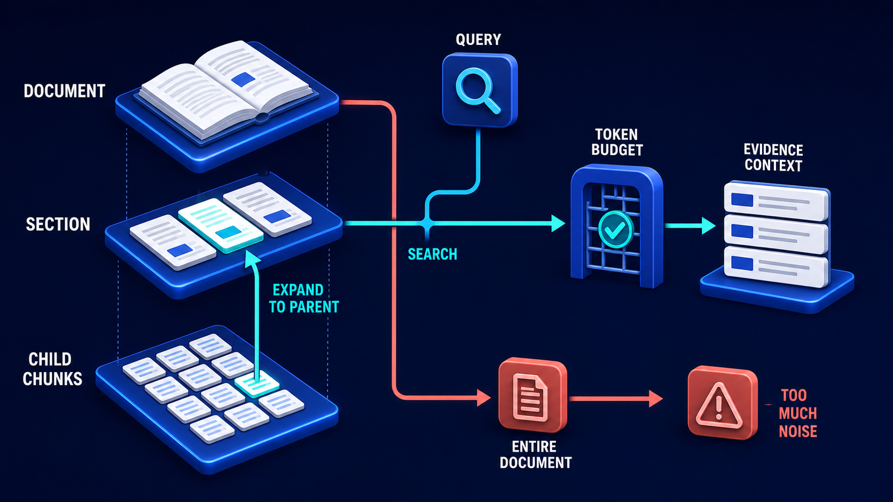

# Diagram 105 — Semantic Chunk Boundaries

**Module:** Chunking and representation
**Role in the course:** where a chunk should end
**Layout:** a structured document into a chunker, producing two good chunks and one bad split

---

## At a glance

A policy document, decomposed into its structural elements, fed to a **SEMANTIC CHUNKER**, producing chunks that each carry a **HEADING PATH** and a **PAGE SPAN**.

Chunks 1 and 2 are bracketed in teal: **WHOLE IDEA**. Chunks 3A and 3B are bracketed in coral: **BAD SPLIT** — and between them, a dashed coral line with a pair of scissors, cutting through a sentence.

The scissors are the diagram's teaching device. It shows the cut happening rather than describing the result.

---

## What the diagram teaches

### 1. Chunking operates on structure, not on characters

The four elements feeding the chunker — **SECTION, PARAGRAPH, LIST, TABLE** — come from the document tree, not from a character stream.

That is the dependency the layout parsing diagram establishes. A chunker that receives flat text has only length to work with. One that receives a tree can respect the boundaries the document's author intended.

The four elements are chosen to span the difficulty range: sections are easy boundaries, paragraphs are usually safe, lists must not be split mid-sequence, and tables must not be split at all.

### 2. HEADING PATH is carried on every chunk, and it is what makes a chunk interpretable alone

Each output card carries a **HEADING PATH** row, drawn as a sequence of connected dots.

A path, not a single heading. `Refunds › Digital goods › Exceptions` rather than just `Exceptions`.

That path is what allows a chunk to stand on its own. Retrieved in isolation, a paragraph beginning "This does not apply where the customer has..." is uninterpretable. With its heading path prepended, it is a specific exception to a specific rule.

It also improves retrieval independently, because heading text carries the vocabulary users search with. A section titled "Refunds" contains the word refund even when the body prose says "reimbursement."

### 3. PAGE SPAN is a range, and ranges rather than points is the honest representation

Chunk 1 spans **12–14**. Chunk 2 spans **15–17**. Chunks 3A and 3B both sit on **18**.

A chunk that respects semantic boundaries will frequently cross pages, because pages are a printing artefact and ideas are not.

Recording a span rather than a single page is what allows a citation to point at the right region. It also means the diagram's chunks 1 and 2 are visibly larger than a page, which is normal and which fixed-size chunking cannot produce.

### 4. WHOLE IDEA is the criterion, and it is stated rather than measured

Two teal brackets, each labelled **WHOLE IDEA**.

Not "correct length," not "under N tokens" — a whole idea.

The test: can this chunk be read on its own and understood? Does it contain a complete thought, including whatever qualifies it?

That criterion produces variable-length chunks, which is the point. Chunk 1 covers three pages; chunk 2 covers three; the material on page 18 should have been one chunk and became two.

### 5. The BAD SPLIT is drawn mid-sentence, and the scissors say so

The coral dashed line crosses a text line in chunk 3A, with a **scissors glyph** at the cut point. The remainder of that line appears at the top of 3B.

A sentence divided across two chunks.

What that produces: neither chunk contains the complete statement. Chunk 3A ends with an incomplete clause; chunk 3B begins with one. Retrieval matching either returns half a rule.

And because both chunks carry the same heading path and the same page span, nothing in their metadata indicates that they are two halves of one thing.

### 6. Both bad chunks carry page span 18, and that is the detectable signature

Look at 3A and 3B. Both say **18**.

Two chunks with the same heading path and the same page span are, structurally, a document region that was divided for a reason other than meaning — almost always a length limit.

That is a checkable condition. A chunker can flag it, and a review can inspect it.

Contrast with chunks 1 and 2, which have different heading paths and non-overlapping spans. They are distinct ideas.

### 7. Length limits are real and the resolution is not to ignore them

Worth stating because the diagram can be read as "never split."

Embedding models have input limits. Context budgets are finite. Some sections are genuinely longer than any reasonable chunk.

The resolution is not to split anywhere, but to split at the **next-best semantic boundary** — a paragraph break, a list item boundary, a sentence end — and to record that the split happened so downstream stages can compensate by retrieving both halves together.

The parent-child pattern in the next diagram is the mechanism for that compensation:

Chunks 3A and 3B there would be child chunks sharing a parent. Matching either returns the section containing both, which restores the sentence the split severed.

---

## Case study — Ellerby Building Society, the rule that lost its condition

Ellerby is a mutual lender with about 210,000 members. Their assistant helps branch and telephone staff answer questions about mortgage products, savings accounts, and lending criteria.

The corpus includes a 340-page lending criteria manual, which is the most-queried document in the system by a wide margin.

### The chunking they started with

Fixed 800-token chunks with 100-token overlap, split at the nearest sentence boundary.

Reasonable, standard, and wrong for their document type.

### The incident

A branch adviser asked whether a self-employed applicant with two years of accounts could be considered for a particular product.

The assistant answered yes, citing the lending criteria.

The criteria say yes — **provided the applicant's accounts are prepared by a qualified accountant and the most recent year shows income not more than 20% below the previous year.**

That condition was in the same section, three sentences later, and it had landed in a different chunk.

The application proceeded to offer. The condition surfaced at underwriting, six days later, and the applicant did not meet it. The offer was withdrawn.

The applicant had already paid for a survey and had exchanged on a related sale. Ellerby covered their costs — about £2,400 — and the complaint was upheld by their internal review.

### The audit

They sampled 400 chunks from the lending criteria manual and had two underwriters assess each for completeness.

**31% of chunks contained a rule whose qualifying conditions were absent.**

That figure is the one that shocked them. Nearly a third of their most-queried document's chunks were, in isolation, misleading.

The pattern was consistent: their criteria are written as a statement followed by conditions, and 800 tokens frequently landed between the two.

**A further 12% were mid-sentence splits**, which were at least visibly broken.

The mid-sentence splits were harmless in practice — a chunk beginning mid-clause tends not to retrieve well, so it rarely reached an answer. The dangerous category was the chunks that read as complete and were not.

### The rebuild

**Structure-aware chunking on the document tree.** Sections, subsections, clauses, and list items became the boundary candidates.

**A rule and its conditions never separate.** Their criteria manual has a consistent structure — a numbered rule followed by lettered conditions — and the chunker treats the rule and all its conditions as an atomic unit regardless of length.

The longest such unit is about 2,100 tokens. It exceeds their preferred chunk size and it is retrieved as one thing, because splitting it is what caused the incident.

**Heading path prepended to every chunk.** `Lending Criteria › Self-employed applicants › Minimum trading period` rather than an unlabelled paragraph.

This produced a measurable retrieval improvement on its own — 7 points on their top-5 accuracy — because staff ask using the vocabulary in the headings.

**Page span recorded as a range.** Their citations now point at a page range and a bounding region, and staff can open the original at the right place.

**Same-span sibling detection.** Any two adjacent chunks sharing a heading path and an overlapping page span are flagged for review at ingestion.

This is the detectable signature the diagram shows. It flagged 340 chunk pairs on first run. Reviewing them found 190 that were genuine length-forced splits and needed the parent-expansion treatment, and 150 that were chunker bugs — mostly list items being treated as separate sections.

### The length problem they could not avoid

Roughly 4% of their atomic units exceed what their embedding model will accept.

They did not solve this by splitting. They solved it by embedding a **summary** of the unit for retrieval and returning the **full unit** as evidence.

The summary is generated at ingestion, carries the heading path, and is what the vector index holds. When it matches, the complete rule with all its conditions is what enters the evidence packet.

That decouples the retrieval representation from the evidence representation, which is the idea the complementary-representations diagram develops.

### Results

- **Chunks containing a rule without its conditions:** 31% → under 2%.
- **Mid-sentence splits:** 12% → 0.
- **Top-5 retrieval accuracy:** 68% → 89%, of which 7 points came from heading paths alone.
- **Upheld complaints citing incomplete criteria:** 3 in the preceding year → 0.
- **Chunk pairs flagged by same-span detection at first run:** 340, of which 150 were chunker bugs.

### The line in their knowledge engineering standard

*A rule and its conditions are one chunk. If that chunk is too long for the embedder, embed a summary and return the rule — but never ship half a rule.*

---

## Composition

A document decomposing on the left, a chunker at centre, four output cards on the right.

**Left:** **POLICY DOCUMENT** — a white page with a blue shield on a blue platform. Four blue connector lines descend to four small platforms: **SECTION** (open book), **PARAGRAPH** (document with lines), **LIST** (document with bullets), **TABLE** (grid).

**Centre:** a teal arrow into **SEMANTIC CHUNKER** — a blue cube containing a node-network glyph, on a blue platform.

**Right:** three teal arrows fan to four white cards.

**Card 1** — a blue `1` badge, content lines, a **HEADING PATH** row of connected teal dots, a **PAGE SPAN** row reading **12–14** with a book icon. Bracketed in teal: **WHOLE IDEA**.

**Card 2** — a blue `2` badge, **HEADING PATH**, **PAGE SPAN 15–17**. Bracketed in teal: **WHOLE IDEA**.

**Cards 3A and 3B** — blue `3A` and `3B` badges, both with **HEADING PATH** rows and **PAGE SPAN 18**. A **coral dashed line with a scissors glyph** crosses a text line in 3A. Bracketed in coral: **BAD SPLIT**.

## Element by element

**POLICY DOCUMENT** — a white page with a blue shield badge.

**SECTION / PARAGRAPH / LIST / TABLE** — four structural element platforms from the document tree.

**SEMANTIC CHUNKER** — a blue cube with a node-network face.

**HEADING PATH** — a row of connected teal dots, representing a hierarchical path rather than a single label.

**PAGE SPAN** — a book icon with a page range.

**The scissors** — a coral glyph on a dashed line, marking a mid-sentence cut.

## Colour and flow semantics

- **Blue connector lines** decompose the document into its structural elements.
- **Teal arrows** carry the chunking flow and mark the two good outputs.
- **Coral** marks the bad split — the dashed cut line, the scissors, and the bracket label.
- **Teal brackets** label whole ideas; the **coral bracket** labels the failure.
- The **identical page span 18** on both bad chunks is the detectable signature.

## How to present it

**Ask where a chunk should end.** Most answers involve a token count. Then point at the teal brackets and read the criterion: a whole idea.

**Ask what a chunker needs in order to respect structure.** A document tree, not a character stream. This is the dependency on layout-aware parsing.

**Read a heading path aloud.** `Refunds › Digital goods › Exceptions`. Then ask what a paragraph beginning "This does not apply where..." means without it.

**Point at the page spans.** 12–14 and 15–17. A chunk respecting meaning frequently crosses pages, because pages are a printing artefact. Fixed-size chunking cannot produce this.

**Point at the scissors and ask what each half contains.** Neither has the complete statement. Then ask what in their metadata indicates they belong together — nothing, except the identical span.

**Give them the detectable signature.** Two adjacent chunks with the same heading path and overlapping page span were split for a reason other than meaning. Ellerby's first run flagged 340 pairs, of which 150 were chunker bugs.

**Tell the Ellerby self-employed case.** A rule answered yes; the qualifying conditions were three sentences later and in a different chunk. Offer withdrawn at underwriting, £2,400 in costs, complaint upheld.

**Give them the audit number.** 31% of chunks in their most-queried document contained a rule without its conditions. Nearly a third, reading as complete and misleading in isolation.

**Make the distinction between the two failure types.** Mid-sentence splits are visibly broken and rarely retrieve. Chunks that read as complete and lack their conditions are the dangerous ones.

**Address the length objection.** Ellerby's longest atomic unit is 2,100 tokens and exceeds their embedder. They embed a summary and return the full rule. Retrieval representation and evidence representation are not the same thing.

**Close on the standard.** *Never ship half a rule.*

**Timing.** Twenty-five minutes. Thirty-five if you sample the room's own chunks for missing conditions, which is uncomfortable and useful.

---

## Lab and checkpoint

**Lab:** Inspect five chunks from your own system. For each, check whether it contains a whole idea, whether its heading path is attached, whether its page span is a range, and whether it is a bad split. Identify any chunk that reads as complete but is missing its conditions, exceptions, or qualifiers.

**Checkpoint:** Why is a chunk that reads as complete but lacks its conditions more dangerous than a mid-sentence split?

**Answer:** Because a mid-sentence split is usually obvious and unlikely to be retrieved. A chunk that looks complete but is missing its conditions, exceptions, or qualifiers can be retrieved and acted on confidently. It is a plausible but incomplete answer that appears authoritative.

## Glossary

- **Bad split** — a chunk cut in a place that breaks a whole idea.
- **Chunk** — a unit of text created for indexing and retrieval.
- **Heading path** — the breadcrumb of headings that tells a chunk where it belongs.
- **Length limit** — the maximum size a chunk may have, which must be respected without breaking meaning.
- **Page span** — the range of pages a chunk covers.
- **Semantic chunking** — chunking based on meaning and document structure rather than token count.
- **Whole idea** — the chunking criterion that each chunk should be a complete, self-contained thought.

## Sources

- Semantic chunking and document structure
- Heading paths and page spans for retrieval
- Chunk quality and condition preservation
