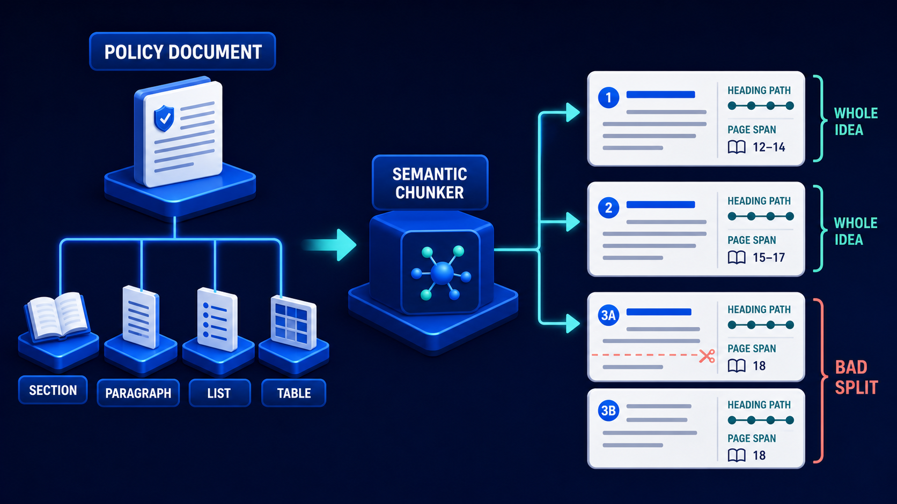

# Diagram 106 — Parent-Child Retrieval

![Three stacked platforms on the left of a dark navy frame — DOCUMENT showing an open book, SECTION showing three cards with one highlighted teal, CHILD CHUNKS showing a grid of twelve small cards with one highlighted. A teal arrow labelled EXPAND TO PARENT runs from the highlighted child up to the highlighted section. A QUERY magnifier feeds a teal SEARCH line into the section level, continuing to TOKEN BUDGET, an archway with a teal check, then EVIDENCE CONTEXT, three stacked cards. A coral path from the document level leads to ENTIRE DOCUMENT and a red TOO MUCH NOISE warning.](../diagrams/106-parent-child-retrieval.png)

**Module:** Chunking and representation
**Role in the course:** search small, return large
**Layout:** three granularity levels with an expansion arrow, a budget gate, and a coral over-retrieval path

---

## At a glance

Three levels of granularity — **DOCUMENT**, **SECTION**, **CHILD CHUNKS** — with one child highlighted and a teal arrow labelled **EXPAND TO PARENT** running up to its section.

The search enters at the child level. The evidence returned is the section.

And a coral path shows the alternative: retrieve the **ENTIRE DOCUMENT**, and arrive at **TOO MUCH NOISE**.

Search small, return large, and stop at the right level. That is the entire pattern, and the coral path is what happens when you skip the middle level.

---

## What the diagram teaches

### 1. Three levels, and each is good at something different

**DOCUMENT** — the whole thing. Complete context, and far too much of it.

**SECTION** — a coherent unit. Enough context to be interpretable, small enough to fit alongside other evidence.

**CHILD CHUNKS** — small, precise fragments. Excellent for matching, poor as evidence.

The tension the pattern resolves: **small chunks match better; large chunks read better.**

A small chunk's embedding is focused, so it matches a specific query precisely. But retrieved alone it lacks context. A large chunk has context and its embedding is diluted across everything it contains, so it matches less precisely.

### 2. The highlighted child and the highlighted section are the mechanism

One child chunk in the grid of twelve is teal. One card in the section row is teal. A teal arrow connects them.

The child is what **matched**. The section is what is **returned**.

That separation is the whole idea. The index holds child embeddings for matching precision; the evidence store returns parents for interpretability.

### 3. The search line enters at the section level, and that is worth reading carefully

Follow the teal **SEARCH** line from the query. It joins the flow at the **SECTION** platform's output, not at the child grid.

The rendering compresses two steps: the query matches a child, the child expands to its parent, and what continues rightward is the section.

Worth stating explicitly when teaching, because the diagram can be misread as searching sections directly — which would lose the matching precision the pattern exists for.

### 4. EXPAND TO PARENT is one level, not all the way up

The arrow goes from child to **section**, and stops.

It does not go to document. That restraint is the difference between the pattern working and the coral path.

Expansion is bounded. One level, to the smallest unit that provides adequate context.

For most corpora that is a section. For some it might be a subsection or a clause. What it is not is the whole document.

### 5. TOKEN BUDGET is an archway, and its position is the constraint

Drawn as a blue arch with a teal check, between the expanded sections and the evidence context.

An archway is something things pass through and that has a fixed width. Not everything fits.

Its placement after expansion is correct: you expand first, then check whether the expanded evidence fits. Expansion increases size, so the budget check must come after it.

That ordering also implies a design question the diagram does not answer — what happens when the expanded evidence exceeds the budget. The options are fewer sections, a smaller expansion level, or a summary. All three are legitimate; picking silently is not.

### 6. The coral path retrieves the whole document and arrives at noise

**ENTIRE DOCUMENT** → **TOO MUCH NOISE**, both in red.

Three costs, and they compound.

**Budget.** A 40-page document consumes the entire context for one piece of evidence, leaving no room for anything else.

**Dilution.** The relevant paragraph is one of four hundred. Its signal is proportionally reduced.

**False grounding.** Everything in the document is now cited-adjacent. A model given a whole document can produce claims from any part of it, and the citation points at the document rather than the passage.

That third one is the least discussed and the most damaging in a knowledge system, because it makes citations unfalsifiable.

### 7. The three levels must exist in the store, which is an ingestion decision

The pattern requires that a child chunk knows its parent, and that the parent is retrievable as a unit.

That is the **PARENT** property from the layout parsing diagram, and it is why parent-child retrieval is impossible over flat-text ingestion.

You cannot add this at query time. If chunks were produced without parent references, the relationship does not exist and re-ingestion is the only route.

It also assumes the parent is a coherent unit, which is a chunking decision:

If the section boundaries in that diagram were drawn at arbitrary lengths, expanding to parent would return an arbitrary span. The pattern's value depends on the parent being a whole idea.

---

## Case study — Rothley Aerospace, the maintenance procedure that arrived alone

Rothley manufactures and services aircraft components. Their technical assistant supports maintenance engineers working on airframes and engines, answering questions from a corpus of maintenance manuals, service bulletins and airworthiness directives.

Getting an answer wrong has consequences measured in aircraft.

### The chunking that caused the problem

Small chunks — around 300 tokens — chosen for retrieval precision. Their engineers ask very specific questions and small chunks matched well.

Retrieval accuracy was excellent. Answer quality was not.

### The characteristic failure

An engineer asked about the torque sequence for a particular flange assembly.

The assistant returned the sequence: a numbered list of bolt positions and values. Correct, precisely retrieved, and missing the two things immediately above it in the manual — the requirement that the mating surfaces be inspected for scoring first, and the note that the sequence applies only to the post-modification variant.

The engineer applied the sequence to a pre-modification assembly. The torque values differed. The error was caught at inspection.

### The audit

They took 200 questions with known-correct answers and examined what the assistant returned.

**Retrieval was finding the right chunk in 91% of cases.**

**The returned chunk was sufficient to answer safely in 54%.**

That gap — 37 percentage points between finding the right thing and returning enough of it — is the parent-child problem stated as a number.

The missing content clustered predictably. Preconditions, applicability notes, warnings, and cross-references to related procedures. All of which sit near the procedure in the manual and outside a 300-token window.

### The rebuild

**Child chunks retained at 300 tokens for the index.** Retrieval precision was not the problem and they did not want to lose it.

**Sections became the evidence unit.** Their manuals have a consistent structure — each procedure is a section containing preconditions, warnings, the procedure itself, and post-conditions.

A matched child expands to its procedure section. Median section length is about 1,400 tokens.

**Expansion stops at the procedure.** Not the chapter, not the manual. Their first implementation expanded to chapter level and immediately hit the coral path — a chapter is 30 to 80 pages, and one filled the entire context.

**Token budget enforced after expansion, with a defined overflow behaviour.** When expanded sections exceed the budget, the system returns fewer sections rather than truncating any of them.

That choice matters in their domain. A truncated procedure is more dangerous than a missing one, because a truncated one looks complete.

### The applicability finding

Their audit surfaced something the pattern did not directly solve.

Many procedures have an applicability statement — which serial numbers, which modification standard, which variant — placed at the **start of the chapter** rather than in the procedure section.

Expanding to the procedure did not capture it.

Their resolution was not to expand further. It was to **denormalise applicability onto every section within its scope** at ingestion time. Each procedure section now carries the applicability statement that governs it, copied from the chapter header.

That is a chunking decision rather than a retrieval one, and it is the kind of thing that only becomes visible once retrieval is otherwise working.

### The verification behaviour it enabled

Because sections carry page spans and their children carry bounding boxes, the assistant shows engineers the original manual page with the matched passage highlighted, inside the surrounding procedure.

Engineers report using the highlight as their primary check — they read the surrounding section on the original page rather than reading the assistant's prose.

Rothley consider that the right outcome. The assistant's job is to find the page and point at the passage; the engineer's job is to read the procedure.

### Results

- **Retrieval accuracy (right chunk found):** 91%, unchanged.
- **Returned evidence sufficient to answer safely:** 54% → 96%.
- **Missing applicability statements:** eliminated by denormalisation.
- **Procedures applied to wrong variant:** 1 known incident, 0 since.
- **Median evidence size:** ~300 tokens → ~1,400 tokens, with fewer results returned.

### The line in their technical publications standard

*Match on the sentence. Return the procedure. Never return the chapter.*

---

## Composition

Three stacked platforms on the left, an expansion arrow, and a right-hand flow with a coral branch.

**Left, top to bottom:** **DOCUMENT** (an open book on a blue platform), **SECTION** (three white cards on a platform, the middle one highlighted teal), **CHILD CHUNKS** (a grid of twelve small white cards, one highlighted teal). Dashed vertical lines connect the three levels.

**A teal arrow labelled EXPAND TO PARENT** runs from the highlighted child chunk up to the highlighted section card.

**Centre:** **QUERY** — a blue tile with a magnifier — sends a teal line down and left, joining the flow at the section level, labelled **SEARCH**.

**Right:** a teal arrow to **TOKEN BUDGET** — a blue archway with a teal check disc — then a teal arrow to **EVIDENCE CONTEXT**, three stacked white cards on a blue platform.

**Coral branch:** from the **DOCUMENT** platform, a coral line runs right and down to **ENTIRE DOCUMENT** — a red tile with a document glyph — then a coral arrow to a red warning triangle labelled **TOO MUCH NOISE**.

## Element by element

**DOCUMENT** — an open book. Complete and excessive.
**SECTION** — three cards, one highlighted. The evidence unit.
**CHILD CHUNKS** — twelve small cards, one highlighted. The matching unit.

**EXPAND TO PARENT** — a teal arrow, one level only.

**QUERY** — a blue tile with a magnifying glass.

**TOKEN BUDGET** — a blue archway with a teal check — a fixed-width passage.

**EVIDENCE CONTEXT** — three stacked white cards.

**ENTIRE DOCUMENT / TOO MUCH NOISE** — red tiles marking the over-retrieval path.

## Colour and flow semantics

- **Teal** carries the search, the expansion, and the path to evidence context — the working pattern.
- **Coral** carries the over-retrieval path from the document level.
- The **two highlighted cards** — one child, one section — are the diagram's central device.
- **Dashed vertical lines** link the three granularity levels without implying flow.
- The **archway form** of the token budget conveys a fixed-width constraint rather than a check.

## How to present it

**State the tension first.** Small chunks match better; large chunks read better. Then ask how you get both.

**Point at the two highlighted cards.** The child matched; the section is returned. Index one thing, return another.

**Ask how far EXPAND TO PARENT should go.** One level. Then point at the coral path and ask what happens if you expand to the document.

**Walk the three costs of whole-document retrieval.** Budget, dilution, and false grounding. Spend time on the third — a citation pointing at a 40-page document is unfalsifiable.

**Tell the Rothley torque sequence.** Correctly retrieved, precisely matched, and missing the inspection precondition and the variant applicability note. Applied to the wrong variant, caught at inspection.

**Give them the audit gap.** 91% found the right chunk; 54% returned enough of it. Thirty-seven points between retrieval working and the answer being safe.

**Ask what clusters in the missing content.** Preconditions, warnings, applicability, cross-references. All of which sit near the target and outside a small window.

**Tell the applicability finding.** Chapter-level statements that expansion to procedure level did not capture, resolved by denormalising onto every section in scope at ingestion. A chunking fix for a retrieval symptom.

**Ask about budget overflow.** Rothley return fewer sections rather than truncating any. A truncated procedure looks complete, which makes it more dangerous than a missing one.

**Note the ingestion dependency.** Parent references must exist. This cannot be added at query time; it requires re-ingestion.

**Close on the standard.** *Match on the sentence. Return the procedure. Never return the chapter.*

**Timing.** Twenty minutes. Thirty if you measure the room's own gap between retrieval accuracy and answer sufficiency, which is usually wider than expected.

---

## Lab and checkpoint

**Lab:** For one query in your system, identify a retrieved chunk and the parent section that should accompany it. Return the section, not the whole document. Check that the section contains the preconditions, warnings, applicability, or cross-references the chunk lacks. Measure the gap between finding the right chunk and returning enough context.

**Checkpoint:** Why is a citation to a 40-page document unfalsifiable?

**Answer:** Because a citation should support the specific claim it is attached to. If the citation is an entire document, the reader cannot quickly verify the claim. It is uncheckable and therefore not useful as evidence.

## Glossary

- **Child chunk** — a small, precise unit used for matching.
- **Context budget** — the total token space available for returning context.
- **Document retrieval** — returning the whole document, which is too large and noisy.
- **Expand to parent** — returning one level of context above the matched child.
- **False grounding** — a citation that looks correct but is too broad to verify.
- **Parent section** — the larger unit that contains the child chunk and its context.
- **Precondition** — a condition that must be met before a procedure applies.
- **Section** — the intermediate unit between child and document.
- **Three-level retrieval** — matching on child, returning section, controlled by document structure.

## Sources

- Hierarchical retrieval and parent-child chunking
- Context expansion and token budgets
- Citation precision and answer sufficiency
