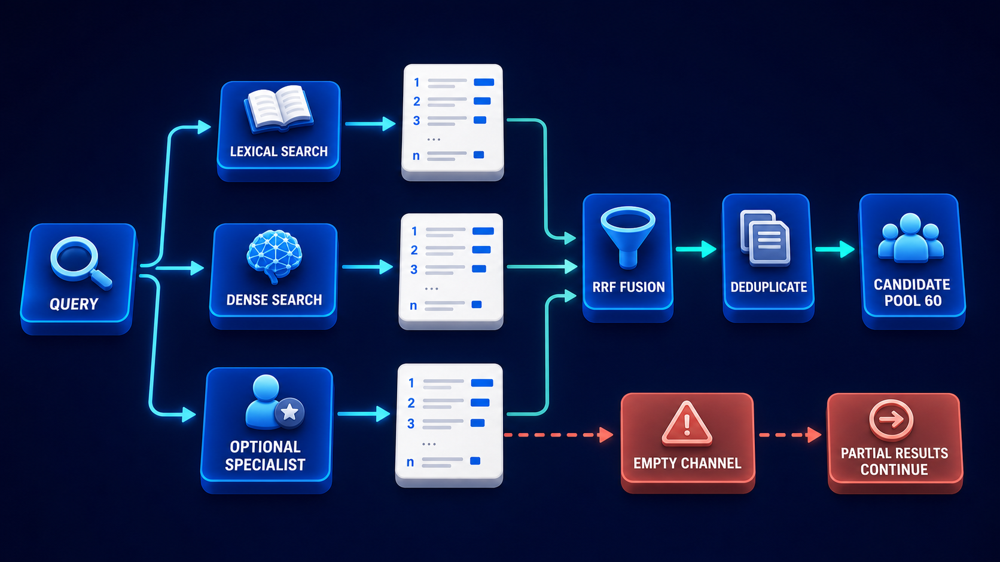

# Diagram 107 — Complementary Representations

**Module:** Chunking and representation
**Role in the course:** one chunk, three ways of being findable
**Layout:** one source into three representations, each with its match type, strength and ranked results, merging at fusion

---

## At a glance

One chunk, indexed three ways: **LEXICAL TERMS**, **DENSE VECTOR**, **TOKEN VECTORS**.

Each has a labelled match type — **EXACT MATCH**, **SEMANTIC MATCH**, **LATE INTERACTION** — and each is annotated with what it is good at: **ERROR CODE**, **REFUND MEANING**, **TERM ALIGNMENT**.

All three converge on **FUSION**.

The three strength labels are the diagram's most useful element. They are not abstract descriptions of the methods; they are examples of the specific query each method wins.

---

## What the diagram teaches

### 1. Three representations of the same chunk, not three different chunks

Everything branches from one **SOURCE CHUNK**.

That is the structural claim. This is not three indexes over different content; it is three indexes over identical content, each capturing something the others cannot.

The storage implication follows: you are holding the same text three times in three forms. That is a real cost, and the diagram's argument is that each form earns it.

### 2. The visual encoding of each representation tells you its shape

**LEXICAL TERMS** — six rounded tiles. Discrete, countable, individually meaningful. A term either is or is not present.

**DENSE VECTOR** — six cubes in a row. A single fixed-length sequence of numbers. One vector for the whole chunk.

**TOKEN VECTORS** — a grid of roughly twenty-four small cubes. Many vectors, one per token.

The size difference is deliberate and honest. Token vectors are visibly the largest object, and they are the most expensive representation by a wide margin — typically an order of magnitude more storage than a dense vector.

### 3. ERROR CODE is what lexical search wins

The first strength tile shows a warning triangle labelled **ERROR CODE**.

A query for `ERR_4471_TIMEOUT` needs exact matching. That string carries no semantic content — an embedding model places it near other alphanumeric strings, not near the concept it names.

Lexical search finds it precisely. Dense retrieval does not.

Every domain has an equivalent: part numbers, case references, drug codes, SKUs, regulation citations, ISBNs. Anything where the identifier is the query.

### 4. REFUND MEANING is what dense vectors win

The second tile shows a currency-refresh glyph labelled **REFUND MEANING**.

A user asks about "getting my money back." The document says "reimbursement of the purchase price." No lexical overlap; the same meaning.

Dense vectors place both near each other because the model was trained to. This is the capability that made vector search worth building.

Its weakness is the mirror of lexical's strength: it cannot reliably distinguish `6205-2RS` from `6205-2Z`.

### 5. TERM ALIGNMENT is what late interaction wins, and it is the least understood of the three

The third tile shows a chain-link glyph labelled **TERM ALIGNMENT**.

Late interaction — embedding each token separately and matching token-to-token at query time — sits between the other two.

What it does that neither other method can: match a **multi-part query** where each part must align with something in the chunk.

A query like "refund policy for digital goods purchased outside the EU" has four constituent requirements. A dense vector compresses the whole query into one point and can match a chunk that satisfies three of the four strongly. Token-level matching can check that each part has a corresponding aligned region.

The chain-link icon is apt: it is about linking query terms to chunk terms individually, rather than comparing two summaries.

The cost is that it is expensive in both storage and query-time computation, which is why it is the third representation rather than the first.

### 6. Three ranked lists, drawn identically, and that is the point

Each representation produces a card listing results **1, 2, 3** with score bars.

Identical rendering, because the output shape is the same regardless of how the ranking was produced. That is what makes fusion possible.

The bars are of varying length and the three cards' orderings differ — which is the observation fusion exists to exploit. A chunk ranked highly by two independent methods is stronger evidence than one ranked highly by one.

### 7. FUSION is a cube with overlapping circles, and the glyph is a set operation

The final object carries a **three-overlapping-circles** glyph — a Venn diagram.

Not a funnel, not a sort. A set operation combining three lists.

The overlap is where the value is. A result appearing in all three regions has independent corroboration from three different matching mechanisms.

The mechanics — rank-based fusion rather than score blending, because the three score scales are incomparable — are what the next diagram develops:

The three channels there are these three representations at query time. **RRF** is named specifically because it discards the incomparable scores and combines on rank position alone.

---

## Case study — Aldbourne Industrial Supplies, three queries and one index

Aldbourne distributes industrial components — bearings, seals, hydraulics, fasteners — to maintenance operations across manufacturing and food processing. About 340,000 line items.

Their assistant serves two audiences with very different query styles, and a third that mixes both.

### The three query populations

They classified eight weeks of queries.

**Identifier queries — 44%.** *"Do you stock SKF 6205-2RS?"* *"Cross-reference for Parker 2M-B4LJ-SS."* The engineer knows the part.

**Descriptive queries — 38%.** *"Bearing for a 25mm shaft in a washdown environment."* The engineer knows the requirement.

**Constrained queries — 18%.** *"6205-2RS but food-grade certified and available within 48 hours."* Both, plus conditions.

That third category was the one their existing system handled worst, and it was growing.

### What each representation did

They implemented all three and measured against a 400-query test set with known-correct answers.

**Lexical alone.**
Identifier queries: 96% top-5. Descriptive: 31%. Constrained: 42%.

**Dense alone.**
Identifier: 34%. Descriptive: 87%. Constrained: 58%.

**Late interaction alone.**
Identifier: 71%. Descriptive: 79%. Constrained: **89%**.

The constrained column is the finding. Late interaction beat both other methods on multi-part queries by a substantial margin, and it was mediocre on the two pure categories where the specialists dominated.

### Why late interaction won the constrained queries

A query like *"6205-2RS but food-grade certified and available within 48 hours"* has three requirements.

**Dense retrieval** compressed it to one point. The strongest signal was the bearing designation, so it returned bearings — including ones that were neither food-grade nor in stock.

**Lexical** matched the part number exactly and had no way to weight the other two constraints, returning every variant of that part.

**Late interaction** could align `6205-2RS` with the part number field, `food-grade` with the certification text, and `48 hours` with lead-time content, and rank chunks where all three aligned above chunks where only one did.

### The cost they had to justify

Token vectors cost them roughly **14× the storage** of dense vectors for the same corpus, and query-time computation was about 6× a dense search.

They did not apply it everywhere.

**Their arrangement:** lexical and dense run on every query. Late interaction runs only when the query classifier detects multiple constraints — about 18% of queries.

That kept the storage cost bounded by only indexing token vectors for the subset of the catalogue that constrained queries touch — product records with certification and availability attributes, roughly 40% of line items.

Total additional storage: about 5.6× dense for that subset, which was affordable.

### The fusion finding

Running all three and fusing produced numbers better than any individual method on every category:

Identifier: 97%. Descriptive: 89%. Constrained: 92%.

The lift on descriptive queries — 87% dense alone to 89% fused — was small. The lift on identifier queries from adding dense to lexical was negligible.

**The value was almost entirely in the constrained category**, where fusion of three methods reached 92% against 89% for the best single method.

Their conclusion, which is worth stating because it is not the conclusion people expect: **for pure query types, use the specialist. Fusion earns its cost on mixed queries.**

### The representation they nearly skipped

Their initial plan had been lexical and dense only, on the reasoning that hybrid search was the established pattern and late interaction was expensive and exotic.

The constrained-query category is what changed it. It was 18% of volume, growing, and the category their customers complained about — and neither established method handled it.

### Results

- **Identifier queries:** 96% → 97%.
- **Descriptive queries:** 87% → 89%.
- **Constrained queries:** 58% (best established method) → 92%.
- **Storage:** dense + lexical + token vectors on 40% of the catalogue, about 5.6× dense overall.
- **Customer complaints about multi-constraint search:** their largest support category → outside the top ten.

### The line in their search architecture notes

*Two representations handle the queries you expect. The third handles the ones your customers are actually asking.*

---

## Composition

One source branching into three parallel lanes, each with four stages, converging on a fusion cube.

**Left:** **SOURCE CHUNK** — a white document on a blue platform. Three cyan arrows fan right.

**Three lanes**, top to bottom:

**LEXICAL TERMS** — six rounded blue tiles on a platform → a cyan outlined arrow labelled **EXACT MATCH** → a white card listing **1 2 3** with teal score bars → a teal arrow → a dark teal-bordered tile with a **coral warning triangle** labelled **ERROR CODE**.

**DENSE VECTOR** — a row of six blue cubes → **SEMANTIC MATCH** → a ranked card → a teal-bordered tile with a **coral currency-refresh glyph** labelled **REFUND MEANING**.

**TOKEN VECTORS** — a grid of many small blue cubes → **LATE INTERACTION** → a ranked card → a teal-bordered tile with a **coral chain-link glyph** labelled **TERM ALIGNMENT**.

**Right:** teal lines from all three strength tiles converge on **FUSION** — a blue cube carrying a three-overlapping-circles glyph.

## Element by element

**SOURCE CHUNK** — a white document. One chunk, three representations.

**LEXICAL TERMS** — discrete rounded tiles. Present or absent.
**DENSE VECTOR** — six cubes in a row. One vector per chunk.
**TOKEN VECTORS** — a grid of ~24 cubes. One vector per token, visibly the largest.

**The three match-type arrows** — EXACT MATCH, SEMANTIC MATCH, LATE INTERACTION.

**The three ranked cards** — identical rendering, differing orderings.

**The three strength tiles** — ERROR CODE, REFUND MEANING, TERM ALIGNMENT. Concrete examples, not abstractions.

**FUSION** — a cube with a Venn glyph.

## Colour and flow semantics

- **Cyan arrows** carry the source into the three representations and label the match types.
- **Teal arrows** carry results through the strength tiles into fusion.
- **Coral glyphs** inside the strength tiles mark the query characteristic each method handles — coral here indicates the difficult case, not a failure.
- The **three ranked cards are rendered identically**, which is what makes fusion possible.
- **Token vectors are drawn visibly largest**, honestly representing their storage cost.

## How to present it

**Point at the single source chunk.** Three indexes over identical content, not three different contents. Then name the cost: you are storing the same text three times.

**Read the three strength labels.** Error code, refund meaning, term alignment. Concrete query characteristics rather than method descriptions.

**Ask for their domain's error code.** Part numbers, case references, drug codes, regulation citations. Every domain has an identifier that carries no semantic content and that dense retrieval cannot find.

**Explain late interaction by the query it wins.** A multi-part query where each part must align with something. Then read Aldbourne's: *"6205-2RS but food-grade certified and available within 48 hours."* Three requirements.

**Walk what each method does with that query.** Dense compresses it to one point and returns bearings. Lexical matches the part number and ignores the constraints. Late interaction aligns each part separately.

**Give them the measurement.** Constrained queries: lexical 42%, dense 58%, late interaction 89%. Then fusion at 92%. The specialists lose badly on the mixed category.

**State the cost honestly.** 14× storage, 6× query computation. Then give Aldbourne's mitigation: token vectors only on the catalogue subset that constrained queries touch, and only run when the classifier detects multiple constraints.

**Give them the conclusion people do not expect.** For pure query types, use the specialist — fusion adds almost nothing. Fusion earns its cost on mixed queries.

**Ask what fraction of their queries are constrained.** Aldbourne's was 18% and growing, and it was the category their customers complained about. Most teams have not measured this split.

**Point at the Venn glyph.** Fusion is a set operation over three lists, and the overlap is corroboration from independent mechanisms.

**Timing.** Twenty-five minutes. Thirty-five if you classify a sample of the room's real queries into the three types, which usually surprises them.

---

## Lab and checkpoint

**Lab:** Take one source chunk and create three representations: lexical keywords for identifiers, dense vector for meaning, and late-interaction for term alignment. Run three query types through each: identifier-only, broad semantic, and constrained multi-part. Then fuse the ranked lists and measure where fusion improves over the best single representation.

**Checkpoint:** Why is fusion a set operation over three ranked lists?

**Answer:** Because fusion combines the results of three independent retrieval methods. Corroboration across different representations is stronger than any single method. The Venn-like overlap shows where multiple methods agree, which is usually the most reliable evidence.

## Glossary

- **Complementary representation** — a different way of indexing the same chunk for a different strength.
- **Dense vector** — a semantic embedding that captures meaning.
- **Error code** — the kind of identifier that lexical search matches well.
- **Fusion** — combining ranked lists from multiple representations.
- **Late interaction** — a retrieval method that aligns each query term with the document.
- **Lexical** — a text-based index for exact or keyword matching.
- **Refund meaning** — the semantic content that dense vectors match.
- **Term alignment** — the multi-term matching that late interaction handles.
- **Three representations** — lexical, dense, and late-interaction indexes over the same chunk.

## Sources

- Multi-representation retrieval and fusion
- Lexical, dense, and late-interaction search
- Hybrid ranking and corroboration in RAG
