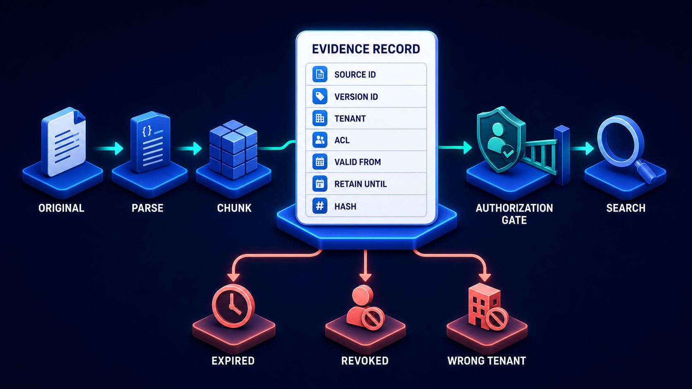

# Diagram 111 — Authorization Before Search

**Module:** Query and retrieval
**Role in the course:** the scope is computed before anything is searched
**Layout:** identity into a policy stage producing a scope, which both excludes four categories and filters three indexes

---

## At a glance

An authenticated user, a **SERVER POLICY** stage, and an **ALLOWED SCOPE**.

From that scope, two things happen simultaneously. Four **coral arrows** carry exclusions: **WRONG TENANT, RESTRICTED, EXPIRED, RETENTION HOLD**. And three **teal arrows** descend to three **filtered** indexes.

Every index is filtered. Not one, not the vector one — all three, by the same scope, before any of them is searched.

---

## What the diagram teaches

### 1. ALLOWED SCOPE is computed once and applied everywhere

The scope is a single object, drawn as a cylinder with a checklist, sitting between the policy stage and the three indexes.

Computing it once rather than per-index has three consequences.

**Consistency.** Three indexes cannot disagree about what a caller may see.

**Auditability.** There is one object to log, and one answer to "what was this caller permitted to see at this moment."

**Cost.** Policy evaluation happens once per query rather than three times.

### 2. All three indexes are labelled FILTERED, and the repetition is the point

**FILTERED LEXICAL INDEX. FILTERED VECTOR INDEX. FILTERED SQL.**

The word appears three times.

That repetition exists because partial filtering is the common failure. A team filters the vector index carefully — because that is where the semantic search is and it feels like the risky one — and leaves the lexical index or the structured query unfiltered.

An unfiltered lexical index is exactly as leaky as an unfiltered vector index. A caller who can search text can find documents they cannot read, learn their titles, and infer their contents.

### 3. FILTERED SQL is included, and structured data is where filtering is most often forgotten

The third index is a database, not a text index.

Structured sources — a ledger, a case system, a customer database — are frequently reached through a query the assistant constructs, and it is easy to construct one that returns rows the caller may not see.

Including SQL alongside the two text indexes says the scope applies to every retrieval channel regardless of its shape.

### 4. Four exclusion categories, and they are different kinds of refusal

**WRONG TENANT** — a boundary violation. This content belongs to another organisation.

**RESTRICTED** — a permission refusal. The content is in the right tenant and this caller may not see it.

**EXPIRED** — a retention outcome. The content is past its retain-until date and should not exist.

**RETENTION HOLD** — the opposite of expired, and the one most often missed. Content under a legal hold that must be preserved and, frequently, must not be surfaced in ordinary retrieval.

That fourth category is not a permission question at all. It is a litigation or regulatory constraint, and it produces content that exists, is otherwise permitted, and must not be returned.

### 5. The exclusions and the filters leave the scope simultaneously

Look at the geometry. Coral arrows go right; teal arrows go down. Both originate at the **ALLOWED SCOPE** platform.

That is one operation with two outputs. Computing the scope determines both what is included and what is excluded — they are the same computation seen from either side.

Drawing the exclusions explicitly rather than as an absence means they can be counted, logged, and monitored.

### 6. PERMITTED CANDIDATES carry green checks, and the checks mean pre-cleared

Four white cards, each with a **teal check disc**.

Every candidate reaching this stage has already passed the scope. Nothing downstream needs to re-check.

That is the payoff of filtering before search. The reranker, the diversity stage, the evidence packer and the answer generator all operate on content that is known to be permitted, and none of them carries a permission responsibility.

### 7. RERANK comes after, and it never sees excluded content

The final stage — a funnel beside a numbered list — receives only permitted candidates.

That ordering has a consequence beyond correctness: the reranker's scores are computed over the permitted set only, so relevance scores and result counts carry no information about excluded content.

Post-filtering leaks precisely there. Even if forbidden documents are removed from the output, their presence during ranking has shifted the scores and counts of everything else.

The scope has nothing to filter on unless every chunk carries the fields it reads:

Three of this diagram's four exclusion categories map directly onto fields on that record — tenant, ACL and retain-until. A chunk missing them cannot be excluded; it can only be returned.

---

## Case study — Nethercote Family Law, the hold that was not held

Nethercote is a family law practice with about 90 fee earners across six offices. Their knowledge system indexes case files, correspondence, court documents, counsel opinions and their own precedent library.

Access control is unusually complex. A fee earner may see files for their own matters, files for matters in their team, and precedent material — but never files for matters where the firm acts for an opposing party in a related case.

### What they had

Careful filtering on their vector index. Their lexical index and their case-management database queries were unfiltered, on the reasoning that both were reached through their case system which already applied permissions.

That reasoning was correct for the case system's own interface and wrong for the assistant, which queried it with a service account.

### The first finding

A fee earner searching for precedent on a particular financial remedy issue received a result set including a document from a matter they had no access to.

The document was returned by the lexical channel. The vector channel had correctly excluded it. Fusion combined the two, and the lexical result reached the candidate pool.

The document was a counsel opinion in a matter where Nethercote acted for the other side of a related dispute. The fee earner read the title and the first paragraph before recognising the case name and reporting it.

That is an information barrier breach, and in family law it is serious.

### The second finding, which was worse

The investigation examined their retention handling.

Nethercote had 41 matters under legal hold — files preserved for actual or anticipated proceedings, which must not be destroyed and, under their own information barrier policy, must not be surfaced outside the handling team.

**Their system had no concept of a retention hold.** Held matters were treated as ordinary closed matters. Their content was indexed, permitted to the team, and — for the 11 held matters where the handling team had changed — permitted to people who should no longer have had access.

Nobody had queried them. The exposure was potential rather than realised.

### The rebuild

**Scope computed once, before any channel runs.**

Their policy stage resolves, per query: the caller's identity, their team, the matters they may access, the matters excluded by information barriers, matters under hold, and content past retention.

The output is an allowed scope object, logged with every query.

**All three channels filtered by that scope.** Lexical, vector, and their case-database queries.

The database change was the largest piece of work. Their assistant's queries were rewritten to take the scope as a parameter and to be constructed such that an unscoped query is a syntax error rather than a query returning everything.

That construction — making the unsafe form impossible to express rather than merely discouraged — is what their technical lead considers the important part.

**RETENTION HOLD as a first-class exclusion category.**

Held matters are excluded from ordinary retrieval entirely. The handling team accesses them through a separate, explicitly-scoped path that logs every access.

This was a requirement from their compliance partner rather than an engineering choice, and it is the category the diagram includes that they would not have thought of.

**Exclusions counted and monitored.**

Each of the four categories is logged per query. Their compliance function receives a weekly summary.

**WRONG TENANT** — Nethercote is single-tenant, so this should always be zero. It is monitored anyway.

**RESTRICTED** — routine, roughly 2,000 exclusions a day, each one an information barrier working.

**EXPIRED** — should be near zero. A non-zero value means their retention job has not run.

**RETENTION HOLD** — around 40 a day, each one a held matter correctly excluded.

That last figure was itself informative. Forty exclusions a day meant held matters were being caught by ordinary searches routinely, which under the previous arrangement would have been forty potential exposures a day.

### The information barrier finding

Once exclusions were logged with reasons, their compliance partner could review them.

The review found **three information barriers that were configured incorrectly** — matters where the barrier should have excluded a team and did not, and one where it excluded a team that should have had access.

None had produced an exposure. All three had been in place for months and were invisible until the exclusion log made barrier behaviour observable.

### Results

- **Unfiltered retrieval channels:** 2 of 3 → 0.
- **Cross-barrier results reaching a fee earner:** 1 known incident → 0.
- **Matters under legal hold in ordinary retrieval:** 41 → 0.
- **Held-matter exclusions per day:** ~40, each previously a potential exposure.
- **Misconfigured information barriers found by exclusion review:** 3.
- **Unscoped database queries:** made syntactically impossible.

### The line in their information security policy

*Every channel is filtered by the same scope, computed once, before any of them runs. A channel that is not filtered is not a channel we operate.*

---

## Composition

A left-to-right identity chain producing a scope, which branches into exclusions and filtered channels.

**Left:** **AUTHENTICATED USER** — a blue person with a shield — cyan arrow → **SERVER POLICY** — a blue server stack with a shield — cyan arrow → **ALLOWED SCOPE** — a blue cylinder on a glowing disc, carrying a green-ticked checklist.

**Right, four coral arrows** fan to red prohibition discs on red platforms: **WRONG TENANT**, **RESTRICTED**, **EXPIRED**, **RETENTION HOLD**.

**Below, three teal arrows** descend to three blue platforms: **FILTERED LEXICAL INDEX** (magnifier over a document), **FILTERED VECTOR INDEX** (a cube cluster with connected nodes), **FILTERED SQL** (a database stack).

**Teal lines** from all three converge on **PERMITTED CANDIDATES** — four white cards each with a **teal check disc** — then a teal arrow right to **RERANK** — a blue funnel beside a card listing **1 2 3** with teal number badges.

## Element by element

**AUTHENTICATED USER** — a person with a shield. Identity established.

**SERVER POLICY** — a server with a shield. Where the scope is computed.

**ALLOWED SCOPE** — a cylinder with a green-ticked checklist. One object, two outputs.

**WRONG TENANT** — a boundary violation.
**RESTRICTED** — a permission refusal.
**EXPIRED** — past retention.
**RETENTION HOLD** — preserved and not to be surfaced.

**FILTERED LEXICAL / VECTOR / SQL** — three channels, all filtered.

**PERMITTED CANDIDATES** — four cards with teal checks. Pre-cleared.

**RERANK** — a funnel and a ranked list, operating only on permitted content.

## Colour and flow semantics

- **Cyan arrows** carry the identity chain to the scope.
- **Coral arrows** carry the four exclusion categories rightward.
- **Teal arrows** carry the scope down into the three channels and their results onward.
- **Exclusions and filters leave the same platform**, marking them as two views of one computation.
- The word **FILTERED** appears three times, once per channel.
- **Teal checks** on the permitted candidates mark them as pre-cleared for everything downstream.

## How to present it

**Ask which of their retrieval channels are filtered.** Most rooms have filtered the vector index. Ask about the lexical one and the structured queries.

**Point at the word FILTERED appearing three times.** Then make the argument: an unfiltered lexical index is exactly as leaky as an unfiltered vector index.

**Tell the Nethercote fusion leak.** The vector channel correctly excluded a counsel opinion; the lexical channel did not; fusion combined them and the excluded document reached a fee earner in a matter where the firm acted for the other side.

**Ask about structured queries specifically.** An assistant constructing a query against a case system with a service account is bypassing the permissions that system's own interface applies. Ask how theirs is scoped.

**Give them the construction principle.** Nethercote made an unscoped query a syntax error rather than a discouraged pattern. Making the unsafe form inexpressible beats making it forbidden.

**Read the four exclusion categories and ask which is unfamiliar.** **RETENTION HOLD**, usually. It is not a permission question — content that exists, is otherwise permitted, and must not be returned.

**Tell the 41 held matters.** No concept of a hold, held matters treated as ordinary closed matters, and 11 where the handling team had changed. Potential rather than realised exposure, and invisible.

**Point at the exclusions and filters leaving the same platform.** One computation, two outputs. Then note that drawing exclusions explicitly means they can be counted.

**Give them the monitoring pattern.** Wrong tenant should be zero. Restricted is routine. Expired should be near zero and a non-zero value means a job did not run. Retention hold is routine and each one is a prevented exposure.

**Tell the barrier-configuration finding.** Logging exclusions with reasons made barrier behaviour observable, and found three misconfigured barriers that had been in place for months.

**Close on post-filtering.** Even if forbidden documents are removed from output, their presence during ranking shifts the scores and counts of everything else. Filtering before search is the only version that does not leak.

**Timing.** Twenty-five minutes. Thirty-five if you audit which of the room's channels are scoped, which usually finds one that is not.

---

## Lab and checkpoint

**Lab:** For each of your retrieval channels — vector, lexical, and structured — identify where the allowed scope is computed and how it is applied. Confirm that every channel is filtered before search. Add the four exclusion categories: restricted, expired, wrong tenant, and retention hold. Log the count per category and set the wrong-tenant count to zero.

**Checkpoint:** Why is filtering before search the only version that does not leak?

**Answer:** Because post-filtering removes forbidden documents from the output, but their presence during search still affects ranking, scores, counts, and what the model sees. Pre-filtering ensures forbidden documents never enter the query, so they cannot influence anything.

## Glossary

- **Allowed scope** — the set of documents the caller is permitted to see.
- **Exclusion** — a document removed from search because of a policy, not relevance.
- **Filter** — the permission applied before search.
- **Fusion leak** — the case where one unfiltered channel lets excluded content enter the result.
- **Lexical index** — the keyword search index.
- **Permitted candidates** — the candidates that have been pre-cleared by scope.
- **Retention hold** — content that is otherwise permitted but must not be returned.
- **Rerank** — the step that orders candidates, which must only see permitted content.
- **Restricted** — content that the caller is not allowed to see.
- **Structured query** — a query against a database or structured data source.
- **Vector index** — the semantic search index.
- **Wrong tenant** — content that belongs to a different tenant.

## Sources

- Permission-aware retrieval and pre-filtering
- Multi-channel search and fusion leaks
- Retention holds and legal exclusions
