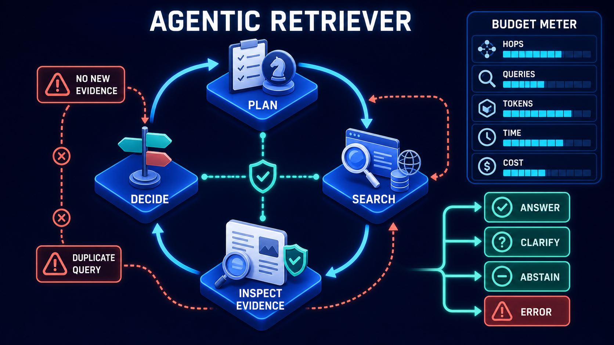

# Diagram 113 — Bounded Multi-Hop Retrieval

![A QUESTION bubble on dark navy fans to three hop platforms — HOP 1 FIND POLICY with a magnifier, HOP 2 FIND PRODUCT CLASS with a folder and cube, HOP 3 VERIFY PURCHASE with a shopping trolley. Each produces two white cards, EVIDENCE with a shield and NEXT QUERY with a speech bubble. Teal lines carry all of them into STOP GATE, a teal-bordered panel listing ANSWERABLE, MAX 3 HOPS, BUDGET and NO NEW EVIDENCE. A coral dashed line runs from the gate along the base through a red LOOP BLOCKED octagon back to the question.](../diagrams/113-bounded-multihop-retrieval.png)

**Module:** Advanced retrieval
**Role in the course:** searching several times without searching forever
**Layout:** three named hops each producing evidence and a next query, feeding a four-condition stop gate with a blocked loop

---

## At a glance

Three hops, each with a **name describing what it is looking for**, each producing two things: **EVIDENCE** and a **NEXT QUERY**.

All of it feeds a **STOP GATE** with four conditions: **ANSWERABLE, MAX 3 HOPS, BUDGET, NO NEW EVIDENCE.**

And a coral path from the gate back to the question, interrupted by a red **LOOP BLOCKED** octagon.

Four stop conditions rather than one, and the loop back to the question is drawn and then blocked.

---

## What the diagram teaches

### 1. Each hop has a purpose, not a number

**HOP 1 FIND POLICY. HOP 2 FIND PRODUCT CLASS. HOP 3 VERIFY PURCHASE.**

Not "hop 1, hop 2, hop 3" — each carries what it is trying to establish.

That naming is the difference between a plan and a loop. A named hop can be assessed: did it find the policy? A numbered hop can only be counted.

It also makes the sequence inspectable. A human reading the trace sees the reasoning chain, not just three searches.

### 2. Each hop produces two outputs, and the second is what makes it multi-hop

**EVIDENCE** — what was found.
**NEXT QUERY** — what to look for now, given what was found.

The next query is derived from the evidence. That derivation is the entire point of multi-hop retrieval: you could not have formulated hop 2's query before seeing hop 1's evidence.

The example sequence makes this concrete. You cannot verify a purchase until you know which product class the policy applies to, and you cannot know the product class until you have found the policy.

### 3. Four stop conditions, and they catch four different failures

**ANSWERABLE** — a teal check. The question can now be answered. This is the success condition, and it is listed first.

**MAX 3 HOPS** — a numeral in a circle. A hard ceiling.

**BUDGET** — a currency symbol. Cost or time exhausted.

**NO NEW EVIDENCE** — a prohibition sign. The last hop added nothing.

Four conditions because a single one leaves gaps. A hop limit alone allows three expensive hops that go nowhere. A budget alone allows the system to spend it going in circles. An answerable check alone never terminates on a question that cannot be answered.

### 4. NO NEW EVIDENCE is the condition teams omit

The fourth, and the most useful.

A retrieval loop frequently converges: hop 3 returns substantially what hop 2 returned, rephrased. It has not failed and it has not progressed.

Detecting that requires comparing hops rather than counting them, and it terminates loops that would otherwise consume the full hop and budget allowance producing nothing.

It is also the condition that most often indicates the question cannot be answered from the corpus — which is a useful thing to know, and the input to abstention.

### 5. ANSWERABLE is first in the list, and that ordering is deliberate

Reading the gate top to bottom: answerable, then three limits.

Success is checked first. The other three are failsafes.

A gate that checks limits first would terminate a hop-3 sequence on its ceiling even when hop 3 had produced exactly what was needed.

### 6. The loop back to the question is drawn and blocked

A coral dashed line runs from the stop gate leftward along the base, through a **red octagon with a white ✗** labelled **LOOP BLOCKED**, and up into **QUESTION**.

The route exists. Without the gate, a multi-hop retriever's natural shape is a cycle: evidence produces a next query, which produces evidence, which produces a next query.

Drawing the cycle and then interrupting it is stronger than omitting it. The octagon sits on the return path, which is precisely where the control belongs.

### 7. The evidence accumulates across hops

Each hop's **EVIDENCE** card carries a shield and feeds the gate independently.

Evidence is not replaced at each hop; it accumulates. The gate assesses the accumulated set, not the most recent hop's contribution.

That matters for the answerable check: a question may become answerable only when hop 1's policy and hop 3's purchase verification are held together.

Where the hops are planned by the retriever rather than fixed in advance, the same bounding problem grows four more dimensions:

**MAX 3 HOPS** and **BUDGET** here are two of that diagram's five meters. **NO NEW EVIDENCE** appears in both, which is the condition that catches convergence rather than exhaustion.

---

## Case study — Selby Retail Group, the return that took eleven searches

Selby operates a department store chain and an online business. Their customer service assistant answers questions about returns, warranties, delivery and product availability.

Return eligibility is genuinely multi-hop. It depends on the product category, the purchase channel, the elapsed time, whether the item was on promotion, and whether the customer holds a loyalty tier that extends the window.

### The unbounded implementation

Their first version looped: search, assess, formulate a follow-up, search again, until it had what it needed.

It had a maximum-iterations guard set to fifteen, which had been chosen as a number that seemed generously high.

### What it produced

**Median hops: 2.1.** Most questions resolved quickly.

**95th percentile: 9.** A meaningful tail.

**Maximum: 15**, hit on about 1.4% of queries — which meant the guard was firing rather than the logic terminating.

The 1.4% were not hard questions. They were questions where the retrieval loop had converged and kept going.

### The example that characterised it

A customer asked whether they could return a discounted coat bought online eleven weeks earlier.

The assistant searched for the returns policy. Found it. Searched for the promotional-items exception. Found it. Searched for the online-purchase window. Found it.

Then it searched for the promotional-items exception again, phrased differently. And again. And for the interaction between promotional items and the online window, which does not exist as a documented rule. And again.

Eleven searches. The three it needed were the first three.

Each search cost a retrieval and a model call. The query took 31 seconds and cost roughly 14 times a typical query.

### The audit

They sampled 200 queries that exceeded four hops.

**In 71%, the evidence needed was complete by hop 3.**

The additional hops were the loop re-asking variations of questions it had already answered, because the assessment step was not comparing new evidence against what it already held.

**In 18%, the question genuinely could not be answered** from their corpus — usually an interaction between two policies that had never been documented. The loop had run to the guard rather than concluding that.

**In 11%, the additional hops were productive.** Genuinely complex questions needing four to six hops.

### The rebuild with a four-condition gate

**Hops named rather than numbered.** Their planner now states what each hop is establishing: *find applicable returns policy*, *determine product category*, *check promotional status*, *verify purchase channel and date*.

That naming made traces readable. Their support team can see the reasoning chain rather than a list of queries.

**MAX HOPS set to 5**, not 15.

They set it by measurement: hop 5 captured 97% of the questions their corpus could answer. Hops 6 through 15 had captured a further 0.4% and consumed a disproportionate share of cost.

**NO NEW EVIDENCE implemented as a similarity check.** Each hop's evidence is compared against the accumulated set. A hop contributing nothing above a threshold terminates the loop.

This was the change with the largest effect. It fires on about 9% of multi-hop queries, and in the audit sample it would have terminated 71% of the over-four-hop queries at hop 3 or 4.

**BUDGET as a combined cost and latency ceiling.** Their customer-facing target is eight seconds; the budget terminates at six to leave room for generation.

**ANSWERABLE checked first**, before any limit.

### What termination produces

The important design decision: what happens when the loop stops without an answer.

Selby's previous behaviour was to answer from whatever it had, which produced confident answers built on incomplete evidence.

Now, a loop terminating on a limit rather than on answerable produces an explicit outcome:

> I found the returns policy and confirmed this was a promotional item purchased online, but I could not establish how the promotional-item exception interacts with the extended online returns window. This needs a supervisor.

That output names what was established and what was not. Advisers reported it as more useful than a wrong answer and more useful than a generic failure.

### The documentation finding

The 18% of questions that genuinely could not be answered turned out to be a corpus problem rather than a retrieval one.

Tracking terminations by unanswerable-reason produced a ranked list of undocumented policy interactions. Their policy team worked through the top twenty over a quarter.

Queries terminating as unanswerable fell from 18% of multi-hop queries to about 6%.

The retrieval system had become an instrument for finding gaps in the policy documentation.

### Results

- **95th percentile hops:** 9 → 4.
- **Queries hitting the maximum:** 1.4% → 0.2%.
- **Median latency on multi-hop queries:** 31s worst case → under 6s by budget.
- **Cost per multi-hop query:** down about 60%.
- **Unanswerable terminations:** 18% → 6%, by fixing documentation.
- **Confident answers on incomplete evidence:** eliminated by the explicit termination output.

### The line in their retrieval design notes

*Counting hops stops a runaway. Comparing hops stops a loop. You need both, and you need to say which one stopped you.*

---

## Composition

A question fanning to three named hops, each producing two cards, converging on a gate, with a blocked return.

**Left:** **QUESTION** — a blue speech bubble with a question mark on a blue platform. Three cyan arrows fan right.

**Three hop platforms**, top to bottom: **HOP 1 FIND POLICY** (magnifier), **HOP 2 FIND PRODUCT CLASS** (folder with a cube), **HOP 3 VERIFY PURCHASE** (shopping trolley).

**Each hop** sends two cyan arrows to two white cards: **EVIDENCE** (document with a blue shield) and **NEXT QUERY** (blue speech bubble).

**Teal lines** from all six cards converge rightward into **STOP GATE** — a teal-bordered panel with a teal shield at its head, listing four rows: **ANSWERABLE** (teal check), **MAX 3 HOPS** (numeral 3), **BUDGET** (currency symbol), **NO NEW EVIDENCE** (prohibition sign).

**A coral dashed line** runs from beneath the gate leftward along the base, through a **red octagon with a white ✗** labelled **LOOP BLOCKED**, and turns up into **QUESTION**.

## Element by element

**QUESTION** — a blue question-mark bubble.

**HOP 1 FIND POLICY** — a magnifier. Named by purpose.
**HOP 2 FIND PRODUCT CLASS** — a folder with a cube.
**HOP 3 VERIFY PURCHASE** — a shopping trolley.

**EVIDENCE** — a document with a shield. What was found.
**NEXT QUERY** — a speech bubble. What to look for next, derived from the evidence.

**STOP GATE** — a teal-bordered panel with four conditions.

**LOOP BLOCKED** — a red octagon on the return path.

## Colour and flow semantics

- **Cyan arrows** carry the question into the hops and each hop into its two outputs.
- **Teal lines** carry evidence and next-queries into the gate.
- **Coral dashed** carries the return path, interrupted by the red octagon.
- The **gate is teal-bordered**, marking it as a validation stage.
- **ANSWERABLE is listed first**, above the three limits.

## How to present it

**Ask what stops a multi-hop retriever.** Most rooms name a hop limit. Then show four conditions and ask what each catches.

**Point at the named hops.** Find policy, find product class, verify purchase. Ask what a numbered hop tells you by comparison — nothing you can assess.

**Explain why the next query cannot be pre-computed.** You cannot verify a purchase until you know the product class, and you cannot know the product class until you have the policy. That derivation is what multi-hop means.

**Ask which stop condition they would forget.** **NO NEW EVIDENCE**, almost always. Then explain the convergence case: hop 3 returning hop 2's content rephrased, which has neither failed nor progressed.

**Tell the Selby coat.** Eleven searches, the three it needed were the first three, 31 seconds, 14× typical cost. The loop re-asking variations of questions it had already answered.

**Give them the audit split.** 71% complete by hop 3, 18% genuinely unanswerable, 11% productively long. Then note that the guard at 15 was firing rather than the logic terminating.

**Ask how they would set the hop limit.** Selby measured: hop 5 captured 97% of answerable questions, hops 6–15 captured 0.4%. A number from measurement, not from intuition.

**Ask why ANSWERABLE is first.** A gate checking limits first terminates on a ceiling even when the hop produced what was needed.

**Point at the blocked loop.** The cycle exists; the octagon sits on the return path where the control belongs.

**Spend time on what termination produces.** Selby's explicit output names what was established and what was not. Advisers found it more useful than a wrong answer *and* more useful than a generic failure.

**Tell the documentation finding.** Tracking unanswerable terminations produced a ranked list of undocumented policy interactions, and fixing the top twenty cut unanswerable queries from 18% to 6%. The retrieval system became an instrument for finding corpus gaps.

**Close on the design note.** *Counting hops stops a runaway. Comparing hops stops a loop.*

**Timing.** Twenty-five minutes. Thirty-five if you measure the room's own hop distribution, which usually has a tail nobody has looked at.

---

## Lab and checkpoint

**Lab:** Take one query in your system that currently needs more than one search. Write the named hops, each with a purpose and a derived next query. Define the four stop conditions: answerable, no new evidence, hop limit, and unanswerable. Then measure the hop distribution for 50 queries and set the limit by data, not intuition.

**Checkpoint:** Why is NO NEW EVIDENCE the stop condition that teams usually forget?

**Answer:** Because it is not a failure or a timeout. It is the case where the retriever finds content that is just a rephrasing of what it already has. Without this condition, the system can keep looping through variations of the same result, wasting time and giving the illusion of progress.

## Glossary

- **Answerable** — the stop condition where the accumulated evidence is enough to answer.
- **Bounded** — the property of having explicit limits on the number of hops.
- **Hop** — one retrieval step in a multi-hop chain.
- **Hop limit** — the maximum number of hops allowed.
- **Multi-hop retrieval** — a query that requires several linked searches to answer.
- **Named hop** — a hop labelled by purpose, such as "find policy" or "verify purchase".
- **No new evidence** — the stop condition where the next hop does not add new information.
- **Termination** — the point where the retrieval chain stops and reports its result.
- **Unanswerable** — the stop condition where the question cannot be answered from the corpus.

## Sources

- Multi-hop retrieval and termination conditions
- Bounded search and convergence detection
- Evidence accumulation and query decomposition
