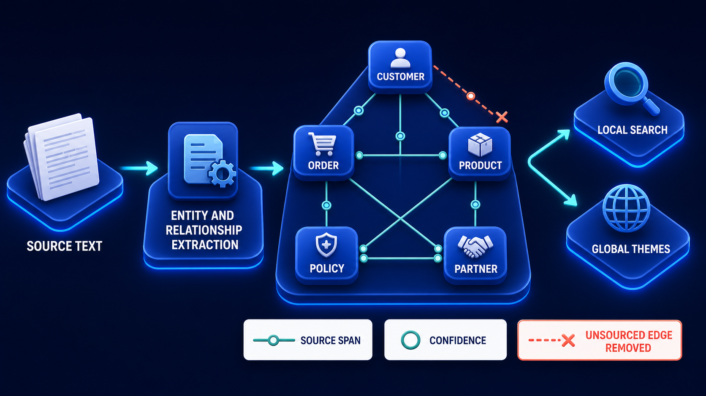

# Diagram 115 — Structured and Federated Retrieval

**Module:** Advanced retrieval
**Role in the course:** evidence from systems that are not documents
**Layout:** one plan into three heterogeneous sources, each normalised by an adapter, merged under contract, with two shortcuts blocked

---

## At a glance

A query plan reaches three completely different sources — a document search, a SQL database, an HTTP API — and each returns through an **identical EVIDENCE ADAPTER** carrying five fields: **VALUE, SOURCE, AS OF, AUTHORITY, CITATION**.

They merge at a **MERGE CONTRACT** with a **VERIFIED IDS** badge.

And two things are blocked in coral: **FREE-FORM SQL** and **RAW API DUMP**.

The three adapters being identical is the whole design. Three sources with nothing in common produce evidence with everything in common.

---

## What the diagram teaches

### 1. The three sources are deliberately heterogeneous

**POLICY SEARCH** — a book with a shield. Unstructured text, retrieved by relevance.

**SQL LEDGER** — a database with a table. Structured rows, retrieved by exact query.

**CASE API** — a cloud with `{ }`. A remote service, retrieved by request.

Three retrieval mechanisms, three data models, three failure modes, three latency profiles.

The point of including all three is that a real knowledge system's evidence does not all come from documents. A question about whether a payment was made is answered by a ledger, not by a policy.

### 2. The adapters are drawn identically, and that is the normalisation claim

Three white cards, same size, same five rows, same icons.

Whatever the source, the evidence that comes out has the same shape.

That uniformity is what allows everything downstream to treat evidence uniformly. The reranker, the packet composer, the citation checker and the answer generator do not need three code paths.

### 3. Five fields, and they map onto the governance work from the start of the volume

**VALUE** — what the evidence says. The fact itself.

**SOURCE** — where it came from. Which system, which record.

**AS OF** — when it was true. A ledger balance is a balance at a moment; an API response is a snapshot.

**AUTHORITY** — how much weight it carries. From the source register.

**CITATION** — how to point at it, so a human can check.

The **AS OF** field is the one that structured sources make necessary. A document is relatively static; a ledger row changes. Evidence from a live system without a timestamp is a claim about an unspecified moment.

### 4. FREE-FORM SQL is blocked, and the reason is not only injection

A coral dashed path to a red-bordered tile showing a database with a terminal prompt, marked **BLOCKED**.

Three reasons, and the security one is the least interesting.

**It bypasses authorisation.** A constructed query with a service account returns rows the caller may not see. The scope filtering from the authorization diagram operates on parameterised queries, not on arbitrary SQL.

**It produces unciteable evidence.** A row returned by an ad-hoc query has no stable reference. You cannot point at it later.

**It is unbounded.** A generated query can join, aggregate and scan without limit, and its cost is not predictable.

The alternative is a parameterised, named query with declared inputs and a declared result shape — which is exactly what an adapter is.

### 5. RAW API DUMP is blocked for a different reason

A red-bordered tile showing a cloud with a download arrow, marked **BLOCKED**.

Not a security failure — a **normalisation** failure.

An API response dropped whole into evidence brings its own field names, its own nesting, its own conventions, and no as-of, no authority, and no citation.

It also brings everything the API returned, including fields nobody asked for, which may include data the caller should not see.

The adapter's job is to extract the specific value, attach the five fields, and discard the rest.

### 6. MERGE CONTRACT carries VERIFIED IDS, and that badge is the hard part

A handshake glyph and a teal **VERIFIED IDS** badge.

Merging evidence from three systems requires knowing that they are talking about the same thing.

The policy says something about customer 8841. The ledger has a row for account 44-8821. The case API returns a record for reference CX-99213.

Are those the same customer?

**VERIFIED IDS** means the merge does not assume they are. Identity across systems is established explicitly — through a mapping, a shared identifier, or a resolution service — and evidence that cannot be tied to a verified identity does not merge.

That is where federated retrieval usually breaks, and it breaks silently: three pieces of evidence about three different entities, presented as one coherent picture.

### 7. The contract is bidirectional

The word **CONTRACT** rather than "merge" or "combine."

The adapters commit to producing the five fields. The merge commits to only combining evidence whose identities are verified.

Neither side improvises. An adapter that cannot supply an as-of date does not get to omit it; a merge that cannot verify identity does not get to guess.

A fourth source type has the same requirement and a harder version of the identity problem:

A graph's nodes *are* entities, so identity resolution is not a merge-time concern there — it is an extraction-time one. The same customer named three ways becomes three nodes, and the merge contract cannot fix what extraction already split.

---

## Case study — Thornaby Mutual, the balance that belonged to someone else

Thornaby is a building society with about 340,000 members. Their servicing assistant answers questions from branch and telephone staff, drawing on three source types.

**Policy documents** — savings and mortgage terms, ingested and indexed.

**The account ledger** — a SQL database holding balances, transactions and rates.

**The case system** — an API serving complaint records, servicing requests and correspondence.

A typical question needs all three: *is this member entitled to the loyalty rate given their balance history and the complaint they raised last year?*

### The first implementation

Three integrations, three shapes.

Policy retrieval returned passages with citations. The ledger integration returned raw rows. The case API integration returned whatever the API sent.

The assistant received three differently-shaped things and combined them in the prompt.

### The identity failure

A member queried their loyalty rate eligibility.

The policy passage was correct. The ledger row was for the right account. The case record was for a **different member** — one whose surname and postcode matched, and whose case reference had been resolved by a fuzzy lookup in the API integration.

The assistant produced an answer stating that the member had raised a complaint about their rate in the previous year, which affected their eligibility.

They had not. Someone else had.

The adviser relayed it. The member, understandably, disputed having made a complaint they had no knowledge of. Establishing what had happened took Thornaby three weeks and involved disclosing to the member that another member's record had been referenced.

That disclosure was itself a data protection incident, reported to the regulator.

### The audit

They examined how identity was resolved across the three sources.

**Policy retrieval** — no identity involved. Passages are general.

**Ledger** — resolved by account number, taken from the adviser's open record. Correct.

**Case API** — resolved by a search call using name and postcode, because the case system used its own reference scheme and no mapping existed.

The fuzzy lookup returned the highest-scoring match. On a corpus of 340,000 members, name-and-postcode collisions are not rare.

**They estimated the fuzzy lookup had returned a wrong record in roughly 0.4% of queries** — around 60 times a month.

Most were caught, because advisers noticed content that did not match the member in front of them. An unknown number were not.

### The rebuild

**A uniform evidence adapter per source.**

Every source now produces the five fields. The ledger integration's raw rows became adapted evidence with a value, a source reference, an as-of timestamp, an authority level, and a citation resolving to the specific ledger entry.

**AS OF became mandatory and it exposed a second problem.**

Their case API returned records without any indication of currency. Adding an as-of field required asking the API team for one, and that conversation revealed the API served from a replica with up to four hours of lag.

Advisers had been reading case records as current for two years. Nobody had known.

**VERIFIED IDS through an explicit mapping.**

Thornaby built a member identity mapping: their internal member number, the ledger account numbers associated with it, and the case system's reference.

The case API integration now looks up by verified reference. There is no fuzzy path.

Where no mapping exists — about 2% of members, mostly recent joiners or records affected by a historical migration — the case evidence is **omitted with a note**, rather than resolved by guessing.

That note is what advisers see: *"No case history available for this member — identity mapping incomplete. Check the case system directly."*

**FREE-FORM SQL removed.**

Their ledger integration had been constructing queries. It now calls named, parameterised queries with declared shapes: `get_balance_as_of`, `get_rate_history`, `get_transaction_summary`.

Fourteen named queries replaced arbitrary SQL. The constraint forced them to enumerate what the assistant actually needed, and the enumeration found that three of the queries it had been generating were reading columns nobody had intended to expose.

**RAW API DUMP removed.**

The case API adapter extracts specific fields. Their API returns 60-odd fields per case record, of which the assistant needs four. The other 56 had been going into the prompt, including internal handling notes not intended for member-facing staff.

### Results

- **Wrong-member case records:** ~0.4% of queries → 0.
- **Members with no identity mapping:** ~2%, evidence omitted with an explicit note rather than guessed.
- **API replica lag:** discovered after two years, now shown as an as-of timestamp.
- **Ledger columns exposed unintentionally:** 3, found by enumerating named queries.
- **API fields entering the prompt:** 60 → 4.
- **Data protection incidents from cross-member evidence:** 1 → 0.

### The line in their integration standard

*Three sources agreeing about the same customer is only useful if it is the same customer. Verify the identity or omit the evidence — never resolve it by scoring.*

---

## Composition

One plan fanning to three sources, each normalised by an identical adapter, converging on a contract, with two blocked shortcuts.

**Top:** **QUERY PLAN** — a blue platform with a clipboard-and-magnifier glyph. Three cyan arrows fan down.

**Three sources**, left to right: **POLICY SEARCH** (a book with a blue shield), **SQL LEDGER** (a database stack beside a table grid), **CASE API** (a white cloud with `{ }`).

**Each** sends a cyan arrow down to a white **EVIDENCE ADAPTER** card listing five rows with blue icons: **VALUE** (database), **SOURCE** (globe), **AS OF** (clock), **AUTHORITY** (institution), **CITATION** (quotation marks).

**Teal arrows** from all three converge on **MERGE CONTRACT** — a teal-bordered panel with a handshake glyph and a **VERIFIED IDS** badge with a check.

**Right:** two **coral dashed paths**, each through a **red hexagonal X**, to red-bordered tiles — **FREE-FORM SQL** (a database with a terminal prompt) marked **BLOCKED**, and **RAW API DUMP** (a cloud with a download arrow) marked **BLOCKED**.

## Element by element

**QUERY PLAN** — a clipboard with a magnifier. What evidence is needed.

**POLICY SEARCH** — a shielded book. Unstructured, relevance-retrieved.
**SQL LEDGER** — a database with a table. Structured, exactly queried.
**CASE API** — a cloud with braces. Remote, requested.

**EVIDENCE ADAPTER** — three identical cards, five fields each.

**MERGE CONTRACT** — a handshake with a VERIFIED IDS badge.

**FREE-FORM SQL** — blocked. Bypasses authorisation, uncitable, unbounded.
**RAW API DUMP** — blocked. Unnormalised, and brings everything the API returned.

## Colour and flow semantics

- **Cyan arrows** carry the plan into the three sources and each source into its adapter.
- **Teal arrows** carry adapted evidence into the merge contract.
- **Coral dashed paths** with **red hexagonal crosses** mark the two blocked shortcuts.
- The **three adapter cards are rendered identically**, which is the normalisation claim made visual.
- **VERIFIED IDS** is the only badge on the merge panel, marking identity as the merge's precondition.

## How to present it

**Ask where their evidence comes from.** If the answer is only documents, ask how they answer a question about a balance or a transaction.

**Point at the three identical adapter cards.** Three sources with nothing in common producing evidence with everything in common.

**Read the five fields and ask which is unusual.** **AS OF**. Then explain why structured sources make it necessary — a ledger row changes, and evidence from a live system without a timestamp is a claim about an unspecified moment.

**Tell the Thornaby API lag finding.** Adding a mandatory as-of field revealed the case API served from a replica with up to four hours of lag. Advisers had been reading records as current for two years.

**Ask why free-form SQL is blocked.** Push past injection. It bypasses the scope filter, produces uncitable evidence, and has unbounded cost.

**Give them the named-query finding.** Fourteen named queries replaced arbitrary SQL, and the enumeration found three columns being read that nobody had intended to expose. The constraint produced an audit.

**Ask why a raw API dump is blocked.** Not security — normalisation. Then give the number: 60 fields returned, four needed, 56 going into the prompt including internal handling notes.

**Spend the most time on VERIFIED IDS.** Three sources agreeing about a customer is only useful if it is the same customer.

**Tell the wrong-member case record.** A fuzzy name-and-postcode lookup returning the highest-scoring match, roughly 60 times a month, producing an answer stating a member had raised a complaint they knew nothing about — and a data protection incident in establishing what happened.

**Give them the omission rule.** Where identity cannot be verified, Thornaby omit the evidence with an explicit note rather than resolving by score. Ask what their system does.

**Close on the standard.** *Verify the identity or omit the evidence — never resolve it by scoring.*

**Timing.** Twenty-five minutes. Thirty-five if you trace how identity is resolved across the room's own sources, which frequently finds a fuzzy match somewhere.

---

## Lab and checkpoint

**Lab:** Identify three heterogeneous sources in your system (documents, SQL, API). For each, write the adapter that normalises the five fields: text, source, as-of, verified ID, and authority. Then write the merge contract that combines results only when verified IDs match, and the rule for omitting evidence when identity cannot be verified.

**Checkpoint:** Why is a verified ID required in a merge contract?

**Answer:** Because three sources agreeing about a customer or entity is only useful if they agree about the same one. Without verified IDs, a fuzzy match can merge records belonging to different people, producing answers that attribute one person's data to another.

## Glossary

- **Adapter** — the component that normalises heterogeneous sources into a common shape.
- **As-of** — the time for which structured evidence is valid.
- **Federated retrieval** — combining evidence from multiple independent sources.
- **Free-form SQL** — ad-hoc database queries, blocked because they bypass scope and normalisation.
- **Merge contract** — the rule that combines normalised evidence from different sources.
- **Named query** — a pre-approved, scoped database query.
- **Normalisation** — the process of making different sources produce the same five fields.
- **Raw API dump** — an unfiltered API response, blocked because it includes too much irrelevant data.
- **Structured source** — a database, API, or other non-document source.
- **Verified ID** — a confirmed identifier that proves different sources refer to the same entity.

## Sources

- Federated retrieval and source normalisation
- Structured evidence and as-of timestamps
- Identity resolution and merge contracts
