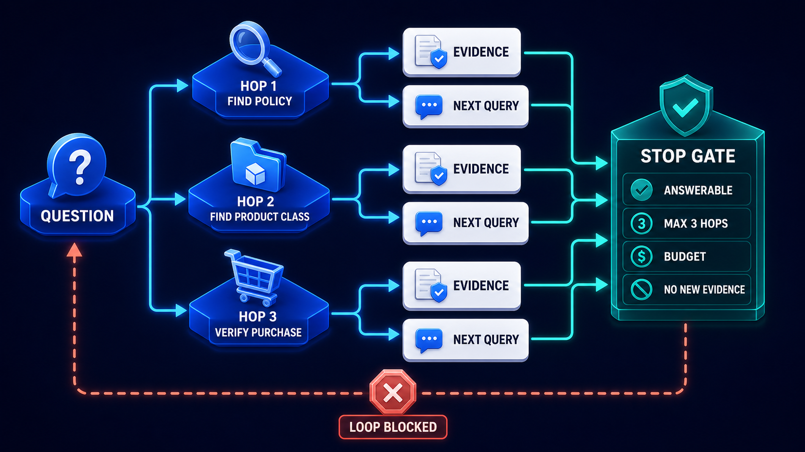

# Diagram 116 — Agentic Retrieval and the Budget Loop

![A circular loop on dark navy headed AGENTIC RETRIEVER, running PLAN with a clipboard and chess knight, SEARCH with a magnifier and globe, INSPECT EVIDENCE with a document and shield, and DECIDE with a signpost. A teal shield sits at the centre linked by dotted lines to all four. On the right, a BUDGET METER panel shows five partially-filled bars — HOPS, QUERIES, TOKENS, TIME, COST. Four teal outcome tiles read ANSWER, CLARIFY, ABSTAIN and a red ERROR. Two coral warning tiles on the left read NO NEW EVIDENCE and DUPLICATE QUERY, each linked by coral dashed lines with red crosses.](../diagrams/116-agentic-retrieval-budget-loop.png)

**Module:** Advanced retrieval
**Role in the course:** a retriever that decides its own next move
**Layout:** a four-stage loop with a central policy shield, a five-dimension budget meter, four outcomes and two loop guards

---

## At a glance

Four stages in a loop — **PLAN, SEARCH, INSPECT EVIDENCE, DECIDE** — with a **teal shield at the centre** connected to all four.

A **BUDGET METER** tracking five dimensions: **HOPS, QUERIES, TOKENS, TIME, COST**.

Four outcomes: **ANSWER, CLARIFY, ABSTAIN, ERROR**.

And two coral guards: **NO NEW EVIDENCE** and **DUPLICATE QUERY**.

Five budget dimensions rather than one, and four outcomes rather than two. Both numbers are the point.

---

## What the diagram teaches

### 1. The shield at the centre governs every stage

A **teal shield with a check**, connected by dotted teal lines to all four loop stages.

Policy is not a stage in the loop. It is at the centre, applying to every stage.

That placement matters because an agentic retriever can go wrong at any point. It can plan to search something it may not see, search a source it is not permitted, inspect evidence it should not have received, or decide to answer from restricted content.

A policy check at one point in the loop leaves the other three unguarded.

### 2. PLAN carries a chess knight, and the glyph is apt

A clipboard with a **chess knight**.

A knight moves in a way that reaches squares other pieces cannot, in two stages. It is the piece of indirection.

Planning in an agentic retriever is not listing steps; it is working out what intermediate thing you need to find in order to find the thing you want.

### 3. Five budget dimensions, and they exhaust independently

**HOPS** — how many times round the loop.
**QUERIES** — how many searches, which may exceed hops if a hop issues several.
**TOKENS** — context consumed.
**TIME** — wall clock.
**COST** — money.

Five bars, all partially filled, all different lengths.

They are not proxies for each other. A loop can exhaust its token budget in two hops if the evidence is large. It can exhaust time without exhausting cost if a source is slow. It can run cheap, fast, small hops and exhaust the hop count.

Tracking one and inferring the rest produces a retriever that terminates on the wrong constraint — or does not terminate when it should.

### 4. Four outcomes, and two of them are not answers

**ANSWER** — sufficient evidence, question resolved.
**CLARIFY** — the question is ambiguous; ask.
**ABSTAIN** — the evidence does not support an answer; say so.
**ERROR** — something failed.

The middle two are the ones that distinguish this from a naive retriever.

**CLARIFY** is not a failure — it is the correct response to an ambiguity that the retriever cannot resolve by searching. More searching will not disambiguate a question that has two legitimate readings.

**ABSTAIN** is not a failure either — it is the correct response when the corpus does not contain the answer. It is drawn in teal alongside answer and clarify, and only **ERROR** is red.

That colouring is a claim: three of the four outcomes are the system working.

### 5. NO NEW EVIDENCE and DUPLICATE QUERY are two different loop pathologies

Both coral, both on the left, both linked by dashed lines with red crosses.

**DUPLICATE QUERY** — the retriever is about to issue a search it has already issued. Detectable before the search runs, and cheap to prevent.

**NO NEW EVIDENCE** — the retriever issued a *different* search and got back what it already had. Detectable only after the search, and it is the subtler of the two.

The first is a planning failure — the agent has forgotten what it asked. The second is a convergence signal — the corpus has nothing more to give on this line of enquiry.

Catching only the first leaves the loop free to spin through rephrasings.

### 6. The guards feed DECIDE, not the loop's start

Follow the coral dashed lines. They converge on the area between **DECIDE** and **PLAN**.

The guards do not terminate the loop directly. They inform the decide stage, which then chooses an outcome.

That routing is correct. A duplicate query is evidence that the retriever should stop, and the decision about *what to stop with* — abstain, clarify, or answer from what it has — belongs to the decide stage.

A guard that terminated directly would produce a hard stop with no outcome attached.

### 7. The loop runs clockwise and the outcomes leave from the bottom right

Plan → search → inspect → decide, and the four outcome tiles are reached from the inspect/decide region.

That geometry says the loop's exit is a decision, not an exhaustion. The budget meter constrains; the decide stage chooses.

Where the sequence is planned in advance rather than decided each iteration, the same bounding applies with fewer dimensions:

That diagram's hops are named in advance; here the plan stage produces them. The named version is easier to audit and less capable; this one is more capable and needs five meters rather than two.

---

## Case study — Larkspur Clinical Research, the search that cost more than the study

Larkspur runs clinical trials for pharmaceutical sponsors. Their research assistant supports medical writers and regulatory staff assembling submissions, answering questions across trial protocols, statistical analysis plans, adverse event data, regulatory correspondence and published literature.

Questions are genuinely multi-step: *has any protocol amendment in this programme changed the primary endpoint definition, and if so, how did the regulator respond?*

That needs the protocol, its amendments, the endpoint definitions, and the correspondence — four different sources and a chain of dependencies.

### The unbounded version

Their first agentic retriever tracked one thing: iteration count, capped at twenty.

It was correct on hard questions. It was ruinous on some of them.

### The cost incident

A medical writer asked a question about endpoint definitions across a programme with eleven trials and about 340 protocol amendments.

The retriever ran for **six minutes**, issued **51 searches**, and consumed roughly **400,000 tokens**.

It did not hit the iteration cap. It hit nineteen iterations, several of which issued multiple queries.

The single query cost about **£31**.

That would have been acceptable for a genuinely hard question. The audit found that the evidence it needed was complete after the seventh search. Iterations eight through nineteen were the retriever re-examining the same amendments from different angles, finding nothing new, and re-planning.

### What one dimension had hidden

Reviewing a month of queries with all five dimensions instrumented retrospectively:

**Hops:** median 3, p95 nine, max nineteen. The cap at twenty had fired twice.

**Queries:** median 4, p95 sixteen, max 51. Queries substantially exceeded hops, because a single plan step frequently issued several searches. **Nothing had been counting these.**

**Tokens:** median 18,000, p95 210,000, max 400,000. Wildly variable, and uncorrelated with hop count — a two-hop query over large protocol documents consumed more than a six-hop query over correspondence.

**Time:** median 4 seconds, p95 47, max 6 minutes.

**Cost:** median £0.11, p95 £4.20, max £31.

The distributions had almost nothing in common. Capping hops had constrained the dimension that mattered least.

### The rebuild

**All five dimensions metered, each with its own ceiling.**

Hops: 6. Queries: 12. Tokens: 120,000. Time: 45 seconds. Cost: £2.50.

Whichever exhausts first terminates the loop and routes to the decide stage.

**Query count turned out to be the binding constraint** on 40% of terminations, and nothing had been tracking it.

**DUPLICATE QUERY detection before issuing.** The retriever maintains the set of queries already issued this session and refuses to re-issue. It fires on about 6% of planned queries.

**NO NEW EVIDENCE as a similarity comparison.** Each search's results are compared against the accumulated evidence. A search contributing nothing above a threshold increments a counter; two consecutive uninformative searches terminate.

This fires on about 11% of multi-step queries and, in the audit sample, would have stopped the £31 query at search nine.

**Four outcomes, with clarify and abstain as first-class.**

Their previous system had answered from whatever it had. Adding abstain was contentious — medical writers wanted answers — and the argument that carried it was a regulatory one: an answer assembled from incomplete evidence in a submission context is worse than an acknowledged gap.

**CLARIFY** turned out to be more used than expected. About 14% of questions carry an ambiguity — which trial, which amendment version, which endpoint — that more searching cannot resolve.

### The policy shield finding

Their central policy check caught something the loop-stage checks would not have.

A query about adverse events in one trial planned a search across the whole programme. That plan was legitimate — cross-trial comparison is normal — but the writer's access was scoped to a single trial under the sponsor's own information barriers.

The plan was refused at the plan stage, before any search ran.

Under their previous arrangement, policy was checked at search time. The plan would have been made, the search issued, the results filtered to nothing, and the retriever would have concluded no evidence existed — rather than that it was not permitted to look.

That distinction matters: *no evidence* and *not permitted* are different answers, and only the second should prompt a request for access.

### Results

- **Cost p95:** £4.20 → £0.68.
- **Cost max:** £31 → £2.50, by ceiling.
- **Median hops:** 3 → 3, unchanged. The fix was not fewer hops.
- **Duplicate queries issued:** ~6% of planned queries → 0.
- **Queries terminated by no-new-evidence:** ~11% of multi-step queries.
- **Binding constraint:** query count on 40% of terminations, previously untracked.
- **Abstentions:** ~7% of questions, previously answered from incomplete evidence.
- **Clarifications:** ~14%.

### The line in their retrieval design standard

*Cap the thing that actually runs out. We capped hops for a year and our problem was queries.*

---

## Composition

A four-stage clockwise loop with a central shield, a budget panel on the right, outcome tiles below it, and two guards on the left.

**Heading:** **AGENTIC RETRIEVER**.

**The loop**, clockwise from the top: **PLAN** (clipboard with a chess knight), **SEARCH** (magnifier over a browser window with a globe and database), **INSPECT EVIDENCE** (document with a magnifier and a teal shield), **DECIDE** (a signpost with teal and coral arms). Connected by thick blue arcs.

**Centre:** a **teal shield with a check**, connected by **dotted teal lines** to all four stages.

**Right:** a bordered **BUDGET METER** panel with five rows, each an icon and a partially-filled segmented bar: **HOPS** (node network), **QUERIES** (magnifier), **TOKENS** (cube), **TIME** (clock), **COST** (currency).

**Lower right:** four tiles reached by teal lines — **ANSWER** (teal check), **CLARIFY** (teal question), **ABSTAIN** (teal minus), **ERROR** (red warning triangle in a red tile).

**Left:** two coral-bordered tiles with warning triangles — **NO NEW EVIDENCE** and **DUPLICATE QUERY** — each connected by **coral dashed lines** carrying **red circular crosses**, converging toward the decide stage.

**Coral dashed arrows** also run from the search and inspect stages back toward the budget meter.

## Element by element

**PLAN** — a clipboard with a chess knight. Indirection: what intermediate thing must be found first.
**SEARCH** — a magnifier over sources.
**INSPECT EVIDENCE** — a document with a magnifier and shield.
**DECIDE** — a signpost with a teal arm and a coral arm.

**The central shield** — policy applying to every stage.

**The five budget bars** — hops, queries, tokens, time, cost. Independent.

**ANSWER / CLARIFY / ABSTAIN** — teal. **ERROR** — red.

**NO NEW EVIDENCE / DUPLICATE QUERY** — coral guards.

## Colour and flow semantics

- **Blue arcs** carry the loop clockwise.
- **Dotted teal lines** connect the central shield to every stage, marking policy as pervasive rather than sequential.
- **Teal lines** carry the four outcomes, three of which are teal and one red.
- **Coral dashed lines** carry the two guards, each marked by a red cross.
- The **five budget bars are of different lengths**, showing independent consumption.

## How to present it

**Ask what stops an agentic retriever.** Most answers name an iteration cap. Then show five dimensions and ask which of them their system tracks.

**Give them the Larkspur distributions.** Hops median 3, queries median 4 but max 51, tokens uncorrelated with hops, cost max £31. Five distributions with almost nothing in common.

**Point out that query count exceeded hop count.** A single plan step issuing several searches. Nothing had been counting them, and it turned out to be the binding constraint on 40% of terminations.

**Tell the £31 query.** Six minutes, 51 searches, 400,000 tokens, and the evidence was complete after the seventh search.

**Point at the central shield and ask why it is not a stage.** An agentic retriever can go wrong at any point — planning to search what it may not see, searching what it is not permitted, inspecting what it should not have received.

**Tell the plan-stage refusal.** A cross-trial search plan refused before any search ran. Under search-time policy, the search would have run, been filtered to nothing, and the retriever would have concluded no evidence existed rather than that it was not permitted to look.

**Draw the two guards apart.** Duplicate query is a planning failure, detectable before the search. No new evidence is a convergence signal, detectable only after. Catching only the first leaves the loop free to spin through rephrasings.

**Ask why the guards feed DECIDE rather than terminating.** The decision about what to stop *with* — abstain, clarify, or answer from what you have — belongs to the decide stage.

**Read the four outcomes and note the colouring.** Three teal, one red. Clarify and abstain are the system working, not failing.

**Give them the clarify number.** 14% of Larkspur's questions carry an ambiguity more searching cannot resolve. Ask what their system does with those.

**Close on the standard.** *Cap the thing that actually runs out.*

**Timing.** Thirty minutes. Forty if you instrument the room's own five dimensions retrospectively, which usually finds one that is binding and untracked.

---

## Lab and checkpoint

**Lab:** Instrument the five budget dimensions for your retrieval agent: hops, queries, tokens, time, and cost. Run a sample and identify which dimension is binding and untracked. Then add guards for no new evidence and duplicate query, and route the loop to decide whether to abstain, clarify, or answer.

**Checkpoint:** Why is a policy shield at the planning stage better than only filtering search results?

**Answer:** Because policy at planning can refuse a search before it runs. If the agent is not permitted to look somewhere, filtering after search may return nothing and mislead the agent into thinking no evidence exists. A planning refusal says the search is not allowed, which is a different and safer outcome.

## Glossary

- **Abstain** — the outcome where the agent cannot answer safely.
- **Agentic retrieval** — a retrieval loop where the agent plans and executes multiple searches.
- **Budget dimension** — one of the limited resources the loop must track.
- **Clarify** — the outcome where the agent asks the user for more information.
- **Decide** — the stage that picks between answer, abstain, and clarify.
- **Duplicate query** — a query that repeats a previous one without adding value.
- **Guard** — the check that detects a budget or loop pathology.
- **Hops** — the number of linked retrieval steps.
- **No new evidence** — the condition where a new query does not add new information.
- **Plan** — the stage that decides what to search next.
- **Policy shield** — the central check that governs every stage.
- **Queries** — the number of distinct searches.

## Sources

- Agentic retrieval and budget loops
- Retrieval termination and safeguard design
- Multi-hop planning and policy enforcement
