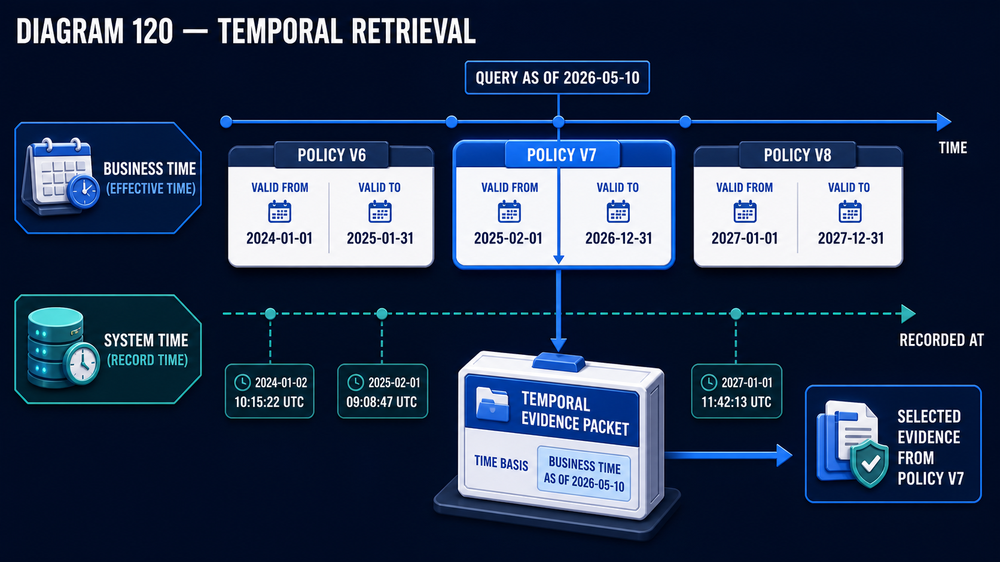

# Diagram 117 — Immutable Source Versions

**Module:** Freshness and change
**Role in the course:** a new version is a new object, not an update
**Layout:** two identical parallel lineages, one per source version, with an immutability lock

---

## At a glance

Two rows, structurally identical. **V7** ingests to a version record and fans out to its own parse, chunks and index. **V8** does the same, separately.

On the right, a coral tile with a padlock: **NEVER OVERWRITTEN**, connected to the V7 outputs.

The parallelism is the argument. V8 does not replace V7. It sits alongside it, with its own complete lineage, and V7 remains exactly as it was.

---

## What the diagram teaches

### 1. Four fields on the version record, and each answers a different question

**CONTENT HASH** — a fingerprint. Is this the same content as before? Two fetches of an unchanged document produce the same hash, and that is what makes change detection possible without re-parsing.

**FETCHED AT** — when we obtained it. A system-time fact about our own operation.

**VALID FROM** — when it became true in the world. A business-time fact about the content.

**PARSER VERSION** — which parser produced the downstream artefacts.

That fourth field is the one teams omit, and it is the one that makes a parser upgrade tractable. When the parser changes, chunks produced by the old parser are identifiable and can be regenerated selectively.

### 2. FETCHED AT and VALID FROM are different clocks, and the record carries both

A clock icon and a calendar icon, adjacent rows.

**Fetched at** is about your pipeline. **Valid from** is about the document.

A policy effective from 1 April may be fetched on 15 March or on 20 June. Those are different facts and both matter — the first for reconstructing what your system knew when, the second for answering questions about what was true when.

Carrying both is what makes the temporal retrieval in the next diagram possible.

### 3. Each version fans out to its own parse, chunks and index

Three teal dashed lines from each version record to **PARSE**, **CHUNKS**, and **INDEX**, each labelled with the version.

**PARSE V7. CHUNKS V7. INDEX V7.** And separately, **PARSE V8. CHUNKS V8. INDEX V8.**

Every derived artefact is version-stamped. That is what allows an answer given three months ago to be reconstructed: you know which chunks it used, which parse produced them, and which source version that parse read.

Without version-stamped derivatives, you know the source had a version and you cannot tell which chunks came from it.

### 4. NEVER OVERWRITTEN is a padlock, and it applies to the derivatives

The coral tile connects to the **V7 outputs**, not to the V7 source record.

That is precise. The claim is not merely that you keep old source documents — most organisations do. It is that the **parse, the chunks and the index** produced from them are also retained.

Overwriting derivatives is the common shortcut. The source is archived; the chunks are regenerated in place. That produces a system that can tell you what the old policy said and cannot tell you what its chunks looked like — and therefore cannot reconstruct what an answer rested on.

### 5. INGEST RUN 842 is named, and run identity is a third layer

Between the source and the version record: **INGEST RUN 842**.

Three identities, not two. The source has versions; each version was produced by a run; the run has an identity.

Run identity matters when a run goes wrong. A parser bug affecting one night's ingestion is bounded by run, not by source or version — and the affected artefacts are exactly those produced by run 842.

### 6. The two rows being identical means versions are peers

V7's row and V8's row have the same structure, the same fields, the same fan-out.

V8 is not "the current one" with V7 as an archive. Both are complete, both are queryable, and which one a query uses is determined by the query's time basis rather than by recency.

That is the design that makes as-of retrieval possible, and it is why the diagram draws them as parallel rather than as a chain.

### 7. The cost is storage, and it is worth naming

Retaining every version's parse, chunks and index multiplies storage by the number of versions.

For a corpus with frequent revisions this is significant. It is also, in most systems, small relative to the source documents themselves — chunks and indexes are typically a fraction of the original corpus size.

The honest framing: this is a real cost, it is usually smaller than expected, and the alternative is a system that cannot explain its own past answers.

Retaining versions is what makes them selectable rather than merely archived:

**VALID FROM** on this diagram's version record is what that diagram's upper timeline is built from, and **FETCHED AT** is what its lower timeline is built from. Two fields here become two clocks there.

---

## Case study — Ashwell Regulatory Consulting, the answer that could not be explained

Ashwell advises financial firms on regulatory compliance. Their knowledge system indexes regulator publications, consultation papers, final rules, and their own guidance notes.

Regulatory text changes constantly. A rule has a consultation version, a policy statement version, a final version, and amendments — often several a year.

### What they had

Source documents versioned and archived. Chunks and index regenerated in place on each ingestion.

That arrangement is common and it seemed sufficient: the old document was retained, so the old content was recoverable.

### The challenge

A client firm was subject to an enforcement action. Part of their defence was that they had relied on advice Ashwell had provided fourteen months earlier.

Ashwell's advice had been assembled with assistance from their knowledge system.

The regulator asked a specific question: **on what basis was that advice given?**

### What they could and could not produce

They could produce the advice note. They could produce the source documents as they had existed at that date, because sources were versioned.

They could not produce **what the system had retrieved**.

Their chunks had been regenerated eleven times since. Their index had been rebuilt. The evidence packet that had informed the advice referenced chunk identifiers that no longer existed.

They could say which documents had been available. They could not say which passages the system had surfaced, which is what the question was actually about.

### The consequence

Ashwell's defence of their own advice was substantially weakened. They could assert that the advice was consistent with the rules as they stood, and they could not demonstrate the reasoning trail.

The matter was resolved without a finding against Ashwell, and their professional indemnity insurer required a remediation plan.

### The rebuild

**Every derived artefact version-stamped and retained.**

Parse output, chunks, embeddings and index versions, all tagged with the source version and the ingest run that produced them.

**Storage impact measured before committing.** Their source corpus was about 900 GB. Chunks and indexes across all retained versions came to about 340 GB — 38% of the source, for eleven historical versions.

That figure was substantially lower than their estimate, and it ended the objection.

**PARSER VERSION recorded**, which they had not previously tracked.

Within three months this paid for itself. A parser upgrade improved table extraction, and they needed to identify which chunks had been produced by the old parser. With the field, it was a query. Without it, they would have re-ingested everything.

Selective regeneration affected about 12% of their corpus rather than 100%.

**Ingest run identity retained.**

This caught a real problem within the first year. A run had used a misconfigured OCR setting for one night, producing degraded chunks for about 4,000 documents.

The defect was discovered six weeks later. Identifying the affected artefacts was a single query on run identity. Without it, the alternative would have been re-ingesting a six-week window.

**Answer records reference chunk versions.**

Every answer their system produces records the specific chunk versions in its evidence packet. Reconstructing an answer from any point in the retained window is now a lookup.

### The test they ran

Six months after the rebuild, they deliberately reconstructed a set of answers from nine months earlier.

They could produce, for each: the question, the chunks retrieved with their version identifiers, the source versions those chunks came from, the parser that produced them, and the ingest run.

That reconstruction took under a minute per answer. Their compliance director described it as the difference between asserting that their advice was sound and demonstrating it.

### The finding about their own corpus

Retaining versions let them measure how often sources actually changed.

**They had assumed roughly quarterly revision for most regulatory sources.** The measurement showed a long tail: about 8% of their sources changed monthly or more frequently, and about 40% had not changed in over two years.

That distribution changed their refresh scheduling. They had been re-fetching everything weekly. They now re-fetch by observed change frequency, which cut their ingestion load by about 60% with no increase in staleness.

Nobody had known the distribution, because nothing had been retaining the versions needed to measure it.

### Results

- **Answer reconstruction:** impossible → under a minute, across the retained window.
- **Storage for all retained derivatives:** ~38% of source corpus size, for eleven versions.
- **Parser upgrade regeneration:** 100% of corpus → 12%, via parser version.
- **Bad-run remediation:** six-week re-ingestion → a single query on run identity.
- **Ingestion load:** down ~60%, by scheduling on measured change frequency.

### The line in their knowledge governance standard

*Keeping the old document is not keeping the old answer. If the chunks are gone, you cannot say what you retrieved — only what you could have.*

---

## Composition

Two structurally identical rows, upper and lower, with an immutability lock on the right.

**Upper row, left to right:** **SOURCE POLICY V7** — a white document with a blue shield — cyan arrow → **INGEST RUN 842** — a blue server with a play glyph — cyan arrow → a large white **SOURCE VERSION V7** card carrying a blue **V7** badge and four rows: **CONTENT HASH** (fingerprint), **FETCHED AT** (clock), **VALID FROM** (calendar), **PARSER VERSION** (`</>`).

From that card, **teal dashed lines** fan to three blue platforms: **PARSE V7** (`</>` tile), **CHUNKS V7** (cube cluster), **INDEX V7** (database with a magnifier).

**Lower row:** identical structure for **POLICY V8**, with a teal **V8** badge on its version card, fanning to **PARSE V8**, **CHUNKS V8**, **INDEX V8**.

**Right:** a **coral-bordered tile** with a **red padlock** reading **NEVER OVERWRITTEN**, connected by a coral line to the V7 outputs.

## Element by element

**SOURCE POLICY V7 / POLICY V8** — the source documents, versioned.

**INGEST RUN 842** — a named run. A third identity alongside source and version.

**SOURCE VERSION card** — four fields: content hash, fetched at, valid from, parser version.

**PARSE / CHUNKS / INDEX** — three derived artefacts, each version-stamped.

**NEVER OVERWRITTEN** — a coral tile with a red padlock, connected to the derivatives rather than to the source.

## Colour and flow semantics

- **Cyan arrows** carry each source through its ingest run to its version record.
- **Teal dashed lines** fan each version record out to its three derived artefacts.
- **Coral** marks the immutability constraint — the only coral in the frame.
- The **two rows are rendered identically**, marking versions as peers rather than as current-and-archive.
- The **padlock connects to the derivatives**, which is the diagram's precise claim.

## How to present it

**Ask what they keep when a source changes.** Most rooms archive the document. Then ask whether they keep the chunks.

**Point at where the padlock connects.** To the derivatives, not to the source. Keeping the old document is not keeping the old answer.

**Tell the Ashwell enforcement question.** *On what basis was that advice given?* They could produce the documents and not the passages, and the passages were what the question was about.

**Read the four version fields and ask which is unfamiliar.** **PARSER VERSION**, usually. Then give the payoff: a parser upgrade regenerating 12% of the corpus rather than 100%.

**Separate FETCHED AT from VALID FROM.** One is about your pipeline, one about the document. A policy effective 1 April fetched on 20 June. Both facts matter, for different questions.

**Point at INGEST RUN 842.** Three identities: source, version, run. Then give the bad-run case — a misconfigured OCR setting for one night, discovered six weeks later, resolved by a single query on run identity.

**Ask why the two rows are drawn as parallel rather than as a chain.** V8 is not the current one with V7 archived. Both are complete and queryable, and which a query uses depends on its time basis.

**Address the storage objection with the number.** Ashwell's derivatives across eleven versions came to 38% of their source corpus. Substantially lower than their estimate, and it ended the objection.

**Tell the change-frequency finding.** Retaining versions let them measure how often sources actually changed — 8% monthly, 40% unchanged in two years — and re-scheduling on that cut ingestion load 60%. A measurement only possible because versions were retained.

**Close on the standard.** *If the chunks are gone, you cannot say what you retrieved — only what you could have.*

**Timing.** Twenty-five minutes. Thirty-five if you ask the room to reconstruct an answer from six months ago, which most cannot.

---

## Lab and checkpoint

**Lab:** Design a version record for one source in your corpus. Include source, version, fetched at, valid from, parser version, and ingest run. Create the rule that derivatives are never overwritten and a new version creates new parse, chunks, and index. Then write the query that would reproduce an answer from six months ago.

**Checkpoint:** Why is keeping the source PDF not enough to reconstruct an old answer?

**Answer:** Because the answer depends on the parse, chunks, and index that were produced from that version. The parser version, chunking policy, and retrieval state are also part of the answer. Keeping only the source document does not tell you what the system actually retrieved and used.

## Glossary

- **Derivative** — the parse, chunks, and index produced from a source version.
- **Fetched at** — the time the source was retrieved.
- **Immutability** — the property that a version and its derivatives are never overwritten.
- **Ingest run** — the identity of the pipeline run that produced the version.
- **Parser version** — the version of the parser that created the chunks.
- **Source version** — an immutable snapshot of a source at a point in time.
- **Valid from** — the time from which the source is authoritative.
- **Version record** — the metadata that identifies and describes one source version.

## Sources

- Immutable source versioning
- Provenance and reproducibility in RAG
- Ingestion pipelines and versioned derivatives
