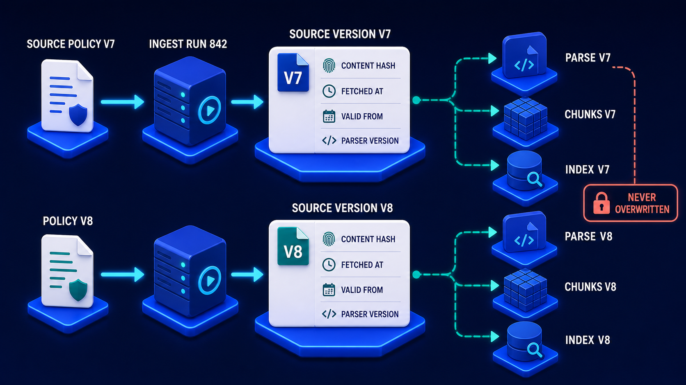

# Diagram 118 — Incremental Ingestion and Reconciliation

**Module:** Freshness and change
**Role in the course:** updating an index without rebuilding it
**Layout:** an upper change-driven path and a lower reconciliation path, both feeding one queue

---

## At a glance

Two independent paths into one queue.

**Above:** source changes — create, update, delete — captured, queued, and applied as four operations.

**Below:** a **RECONCILIATION SCAN** comparing a **SOURCE MANIFEST** against an **INDEX MANIFEST**, detecting mismatches, and feeding them into the same queue.

The lower path is the diagram's real content. Change capture handles the changes you were told about. Reconciliation handles the ones you were not.

---

## What the diagram teaches

### 1. Three change types, and DELETE is drawn in red

**CREATE** with a green plus. **UPDATE** with a pencil. **DELETE** in **red**, with a red cross.

Delete is coloured differently because it behaves differently.

Create and update add or replace content. Delete removes it — and removal is the operation that can leave inconsistency behind, because the thing to be removed exists in several places: the parse, the chunks, the embeddings, and the index.

A partially-applied delete leaves content retrievable that should not be.

### 2. The work queue is IDEMPOTENT and RETRY-SAFE, and both words are on the diagram

The queue tile carries **IDEMPOTENT WORK QUEUE** with a **RETRY-SAFE** label and circular arrows above and below.

Ingestion work fails. A parser crashes, an embedding service times out, a node is replaced mid-job.

If the work is idempotent, the recovery is to retry. If it is not, a retry after a partial application produces duplicate chunks, double-counted content, or an index in a state that matches no source version.

The circular arrows drawn on both sides of the queue emphasise that retry is the normal mechanism, not the exception path.

### 3. Four operations, and their separation is what makes incremental work incremental

**REPARSE CHANGED UNITS** — only the parts of the document that changed.
**RE-EMBED AFFECTED CHUNKS** — only chunks whose content changed.
**UPDATE INDEX** — only the affected entries.
**TOMBSTONE DELETE** — mark removal.

The word **CHANGED** in the first and **AFFECTED** in the second are the point. A document edit that touches one paragraph should not reparse forty pages or re-embed three hundred chunks.

That selectivity depends on the content hash from the previous diagram: comparing hashes per unit tells you which units changed.

### 4. TOMBSTONE DELETE is a marker, not an erasure

The fourth output, in red, leading to a bin.

A tombstone records that something was deleted, rather than simply removing it.

Three reasons.

**Distributed consistency.** A delete applied to an index and not yet propagated needs a marker, or a stale replica will resurrect the content.

**Reconciliation.** The lower path compares manifests. Content absent from the source and absent from the index is indistinguishable from content that was never ingested — unless a tombstone says it was deleted deliberately.

**Audit.** Knowing that a document was removed, and when, is frequently a requirement in its own right.

The bin at the end says the content does go; the tombstone says the record of its going remains.

### 5. The reconciliation path exists because change capture is not reliable

The lower row, entirely separate, running **RECONCILIATION SCAN → SOURCE MANIFEST → COMPARES → INDEX MANIFEST → DETECTED MISMATCH**.

Change capture depends on being told. Sources fail to notify, notifications are lost, a webhook endpoint is down, a polling job misses a window, a change happens through a path that does not emit events.

Reconciliation does not depend on being told. It lists what the source has, lists what the index has, and compares.

That independence is why it is drawn as a separate row rather than as a stage in the upper one.

### 6. COMPARES is drawn as a bidirectional arrow, and mismatches go both ways

The comparison glyph is a **double-headed arrow** between the two manifests.

Two failure directions.

**In the source, not in the index** — missing content. Something was created or updated and never ingested.

**In the index, not in the source** — orphaned content. Something was deleted at source and never removed from the index.

The second is the more dangerous and the less obvious. Missing content produces a gap someone eventually notices. Orphaned content produces confident answers from material that no longer exists.

The mismatch tile names both: **MISSING OR STALE ITEMS**.

### 7. Both paths feed the same queue

The coral arrow from **DETECTED MISMATCH** runs up into the **IDEMPOTENT WORK QUEUE**.

Reconciliation does not have its own repair mechanism. It detects, and it enqueues the same work the change path enqueues.

That convergence means there is one code path applying changes, one place where idempotency matters, and one thing to test.

The selectivity that makes incremental work incremental depends on a field established at ingestion:

**CONTENT HASH** there is what lets change capture reparse only changed units. Without per-unit hashing, "reparse changed units" degrades to reparsing the document, and incremental ingestion is incremental in name only.

---

## Case study — Bellingham Housing Association, the policies that were withdrawn and stayed

Bellingham manages about 22,000 homes. Their knowledge system supports housing officers, repairs staff and their contact centre, indexing tenancy policy, repairs procedures, allocation criteria and statutory guidance.

Their content lives in a document management system that emits change events.

### What they relied on

Event-driven ingestion only. A document changes, the DMS emits an event, the pipeline processes it.

No reconciliation. The reasoning had been that the DMS was authoritative and its events were reliable.

### The first failure

A repairs policy was withdrawn following a change in statutory guidance. It was deleted from the DMS.

The deletion event was emitted. Their event consumer was, at that moment, in a restart following a deployment. The event was consumed from the queue and lost before processing completed.

The document remained in the index for **seven months**.

During that period it was retrieved 340 times and formed part of answers given to housing officers about repairs responsibilities under a policy that no longer existed.

### How it surfaced

A housing officer challenged an answer, saying the policy had been withdrawn. They were correct.

Investigation found three more withdrawn documents still in the index, all lost during the same deployment window.

### The second failure, found by the same investigation

More systematic. Their DMS had a bulk-edit facility used by their policy team for formatting and metadata changes across multiple documents.

**Bulk edits did not emit per-document change events.** They emitted a single batch event that their consumer had never implemented handling for.

Over two years, roughly 1,400 documents had been modified through bulk edits and never re-ingested. Their index held content that was up to two years out of date for those documents.

Most bulk edits were cosmetic. About 90 were substantive — content changes made alongside formatting work.

### The rebuild

**Reconciliation added as an independent nightly scan.**

Their source manifest lists every document in the DMS with its identifier and content hash. Their index manifest lists every document represented in the index with the source version it came from.

The comparison runs nightly and takes about eleven minutes for 47,000 documents.

**The first run found 1,847 mismatches.**

1,400 stale from bulk edits. 340 items where an event had been lost. 89 orphaned — deleted at source, present in the index. 18 present in the source and never ingested at all, for reasons they never fully established.

**Tombstones implemented.**

Their original delete had removed index entries directly. That made reconciliation unable to distinguish a deliberate deletion from a never-ingested document — both are absent from the index.

With tombstones, the index manifest records deleted items with their deletion timestamp, and reconciliation can tell the two apart.

**The work queue made idempotent.**

Their existing queue had not been. A retry after a partial failure had, on at least two known occasions, produced duplicate chunks — the same passage indexed twice, appearing twice in evidence packets.

Making the work idempotent required keying each unit of work on the source version and unit identifier, so that applying it twice is a no-op.

**Content-hash-based selectivity.**

Their reprocessing had been per-document: any change reparsed and re-embedded the whole thing.

Per-unit hashing meant a formatting change to one section reparsed one section. Their reprocessing cost fell about 80%, which is what made nightly reconciliation-driven repair affordable.

### The ongoing numbers

After the initial 1,847, steady-state mismatches settled at **3 to 12 per night**.

Their distribution is instructive:

**Most are timing** — a document changed after the source manifest was generated and before the index caught up. These resolve on the next scan.

**A few per week are genuine losses** — events that did not arrive. Their event delivery is about 99.7% reliable, which sounds excellent and produces roughly 15 lost events a week at their volume.

**Occasional orphans** — deletions that did not propagate.

That 99.7% figure is the argument for reconciliation in one number. Event-driven ingestion at 99.7% reliability leaves 0.3% of changes unapplied, permanently, unless something independent checks.

### Results

- **Initial reconciliation mismatches:** 1,847.
- **Stale documents from unhandled bulk edits:** ~1,400, up to two years out of date.
- **Withdrawn policies still retrievable:** 4, one for seven months.
- **Steady-state mismatches:** 3–12 per night.
- **Lost events per week:** ~15, at 99.7% delivery reliability.
- **Reprocessing cost:** down ~80% via per-unit hashing.
- **Duplicate chunks from non-idempotent retries:** 2 known → structurally prevented.

### The line in their platform standard

*Event delivery is 99.7% reliable, which means it fails fifteen times a week. Reconciliation is not a backup for change capture — it is the thing that makes change capture safe to rely on.*

---

## Composition

Two horizontal rows, upper and lower, converging on a shared queue.

**Upper row, left:** **SOURCE CHANGES** — a bordered panel with three white cards: **CREATE** (green plus), **UPDATE** (pencil), **DELETE** (red cross, label in red).

Blue arrows → **CHANGE CAPTURE** — a white card showing a blue funnel with cubes.

Blue arrow → **IDEMPOTENT WORK QUEUE** — a white card with a blue server-rack glyph, with **RETRY-SAFE** labelled above and **circular blue arrows** above and below.

**Four blue arrows** fan right to white cards: **REPARSE CHANGED UNITS** (`</>` document) → a blue cube cluster; **RE-EMBED AFFECTED CHUNKS** (node cube) → a bracketed vector glyph; **UPDATE INDEX** (database with magnifier) → a coloured cube cluster; **TOMBSTONE DELETE** (red gravestone, label in red) → a red bin.

**Lower row, left:** **RECONCILIATION SCAN** — a bordered panel with a magnifier over a calendar.

Blue arrow → **SOURCE MANIFEST** — a clipboard with green ticks.

A **double-headed arrow** labelled **COMPARES** → **INDEX MANIFEST** — an identical clipboard.

Red arrow → **DETECTED MISMATCH (MISSING OR STALE ITEMS)** — a red-bordered tile with a warning triangle.

A **coral arrow** runs from the mismatch tile up into the **IDEMPOTENT WORK QUEUE**.

## Element by element

**CREATE / UPDATE / DELETE** — three change types, delete in red.

**CHANGE CAPTURE** — a funnel. What you were told about.

**IDEMPOTENT WORK QUEUE** — retry-safe, with circular arrows.

**REPARSE CHANGED UNITS / RE-EMBED AFFECTED CHUNKS** — selective, depending on per-unit hashing.
**UPDATE INDEX** — affected entries only.
**TOMBSTONE DELETE** — a marker, leading to a bin.

**RECONCILIATION SCAN** — an independent check.
**SOURCE MANIFEST / INDEX MANIFEST** — two lists, compared bidirectionally.
**DETECTED MISMATCH** — missing or stale, feeding back into the queue.

## Colour and flow semantics

- **Blue arrows** carry both the change path and the reconciliation path.
- **Red** marks delete, tombstone delete and the detected-mismatch tile.
- **Coral** carries the mismatch back into the shared queue.
- The **double-headed COMPARES arrow** marks the comparison as bidirectional — mismatches in both directions.
- **Circular arrows** on the queue mark retry as the normal mechanism.

## How to present it

**Ask how their index learns that a source changed.** If the answer is events only, ask what happens when an event is lost.

**Give them the Bellingham number.** 99.7% event delivery reliability sounds excellent and produces about fifteen lost events a week at their volume. Every one of those is a permanent inconsistency without an independent check.

**Tell the withdrawn policy.** A deletion event lost during a deployment restart, a policy that no longer existed retrievable for seven months, 340 retrievals, and answers given about repairs responsibilities under it.

**Tell the bulk-edit finding.** A DMS facility emitting a batch event their consumer never handled. 1,400 documents up to two years stale, of which about 90 were substantive changes.

**Point at the two rows and ask why reconciliation is separate.** Change capture depends on being told. Reconciliation does not.

**Point at the double-headed COMPARES arrow.** Mismatches go both ways. In the source not the index is a gap someone notices; in the index not the source is confident answers from content that no longer exists.

**Ask why a tombstone rather than a deletion.** Then give the reconciliation reason: without one, deliberately deleted and never-ingested are indistinguishable — both absent from the index.

**Ask what makes the queue idempotent.** Keying work on source version and unit identifier so a retry is a no-op. Then give Bellingham's duplicate chunks — the same passage indexed twice, appearing twice in evidence packets.

**Point at CHANGED and AFFECTED in the operation names.** Selectivity depends on per-unit content hashing. Bellingham's reprocessing cost fell 80%, which is what made nightly repair affordable.

**Note that both paths feed one queue.** One code path applying changes, one place idempotency matters, one thing to test.

**Close on the standard.** *Reconciliation is not a backup for change capture — it is the thing that makes change capture safe to rely on.*

**Timing.** Twenty-five minutes. Thirty-five if you run a manifest comparison against the room's own index, which almost always finds something.

---

## Lab and checkpoint

**Lab:** Design a change-capture and reconciliation flow for one source. Identify the three change types: new, changed, and tombstone delete. Build an idempotent, retry-safe work queue. Add a reconciliation path that compares source manifest to index and feeds mismatches into the same queue. Run the comparison and fix any gaps.

**Checkpoint:** Why must reconciliation be separate from change capture?

**Answer:** Because change capture depends on being told about changes and can miss events. Reconciliation does not depend on events; it independently checks the source against the index and finds gaps in either direction. It is what makes change capture safe to rely on.

## Glossary

- **Affected** — the operation that reindexes units impacted by a source change.
- **Change capture** — the event-driven process that learns a source changed.
- **Changed** — the operation that reindexes units whose content hash differs.
- **Delete** — the operation that marks a source or chunk as removed.
- **Idempotent** — the property that doing the same work twice produces the same result.
- **New** — the operation that indexes a source for the first time.
- **Reconciliation** — the independent comparison of source manifest to index.
- **Retry-safe** — the property that a failed change can be retried without harm.
- **Tombstone** — a marker that records a deletion rather than erasing the record.
- **Work queue** — the queue of change and reconciliation operations.

## Sources

- Incremental indexing and change capture
- Reconciliation and tombstone patterns
- Idempotent and retry-safe ingestion
