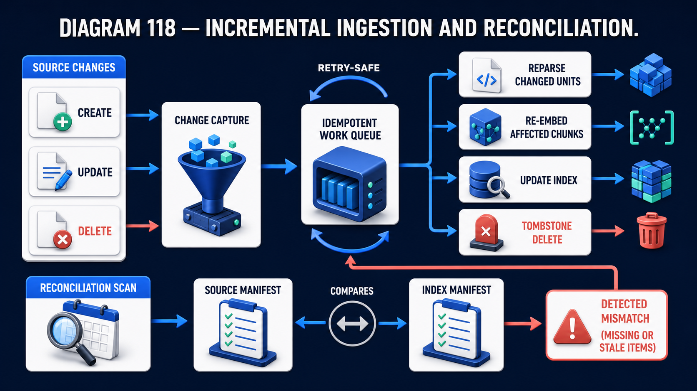

# Diagram 119 — Safe Index Promotion

![A LIVE ALIAS card on dark navy points at INDEX BLUE V7, labelled CURRENT LIVE INDEX (STABLE). A dashed blue line leads to a RELEASE GATE panel listing six green-ticked checks — INGEST CHECK, SECURITY CHECK, GOLDEN QUERIES, RECALL, CITATIONS, FRESHNESS — above a green ALL CHECKS PASSED bar. A teal ATOMIC PROMOTE arrow leads to INDEX GREEN V8, labelled BUILDING NEW INDEX (CANDIDATE). A coral path leads to a red FAILED CHECK tile and then KEEP V7 LIVE NO CHANGE. A CACHE KEYS card at lower left carries an INDEX VERSION tag.](../diagrams/119-safe-index-promotion.png)

**Module:** Freshness and change
**Role in the course:** replacing an index without breaking anything
**Layout:** a live alias over a stable index, a six-check gate, an atomic promotion, and a no-change failure path

---

## At a glance

**INDEX BLUE V7** is live. **INDEX GREEN V8** is being built. Between them, a **RELEASE GATE** with six checks, and an **ATOMIC PROMOTE** arrow.

If any check fails: **KEEP V7 LIVE, NO CHANGE.**

And at lower left, easy to overlook: **CACHE KEYS** carrying an **INDEX VERSION** tag.

Blue-green deployment applied to an index, with a gate whose failure mode is doing nothing.

---

## What the diagram teaches

### 1. The alias is what is live, not the index

A **LIVE ALIAS** card with a **LIVE** pin points at Index Blue.

Nothing queries the index by name. Everything queries the alias, and the alias points at whichever index is current.

That indirection is what makes promotion atomic. Switching an alias is a single operation. Repointing a fleet of clients is not.

It is also what makes rollback trivial: point the alias back.

### 2. Blue and green are peers, not old and new

**INDEX BLUE V7** — *current live index (stable)*.
**INDEX GREEN V8** — *building new index (candidate)*.

Two complete indexes, both existing simultaneously. The candidate is built alongside the live one rather than replacing it.

The cost is holding two indexes. The benefit is that promotion is a pointer change and failure costs nothing, because the stable one was never touched.

### 3. Six checks, and they cover four different concerns

**INGEST CHECK** — did the build complete? Right document count, no failed units.

**SECURITY CHECK** — are permissions correctly applied? Tenant separation, ACLs, retention exclusions.

**GOLDEN QUERIES** — does the known question set still get the right answers?

**RECALL** — is retrieval quality maintained on the measured set?

**CITATIONS** — do citations resolve to real, correct locations?

**FRESHNESS** — is the content as current as it should be?

Build integrity, security, correctness, quality, verifiability, currency. Six checks, and a build can pass any five and fail the sixth.

### 4. SECURITY CHECK is in the release gate, and its presence there is the strong claim

Second in the list.

An index rebuild is a moment where permissions can silently break. A chunking change alters chunk identifiers; a schema change may drop a tenant field; a parser upgrade may produce content in a partition it does not belong to.

Checking security at promotion time — not only at ingestion time — catches the case where a build succeeded and got the permissions wrong.

### 5. CITATIONS is a check, and it is the one most systems lack

Fifth in the list.

A citation points at a document, a page, a region. An index rebuild can break that pointer: chunk boundaries move, page mappings change, bounding boxes shift after a parser upgrade.

An index that retrieves correctly and cites incorrectly is worse than one that fails, because the answers look verifiable and are not.

The check verifies that a sample of citations resolves to a location containing the cited text.

### 6. ALL CHECKS PASSED is a single green bar, and it is an AND

Six ticks above one bar.

Not a score, not a threshold, not five-of-six. All of them.

That is appropriate for a gate whose failure mode is free. Since failing means keeping the current index and changing nothing, there is no cost to being strict.

### 7. KEEP V7 LIVE NO CHANGE is the failure mode, and it is the diagram's best feature

The coral path leads to **FAILED CHECK** and then to a tile reading **KEEP V7 LIVE, NO CHANGE**.

A failed promotion is a non-event. The live index is untouched, the alias is unmoved, and users see nothing.

That is what makes the gate affordable. A deployment whose failure mode is an outage must be attempted cautiously and rarely. One whose failure mode is nothing can be attempted daily.

### 8. CACHE KEYS carrying INDEX VERSION is the detail that prevents the subtle bug

A card at lower left with a key glyph and an **INDEX VERSION** tag.

Query results are cached. If the cache key does not include the index version, a promotion leaves cached results from the previous index being served against the new one.

The symptom is intermittent and confusing: some queries return old results, some new, depending on cache state. It looks like a retrieval bug and it is a cache-key bug.

Including the version in the key means promotion invalidates the cache implicitly — old-version entries are simply never looked up again.

Promotion is the batch counterpart to a continuous process running underneath it:

That diagram keeps a live index current between rebuilds; this one replaces it. The **FRESHNESS** check in the release gate is what verifies that the candidate index actually caught up with everything the change and reconciliation paths had applied.

---

## Case study — Wrenbury Building Control, the rebuild that broke citations

Wrenbury provides building regulations compliance software to about 400 local authorities and 2,000 private inspectors. Their knowledge system indexes building regulations, approved documents, local amendments and technical guidance.

Inspectors rely on it in the field, and a citation is what they show to a builder.

### The promotion process they had

Rebuild in place. The pipeline reindexed, and when it finished, the new content was live.

Rebuilds ran monthly. Each one was a source of anxiety and they were scheduled for Sunday nights.

### The incident

A parser upgrade improved table extraction, which mattered because approved documents are dense with tables.

The rebuild completed. Retrieval quality improved measurably — their golden query set scored better than it ever had.

**Citations broke.**

The parser upgrade changed how it computed bounding boxes, applying a different origin convention. Every citation's highlight region was offset — vertically by about 12mm, horizontally by 4mm.

The text quoted in answers was correct. The highlighted region on the original document pointed at the wrong paragraph.

### How long it took to surface

**Nine days.**

Inspectors were reading the quoted text, which was right. The highlight was a convenience most did not scrutinise.

It surfaced when an inspector showed a highlighted regulation to a builder who disputed it, and the builder pointed out that the highlighted paragraph said something different from what the inspector was quoting.

That is a professional credibility problem for an inspector standing on a building site.

### The wider audit

Reviewing rebuilds over the preceding two years found three more promotion-related failures that had reached production.

**A tenant field dropped in a schema change**, eleven months earlier, which had made a small number of local-authority amendments visible across authorities for two days before someone noticed.

**A freshness regression**, where a rebuild had used a stale source snapshot, serving regulations superseded three weeks earlier.

**A recall regression** after an embedding model change, which had degraded retrieval on a category of queries for six weeks before anyone characterised it.

None had been caught at promotion, because there was no promotion — the rebuild simply became live.

### The rebuild of the process

**Blue-green with an alias.**

Two indexes. The candidate builds alongside the live one. Clients query an alias.

Their storage roughly doubled during a build window and returns to normal after the previous index is retired. They retain the previous index for seven days after promotion, which costs a little more and makes rollback instant.

**Six release-gate checks, all mandatory.**

*Ingest check* — document count within tolerance, zero failed units.

*Security check* — a synthetic query set exercising tenant separation and ACL filtering. This would have caught the dropped tenant field.

*Golden queries* — 600 questions with known-correct answers.

*Recall* — measured against a fixed set, with a regression threshold.

*Citations* — this is the check the incident produced. A sample of 200 citations is resolved and the text at the cited location is compared against the quoted text. A mismatch fails the gate.

*Freshness* — the newest source version in the candidate index is compared against the newest available at source.

**Atomic promotion by alias switch.**

**Failed check means no change.** The candidate is retained for investigation; the live index is untouched.

**Cache keys include the index version.**

They discovered they needed this on their first blue-green promotion. The promotion succeeded, and for about forty minutes queries returned a mixture of old and new results depending on cache state.

That mixture was more confusing than either would have been alone, and it took longer to diagnose than the promotion had taken to perform.

### What changed operationally

**Rebuild frequency went from monthly to daily.**

That is the change their engineering lead considers most significant, and it follows directly from the failure mode. A rebuild that cannot break anything is a rebuild you can run every night.

Daily rebuilds meant their index is at most 24 hours behind source, against up to 30 days previously.

**Gate failures are routine and uneventful.**

The gate fails on roughly 4% of nightly builds. Most are freshness — a source feed that did not update — and the failure is a log line and an unchanged index.

Two gate failures in the first year were substantive: one recall regression from an embedding change, and one citation failure from a chunking adjustment. Both would previously have reached production.

### Results

- **Citation offset incident:** 9 days undetected → the check that would have caught it now runs nightly.
- **Rebuild frequency:** monthly → daily.
- **Index staleness:** up to 30 days → under 24 hours.
- **Promotion-related production failures:** 4 in two years → 0 in the following year.
- **Gate failure rate:** ~4% of nightly builds, all uneventful.
- **Cache-mixture incidents:** 1, on the first promotion, fixed by versioned cache keys.
- **Rollback time:** previously a full rebuild → an alias switch.

### The line in their release standard

*A rebuild that can break production is a rebuild you do monthly and dread. A rebuild that can only be refused is one you do nightly and forget about.*

---

## Composition

A left-to-right promotion flow with a vertical gate at centre and a coral no-change path beneath.

**Left:** **LIVE ALIAS** — a white card containing a blue **LIVE** pin on a glowing base — with a blue arrow to **INDEX BLUE V7**, a blue cube with a dotted top face and a **V7** badge, labelled beneath **CURRENT LIVE INDEX (STABLE)**.

**Centre:** a **dashed blue line** from the index to a tall white **RELEASE GATE** panel with a dark header. Six rows, each a **green tick** beside an icon and label: **INGEST CHECK** (database), **SECURITY CHECK** (shield), **GOLDEN QUERIES** (magnifier), **RECALL** (bar chart), **CITATIONS** (quotation marks), **FRESHNESS** (clock). Beneath, a **green bar** with a white check reading **ALL CHECKS PASSED**.

**Right:** a **teal arrow** labelled **ATOMIC PROMOTE** to **INDEX GREEN V8** — a green cube with a **V8** badge, labelled above **BUILDING NEW INDEX (CANDIDATE)**.

**Lower:** a **coral dashed line** from the index area to a **red FAILED CHECK tile** with a white ✗, then a coral arrow to a red-bordered tile reading **KEEP V7 LIVE NO CHANGE**. A **teal dashed line** runs down from the promote arrow to that tile.

**Lower left:** a white **CACHE KEYS** card containing a green key glyph and a dark **INDEX VERSION** tag.

## Element by element

**LIVE ALIAS** — a pin reading LIVE. What clients query.

**INDEX BLUE V7** — the stable index, untouched during promotion.
**INDEX GREEN V8** — the candidate, built alongside.

**RELEASE GATE** — six checks and an AND bar.

**ATOMIC PROMOTE** — a teal arrow. A pointer change.

**FAILED CHECK → KEEP V7 LIVE NO CHANGE** — the coral path, terminating in a non-event.

**CACHE KEYS / INDEX VERSION** — the detail preventing mixed-version results.

## Colour and flow semantics

- **Blue** marks the stable index and the live alias.
- **Green** marks the candidate index and the passed-checks bar.
- **Teal** marks the promotion arrow — the committed transition.
- **Coral and red** mark the failure path and its no-change terminal.
- **Green ticks** on all six checks with a single **ALL CHECKS PASSED** bar make the conjunction explicit.

## How to present it

**Ask how they replace an index.** If the answer is rebuilding in place, ask what happens if the rebuild is wrong.

**Point at the alias.** Nothing queries the index by name. That indirection is what makes promotion atomic and rollback trivial.

**Read the six checks and group them.** Build integrity, security, correctness, quality, verifiability, currency. Then ask which their process performs.

**Ask why SECURITY is checked at promotion.** A rebuild is a moment where permissions can silently break — a dropped tenant field, a chunking change altering identifiers. Then give Wrenbury's eleven-month-old incident: local-authority amendments visible across authorities for two days.

**Spend time on CITATIONS.** Then tell the parser upgrade: retrieval quality improved measurably, and every citation highlight was offset by 12mm. Nine days undetected, surfaced when an inspector showed a builder a highlighted paragraph that said something else.

**Make the point about that failure class.** An index that retrieves correctly and cites incorrectly is worse than one that fails, because the answers look verifiable.

**Point at the single ALL CHECKS PASSED bar.** An AND, not a score. Then explain why strictness is affordable: the failure mode is free.

**Read the failure tile aloud.** *Keep V7 live, no change.* A failed promotion is a non-event.

**Give them the frequency consequence.** Wrenbury went from monthly rebuilds they dreaded to nightly ones they forget about, and index staleness from 30 days to under 24 hours. That follows directly from the failure mode.

**Point at CACHE KEYS.** Easy to miss. Without the version in the key, a promotion serves a mixture of old and new results depending on cache state — a symptom that looks like a retrieval bug and is not.

**Close on the standard.** *A rebuild that can only be refused is one you do nightly and forget about.*

**Timing.** Twenty-five minutes. Thirty-five if you design the room's own release gate, which usually reveals they have two of the six checks.

---

## Lab and checkpoint

**Lab:** Design a safe promotion process for your index. Use an alias that points to the live version. Build a new version nightly and run the six checks: build integrity, security, correctness, quality, verifiability, and currency. Only if all pass, flip the alias. If any fail, keep the old version live and do nothing.

**Checkpoint:** Why must cache keys include the index version?

**Answer:** Because if cache keys do not include the version, a promotion can serve a mixture of old and new results depending on what is cached. This produces symptoms that look like a retrieval bug but are actually a cache-invalidation problem.

## Glossary

- **Alias** — the pointer that indicates which index version is live.
- **Build integrity** — the check that the index was built correctly.
- **Citation** — the check that the new index can still point to the right source locations.
- **Correctness** — the check that the index retrieves the right content.
- **Currency** — the check that the index is up to date.
- **Promotion** — switching the alias from the old index to the new one.
- **Quality** — the check that retrieval quality has not regressed.
- **Release gate** — the set of checks before promotion.
- **Rollback** — reverting the alias to the previous live version.
- **Security** — the check that permissions and tenant isolation still hold.
- **Verifiability** — the check that citations and provenance work.

## Sources

- Index promotion and alias management
- Rebuild verification and rollback
- Cache invalidation and versioned index keys
