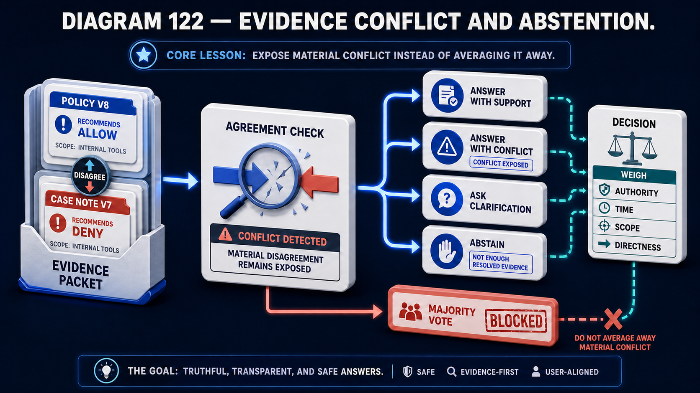

# Diagram 121 — Claim-to-Source Citation Lineage

**Module:** Answer integrity
**Role in the course:** every claim traced to a page
**Layout:** four claims through five lineage columns, with one unsupported claim removed

---

## At a glance

Three claims, each traced across five columns: **EVIDENCE SPANS → CHUNK → SOURCE VERSION → ORIGINAL PAGE → OWNER**.

A fourth claim, bordered in coral, labelled **UNSUPPORTED CLAIM**, takes a different route: **REMOVED BEFORE PUBLICATION**, and **DOES NOT REACH AN ORIGINAL PAGE**.

And a summary badge: **EVERY PUBLISHED CLAIM REACHES AN ORIGINAL PAGE.**

Five columns because a citation that stops short of any one of them is incomplete.

---

## What the diagram teaches

### 1. Five columns, and each removes a different kind of doubt

**EVIDENCE SPANS** — the specific text that supports the claim. Not the chunk; the passage within it.

**CHUNK** — identified by hash, e.g. `7F3A1C`. Which retrievable unit the span came from.

**SOURCE VERSION** — `DOC_v2.1` with `HASH: A1B2C3D4`. Which version of which document.

**ORIGINAL PAGE** — `PAGE 42`. Where in the original.

**OWNER** — `ACME RESEARCH`. Who is accountable for the content.

Stop at chunk and you cannot show a human the original. Stop at source version and you cannot point at a page. Stop at page and you cannot say who is answerable for it.

### 2. Claims 2 and 3 share a chunk, and the diagram shows it

Look at the chunk column. **CHUNK 9B2D4E** appears twice — once for claim 2 and once for claim 3.

Both trace to **DOC_v1.4**, and then diverge: claim 2 reaches **PAGE 17**, claim 3 reaches **PAGE 18**.

One chunk spanning two pages, supporting two claims from different parts of it.

That is realistic and it is why evidence spans are a separate column from chunks. A chunk is a retrieval unit; the span is what actually supports a specific claim, and two claims can come from one chunk at different locations.

### 3. The version hash appears alongside the version number

`DOC_v2.1` with `HASH: A1B2C3D4`. `DOC_v1.4` with `HASH: E5F6G7H8`. `DOC_v3.0` with `HASH: I9J0K1L2`.

Version number and content hash together.

The number is a human-readable label; the hash is the guarantee. Two documents labelled v1.4 could differ if the versioning was mishandled. Their hashes cannot.

Recording both means a citation can be verified even if version labelling turns out to be unreliable.

### 4. OWNER is the last column, and its presence is the governance loop closing

**ACME RESEARCH. GLOBAL STANDARDS ORG. NATIONAL ARCHIVES.**

Three different owning institutions across four claims.

This is the ownership field from the source register, at the far end of the pipeline. A claim traces back to the organisation accountable for the content it rests on.

Two uses. A reader assessing an answer can weigh the sources by who published them. And a wrong claim can be reported to the party who can correct it.

### 5. The unsupported claim is removed before publication, not flagged

The coral path: **UNSUPPORTED CLAIM → REMOVED BEFORE PUBLICATION → DOES NOT REACH AN ORIGINAL PAGE.**

Removed, not marked. The published answer contains three claims, not four with a caveat.

That is a stronger position than flagging, and it is the one the summary badge asserts: **every published claim reaches an original page.** A flagged unsupported claim would falsify that.

The reasoning: a caveated claim is still read. A reader skimming an answer takes the substance and not the qualification, and an unsupported claim with a warning still enters their understanding.

### 6. The VERIFIED CITATION panel names four checks

**PAGE 42. BBOX x1,y1,w,h. AS OF 2025-05-20. ACCESS CHECK OK.**

Four properties of a citation that has been verified rather than merely constructed.

**Page** — resolvable location.
**BBOX** — the exact region, so the citation can be shown rather than described.
**As of** — the temporal basis. A citation to a versioned document is a citation at a date.
**Access check** — the reader is permitted to see the cited source.

That fourth one is unusual and important. A citation pointing at content the reader cannot open is not a citation; it is a reference to something they must take on trust.

### 7. The three arrow types are named in the legend

**VERIFIED / SAFE FLOW (CITATION LINEAGE)** in teal.
**PROCESS FLOW** in blue.
**WARNING / BLOCKING FLOW (NOT PUBLISHED)** in coral dashed.

Naming them matters because the diagram uses two forward directions. Teal carries claims into their lineage; blue carries the lineage columns rightward. They are different relationships and the legend distinguishes them.

Removing an unsupported claim is one of two reasons a claim may not survive to publication:

This diagram removes claims with **no** support. That one handles claims with **contradictory** support — which must not be removed, because the disagreement is itself the finding.

---

## Case study — Pemberton Actuarial, the claim that cited a summary

Pemberton provides actuarial advice to pension schemes and insurers. Their reports carry regulatory weight, and their citations are examined.

Their assistant helps actuaries assemble evidence for reports — mortality assumptions, regulatory requirements, market data conventions and scheme-specific rules.

### What their citations looked like

Document title and a section reference. *"Continuous Mortality Investigation, Working Paper 154, Section 3."*

Adequate for a human reading a report and inadequate for verification, for a reason that took an external review to surface.

### The finding

A peer review of one of their reports questioned an assumption. The reviewer went to the cited working paper, section 3, and found that it said something related but different.

The cited section discussed the methodology. The specific figure Pemberton had used came from a **table in an appendix**, which the assistant had retrieved and cited by the section that referenced it rather than by its own location.

The figure was correct. The citation pointed somewhere it could not be found.

### The wider audit

They sampled 300 citations from reports issued over eighteen months and attempted to verify each by opening the cited location and finding the supporting text.

**64% resolved correctly.**

**21% pointed at a location in the right document that did not contain the cited content** — the appendix problem, or a section reference that had shifted between document versions.

**11% pointed at a document version that was no longer available**, because the publisher had superseded it and Pemberton had cited by title rather than by version.

**4% could not be resolved at all.**

For a firm whose reports carry regulatory weight, a 36% citation failure rate was a serious finding, and it had been invisible because nobody had systematically checked.

### The rebuild

**Five-column lineage on every claim.**

Every claim in an assistant-assembled evidence pack traces through evidence span, chunk, source version with hash, original page, and owner.

**Bounding boxes made citations showable.**

The largest practical change. A citation now resolves to a highlighted region on the original page. An actuary checking a figure sees it highlighted in the table it came from.

Their peer reviewers adopted this immediately. Review time on citation checking fell substantially, because verifying a citation became clicking rather than searching.

**Version hashes alongside version labels.**

They found this necessary within two months. A standards body had reissued a working paper under the same version number with a corrected table.

Their hash detected it. Two of their reports had cited the pre-correction content, and they were able to identify exactly which claims were affected and reissue.

Under title-and-section citation, they would not have known.

**AS OF on every citation.**

Their sources are versioned and their reports are dated. A citation to a mortality table is a citation to that table as it stood on a date.

**ACCESS CHECK added after a specific complaint.**

A client received a report citing a source available only under a subscription Pemberton held and the client did not.

The citation was accurate and unverifiable by the reader.

Their access check now flags citations to sources the recipient cannot access, and the report either uses an accessible alternative or states explicitly that the source is subscription-restricted.

**Unsupported claims removed, not flagged.**

Contested internally. Actuaries wanted to retain claims they believed were correct but could not source, with a note.

The argument that settled it came from their compliance function: a report where some claims are sourced and some are noted-as-unsourced invites a reader to treat the distinction as a matter of degree. Removing them means every claim in the report has the same status.

About 6% of assistant-drafted claims are removed at this stage. Actuaries can add them back manually, with their own attribution — which makes the claim the actuary's professional judgement rather than an unsourced system output.

That distinction is exactly what their professional standards require.

### Results

- **Citation resolution rate:** 64% → 99.2%.
- **Citations pointing at the wrong location in the right document:** 21% → under 0.5%.
- **Superseded-version citations:** 11% → 0, via version hashes.
- **Reports reissued after a same-number reissue was detected:** 2.
- **Peer review citation-checking time:** substantially reduced by showable citations.
- **Claims removed as unsupported:** ~6%, with a manual re-add path under the actuary's own attribution.

### The line in their reporting standard

*A citation the reader cannot open, cannot find, or cannot date is not a citation. It is a claim that something exists somewhere.*

---

## Composition

A five-column lineage table with an answer panel on the left and a verification panel on the right.

**Left:** a blue **ANSWER** panel containing four rows — **CLAIM 1**, **CLAIM 2**, **CLAIM 3** (each with a teal numbered badge), and a **coral-bordered UNSUPPORTED CLAIM** with a red ✗.

**Column headers**, left to right with blue arrows between: **EVIDENCE SPANS**, **CHUNK**, **SOURCE VERSION**, **ORIGINAL PAGE**, **OWNER**.

**Four rows** of white cards, connected by **blue arrows** across the columns:

Row 1: quotation-mark card → **CHUNK 7F3A1C** → **DOC_v2.1 / HASH: A1B2C3D4** → **PAGE 42** → **ACME RESEARCH**.
Row 2: quotation card → **CHUNK 9B2D4E** → **DOC_v1.4 / HASH: E5F6G7H8** → **PAGE 17** → **GLOBAL STANDARDS ORG**.
Row 3: quotation card → **CHUNK 9B2D4E** → **DOC_v1.4** → **PAGE 18** → **GLOBAL STANDARDS ORG**.
Row 4: quotation card → **CHUNK 3C8F90** → **DOC_v3.0 / HASH: I9J0K1L2** → **PAGE 73** → **NATIONAL ARCHIVES**.

**Teal arrows** carry each claim from the answer panel into its evidence span.

**Coral dashed path:** from the unsupported claim rightward to **REMOVED BEFORE PUBLICATION** — a red tile with a bin — then a coral dashed arrow to a red prohibition sign labelled **DOES NOT REACH AN ORIGINAL PAGE**.

**Right:** a teal-bordered **VERIFIED CITATION** panel with a teal shield, listing **PAGE 42**, **BBOX x1,y1,w,h**, **AS OF 2025-05-20**, **ACCESS CHECK OK**. Beneath, a teal-bordered badge reading **EVERY PUBLISHED CLAIM REACHES AN ORIGINAL PAGE**.

**Legend:** teal arrow — **VERIFIED / SAFE FLOW (CITATION LINEAGE)**; blue arrow — **PROCESS FLOW**; coral dashed arrow — **WARNING / BLOCKING FLOW (NOT PUBLISHED)**.

## Element by element

**ANSWER panel** — three numbered claims and one coral-bordered unsupported claim.

**EVIDENCE SPANS** — quotation cards. The specific supporting text.
**CHUNK** — hash-identified retrieval units. Two claims share `9B2D4E`.
**SOURCE VERSION** — version label plus content hash.
**ORIGINAL PAGE** — a resolvable location.
**OWNER** — the accountable institution.

**VERIFIED CITATION** — four checks: page, bbox, as-of, access.

## Colour and flow semantics

- **Teal arrows** carry claims into their lineage — the verified path.
- **Blue arrows** carry each row rightward through the five columns.
- **Coral dashed** carries the unsupported claim out of the answer entirely.
- The **legend names all three**, which is necessary because two forward directions are in use.
- **Two rows sharing CHUNK 9B2D4E** and diverging at page is the diagram's realistic detail.

## How to present it

**Read the five columns and ask where their citations stop.** Most stop at document or section. Then ask what each further column adds.

**Point at claims 2 and 3 sharing a chunk.** One retrieval unit, two claims, two pages. That is why evidence span is a separate column from chunk.

**Ask why the hash appears next to the version label.** The label is human-readable; the hash is the guarantee. Then tell the Pemberton reissue: a standards body reissuing a working paper under the same version number with a corrected table, detected by hash, two reports reissued.

**Tell the appendix citation failure.** A figure from an appendix table, cited by the section that referenced it. The figure was correct; the citation pointed somewhere it could not be found.

**Give them the audit numbers.** 64% resolved, 21% wrong location in the right document, 11% superseded version, 4% unresolvable. A 36% failure rate, invisible because nobody had checked.

**Read the four verified-citation properties.** Page, bbox, as-of, access check. Ask which is unfamiliar — usually the access check.

**Tell the subscription-source complaint.** A citation that was accurate and unverifiable by the reader. Ask what their equivalent is.

**Make the removed-not-flagged argument.** A caveated claim is still read. A reader takes the substance and not the qualification. Then give Pemberton's compliance argument: mixed sourced and noted-as-unsourced claims invite a reader to treat the distinction as a matter of degree.

**Point at the manual re-add path.** An actuary can restore a removed claim under their own attribution, which makes it professional judgement rather than unsourced system output. That distinction is what their standards require.

**Read the summary badge.** *Every published claim reaches an original page.* Then note that flagging would falsify it.

**Close on the standard.** *A citation the reader cannot open, cannot find, or cannot date is not a citation.*

**Timing.** Twenty-five minutes. Thirty-five if you attempt to verify a sample of the room's own citations, which is reliably sobering.

---

## Lab and checkpoint

**Lab:** Take one generated report from your system and list every claim. For each, find the citation: document, version, chunk, span, page, bounding box, as-of, and access check. Identify any claim that cites a summary, the wrong location, a superseded version, or no source at all. Remove unsupported claims before publication.

**Checkpoint:** Why is an unsupported claim removed before publication, not just flagged?

**Answer:** Because a caveated or flagged claim is still read, and readers tend to take the substance rather than the qualification. Removing it means the report only contains claims that can be traced to a source. A removed claim can be restored under professional judgement with explicit attribution.

## Glossary

- **Access check** — the test that a reader can open the cited source.
- **As-of** — the time the cited content was valid.
- **Bounding box (bbox)** — the location of the cited text on the page.
- **Chunk** — the indexed unit that contains the cited content.
- **Citation** — the trace from a claim back to its source.
- **Claim** — a statement in a generated report.
- **Lineage** — the full chain from claim to source, version, and owner.
- **Owner** — the accountable party for the cited source.
- **Span** — the exact text being cited.
- **Superseded version** — a version that has been replaced and is no longer current.
- **Unsupported claim** — a claim that cannot be traced to a source.
- **Verified citation** — a citation that passes page, bbox, as-of, and access checks.

## Sources

- Citation verification and claim lineage
- Source resolution and citation bounds
- Generated-report attribution and unsupported claims
