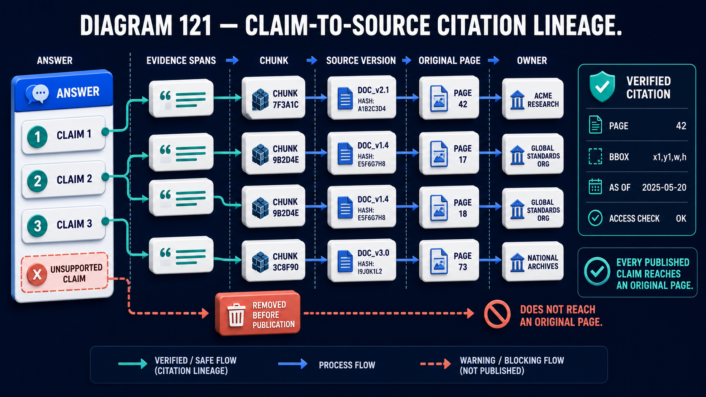

# Diagram 122 — Evidence Conflict and Abstention

![A banner on dark navy reads CORE LESSON: EXPOSE MATERIAL CONFLICT INSTEAD OF AVERAGING IT AWAY. An EVIDENCE PACKET holder shows POLICY V8 RECOMMENDS ALLOW above CASE NOTE V7 RECOMMENDS DENY, joined by a DISAGREE badge. An AGREEMENT CHECK card shows two arrows colliding under a magnifier with a CONFLICT DETECTED bar. Four outcome tiles read ANSWER WITH SUPPORT, ANSWER WITH CONFLICT, ASK CLARIFICATION and ABSTAIN, feeding a DECISION panel listing AUTHORITY, TIME, SCOPE and DIRECTNESS. A coral path leads to MAJORITY VOTE marked BLOCKED.](../diagrams/122-conflict-uncertainty-abstention.png)

**Module:** Answer integrity
**Role in the course:** what to do when the evidence disagrees
**Layout:** conflicting evidence into an agreement check, four outcomes weighed on four dimensions, with majority voting blocked

---

## At a glance

Two pieces of evidence that **disagree**: Policy V8 recommends allow; Case Note V7 recommends deny. Both scoped to internal tools.

An **AGREEMENT CHECK** detects it and states: **material disagreement remains exposed.**

Four outcomes, weighed on four dimensions. And one thing explicitly blocked: **MAJORITY VOTE.**

The lesson is written across the top: **expose material conflict instead of averaging it away.**

---

## What the diagram teaches

### 1. The conflicting evidence is scoped identically, which is what makes it a real conflict

Both cards carry **SCOPE: INTERNAL TOOLS**.

That detail matters enormously. Two pieces of evidence recommending opposite things about *different* scopes are not in conflict — they are about different situations.

Same scope, opposite recommendations, is a genuine disagreement that must be resolved or exposed.

Checking scope before declaring conflict is what prevents a system from reporting spurious conflicts constantly.

### 2. The version numbers differ, and that is the first resolution to try

**POLICY V8** and **CASE NOTE V7**.

Different versions, and one is newer.

That is not automatically decisive — a case note is a record of what was decided in a specific case, and a newer policy does not retroactively change what was decided. But version and date are the first thing to examine.

The **TIME** dimension in the decision panel is where this is weighed.

### 3. CONFLICT DETECTED says the disagreement REMAINS EXPOSED

The bar beneath the agreement check: **MATERIAL DISAGREEMENT REMAINS EXPOSED.**

Not resolved, not flagged for later — **remains exposed**. It stays visible through everything downstream.

The colliding-arrows glyph under the magnifier reinforces it: two forces meeting, neither absorbing the other.

### 4. Four outcomes, and the first two are both answers

**ANSWER WITH SUPPORT** — the evidence agrees; answer normally.

**ANSWER WITH CONFLICT** — badged **CONFLICT EXPOSED**. An answer is given, and the disagreement is presented alongside it.

**ASK CLARIFICATION** — the conflict may be resolvable with information from the user. Which scope, which date, which case.

**ABSTAIN** — badged **NOT ENOUGH RESOLVED EVIDENCE**. No answer.

The second is the interesting one. Conflict does not force abstention. A user can frequently act on *"the policy says allow, a case note from last year says deny, here is both"* — that is a more useful output than either an averaged answer or a refusal.

### 5. The four decision dimensions are how conflicts are weighed

**AUTHORITY** — which source carries more weight? From the source register.

**TIME** — which is more recent, and does recency matter for this kind of content?

**SCOPE** — is one more specific to the situation? A specific rule beats a general one.

**DIRECTNESS** — does one address the question directly while the other is inferential?

Four dimensions, and they can point in different directions. A newer, less authoritative, more general, more inferential source against an older, more authoritative, more specific, more direct one is a genuine judgement.

The scales glyph on the decision panel says weighed, not computed.

### 6. MAJORITY VOTE is blocked, and it is the diagram's sharpest prohibition

A coral path from the conflict detection to a red-bordered tile showing a group-of-people glyph, **MAJORITY VOTE**, stamped **BLOCKED**. Beneath, in coral: **DO NOT AVERAGE AWAY MATERIAL CONFLICT.**

Majority voting on evidence is the intuitive resolution and it is wrong for a specific reason: **evidence is not a sample.**

Five documents saying one thing and one saying another may mean the one is an exception that governs, a correction that supersedes, or the only source with authority. Counting treats them as votes when they are claims of differing weight.

It is also gameable by corpus composition. If a rule is restated in five places and its exception in one, majority voting will always defeat the exception.

### 7. The goal bar names three properties

**TRUTHFUL, TRANSPARENT, AND SAFE ANSWERS** — with three markers: **SAFE**, **EVIDENCE-FIRST**, **USER-ALIGNED**.

Three properties that a conflict-averaging system fails simultaneously. It is not truthful, because it presents a resolution that the evidence does not support. It is not transparent, because the disagreement is invisible. And it is not user-aligned, because the user is denied information they would have acted on.

An exposed conflict still has to be traceable, and both sides of it must reach a page:

**ANSWER WITH CONFLICT** produces two sets of citations rather than one, and the **OWNER** column is frequently what resolves the disagreement — two positions from the same authority mean something different from two positions from different ones.

---

## Case study — Thurloe Compliance, the exception that was outvoted

Thurloe provides financial crime compliance support to about 90 regulated firms. Their assistant answers questions about customer due diligence, sanctions screening, reporting obligations and internal escalation.

Their corpus contains regulation, regulator guidance, industry good-practice notes, their own policy templates, and firm-specific procedures.

### The corpus property that caused the problem

Compliance content is repetitive by design. A single obligation — say, enhanced due diligence for politically exposed persons — is stated in the regulation, restated in regulator guidance, restated in industry notes, restated in Thurloe's template, and restated in each firm's own procedure.

One obligation, five to eight statements.

Exceptions and carve-outs are stated once.

### What their first system did

Retrieved the top candidates and synthesised. Where sources differed, it produced a synthesis that reflected the weight of the retrieved set.

That is majority voting by another name.

### The incident

A firm asked whether enhanced due diligence was required for a particular customer category.

The general rule says yes. Six retrieved passages said yes.

A regulator guidance note issued four months earlier had introduced a **carve-out** for that specific category under defined conditions. One passage said the carve-out applied.

The assistant answered yes, enhanced due diligence required — synthesising six agreeing sources against one dissenting.

The firm applied enhanced due diligence to a customer category where it was not required. That is not a compliance breach, but it is a cost: enhanced due diligence is expensive and slow, and the firm applied it to around 400 customers over five months.

The firm's own compliance officer eventually queried it against the guidance note directly.

### The wider audit

Thurloe examined how their assistant handled conflicts across 400 sampled questions where their corpus contained a genuine conflict.

**In 78%, the conflict was invisible in the answer.** The assistant had synthesised toward the more numerous position.

**In 19%, the answer reflected the minority position** — usually where the minority source ranked very highly.

**In 3%, the conflict was mentioned.** Almost always by accident, where two passages were quoted adjacently.

The 78% figure was the finding. Their assistant was systematically defeating exceptions, because exceptions are by nature stated once.

### The rebuild

**Scope checked before conflict is declared.**

Their first implementation flagged conflicts constantly, because a rule for one customer type and a different rule for another are not in conflict.

Scope comparison — customer category, jurisdiction, firm type, date range — reduced flagged conflicts by about 70%, leaving genuine ones.

**AGREEMENT CHECK as an explicit stage.**

Passages making claims about the same scoped question are compared. Disagreement is detected and carried forward rather than resolved during synthesis.

**Four outcomes, with ANSWER WITH CONFLICT as the most-used non-trivial one.**

Their distribution after twelve months:

*Answer with support* — 81%. No conflict.
*Answer with conflict* — 12%. The output that changed most.
*Ask clarification* — 4%. Usually scope ambiguity.
*Abstain* — 3%.

The 12% is the category that had previously been synthesised away.

**The conflict output format.**

> **Enhanced due diligence — customer category C**
> **General position:** required. Sources: regulation reg. 33, FCA guidance 4.2, industry note 2024-11, Thurloe template §7, firm procedure §12.4.
> **Carve-out:** not required where conditions A and B are met. Source: FCA guidance note 2026-03 (issued four months after the sources above).
> **Weighing:** the carve-out is more recent, more specific to this category, and from the same authority as the general position. It appears to govern.
> **This is a judgement. Confirm with your MLRO.**

Five sources on one side and one on the other, and the one is presented as probably governing — with the reasoning stated.

**MAJORITY VOTE explicitly prohibited in their synthesis logic**, and tested.

Their evaluation set includes conflict cases with deliberately lopsided source counts. An answer that follows the majority against a more authoritative, more recent, more specific minority fails the test.

### The corpus finding

Once conflicts were exposed and counted, Thurloe could see where they clustered.

**About 40% of detected conflicts arose from their own templates being out of date** relative to regulator guidance.

Their content team had been updating templates on a quarterly cycle. Regulator guidance moves faster.

They moved template updates to trigger on guidance changes rather than on a calendar, and conflicts arising from their own content fell from 40% of the total to about 9%.

The assistant had become an instrument for detecting their own staleness.

### Results

- **Conflicts invisible in answers:** 78% → 0.
- **Answers exposing conflict:** 3% (accidental) → 12% (deliberate).
- **Spurious conflicts from scope confusion:** reduced ~70% by scope checking.
- **Conflicts from Thurloe's own stale templates:** 40% of total → ~9%.
- **The carve-out incident:** 400 customers unnecessarily subject to enhanced due diligence → the equivalent case now produces the conflict output.

### The line in their content standard

*Exceptions are stated once. Rules are stated six times. A system that counts sources will defeat every exception in the corpus.*

---

## Composition

A banner across the top, an evidence packet on the left, a check at centre, four outcomes and a decision panel on the right, with a blocked path beneath.

**Top:** a bordered banner with a star glyph reading **CORE LESSON: EXPOSE MATERIAL CONFLICT INSTEAD OF AVERAGING IT AWAY.**

**Left:** an **EVIDENCE PACKET** holder containing two cards — a blue **POLICY V8** card reading **RECOMMENDS ALLOW / SCOPE: INTERNAL TOOLS**, and a red **CASE NOTE V7** card reading **RECOMMENDS DENY / SCOPE: INTERNAL TOOLS** — joined by a dark **DISAGREE** badge with opposing arrows.

**Centre:** a blue arrow to **AGREEMENT CHECK** — a white card showing a blue and a red arrow colliding beneath a magnifier, above a dark bar reading **CONFLICT DETECTED** with a coral warning triangle, and beneath it **MATERIAL DISAGREEMENT REMAINS EXPOSED**.

**Right:** four blue arrows fan to four white tiles — **ANSWER WITH SUPPORT** (document with a check), **ANSWER WITH CONFLICT** (warning triangle, with a **CONFLICT EXPOSED** badge), **ASK CLARIFICATION** (question bubble), **ABSTAIN** (raised hand, with a **NOT ENOUGH RESOLVED EVIDENCE** badge).

**Far right:** teal dashed arrows from all four into a **DECISION** panel with scales, listing **WEIGH** above four rows: **AUTHORITY** (shield), **TIME** (clock), **SCOPE** (target), **DIRECTNESS** (arrow).

**Beneath:** a **coral arrow** from the agreement check to a red-bordered tile showing a group glyph, **MAJORITY VOTE**, stamped **BLOCKED**, with a coral dashed line to a red ✗ and the coral text **DO NOT AVERAGE AWAY MATERIAL CONFLICT**.

**Bottom:** a bordered bar reading **THE GOAL: TRUTHFUL, TRANSPARENT, AND SAFE ANSWERS**, with markers **SAFE**, **EVIDENCE-FIRST**, **USER-ALIGNED**.

## Element by element

**POLICY V8 / CASE NOTE V7** — two cards, opposite recommendations, identical scope.

**DISAGREE** — a badge with opposing arrows.

**AGREEMENT CHECK** — colliding arrows under a magnifier, with conflict detected and remaining exposed.

**Four outcomes** — support, conflict, clarification, abstention.

**DECISION panel** — scales, weighing authority, time, scope, directness.

**MAJORITY VOTE / BLOCKED** — the prohibited resolution.

## Colour and flow semantics

- **Blue arrows** carry evidence into the check and the check into four outcomes.
- **Teal dashed arrows** carry the outcomes into the decision panel — weighing rather than routing.
- **Coral** marks the blocked majority-vote path and its prohibition text.
- The two evidence cards are **blue and red**, marking the opposing positions.
- The **scales glyph** on the decision panel asserts weighing rather than computation.

## How to present it

**Read the banner first.** *Expose material conflict instead of averaging it away.* Then ask what their system does when sources disagree.

**Point at the identical scopes on both cards.** Same scope, opposite recommendations. Then note that different scopes are not a conflict, and that checking scope first is what prevents constant spurious flagging — Thurloe's cut flagged conflicts by 70%.

**Ask what majority voting does to an exception.** Then give the corpus property: rules are restated many times, exceptions are stated once. Counting sources defeats every exception.

**Tell the Thurloe carve-out.** Six passages saying enhanced due diligence is required, one guidance note four months newer introducing a carve-out, and 400 customers unnecessarily put through an expensive process for five months.

**Give them the audit number.** 78% of genuine conflicts invisible in the answer. Their assistant was systematically defeating exceptions.

**Read the four outcomes and stress that two are answers.** Conflict does not force abstention. A user can act on *"here is both positions and which appears to govern."*

**Read the Thurloe conflict output aloud.** Five sources on one side, one on the other, the one presented as probably governing, with reasoning, and a confirm-with-your-MLRO line. Ask whether that is more or less useful than a synthesised answer.

**Walk the four weighing dimensions.** Authority, time, scope, directness. Then note they can point in different directions, which is why the panel shows scales rather than a formula.

**Point at the BLOCKED stamp.** Not discouraged — blocked, and tested. Thurloe's evaluation set includes deliberately lopsided conflict cases.

**Tell the staleness finding.** 40% of detected conflicts came from Thurloe's own templates lagging regulator guidance. Exposing conflicts turned the assistant into an instrument for detecting their own content decay.

**Close on the standard.** *Exceptions are stated once. Rules are stated six times.*

**Timing.** Twenty-five minutes. Thirty-five if you look for conflicts in the room's own corpus, which usually finds that their own content is one side of them.

---

## Lab and checkpoint

**Lab:** Search your corpus for one rule that is stated many times and one exception that is stated once. Run a query that should trigger the exception and check whether your system returns the exception or synthesises it away. Then define the four outcomes and the four weighing dimensions for handling conflicts.

**Checkpoint:** Why is majority voting blocked?

**Answer:** Because rules are usually stated many times and exceptions are stated once. Counting sources would make every exception lose. Conflicts must be weighed by authority, time, scope, and directness, not by vote count.

## Glossary

- **Abstain** — the outcome where the system refuses to answer because the conflict cannot be resolved.
- **Authority** — the source with the greatest standing in the domain.
- **Conflict detected** — the state where sources with the same scope disagree and the disagreement is exposed.
- **Directness** — how directly the source addresses the question.
- **Majority vote** — a forbidden method of resolving conflicts by counting sources.
- **Material conflict** — a disagreement that affects the answer.
- **Rule** — the usual guidance, typically stated many times.
- **Scope** — the situation the source applies to.
- **Exception** — the special case, typically stated once.
- **Time** — the recency of the source.
- **Weighing dimensions** — the four factors used to decide which side governs.

## Sources

- Conflict detection and resolution in RAG
- Exception handling and source weighting
- Abstention and conflict exposure
