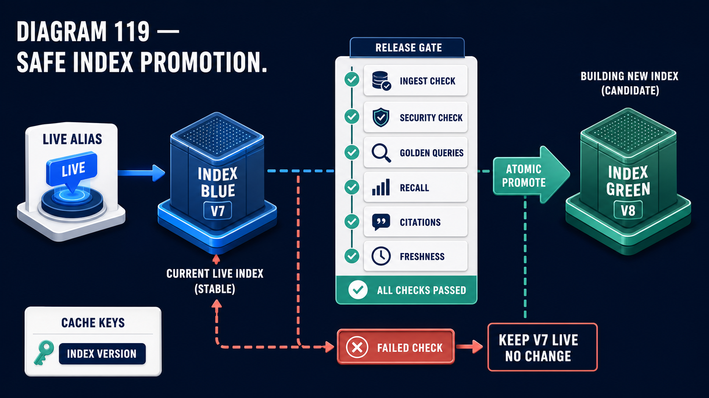

# Diagram 123 — Layered RAG Evaluation

![A GOLDEN QUERY SET panel on dark navy lists six categories — IDENTIFIER, POLICY, MULTIHOP, TEMPORAL, MULTIMODAL, PERMISSION. Blue arrows feed a RETRIEVAL DASHBOARD showing RECALL AT K, NDCG, MRR, PRECISION, LATENCY and a green-ticked ZERO LEAKAGE, and a GENERATION DASHBOARD showing FAITHFULNESS, CLAIM SUPPORT, CITATION and ABSTENTION bars. Both feed a DRIFT COMPARISON table with BASELINE and CANDIDATE columns and arrows showing direction of change. A teal dashed path leads to a green PASS shield; a coral dashed path from any red leads to a red HOLD octagon.](../diagrams/123-rag-evaluation-dashboard.png)

**Module:** Answer integrity
**Role in the course:** measuring a knowledge system in layers
**Layout:** a categorised query set feeding two dashboards, compared against a baseline, producing a release decision

---

## At a glance

A **GOLDEN QUERY SET** with six named categories feeds two separate dashboards — **RETRIEVAL** and **GENERATION** — whose metrics are compared **BASELINE against CANDIDATE**, producing **PASS** or **HOLD**.

The rule on the failure path is explicit: **ANY RED (REGRESSION OR LEAKAGE) → HOLD.**

Two dashboards because retrieval and generation fail differently. Six query categories because a single undifferentiated set hides category-specific regressions.

---

## What the diagram teaches

### 1. Six query categories, and each exercises a different capability

**IDENTIFIER** — exact-match queries. Part numbers, references, codes. Exercises lexical retrieval.

**POLICY** — rule and guidance questions. Exercises semantic retrieval and authority weighting.

**MULTIHOP** — questions needing several retrievals in sequence.

**TEMPORAL** — as-of questions. Exercises version selection.

**MULTIMODAL** — questions whose answers live in tables, images or scanned content.

**PERMISSION** — queries testing that a caller cannot see what they should not.

A single undifferentiated set averages these. A change that improves semantic retrieval and breaks identifier matching shows as a small net improvement, and the identifier regression is invisible until users find it.

### 2. PERMISSION as a query category is the unusual one

The sixth, with a red padlock.

Most evaluation sets measure quality. This one includes queries whose correct answer is *nothing* — a caller attempting to reach content outside their scope.

That makes access control a measured property rather than an assumed one, and it is what feeds the **ZERO LEAKAGE** check on the retrieval dashboard.

### 3. Two dashboards, and their metrics do not overlap

**RETRIEVAL:** recall at K, NDCG, MRR, precision, latency, zero leakage.

**GENERATION:** faithfulness, claim support, citation, abstention.

Six and four, with nothing in common.

Retrieval metrics ask whether the right evidence was found and ranked. Generation metrics ask whether the answer used it honestly.

They fail independently. Perfect retrieval feeding an unfaithful generator produces a wrong answer with the right evidence available. Perfect generation over poor retrieval produces an honest answer to a question it lacked the material for.

### 4. ZERO LEAKAGE is a binary check among continuous metrics

Five metrics with sparkline trends, and one with a **green tick**.

The others are measurements on a scale. Leakage is not. Any leakage is a failure, and the check is pass or fail.

Placing a binary among continuous metrics is deliberate — it says this one is not traded off against the others. A candidate with better recall and non-zero leakage does not pass.

### 5. ABSTENTION is a generation metric, and measuring it is unusual

Fourth on the generation dashboard.

Abstention rate is measured because it can be wrong in both directions.

**Too low** — the system answers questions it should decline, which is the failure the conflict and citation diagrams are about.

**Too high** — the system declines questions it could answer, which makes it useless.

A metric that can be wrong in two directions cannot be optimised; it has to be held in a band. That is why it is measured rather than maximised.

### 6. The drift comparison shows direction, not just value

The table has **BASELINE** and **CANDIDATE** columns with **arrows between them** — up, right, down.

Up is improvement. Right is no material change. Down is regression.

Two rows in the diagram show red: a latency row with a down arrow and a red sparkline, and a row with a **red warning triangle** in the candidate column against a green tick in the baseline.

That second row is a leakage regression — the baseline had zero leakage and the candidate does not.

### 7. ANY RED means HOLD, and the asymmetry is deliberate

Two paths from the drift comparison.

**ALL GREEN OR NEUTRAL → PASS**, a green shield.

**ANY RED (REGRESSION OR LEAKAGE) → HOLD**, a red octagon with a raised hand.

Not a score, not a weighted average. Any single regression holds the release.

That is strict, and it is affordable for the same reason the release gate in the promotion diagram is strict: holding costs nothing. The current system stays live.

The parenthetical — **regression or leakage** — names the two distinct failure types the rule covers.

This decision is one of the checks a candidate index must pass before it goes anywhere:

**GOLDEN QUERIES** and **RECALL** in that gate are this dashboard, running as a release check. **HOLD** here and **KEEP V7 LIVE, NO CHANGE** there are the same outcome described from either side — and both are affordable for the same reason: refusing costs nothing.

---

## Case study — Halloway Clinical Systems, the upgrade that improved everything and broke one thing

Halloway provides clinical knowledge systems to hospital trusts. Their assistant serves doctors, nurses and pharmacists across guidance, formularies, local protocols and structured medicines data.

### What they measured before

One number: answer accuracy on a 200-question set, assessed by clinicians.

It sat between 84% and 89%. It moved slowly. It told them almost nothing about what to fix.

### The upgrade

An embedding model change, expected to improve semantic retrieval.

Their single metric went from 86% to 89%. They shipped it.

### What broke

**Drug identifier queries.**

Clinicians search by drug name, by BNF code, and frequently by a specific formulation identifier. Those identifiers are alphanumeric and carry no semantic content.

The new embedding model was better at concepts and worse at these strings. Identifier query accuracy fell from 94% to 61%.

Their 200-question set contained eleven identifier queries. Eleven of two hundred, in an aggregate that improved by three points.

### How it surfaced

Pharmacists complained within a week that searching by formulation code had "stopped working."

It had not stopped working. It had degraded from reliable to unreliable, which is harder to report and easier to dismiss.

Six weeks elapsed between the deployment and anyone characterising the problem, because each individual complaint looked like a one-off.

### The rebuild of their evaluation

**Six categories, sized by importance rather than by convenience.**

*Identifier* — 180 queries. Drug names, BNF codes, formulation identifiers, ICD codes.
*Policy* — 220. Guidance and protocol questions.
*Multihop* — 90. Questions requiring several retrievals.
*Temporal* — 60. Questions about superseded guidance, which matters because clinical guidance is versioned and a superseded protocol is dangerous.
*Multimodal* — 110. Dose tables, interaction matrices, scanned local protocols.
*Permission* — 140. Queries testing that a caller cannot reach another trust's local protocols or restricted content.

840 queries, against 200.

**Two dashboards.**

Their previous single number had conflated retrieval and generation. Separating them immediately localised two long-standing problems: a faithfulness issue they had attributed to retrieval, and a recall issue they had attributed to generation.

**ZERO LEAKAGE as a binary.**

Their permission category produces a leakage count. It must be zero.

This caught something on its first run: **a local protocol from one trust was reachable by another** through a lexical query on an unusual term. It had been possible for an unknown period.

**Abstention held in a band.**

They set 4% to 9%. Below 4% suggests the system is answering things it should decline; above 9% suggests it is declining things it could answer.

Their first candidate after the rebuild came in at 2.1%, which failed. Investigation found the abstention threshold had been loosened during an unrelated change.

**ANY RED holds.**

The rule was contentious. Their product function argued for a weighted score, on the grounds that a small regression in one category against large improvements elsewhere should ship.

Their clinical safety officer's counter settled it: **a regression in a clinical knowledge system is a category of question that has become less reliable, and no improvement elsewhere makes that acceptable.**

### The re-test of the embedding upgrade

They re-ran the upgrade that had shipped, against the new evaluation.

**Policy:** up 4 points.
**Multihop:** up 6 points.
**Temporal:** neutral.
**Multimodal:** up 2 points.
**Permission:** zero leakage, unchanged.
**Identifier:** **down 33 points.**

Under the new rule it would have been held on day one.

Their eventual resolution was a hybrid: the new model for semantic retrieval and a lexical channel weighted heavily for identifier-shaped queries. Identifier accuracy recovered to 96%, above where it had started.

### The finding about their category sizing

Sizing categories by importance rather than by convenience changed what they could detect.

Identifier queries are about 31% of real traffic and had been 5.5% of their evaluation set. Permission queries are a tiny fraction of traffic and are 17% of the set, because their consequence is disproportionate.

**Evaluation weight follows consequence, not frequency.** That is the principle they wrote down.

### Results

- **Evaluation set:** 200 undifferentiated → 840 across six categories.
- **The identifier regression:** invisible in a 3-point aggregate improvement → a 33-point category failure.
- **Time to detect a category regression:** six weeks → the next evaluation run.
- **Cross-trust leakage:** 1 instance found on the first permission run, previously undetected.
- **Abstention:** now held in a 4–9% band, with a failure on the first candidate.
- **Identifier accuracy after the hybrid fix:** 94% → 96%.

### The line in their evaluation standard

*Eleven identifier queries in two hundred meant a thirty-three point failure looked like a three point win. Size your categories by what a regression would cost, not by how many you happen to have.*

---

## Composition

A query set on the left, two dashboards at centre, a drift table, and a two-way release decision on the right.

**Left:** a bordered **GOLDEN QUERY SET** panel listing six rows with icons — **IDENTIFIER** (ID card), **POLICY** (teal shield), **MULTIHOP** (node network), **TEMPORAL** (teal clock), **MULTIMODAL** (purple image tiles), **PERMISSION** (red padlock).

**Centre, upper:** blue arrow to **RETRIEVAL DASHBOARD** — a white panel with a database-and-magnifier glyph, listing **RECALL AT K** (bar sparkline), **NDCG** (line), **MRR** (line), **PRECISION** (bars), **LATENCY** (line), **ZERO LEAKAGE** (green tick).

**Centre, lower:** blue arrow to **GENERATION DASHBOARD** — a white panel with an AI-cube glyph, listing **FAITHFULNESS**, **CLAIM SUPPORT**, **CITATION**, **ABSTENTION**, each with segmented green bars.

**Right of centre:** blue arrows into **DRIFT COMPARISON** — a white panel with **BASELINE** and **CANDIDATE** columns, ten rows of sparklines with **up, right and down arrows** between them. Two rows show red.

**Far right:** a **teal dashed arrow** labelled **ALL GREEN OR NEUTRAL** to a green shield reading **PASS**; a **coral dashed arrow** labelled **ANY RED (REGRESSION OR LEAKAGE)** to a red octagon with a raised hand reading **HOLD**.

**Legend:** blue — **EVALUATION FLOW**; teal dashed — **SAFE / VERIFIED FLOW**; coral dashed — **WARNING / BLOCKING FLOW**.

## Element by element

**The six query categories** — identifier, policy, multihop, temporal, multimodal, permission.

**RETRIEVAL DASHBOARD** — five continuous metrics and one binary.
**GENERATION DASHBOARD** — four metrics including abstention.

**DRIFT COMPARISON** — baseline against candidate, with direction arrows.

**PASS** — a green shield. **HOLD** — a red octagon.

## Colour and flow semantics

- **Blue arrows** carry the evaluation flow from query set through dashboards to comparison.
- **Teal dashed** carries the pass path; **coral dashed** carries the hold path.
- **Green ticks and bars** mark passing measurements; **red sparklines and triangles** mark regressions.
- **ZERO LEAKAGE is a tick among sparklines**, marking it as binary rather than continuous.
- **Direction arrows** in the drift table carry the comparison, not the values.

## How to present it

**Ask what their evaluation set looks like.** If it is one undifferentiated set, ask what a category-specific regression would look like in the aggregate.

**Tell the Halloway upgrade.** Aggregate up three points, shipped, and identifier query accuracy down 33 points — because eleven of two hundred queries were identifier queries.

**Give them the detection lag.** Six weeks, because each complaint looked like a one-off. Degraded from reliable to unreliable is harder to report than broken.

**Read the six categories and ask which they lack.** **PERMISSION** and **TEMPORAL** are the two most often missing.

**Explain permission as a category.** Queries whose correct answer is nothing. It makes access control measured rather than assumed. Then give Halloway's first-run finding: a local protocol reachable across trusts through a lexical query on an unusual term.

**Ask why two dashboards.** Retrieval and generation fail independently, and separating them localises problems. Halloway had been attributing a faithfulness issue to retrieval and a recall issue to generation.

**Point at ZERO LEAKAGE among the sparklines.** A binary among continuous metrics. It is not traded against the others.

**Ask why abstention is measured rather than maximised.** It can be wrong in both directions, so it is held in a band. Halloway use 4–9%, and their first candidate failed at 2.1% because a threshold had been loosened in an unrelated change.

**Read the hold rule aloud.** *Any red — regression or leakage — holds.* Then give the counter-argument they will hear, and the clinical safety officer's answer: a regression is a category of question that has become less reliable, and improvements elsewhere do not make that acceptable.

**Give them the sizing principle.** Identifier queries were 31% of traffic and 5.5% of the evaluation set. Permission queries are a tiny fraction of traffic and 17% of the set. **Weight follows consequence, not frequency.**

**Close on the standard.** *Size your categories by what a regression would cost.*

**Timing.** Thirty minutes. Forty if you re-size the room's own evaluation set by consequence, which usually reveals a category with almost no coverage.

---

## Lab and checkpoint

**Lab:** Classify 50 of your queries into the six categories: factual, procedural, permission, temporal, conflict, and multi-hop. Measure retrieval and generation metrics per category. Add a zero-leakage check and an abstention band. If any metric is red, hold the release.

**Checkpoint:** Why should evaluation categories be sized by consequence, not frequency?

**Answer:** Because a rare query type with high consequence needs more coverage than a common query with low consequence. Halloway's permission queries were a tiny fraction of traffic but 17% of their evaluation set. Frequency would under-weight the categories that hurt most when they fail.

## Glossary

- **Abstention** — the rate at which the system declines to answer.
- **Any red means hold** — the rule that any failing metric blocks release.
- **Category** — a class of query with a similar failure mode.
- **Consequence** — the cost of a regression in a category.
- **Dashboard** — the retrieval and generation metrics view.
- **Drift** — the change in a metric compared to a baseline.
- **Generation metric** — a measure of answer quality, such as groundedness or abstention.
- **Permission** — a query category that tests access control.
- **Regression** — a drop in a metric.
- **Retrieval metric** — a measure of search performance.
- **Temporal** — a query category that tests time-aware retrieval.
- **Zero leakage** — the binary check that no cross-tenant or forbidden content appears.

## Sources

- RAG evaluation dashboards
- Category-based testing and consequence weighting
- Regression and leakage gating
