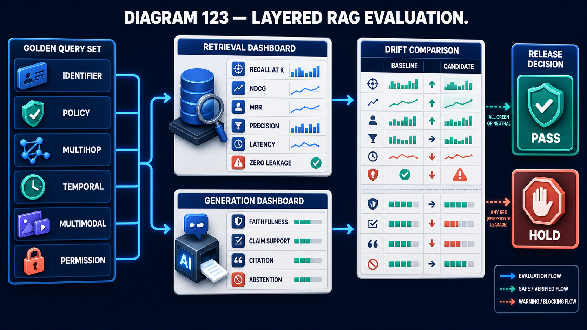

# Diagram 124 — Acme Knowledge Fabric Capstone

![Six numbered column panels on dark navy — 1 SOURCES, 2 INTAKE, 3 INDEXES, 4 QUERY, 5 POLICY, 6 OPERATIONS — each holding a vertical stack of white stage cards connected by blue arrows. Teal arrows run between columns along the authorised path; red hexagonal crosses hang off nearly every stage marking blocked or unauthorised data. At the right, an ANSWER WITH EVIDENCE card with numbered claims and a teal shield sits above MAYA, a person at a desk. Two dashed teal feedback bars read FEEDBACK: QUALITY & TRACEABILITY and FEEDBACK: INDEX HEALTH.](../diagrams/124-acme-knowledge-fabric.png)

**Module:** Capstone
**Role in the course:** the whole volume in one system
**Layout:** six numbered columns of stages, an authorised path threading them, a blocked cross at nearly every stage, and two feedback loops

---

## At a glance

Six numbered columns, twenty-eight stages, and a **red hexagonal cross hanging off nearly every one of them**.

An **ANSWER WITH EVIDENCE** card on the right, and **MAYA** — the person the whole thing exists for.

Two feedback loops running back along the base: **QUALITY & TRACEABILITY** and **INDEX HEALTH**.

The crosses are the diagram's defining feature. Every stage can refuse, and drawing all of them makes the point that a knowledge system is mostly a series of things that do not happen.

---

## What the diagram teaches

### 1. Six columns, and they are the volume's structure

**1 SOURCES** — policy, case API, payment SQL, attachments. Four heterogeneous inputs.

**2 INTAKE** — register, version, parse, OCR, provenance. Everything from the governance and document-engineering modules.

**3 INDEXES** — lexical, vector, visual, graph, structured. Five representations.

**4 QUERY** — plan, authorize, hybrid, rerank, pack.

**5 POLICY** — cite, conflict, clarify, abstain.

**6 OPERATIONS** — promote, cache, eval, trace, delete.

Read left to right and it is the volume's table of contents.

### 2. Nearly every stage has a red cross, and that is the honest picture

Count them. Twenty-odd red hexagonal crosses, one per stage across every column.

Each marks the blocked or unauthorised path out of that stage.

A source without an owner does not register. A document that fails parsing does not index. A query outside scope does not authorize. A claim without a citation does not publish.

Drawing all of them at once produces a picture that looks defensive, and that is accurate. Most of the engineering in a governed knowledge system is refusal machinery.

### 3. AUTHORIZE is highlighted, and it is the only stage drawn that way

In column 4, **AUTHORIZE** carries a teal border that no other stage has.

It is the load-bearing control. Everything before it prepares evidence; everything after it operates on evidence the caller is entitled to.

Its position — after **PLAN**, before **HYBRID** — is the filter-before-search ordering from earlier in the volume, made structural.

### 4. Column 5 is POLICY, and all four of its stages are about not answering plainly

**CITE** — attach provenance.
**CONFLICT** — expose disagreement.
**CLARIFY** — ask rather than assume.
**ABSTAIN** — decline.

Four stages, and three of them produce something other than a direct answer.

That column is where the volume's answer-integrity module lives, and its size relative to the query column says something: getting the evidence is half the work, and deciding what may honestly be said with it is the other half.

### 5. Column 6 includes DELETE, and its presence is unusual

**PROMOTE, CACHE, EVAL, TRACE, DELETE.**

Deletion as an operational stage, alongside promotion and evaluation.

Most architecture diagrams stop at serving. Including deletion says that removing content — on retention expiry, on withdrawal, on a subject request — is an ongoing operational responsibility rather than an edge case.

It also closes the loop with the retention fields from the provenance diagram. Those fields exist so that this stage can run.

### 6. Two feedback loops, and they return to different places

**FEEDBACK: QUALITY & TRACEABILITY** runs from operations back to **intake**.

**FEEDBACK: INDEX HEALTH** runs from operations back to **indexes**.

Two loops with two destinations, because they carry different findings.

Quality and traceability findings — citations that do not resolve, claims that cannot be traced, sources that turn out to be stale — are **intake** problems. The fix is at ingestion.

Index health findings — recall regressions, leakage, drift — are **index** problems. The fix is a rebuild or a configuration change.

Routing all feedback to one place would send a citation failure to the index team.

### 7. Maya is at the end, and the answer card is what reaches her

**ANSWER WITH EVIDENCE** — a card with numbered claims and a teal shield — sits between the pipeline and **MAYA**.

She is drawn as a person at a desk, named, at the far right.

That placement is the reminder the capstone needs. Six columns, twenty-eight stages and twenty red crosses exist to put one card in front of one person, and the card's value is the numbered claims and the shield — the claims are traceable and the answer is verified.

**EVAL** in column 6 is what keeps every column honest:

The six query categories there map onto this diagram's columns: identifier and policy test column 3, multihop tests column 4, temporal tests column 2's versioning, multimodal tests OCR and visual indexing, and permission tests the highlighted **AUTHORIZE** stage. Each category exists because a column can regress independently.

---

## Case study — Acme's knowledge fabric, assembled over fourteen months

The diagram names a system. This case study is its construction, told as a sequence, because that is more honest than presenting it as designed.

Acme is a mid-sized insurer. Maya is a claims technical specialist.

### Month 1 — sources and a spreadsheet

They began by pointing ingestion at four sources: their policy library, their case API, their payment ledger, and customer attachments.

Everything was ingested. It worked and the answers were poor.

**The finding that started the governance work:** nobody could say who owned the policy library's content. It had been assembled from three predecessor companies' documents during a merger.

They built the source register. Ingested content fell by about 40%, and answer quality improved.

### Month 3 — parse and OCR

Their attachments are heavily scanned — surveyor reports, photographs of damage, handwritten adjuster notes.

Flat text extraction had been producing unusable content from tables in surveyor reports, which is where the quantified damage assessment lives.

Layout-aware parsing and OCR with confidence recording. About 9% of pages routed to review.

### Month 4 — the provenance record

Prompted by a data protection audit that asked which chunks contained personal data and when they would be deleted.

Nobody could answer. The seven-field evidence record was the response, and the retention half of it enabled the DELETE stage in column 6 fourteen months later.

### Month 5 — chunking, and a rework

Their first chunking was fixed-size. A claims adjuster noticed that a policy exclusion had been separated from the condition that qualified it.

Semantic chunking on the document tree, with heading paths. This was rework — the second chunking of the entire corpus — and it is the step they would do differently.

### Month 6 — indexes

Lexical first, because claims reference numbers and policy numbers are how adjusters search.

Vector second. Visual third, once OCR was retaining page images, which made damage photographs searchable by content.

Graph and structured came later, at months 9 and 11.

### Month 7 — authorization before search

A penetration test found that their vector index was filtered and their lexical index was not.

The rebuild moved filtering ahead of search across all channels. This is the point at which the AUTHORIZE stage got its highlight in their own architecture drawings.

### Month 8 — the policy column

Prompted by a complaint. An adjuster had relied on an answer citing a policy wording that had been superseded, because the assistant had synthesised across versions without exposing that they differed.

Cite, conflict, clarify and abstain were built together over about six weeks. Their abstention rate settled at 5%.

### Month 10 — temporal retrieval

Claims are assessed under the policy in force at the date of loss, which may be several versions back.

This required the version work from month 4 to have been done properly. It had been, which is the one sequencing decision they got right by accident.

### Month 12 — evaluation

Six categories, 620 queries.

The first run found a leakage instance and a temporal regression that had been present for two months.

### Month 13 — the operations column

Safe promotion with a release gate. Nightly rebuilds, against monthly.

Cache keys versioned, after a promotion served mixed results for half an hour.

Deletion implemented properly, which closed the loop opened by the month-4 data protection audit.

### Month 14 — the feedback loops

The last thing built, and the thing their engineering lead says should have been earlier.

Quality and traceability feedback to intake. Index health feedback to indexes.

Before those loops, findings from evaluation and tracing were raised as tickets and prioritised alongside feature work. Routing them structurally back to the stage that owns them changed how quickly they were addressed.

### What Maya's experience is now

She asks a question about whether a claim is covered.

The system plans, authorises against her scope and the claim's tenant, searches five indexes, reranks, packs an evidence packet, checks citations, exposes any conflict between the policy version and an endorsement, and returns three numbered claims with a shield.

She reads the claims and clicks the citations. The originals open with the cited regions highlighted.

Median time to a coverage assessment: 22 minutes previously, about 4 minutes now.

### The sequencing they would change

Their retrospective names three.

**Provenance should have come first**, before parse and chunk. Adding the seven fields at month 4 meant re-ingesting everything.

**Evaluation should have come before the policy column**, so that the effect of cite, conflict, clarify and abstain could be measured rather than asserted.

**The feedback loops should have been built with the first operational stage**, not last. Fourteen months of findings were routed manually.

### Results

- **Sources ingested:** down ~40% at the register stage, with a quality improvement.
- **Pages routed to OCR review:** ~9%.
- **Abstention rate:** ~5%.
- **Time to a coverage assessment:** 22 minutes → 4.
- **Index rebuilds:** monthly → nightly.
- **Corpus re-ingestions during the build:** 3, of which 2 were avoidable with better sequencing.

### The line in their programme retrospective

*Every red cross in that diagram is something we shipped without and then added after it bit us. The order we built them in was the order we discovered we needed them.*

---

## Composition

Six numbered column panels with an answer and a person at the right, and two feedback bars beneath.

**Columns**, left to right, each a bordered panel with a numbered header:

**1 SOURCES** — POLICY, CASE API, PAYMENT SQL, ATTACHMENTS.
**2 INTAKE** — REGISTER, VERSION, PARSE, OCR, PROVENANCE.
**3 INDEXES** — LEXICAL, VECTOR, VISUAL, GRAPH, STRUCTURED.
**4 QUERY** — PLAN, **AUTHORIZE** (teal-bordered), HYBRID, RERANK, PACK.
**5 POLICY** — CITE, CONFLICT, CLARIFY, ABSTAIN.
**6 OPERATIONS** — PROMOTE, CACHE, EVAL, TRACE, DELETE.

**Blue arrows** connect stages vertically within each column; **blue arrows** connect the column headers horizontally.

**Teal arrows** run between columns along the authorised path.

**Red hexagonal crosses** hang to the right of nearly every stage card.

**Right:** a teal-bordered **ANSWER WITH EVIDENCE** card showing numbered claim lines and a teal shield, with a teal arrow down to **MAYA** — a person at a desk on a blue platform.

**Beneath:** two teal dashed bordered bars — **FEEDBACK: QUALITY & TRACEABILITY** running back to intake, and **FEEDBACK: INDEX HEALTH** running back to indexes.

**Legend:** teal arrow — **AUTHORIZED / VERIFIED EVIDENCE PATH**; red arrow — **BLOCKED / UNAUTHORIZED DATA**; blue arrow — **MAIN PROCESS FLOW**.

## Element by element

**The six columns** — the volume's structure as a pipeline.

**AUTHORIZE** — the only teal-bordered stage. The load-bearing control.

**The red hexagonal crosses** — one per stage, marking every refusal path.

**ANSWER WITH EVIDENCE** — numbered claims and a teal shield.

**MAYA** — the named person the system serves.

**The two feedback bars** — quality and traceability to intake; index health to indexes.

## Colour and flow semantics

- **Blue arrows** carry the main process flow, vertically within columns and horizontally between headers.
- **Teal arrows** carry the authorised evidence path between columns.
- **Red hexagonal crosses** mark blocked data at nearly every stage.
- **Teal dashed bars** carry the two feedback loops back to different destinations.
- **AUTHORIZE alone is teal-bordered**, marking it as the pipeline's central control.

## How to present it

**Do not walk all twenty-eight stages.** It is the closing diagram and a tour repeats the volume.

**Count the red crosses instead.** Twenty-odd, one per stage. Then make the point: most of the engineering in a governed knowledge system is refusal machinery.

**Trace one question end to end.** Maya asks about coverage; the system plans, authorises, searches five indexes, reranks, packs, cites, checks for conflict, and returns three numbered claims. One path, naming each column's contribution.

**Point at the teal border on AUTHORIZE.** The only highlighted stage, positioned after plan and before hybrid. Filter before search, made structural.

**Ask why column 5 is called POLICY.** Then read its four stages and note that three produce something other than a direct answer. Getting the evidence is half the work.

**Point at DELETE in column 6.** Deletion as an ongoing operational stage. Then connect it back to the retention fields in the provenance record — those fields exist so this stage can run.

**Ask why there are two feedback bars.** Citation failures are intake problems; recall regressions are index problems. One loop would send a citation failure to the index team.

**Tell the fourteen-month sequence.** Each stage added after something bit them. Then give the three sequencing regrets: provenance should have been first, evaluation before the policy column, feedback loops with the first operational stage.

**Give them the re-ingestion count.** Three corpus re-ingestions during the build, two of them avoidable. That is the cost of learning the order.

**Point at Maya.** Six columns, twenty-eight stages and twenty red crosses exist to put one card in front of one person. 22 minutes to 4.

**Close on the retrospective line.** *Every red cross is something we shipped without and then added after it bit us.*

**Timing.** Thirty minutes as a closing session. Forty-five if the room maps their own system onto the six columns and identifies which crosses they are missing.

---

## Lab and checkpoint

**Lab:** Map your own knowledge system onto the six columns: source, parse, chunk, index, retrieve, and answer/operate. For each stage, mark whether you have the refusal/control and whether it is instrumented. Identify the three stages that would cause re-ingestion if added later, and move them earlier.

**Checkpoint:** Why is AUTHORIZE the only highlighted stage?

**Answer:** Because filtering before search is the single most important structural control. If it is not positioned between planning and retrieval, the search can see forbidden content, which produces leakage and wrong conclusions. Authorisation before search is the linchpin of a governed system.

## Glossary

- **Acme** — the fictional organisation whose knowledge fabric is shown.
- **Authorize** — the highlighted stage that enforces access before search.
- **Cite** — the stage that creates source citations.
- **Conflict** — the stage that detects disagreeing sources.
- **Delete** — the operational stage that enforces retention and deletion.
- **Feedback loop** — the path that sends failures back to the right stage.
- **Hybrid search** — the stage that combines lexical, vector, and structured search.
- **Index** — the stage that builds searchable representations.
- **Knowledge fabric** — the full pipeline from source to answer.
- **Parse** — the stage that extracts structured content from documents.
- **Policy** — the column that decides whether and how to answer.
- **Provenance** — the record of where content came from.
- **Rerank** — the stage that orders candidates.
- **Source** — the stage that governs and ingests original content.

## Sources

- End-to-end RAG and knowledge-fabric design
- Source governance and policy enforcement
- Citation, conflict, and operational deletion
