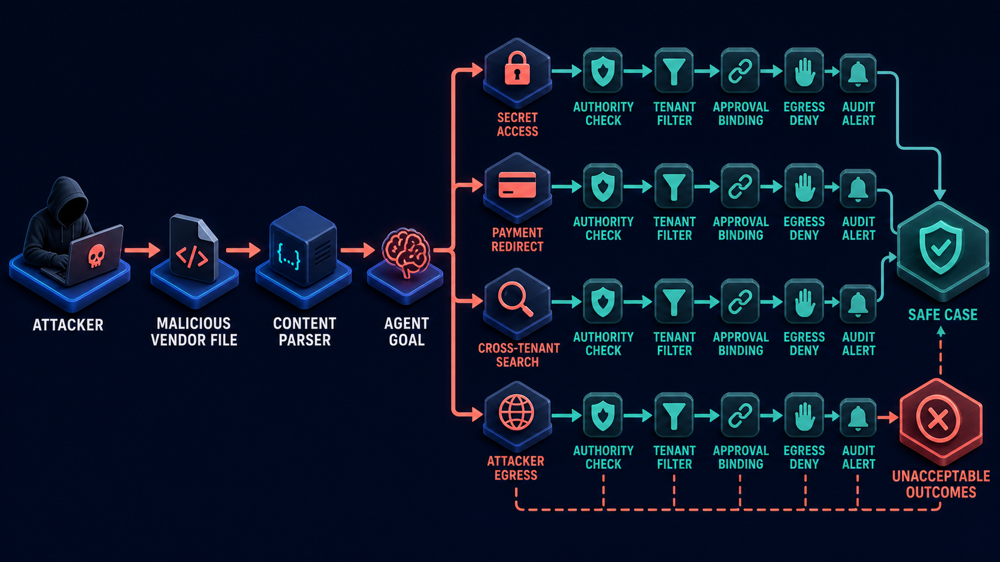

# Diagram 149 — Assets, Identities, Trust Boundaries, Data Flows, and Owners

**Module:** Threat models and trust boundaries
**Role in the course:** how to draw a useful threat model before selecting individual security products or controls
**Layout:** Maya and the Acme agent stand outside the ACME TRUST ZONE. An IDENTITY GATE and a POLICY GATE guard the entrance. Inside are protected cards for PAYMENT TOOL, CASE DATA, SECRET VAULT, and AUDIT EVIDENCE, each with an OWNER icon. Cyan arrows show USER INTENT, DELEGATED REQUEST, and TOOL CALL; a teal arrow shows DATA RETURN. A TENANT BOUNDARY encloses the zone and a PAYMENT BOUNDARY wraps the payment tool. INTERNET and VENDOR FILE sit below, marked with red X marks.

---

## At a glance

**MAYA → ACME AGENT → IDENTITY GATE → POLICY GATE → CASE DATA / PAYMENT TOOL / SECRET VAULT / AUDIT EVIDENCE**.

Every protected asset has an **OWNER**.

The **TENANT BOUNDARY** encloses the trust zone; the **PAYMENT BOUNDARY** wraps the payment tool.

The **INTERNET** and **VENDOR FILE** stay outside, marked as untrusted.

This is the museum-floor-plan view of agent security: valuable exhibits, doors, staff-only rooms, and the person responsible for each alarm on one page.

---

## What the diagram teaches

### 1. A threat model is a picture, not a product list

The diagram is a threat model, not a shopping list. It shows what matters, which identities interact with it, where trust changes, how data moves, and who owns each decision. That makes it possible to argue about risk before buying tools. If the team skips this step, they often purchase impressive products and still leave critical assets unowned because no one mapped a product to a named boundary.

The trace is simple: list the assets and the harm each can suffer, place the human, client, agent, workload, tool, service, tenant, and attacker identities, draw the trust zones and every inbound, outbound, and cross-tenant data flow, attach an owner and a control point to each high-impact boundary, then record the assumptions and residual risks the picture does not eliminate.

### 2. Assets are more than the language model and the database

Assets include money, customer data, credentials, capabilities, evidence, availability, and customer trust. The PAYMENT TOOL is an asset because a mistake there moves real money. CASE DATA is an asset because disclosure or incorrect change harms the customer. The SECRET VAULT is an asset because credentials can amplify a breach. AUDIT EVIDENCE is an asset because without it the team cannot prove what happened. When the model itself is treated as the only asset, teams over-invest in alignment and under-invest in authorization and isolation.

### 3. Identities exist at every hop, not just at login

The diagram places MAYA the human, the ACME AGENT, and the service identities behind the IDENTITY GATE, POLICY GATE, and each asset. In a delegated flow, a single human intent passes through multiple identities, and each hop must be resolvable. The IDENTITY GATE answers "who is asking?" The POLICY GATE answers "what is this identity allowed to do with this resource right now?" Those questions are answered on purpose. Knowing the caller is not enough; the caller must also pass the context check.

### 4. A trust boundary is wherever assumptions change

A trust boundary is a place where assumptions or authority change. The TENANT BOUNDARY is the largest one. The PAYMENT BOUNDARY is stricter, around a money-moving tool. The boundary between MAYA and the agent is a delegated-authority boundary. The boundary between the agent and the protected assets is an untrusted-to-trusted boundary. The most dangerous boundaries are the invisible ones: where a document becomes an instruction, where retrieved text becomes a policy, where model output becomes a tool call. The diagram makes them visible so controls can be placed at them.

### 5. Every consequential flow needs a four-part contract

No consequential flow crosses a trust boundary without an identified caller, an intended resource, a policy check, and an evidence owner. The arrows are labeled so those four parts can be named: USER INTENT, DELEGATED REQUEST, TOOL CALL, and DATA RETURN. Each crossing needs a contract. If the contract is incomplete, the system should stop, ask, or deny. This is a security contract, not a promise that the model will behave. The surrounding system refuses risky moves regardless of what the model suggests.

### 6. Authority moves in narrow, verifiable hops

The arrows are short and labeled because authority should not flow from a user directly to the deepest resource in one leap. It hops from MAYA to the agent, from the agent to the identity gate, from the identity gate to the policy gate, and from the policy gate to a specific tool. Each hop narrows authority. The user asks for a refund. The agent translates that into a delegated request. The identity gate verifies the agent's identity and tenant. The policy gate evaluates the refund against case data, finance rules, and approval state. Only then does the payment tool receive a bounded, attributed command.

### 7. Untrusted content is kept outside until a control deliberately grants it authority

The INTERNET and VENDOR FILE sit below the TENANT BOUNDARY with red X marks. They are not inside the trust zone. The central warning is that external content, retrieved documents, tool descriptions, remote cards, and model outputs are data until a trusted control deliberately grants them authority.

Diagram 150 takes the same vendor file and traces the attack paths it could open. The boundary in Diagram 149 is the starting point for the misuse cases in Diagram 150. The red X at the boundary is the first control that keeps the untrusted document from becoming an instruction. Only after parsing, tenant binding, authority checks, and approval does any external influence reach a protected asset.

### 8. Payment, tenant, and secret boundaries isolate the most sensitive capabilities

The PAYMENT BOUNDARY is around the PAYMENT TOOL because it is the most dangerous single capability. The SECRET VAULT is a separate card because credentials are not ordinary data. CASE DATA is protected by the tenant boundary and the policy gate because customer information crosses privacy and business risk lines. These boundaries are policy perimeters, not just network segments. In a Next.js application, the payment action is a Route Handler that receives only a typed decision record from the server, never raw model text. In a Python application, a FastAPI dependency returns a typed `SecurityContext` and rejects requests whose caller, tenant, audience, or resource cannot be resolved.

### 9. Audit evidence is a protected asset with its own owner

AUDIT EVIDENCE is an asset, not an afterthought. It receives a DATA RETURN arrow from the policy gate and the tools. Every allowed and denied decision must produce evidence, and that evidence must have an owner. Without an owner, evidence is forgotten, deleted, or mislabeled. The owner is responsible for retention, tamper protection, and the format investigators and regulators need. A denial without evidence is an unreviewable decision.

### 10. Model output, documents, and tool descriptions are data until a control says otherwise

Documents, retrieved text, model output, tool descriptions, remote cards, and external results are all data. They may be true, false, relevant, misleading, or malicious. None has authority until a trusted control deliberately grants it. The IDENTITY GATE and POLICY GATE are those controls. If a vendor file says "urgent finance instruction," the policy gate still checks the finance owner, the approval binding, and the payment boundary. The file does not get to bypass those checks just because the language model summarizes it as important.

### 11. The Next.js and Python maps implement the same model in code

The diagram maps directly to implementation. In Next.js, the server-side security context resolves actor, tenant, resource, purpose, and correlation IDs before protected Route Handlers run. Tokens, policy decisions, secrets, and privileged mutations stay in authenticated server code. Typed request, decision, denial, approval, and receipt records let the React interface explain security state without inventing it. In Python, a FastAPI dependency returns a typed `SecurityContext` and rejects requests whose caller, tenant, audience, or resource cannot be resolved. Pydantic models and explicit service boundaries keep identity, tenant, policy, data classification, and audit context separate. Tests exercise both allow and deny paths with hostile synthetic fixtures and dependency-injected adapters.

### 12. Record assumptions and residual risk, because no diagram eliminates every harm

The final step is to record assumptions and residual risks that the picture does not eliminate. A misconfigured owner, an unpatched secret store, a social-engineering call to the help desk, or a missing test case can still break the model. Residual risk must be named. If the payment tool relies on a third-party idempotency key, that is an assumption. If the tenant boundary is enforced only at the API layer, a shared cache could violate it. The picture is the starting point for decisions, not the end.

---

## Case study — Maya, the vendor file, and the refund

Maya asks Acme to refund a legitimate payment and uploads a vendor attachment.

- The **USER INTENT** arrow from Maya to the Acme Agent crosses a human-to-agent boundary. The system verifies the real customer and tenant.
- The **DELEGATED REQUEST** from the agent to the **IDENTITY GATE** crosses an external-to-internal boundary. The agent's identity is verified, not assumed.
- The **VENDOR FILE** remains outside the **TENANT BOUNDARY**. It is untrusted until a content control parses, validates, and binds it to the case.
- The refund crosses customer, Acme, finance, and payment-provider boundaries. The **POLICY GATE** evaluates it against case data, finance rules, and customer entitlements.
- **Credentials stay in the SECRET VAULT** and are never added to the model context.
- **Security and finance owners receive named evidence** for their decisions.

The result: the team sees where hostile content could meet payment authority before the agent is implemented, and the valid refund proceeds while the attachment is handled as data, not authority.

The danger is starting with a list of tools. That misses the business asset, the human owner, and the dangerous boundary between untrusted content and real authority. The takeaway is simple: protect named assets at named boundaries with named owners.

---

## Composition

The picture is a trust-zone map. On the left, MAYA and the ACME AGENT sit outside the ACME TRUST ZONE. Cyan arrows carry USER INTENT, DELEGATED REQUEST, and TOOL CALL. A teal arrow carries DATA RETURN. The IDENTITY GATE and POLICY GATE guard the zone. Inside are four protected asset cards with OWNER icons: PAYMENT TOOL, CASE DATA, SECRET VAULT, and AUDIT EVIDENCE. The PAYMENT TOOL sits inside a yellow PAYMENT BOUNDARY. The whole zone sits inside a blue TENANT BOUNDARY. Below the zone, the INTERNET and VENDOR FILE are coral blocks with red X marks.

## Element by element

- **MAYA** — the human customer.
- **ACME AGENT** — the delegated automated actor.
- **USER INTENT** — the original human request.
- **DELEGATED REQUEST** — the authenticated request the agent sends.
- **TOOL CALL** — the action the policy gate evaluates.
- **DATA RETURN** — the constrained result.
- **IDENTITY GATE** — answers who is asking.
- **POLICY GATE** — answers what is allowed.
- **PAYMENT TOOL** — the money-moving capability.
- **CASE DATA** — customer and case records.
- **SECRET VAULT** — credentials and keys.
- **AUDIT EVIDENCE** — records of allowed and denied decisions.
- **OWNER** — the accountable person or role for an asset.
- **TENANT BOUNDARY** — the trust zone perimeter.
- **PAYMENT BOUNDARY** — the stronger perimeter around the payment tool.
- **INTERNET** — the external, untrusted network.
- **VENDOR FILE** — an untrusted document from outside the tenant.

---

## Colour and flow semantics

The course visual grammar applies directly.

- **Cobalt platform** — a protected boundary or protected resource. The gates, asset cards, TENANT BOUNDARY, and PAYMENT BOUNDARY are cobalt.
- **Cyan arrow** — a request or delegated authority. USER INTENT, DELEGATED REQUEST, and TOOL CALL are cyan.
- **Teal arrow** — a verified identity, allowed decision, safe result, or evidence path. DATA RETURN is teal.
- **Coral path** — an injection, leak, denial, or residual risk. INTERNET and VENDOR FILE are coral, with red X marks showing they are kept out.
- **White card** — an identity, claim, policy, approval, or evidence record. OWNER icons and asset labels are white cards.

The overall flow moves from external actor through gates to protected assets, then back as a teal result. Untrusted sources sit below the main flow, visually separated by the tenant boundary.

---

## How to present it

- **Ask what the team protects.** Most groups list databases and API keys. Push them to add money, customer trust, availability, evidence, and brand. Then ask who owns each.
- **Point at the two gates.** Identity answers "who?" Policy answers "what is allowed in this context?" If the room cannot separate them, the system likely conflates authentication with authorization.
- **Trace the arrows one at a time.** For USER INTENT, DELEGATED REQUEST, TOOL CALL, and DATA RETURN, ask: who is the caller, what is the resource, where is the policy check, and where is the evidence?
- **Emphasize the untrusted sources.** The INTERNET and VENDOR FILE have red X marks. Ask whether a document can currently influence a payment or a tool call. If yes, there is a boundary problem.
- **Show Diagram 150 as the next chapter.** The same vendor file blocked at the boundary in Diagram 149 becomes the starting point for attack paths in Diagram 150.
- **Ask about the payment boundary.** Who approves payments? Is the tool inside its own policy perimeter? Does it require bound approval?
- **Ask about the secret vault.** Does the agent ever see a credential? It should not.
- **Ask about audit evidence as an asset.** Who owns it? How long is it kept? A denial without evidence is unreviewable.
- **Use the analogy.** The diagram is a museum floor plan with exhibits, doors, staff rooms, and the person responsible for each alarm.
- **Use the lab prompt as a drawing exercise.** Have the room draw the Acme refund journey with six assets, seven identities, five trust boundaries, eight flows, and one owner per high-impact decision.
- **Close on the standard.** Every consequential flow has an identified caller, an intended resource, a policy check, and an evidence owner. Untrusted content is data until a trusted control deliberately grants it authority.

---

## Lab and checkpoint

**Lab:** Draw the Acme refund journey. Mark six assets, seven identities, five trust boundaries, eight flows, and one accountable owner for every high-impact decision.

**Checkpoint:** Is the language model itself the only asset in an agent threat model?

**Answer:** No. Money, customer data, identities, credentials, tools, evidence, availability, and trust may be more important assets. The model is one component among many.

---

## Glossary

- **Asset** — something valuable that can be harmed, such as money, data, credentials, capabilities, evidence, availability, or customer trust.
- **Trust boundary** — a place where assumptions or authority change.
- **Data flow** — movement of information between components, labeled with a caller, resource, policy check, and evidence owner.
- **Identity** — a resolvable actor, such as a human, client, agent, workload, tool, service, tenant, or attacker.
- **Policy gate** — a control that evaluates what an identified identity may do with a specific resource.
- **Owner** — the accountable person or role for an asset, boundary, or decision.

---

## Sources

- NIST Zero Trust Architecture
- NIST AI Risk Management Framework
