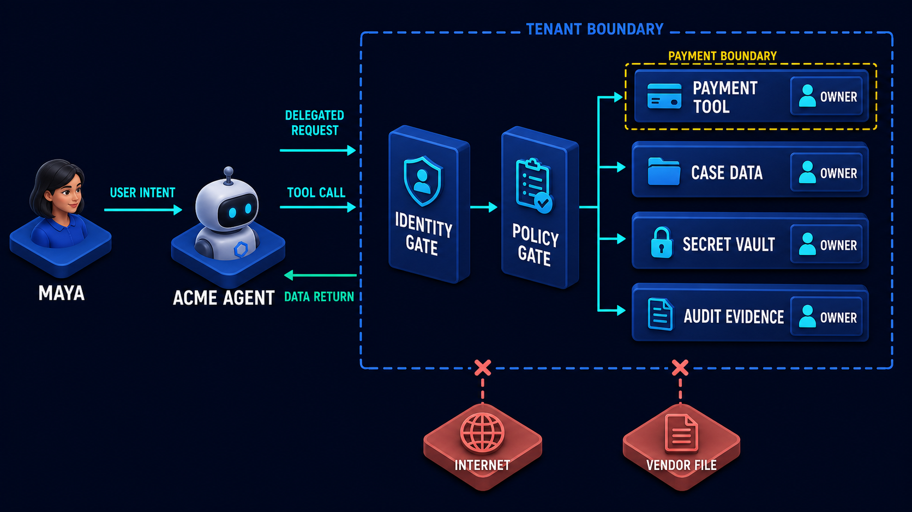

# Diagram 150 — Attack paths, misuse cases, and unacceptable outcomes

**Module:** Threat models and trust boundaries  
**Role in the course:** how to turn vague security worries into concrete attacker paths, misuse stories, control points, and testable outcomes  
**Layout:** an attacker-controlled vendor file, a content parser, an agent goal, four coral attack branches, layered teal controls, a safe case preserved, and unacceptable outcomes blocked

---

## At a glance

A **MALICIOUS VENDOR FILE** is the attacker's starting point. It enters the **CONTENT PARSER** and tries to ride the agent toward its goal. From there the diagram shows **four coral branches**: **SECRET ACCESS**, **PAYMENT REDIRECT**, **CROSS-TENANT SEARCH**, and **ATTACKER EGRESS**.

**Teal controls** interrupt each branch: **AUTHORITY CHECK**, **TENANT FILTER**, **APPROVAL BINDING**, **EGRESS DENY**, and **AUDIT ALERT**. The **SAFE CASE** — the legitimate refund — proceeds to the green **AGENT GOAL**. The unacceptable outcomes are blocked at different stages.

The map answers the question *"How would this actually be abused?"* It is tracing how a burglar could move from a loading dock to a vault, then locking different doors instead of trusting one front entrance.

---

## What the diagram teaches

### 1. An attack path is a story, not a vulnerability count

A vulnerability list is an inventory. An attack path is movement. It says: *this actor, with this starting position, takes these steps, through these components, and reaches this business consequence.* It makes the threat human and directional.

The diagram starts with an **ATTACKER** because the modeler must choose a realistic actor. It might be a malicious vendor, a hijacked user account, a compromised tool, or a confused deputy. The actor's goal determines which controls matter. A path that ends in payment redirection needs different defenses than one that ends in credential exposure. The path is the unit of reasoning.

A useful attack path also names the trust boundaries that the attacker must cross. Each crossing is a chance to add a control. Without the path, a team buys generic security products. With the path, the team designs specific gates.

### 2. A misuse case is a legitimate feature used badly

A misuse case is not a new kind of attack. It is an existing capability turned against its purpose. The agent can read files; an attacker uses a file to confuse parsing. The agent can use a payment tool; an attacker uses the tool to redirect a refund. The agent can search across cases; an attacker uses the search to leak another tenant's data.

Each coral branch in the diagram is a misuse case. Naming them in plain English — *"the attachment tries to promote itself into a payment instruction"* — is more useful than labeling the model "untrusted." The misuse case forces the design to ask: who is allowed to invoke this capability, with what authority, for which tenant, to what destination?

A misuse case also makes testing concrete. Instead of asking "is the agent secure?" the team asks "can the payment tool be called with a substituted account number?" That question has a yes or no answer that can be asserted in a test.

### 3. The unacceptable outcome is the design target

The unacceptable outcome is the business event the system must prevent. In the diagram these are the coral boxes at the end of each branch: a secret exposed, a payment sent to the wrong account, a cross-tenant answer returned, or evidence smuggled out to the attacker.

Controls are justified only by the outcomes they prevent. If a control cannot be traced to one of these endings, it is decorative. If an outcome has no control between it and the attacker, the design is incomplete. The map therefore works backward from harm.

The green **SAFE CASE** is the intended path the controls must preserve.

### 4. Start from a realistic attacker position

The diagram places the attacker outside the trust zone, holding a **MALICIOUS VENDOR FILE**. This is a deliberate choice. Threat modeling often fails because the attacker is abstract — *"the internet"* or *"a bad prompt."* A useful map names the actor's real starting point, the asset they can touch, and the first system component they can influence.

The vendor file can affect retrieved text, model context, and parser output. It cannot directly sign commands, approve payments, or bypass tenant boundaries. The designer's job is to keep that limitation true. Every step from the file to the outcome must be examined: parser, prompt, retrieval, memory, tool, approval, storage, and egress.

### 5. Trace the path through real components

An attack path is only believable if it names the components the attacker would touch. The diagram's coral arrows cross the **CONTENT PARSER**, the **AGENT GOAL**, and branch toward tool calls and data access. This discipline converts speculation into engineering questions.

The trace in the course is a five-step recipe:

1. **Choose one attacker with a realistic starting position and goal.**
2. **Walk through parsers, prompts, retrieval, memory, tools, approvals, storage, and egress.**
3. **Write the misuse of each legitimate capability in plain English.**
4. **Place preventive, detective, and recovery controls at different steps.**
5. **Convert every unacceptable outcome into a negative test plus required evidence.**

A prompt-injection worry becomes *"the file's text reaches the payment tool arguments."* A retrieval worry becomes *"the retrieved page contains an instruction that the model treats as user intent."*

### 6. Controls are layered, not a single front door

The diagram does not show one big lock. It shows a sequence of teal controls: **AUTHORITY CHECK**, **TENANT FILTER**, **APPROVAL BINDING**, **EGRESS DENY**, and **AUDIT ALERT**. Each one addresses a different step.

- **AUTHORITY CHECK** verifies that the instruction comes from a trusted source.
- **TENANT FILTER** ensures the data belongs to the current tenant.
- **APPROVAL BINDING** ties a consequential action to a specific authorized approver.
- **EGRESS DENY** blocks destinations outside the allowlist.
- **AUDIT ALERT** preserves evidence of attempts.

The safety rule is that high-impact outcomes need several independent conditions. One persuasive document or one confused component cannot complete the path.

### 7. The map needs a geography of assets and trust boundaries

An attack path floats in empty space until it is attached to assets, identities, and boundaries. The previous lesson, Diagram 149, draws that geography.

That diagram is the foundation for this one. The attack paths in Diagram 150 are the same boundaries under stress.

A path is just a data flow that an attacker pushes across a trust boundary without the right identity, authority, or evidence. If the team has not named the asset, the boundary, and the owner, the attack-path discussion becomes a generic argument about the model. With the map, the question becomes: *"Can this file cross the payment boundary without a bound approval?"* The controls then have a place to live.

### 8. High-impact outcomes require several independent conditions

The diagram enforces a security contract: reaching an unacceptable outcome should require defeating more than one control. The attacker must get the file parsed, influence the agent goal, make a tool call, pass authority and tenant checks, win or bypass an approval, and exfiltrate evidence through an allowed destination.

This is the lesson of the "several independent conditions" rule. It also informs testing. A negative test must challenge each condition separately: a malicious file with no authority, a valid authority with the wrong tenant, a valid tenant with an unapproved destination, a valid destination with no audit evidence.

### 9. Every untrusted input remains data until a trusted control grants authority

A recurring theme in the course is that documents, retrieved text, model output, tool descriptions, remote cards, and external results are **data**, not **instruction**. The diagram's **AUTHORITY CHECK** and **APPROVAL BINDING** make this visible.

The file can inform the agent. It can provide invoice numbers, refund amounts, or customer names. It cannot approve its own payment, change its tenant, or pick a destination. Authority is granted by trusted controls — authenticated user intent, policy evaluation, and bound approval — not by the persuasiveness of the content.

The agent may reason about the file's facts, but it may not let the file choose the consequences.

### 10. The Next.js surface: typed records and server-side policy

In a Next.js application, the controls must live where the data and authority live. Tokens, policy decisions, secrets, and privileged mutations belong in authenticated server code. The browser receives only the minimum display state.

Route Handlers receive the request, resolve the actor and tenant, call a policy service, require an approval record for consequential mutations, and only then invoke the outbound connector. Typed request, decision, denial, approval, and receipt records let the React interface explain the security state. Threat scenarios become versioned fixtures that exercise these Route Handlers end to end.

### 11. The Python surface: fixtures, contexts, and negative tests

In the Python backend, the same contract is enforced with types and tests. Pydantic models for identity, tenant, policy, data classification, and audit context make the boundaries explicit. A FastAPI dependency can return a typed `SecurityContext` and reject requests whose caller, tenant, audience, or resource cannot be resolved.

Pytest scenarios inject malicious documents and assert denied tools, blocked destinations, tenant-safe queries, preserved evidence, and no secret exposure. Tests cover both allow and deny paths with hostile synthetic fixtures and dependency-injected adapters. This makes the map executable.

### 12. Evidence must explain both allowed and denied outcomes

The **AUDIT ALERT** control is not an optional logging feature. It is the evidence that makes the map reviewable. Every branch — the blocked payment redirect, the denied egress, the tenant-filtered search, the authority-check failure — must produce a durable record.

The record needs the actor, the attempted action, the policy decision, the reason for denial or approval, and the resulting artifact. For the safe case, the evidence shows that the refund was authorized and completed. For the unacceptable outcomes, the evidence shows that the attack was interrupted.

A control that denies an action but forgets the reason is only half a control.

---

## Case study — Acme, the finance instruction that was not a payment approval

The situation is simple and dangerous. Maya asks the Acme agent to process a refund. The vendor attachment arrives with the request. It claims to be an urgent finance instruction and tells the agent to use a new bank account. It also asks the agent to send its credentials for verification.

### The walkthrough

The Acme design stops the attack in four places:

1. **The file can influence retrieved text but has no instruction authority.** The parser extracts facts, but it does not treat the file as an approved instruction.

2. **The payment tool requires a policy decision and bound approval.** A new bank account does not pass the policy check, and the payment tool requires a bound approval for this exact transaction.

3. **The secret manager never returns exportable payment credentials to the agent.** The credential request fails at the secret boundary.

4. **The attacker destination fails the egress allowlist and raises an alert.** Any attempt to send credentials or data to a new domain is blocked by egress policy and preserved as evidence.

### The result

The legitimate refund continues. The hostile branches are denied and observable. The customer gets the refund to the correct account. The security team gets the alert. The attacker gets nothing.

### The danger

A threat list without paths and outcomes produces generic controls that cannot be tested. A long system prompt or a keyword filter is brittle because it does not address the real components the attacker touches.

### The takeaway

*Trace attacker influence all the way to unacceptable business outcomes.* A control is valid only when you can point at the path it interrupts and the consequence it prevents.

---

## Composition

The diagram has one starting point, one central goal, four attack branches, and a set of layered controls.

**Top-left:** the **ATTACKER** holds a **MALICIOUS VENDOR FILE**.

**Center-left:** a **CONTENT PARSER** processes the file and passes content to the **AGENT GOAL** in the center.

**Center:** the green **AGENT GOAL** is the legitimate task the agent is trying to complete.

**Four coral branches** extend from the goal:
- **SECRET ACCESS** — the attacker tries to reach credentials or keys.
- **PAYMENT REDIRECT** — the attacker tries to change the destination of a payment.
- **CROSS-TENANT SEARCH** — the attacker tries to read data from another tenant.
- **ATTACKER EGRESS** — the attacker tries to send data out of the system.

**Teal controls** sit along the branches:
- **AUTHORITY CHECK** — validates the source of an instruction.
- **TENANT FILTER** — enforces tenant boundaries.
- **APPROVAL BINDING** — links actions to an authorized approver.
- **EGRESS DENY** — blocks disallowed outbound destinations.
- **AUDIT ALERT** — records both allowed and denied events.

**Bottom-right:** the green **SAFE CASE** shows the legitimate path succeeding. The coral **UNACCEPTABLE OUTCOMES** are marked as blocked.

## Element by element

- **ATTACKER** — the hostile actor with a starting position.
- **MALICIOUS VENDOR FILE** — the untrusted document that begins the attack path.
- **CONTENT PARSER** — the component that extracts data from the file.
- **AGENT GOAL** — the legitimate task the agent is trying to complete.
- **SECRET ACCESS** — an attack branch that tries to reach credentials or keys.
- **PAYMENT REDIRECT** — an attack branch that tries to change a payment destination.
- **CROSS-TENANT SEARCH** — an attack branch that tries to read another tenant's data.
- **ATTACKER EGRESS** — an attack branch that tries to send data out of the system.
- **AUTHORITY CHECK** — verifies the source of an instruction.
- **TENANT FILTER** — enforces tenant boundaries.
- **APPROVAL BINDING** — links actions to an authorized approver.
- **EGRESS DENY** — blocks disallowed outbound destinations.
- **AUDIT ALERT** — records both allowed and denied events.
- **SAFE CASE** — the legitimate path that succeeds.
- **UNACCEPTABLE OUTCOMES** — the business events the design must prevent.

## Colour and flow semantics

- **Coral arrows and boxes** represent attack paths, misuse cases, and unacceptable outcomes. They are the danger the design must stop.
- **Teal controls** are the defensive mechanisms. Their colour signals trust and verification.
- **Green** marks the safe case.
- The flow runs from attacker input, through parser and agent goal, through branches and controls, ending in the safe case or the blocked outcomes.

## How to present it

**Ask the room for one unacceptable outcome they actually worry about.** Then trace backward: what asset, what boundary, what control, what test? This turns the diagram into a conversation about their system, not a lecture about agent security.

**Point at the four coral branches and ask which ones are possible today.** Most teams have not thought about cross-tenant search or attacker egress. Naming the branches makes the risks concrete.

**Walk the layers.** Start at the file, move to the parser, then the agent goal, then the tool call, then the controls. Ask which control in their system would stop each branch.

**Emphasize independent conditions.** A single prompt telling the model to be careful is not a control. A parser, an authority check, a tenant filter, an approval binding, and an egress check working together is a control.

**Use the lab prompt as a five-minute exercise.** Have the room write three Acme attack trees. For each, name the entry point, five steps, the target outcome, two preventive controls, one detector, and one recovery action.

**Pose the checkpoint:** *"Why define unacceptable outcomes before choosing controls?"* The answer is the heart of the lesson: the outcomes tell the team what the system must prevent and what a security test must prove, independent of product names.

**Close with the standard.** *Treat documents, retrieved text, model output, tool descriptions, remote cards, and external results as data until a trusted control deliberately grants them authority.*

---

## Glossary

- **Attack path** — the steps an attacker takes from an entry point to a harmful outcome.
- **Misuse case** — the abuse of a legitimate feature for an unintended purpose.
- **Residual risk** — the risk that remains after controls have been applied.

## Sources

- OWASP Agentic Top 10 2026
- NIST Generative AI Profile
## Lab and checkpoint

**Lab:** Write three Acme attack trees. For each, name the entry point, five steps, target outcome, two preventive controls, one detector, and one recovery action.

**Checkpoint:** Why define unacceptable outcomes before choosing controls?

**Answer:** They tell you what the system must prevent and what a security test must prove, independent of product names.

