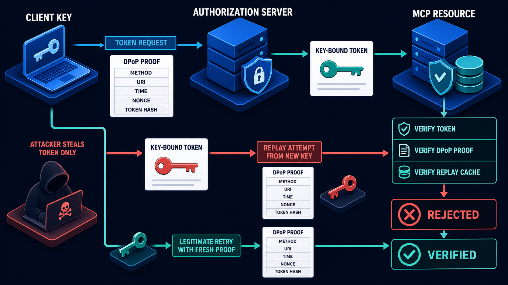

# Diagram 155 — DPoP, Sender-Constrained Tokens, and Replay Resistance

**Module:** Identity, OAuth, and delegated authority
**Stability:** Stable OAuth standard; active MCP roadmap direction
**Role in the course:** Explain what DPoP changes, what it does not solve, and how to label it honestly in an MCP design
**Layout:** A **CLIENT KEY** platform on the left creates a **DPoP PROOF** card showing **METHOD**, **URI**, **TIME**, **NONCE**, and **TOKEN HASH**. A cyan arrow carries the proof to an **AUTHORIZATION SERVER**, which issues a **KEY-BOUND TOKEN**. Another cyan arrow carries the token to the **MCP RESOURCE**, where a verification gate checks the **TOKEN**, the **DPoP PROOF**, and the **REPLAY CACHE**. A coral path shows an **ATTACKER** with **TOKEN ONLY** attempting **REPLAY FROM NEW KEY** and being rejected. A teal path shows a legitimate retry with a fresh proof.

---

## At a glance

**CLIENT KEY → DPoP PROOF → AUTHORIZATION SERVER → KEY-BOUND TOKEN → MCP RESOURCE → ALLOWED REQUEST**.

The **MCP RESOURCE** checks **TOKEN + DPoP PROOF + REPLAY CACHE** before any business decision.

A stolen **TOKEN ONLY** is **rejected** when the attacker tries to replay it from a new key.

A legitimate retry with a **fresh DPoP proof** is allowed.

This is the “stolen ticket is not enough” view of OAuth: the ticket names the event, but entry also requires a fresh signature from the original buyer’s key.

---

## What the diagram teaches

### 1. DPoP changes the bearer-token assumption

A normal bearer token says “present this string and you are in.” Anyone who reads the string from a log, a memory dump, or a network trace can replay it. DPoP changes that. The access token is bound to a public key, and every use must be accompanied by a proof signed with the matching private key. The diagram puts **CLIENT KEY** at the start because the key is the real credential. Possession of the token string alone is no longer enough.

### 2. The DPoP proof is a fresh, signed envelope over the request

The client creates a fresh proof for each token or resource request, containing the HTTP **METHOD**, the request **URI**, a **TIME** stamp, a **NONCE** when required, and a **TOKEN HASH**. By signing these values, the client proves that the same party that holds the key is making this exact request. If the method, URI, or token hash changes, the proof no longer matches, and the resource denies.

### 3. The authorization server binds the issued token to the public key

The **AUTHORIZATION SERVER** issues a **KEY-BOUND TOKEN**. Internally the token contains a confirmation claim that carries the public-key thumbprint. The client proves possession at token issuance by sending a DPoP proof in the token request. Because the token is cryptographically bound to the key, a stolen token string cannot be redeemed at the resource without the matching private key.

### 4. The resource checks the token and the proof together

The **MCP RESOURCE** is the verification gate. It does not stop at the access token. It validates the token signature, issuer, audience, expiry, and scopes, then checks the DPoP proof. It verifies that the proof is signed by the private key matching the public-key thumbprint in the token, that the method and URI match the current request, that the time is within the accepted window, that the token hash matches the presented token, and that any nonce is acceptable.

### 5. The replay cache rejects reused proof identifiers

The **REPLAY CACHE** stores the identifiers of recently accepted DPoP proofs. If the same proof identifier arrives twice within the acceptance window, the cache rejects the second use. A legitimate retry creates a new proof with a new timestamp and identifier. The cache is a small, bounded control that turns fresh proofs into single-use tickets for the request context.

### 6. DPoP does not solve over-scoped tokens, compromised clients, or data leakage

DPoP is valuable but limited. It does not reduce an over-scoped token to least privilege; it only constrains who can present the token. It does not protect against malicious code running in the client, because that code can use the legitimate private key. It does not prevent the authorized client from misusing data or calling the wrong endpoint. And it cannot protect a token if the private key itself is extracted.

### 7. The protected token only matters if the underlying OAuth issuance was correct

Before the resource can verify a DPoP-bound token, the token must have been issued correctly. A DPoP-bound token with the wrong audience is still the wrong token. DPoP is a presentation control; it does not repair a broken issuance path.

Diagram 154 shows that issuance: protected-resource metadata, authorization-server discovery, PKCE S256, issuer validation, resource audience, and minimal scopes. DPoP protects the token only after it has been correctly bound to the right audience and client.

### 8. DPoP does not turn an over-privileged token into least privilege

It is tempting to say “we use DPoP, so the token is safe.” The token is safer from theft replay, but its authority is unchanged. The token still carries audience, issuer, scopes, tenant, and policy claims. If those claims allow a refund of any amount, DPoP does not stop the holder from replaying a large refund. Least privilege is still a separate design decision. DPoP constrains the presenter; policy constrains the power.

### 9. Key protection is the precondition

The diagram starts with **CLIENT KEY** because the protection of that key is the foundation. If the key lives in browser local storage or is logged with the token, DPoP collapses. Good practice uses a hardware-backed or operating-system-protected key, a short rotation window, and no export. The key is as sensitive as the token it protects, and often more so because it can mint proofs.

### 10. The Next.js and Python maps implement the same DPoP contract

The same contract can be written in any stack. In Next.js, keep DPoP private keys in server-side or platform-protected storage, build a standards-tested request signer rather than browser-local ad hoc crypto, and keep tokens, policy decisions, secrets, and privileged mutations in authenticated server code. Use typed request, decision, denial, approval, and receipt records so the React interface can explain security state without inventing it. In Python, wrap OAuth calls in a DPoP-capable client and test key rotation, nonce challenges, clock skew, URI normalization, and proof replay; use Pydantic models and explicit service boundaries for identity, tenant, policy, data classification, and audit context; and test allow and deny paths with hostile synthetic fixtures.

### 11. A good test plan exercises the deny paths and double-submission edge cases

The lab prompt lists the cases that prove the control works: missing proof, wrong key, wrong method, wrong URI, expired proof, reused identifier, missing token hash, and a valid fresh retry. Each case should fail for the right reason. Missing proof should fail at the DPoP verifier. Wrong method or URI should fail because the proof does not match the request. Reused identifier should fail at the replay cache. The valid fresh retry should pass and produce a new proof identifier.

### 12. DPoP is a security contract, not a promise that the model will behave

DPoP is one control at the token-presentation boundary. The system still verifies identity and tenant, evaluates narrow authority against the current context, constrains data and destinations, and preserves evidence for allowed and denied outcomes. It does not remove the need for policy, approval, secret management, or audit. It adds one strong condition: the token can only be used by the key that owns it.

---

## Case study — Acme, the leaked token, and the useless replay

A diagnostic log accidentally exposes an Acme access-token string while the payment flow uses sender-constrained tokens.

### What the situation looks like

At first the exposure looks like a high-severity incident. The token string is in a log that may have been copied to monitoring, support, or offshore systems. Under a bearer-only model, the team would rotate the credential immediately and assume the worst. Because the token is DPoP-bound, the response can be more measured but still serious.

### Walking through the diagram

- The attacker has the token but not Acme's bound private key.
- A forged request contains either no proof or a proof from a different key.
- The payment resource rejects the mismatch before business policy is evaluated.
- Acme revokes or rotates the exposed credential and investigates the logging failure.

### Result

Token theft is less immediately useful, while layered response still treats the exposure seriously. The attacker cannot replay the token from their own infrastructure because they cannot produce a valid DPoP proof.

### The danger

DPoP does not fix excessive scopes, compromised client code, malicious authorized actions, data leakage, or poor key protection. If the same log also captured the private key, the token is as exposed as before. If the token allows broad payment scopes, the legitimate client can still cause harm.

### Takeaway

Bind token use to a key, then keep all the other controls.

---

## Composition

The diagram is arranged as a left-to-right OAuth flow with a verification stack on the right and an attacker path underneath.

- **CLIENT KEY** — a cobalt platform on the far left, showing where the key is generated and protected.
- **DPoP PROOF** — a white card with the five binding fields: METHOD, URI, TIME, NONCE, TOKEN HASH.
- **AUTHORIZATION SERVER** — a cobalt platform that issues the KEY-BOUND TOKEN.
- **KEY-BOUND TOKEN** — a white card carrying the access token and the key thumbprint.
- **MCP RESOURCE** — a cobalt platform that verifies the token, proof, and replay state.
- **REPLAY CACHE** — a small white card inside the resource, storing recent proof identifiers.
- **ATTACKER** — a coral path from TOKEN ONLY to REPLAY FROM NEW KEY, blocked by a red X.
- **LEGITIMATE RETRY** — a teal path with a fresh DPoP proof.

The flow reads from key to proof to token to resource. The attacker path and the legitimate retry create a contrast at the resource gate.

---

## Element by element

- **CLIENT KEY** — the private key held by the client instance.
- **DPoP PROOF** — a signed object that binds the request to the key.
- **METHOD** — the HTTP method of the bound request.
- **URI** — the request URI of the bound request.
- **TIME** — the timestamp of the proof.
- **NONCE** — a server-provided or client-generated replay-prevention value.
- **TOKEN HASH** — a hash of the access token being presented.
- **AUTHORIZATION SERVER** — the OAuth issuer that binds the token to the key.
- **KEY-BOUND TOKEN** — the access token with a confirmation claim.
- **MCP RESOURCE** — the protected server that verifies token and proof.
- **REPLAY CACHE** — the store of recently accepted proof identifiers.
- **ATTACKER** — the hostile actor attempting replay.
- **TOKEN ONLY** — the attacker’s stolen token, without the private key.
- **REPLAY FROM NEW KEY** — the attacker’s replay attempt using a different key.
- **LEGITIMATE RETRY** — a new DPoP proof created by the valid client.

---

## Colour and flow semantics

The course visual grammar applies directly to this diagram.

- **Cobalt platform** — a protected identity, policy, tenant, resource, sandbox, or governance boundary. The CLIENT KEY, AUTHORIZATION SERVER, and MCP RESOURCE are all cobalt platforms.
- **Cyan arrow** — a request, delegated authority, tool call, or intended data path. The arrows from key to proof, proof to token, and token to resource are cyan.
- **Teal arrow / path** — a verified identity, allowed decision, safe result, receipt, evidence, or review path. The legitimate retry with a fresh proof is teal.
- **Coral path** — an injection, replay, privilege error, data leak, denial, quarantine, exception, or residual risk. The attacker’s TOKEN ONLY and REPLAY FROM NEW KEY path is coral and blocked.
- **White card** — an identity, token, claim, policy, tenant key, approval, artifact, audit event, or evidence record. The DPoP PROOF, KEY-BOUND TOKEN, and REPLAY CACHE are white cards.

The overall flow reads left to right, from key generation through proof and token to the resource. The attacker path is shown below or beside the main flow, marked as rejected.

---

## How to present it

**Ask what “stolen token” means in the room.** Most teams think of a token string in a log. Ask whether that string alone would be enough to call the payment API. If the answer is yes, they are using bearer tokens.

**Point at CLIENT KEY and DPoP PROOF.** The key is the credential. The proof is the fresh signature. The token is the bound artifact. Make the room name which of those three is currently protected in their system.

**Trace the flow.** CLIENT KEY → DPoP PROOF → AUTHORIZATION SERVER → KEY-BOUND TOKEN → MCP RESOURCE. At the resource, name the checks: token validity, key binding, method, URI, time, nonce, token hash, replay cache.

**Emphasize the attacker path.** TOKEN ONLY is not enough. REPLAY FROM NEW KEY is blocked. Ask what would happen if an attacker phished the token from a log or a browser cache. If DPoP is in place, the answer is “they still need the private key.”

**Point at the replay cache.** A fresh proof can still be replayed. The cache is what stops the same proof from being used twice. Ask how long the acceptance window is and how the cache is shared across resource instances.

**Show Diagram 154 as the context.** DPoP is the next hop after a correctly issued, audience-bound token. If the token is minted for the wrong resource or with the wrong scope, DPoP does not help. Use the previous lesson to anchor the issuance story.

**Discuss the limits honestly.** DPoP does not fix excessive scope, compromised clients, data leakage, or poor key protection. This is the “what it does not solve” part of the learning outcome. A slide that claims otherwise will break trust when an audit finds those gaps.

**Use the lab prompt as a testing exercise.** Have the room write one test case for missing proof, wrong key, wrong method, wrong URI, expired proof, reused identifier, missing token hash, and a valid fresh retry. Five minutes is enough to surface whether their DPoP library checks all the fields.

**Use the analogy.** A stolen ticket is useless if entry also requires a fresh signature made by the key held by the original buyer. The ticket names the event; the signature proves the holder.

**Mention the sources in context.** OAuth DPoP (RFC 9449) defines the proof format and the confirmation claim. MCP’s current roadmap calls out DPoP adoption as an active direction, but not a universal core requirement today.

**Close on the standard.** Possession of the access-token string alone is insufficient to replay the request from a different key or request context.

**Ask the checkpoint question.** “Does DPoP turn an overprivileged token into least privilege?” If the room says yes, revisit point 8.

**Timing.** Twenty to twenty-five minutes, plus five minutes for the lab testing exercise.

---

## Lab and checkpoint

### Lab

Write verification cases for missing proof, wrong key, wrong method, wrong URI, expired proof, reused identifier, missing token hash, and a valid fresh retry.

### Checkpoint

Does DPoP turn an overprivileged token into least privilege?

### Answer

No. It constrains who can present the token; the token’s audience, scopes, policy, and data permissions still matter.

---

## Glossary

- **DPoP** — an OAuth proof-of-possession mechanism that binds token use to a public key.
- **Sender-constrained token** — a token that can be presented only with a proof from its holder.
- **Replay** — the reuse of captured valid material, such as a token or a proof, in an unauthorized request.
- **DPoP proof** — a signed object containing method, URI, time, nonce, and token hash.
- **Key-bound token** — an access token that carries a confirmation claim with the public-key thumbprint.
- **Replay cache** — a short-lived store of accepted proof identifiers that rejects duplicate use.

---

## Related lessons

- **Diagram 154 — OAuth, OpenID Connect, resource metadata, and audiences:** the current MCP authorization profile that issues the tokens DPoP protects.
- **Diagram 156 — Workload identity, token exchange, and agent delegation:** how an authenticated workload exchanges parent authority for a narrow downstream token.
- **Diagram 160 — Secret manager and short-lived credentials:** how secret storage, rotation, and key protection support the DPoP precondition.

---

## Sources

- OAuth DPoP (RFC 9449)
- MCP current roadmap
