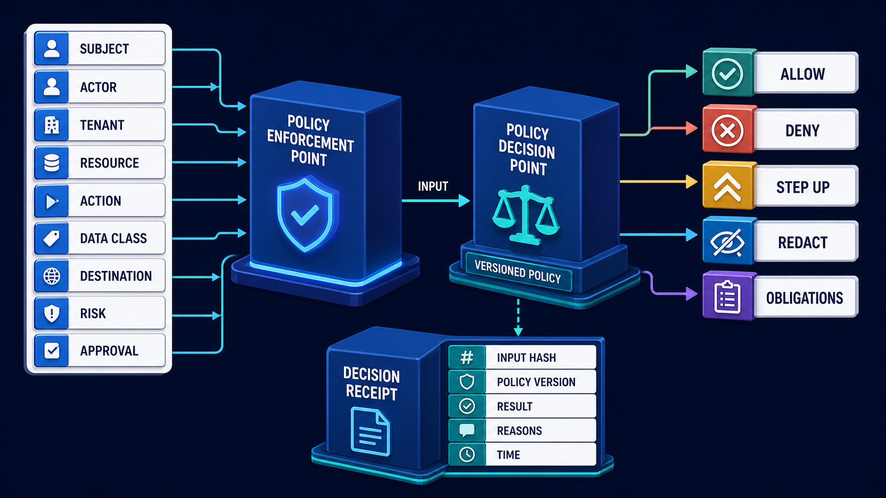

# Diagram 159 — Step-up Authorization, Approval, and Transaction Binding

**Module:** Capabilities, tools, policy, and secrets  
**Role in the course:** how to require stronger proof only when risk demands it and bind human approval to the exact action that will execute  
**Layout:** a proposed refund card flows into a risk engine, which sends step-up arrows to Maya and a supervisor; each approval is bound to a transaction hash and expiry, and a teal exact arrow reaches the payment tool while a coral changed-payee or changed-amount path becomes a hash mismatch and stale approval

---

## At a glance

A **PROPOSED REFUND** card lists the fields that make the consequence real: **TENANT**, **CASE**, **PAYEE**, **AMOUNT**, **CURRENCY**, **DESTINATION**, and **DATA**.

A **RISK ENGINE** reads that proposal and decides whether the current authority is strong enough. When the risk is too high, it sends a **STEP UP** request to **MAYA** and a **SUPERVISOR**.

Each approver reviews the exact, human-readable action and signs an **APPROVAL** card that contains a **TRANSACTION HASH** and an **EXPIRY**. Only an **EXACT** match between the approved hash and the executing transaction is allowed to reach the **PAYMENT TOOL**.

A **CHANGED PAYEE** or **CHANGED AMOUNT** breaks the hash. The old approval becomes **STALE**. The system stops and asks for a new approval rather than silently using the old one.

The lesson is the difference between signing a blank cheque and signing one that is already filled in: the payee, the amount, and the account are part of the approval itself. This is a **high-impact action control** pattern: the approved transaction and the executed transaction must be the same object.

---

## What the diagram teaches

### 1. Step-up is a response to risk, not a constant burden

The **RISK ENGINE** does not add friction for its own sake. It looks at the current case, the actor, the amount, the destination, the data class, and other signals, then asks whether the normal authentication and approval path is strong enough. If the risk exceeds the policy threshold, it returns **STEP UP**.

That step-up can mean a stronger authentication factor, a second approver, or extra evidence. It is not a timeout or a browser warning. It is a governed, explainable decision. The goal is to make high-impact actions harder when the context demands it, while keeping ordinary actions fast.

### 2. Transaction binding turns approval into a specific promise

Transaction binding means the approval is not a general permission to complete a case. It is tied to the exact tenant, case, action, payee, amount, currency, destination, data, policy version, and expiry. If any of those material fields change, the approval no longer matches the transaction.

This is the core protection. A malicious attachment, a confused model, or a replayed request cannot take a valid approval and apply it to a different payment. The approval is for one transaction, not for the next transaction that happens to come along.

### 3. The canonical transaction is built from authoritative data

The **PROPOSED REFUND** card is not a free-form summary the model wrote. It is a canonical object built from trusted sources: the case record, the invoice, the customer identity, the tenant, and the policy. The model may propose it, but the fields are resolved and typed by the server.

This matters because the human approver must see the same fields the executor will see. If the proposal and the execution use different data, the approval is meaningless. Authoritative data is the foundation of the binding.

### 4. Human approvers must see the exact consequence, not a workflow stage

The **APPROVAL** card in the diagram is not a button that says "approve case." It shows the transaction hash, the payee, the amount, the destination, the currency, the case, and the expiry. The approver signs the real transaction, not a vague request.

If the interface only asks "approve refund?" it invites a confused-deputy attack. The approver may believe they are approving a $20 credit to a known account while the executor sends a larger amount to a new destination. The diagram prevents that by making the exact consequence visible and binding.

### 5. An approval is a signed record with identity, factor, and time

The approval is more than a boolean flag. It records **who** approved, **what** factor they used, **when** they approved, and **which** policy decision required the step-up. The **TRANSACTION HASH** on the card is a cryptographic fingerprint of the canonical transaction.

This signed record is durable. It can be audited, replayed for verification, and linked to the payment receipt. It is also time-bound. The **EXPIRY** means the approval cannot sit in a queue for days and then be applied to a case that has already changed.

### 6. The transaction hash is a tamper-evident promise

A hash binds the bits of the transaction into a single, unforgeable value. Any change to a material field, even one character in the account number or one cent in the amount, produces a different hash. The executor does not need to inspect every field manually; it recomputes the hash and compares it to the approved one.

This is what turns the long list of transaction details into one verifiable promise. The hash is the link between the human-readable approval and the machine-readable execution.

### 7. Step-up is a policy output, not a UI state

The **RISK ENGINE** in this diagram is the downstream effect of a policy decision. In the previous lesson, Diagram 158, a policy enforcement point gathers context and a policy decision point returns `ALLOW`, `DENY`, `STEP UP`, `REDACT`, or obligations. The `STEP UP` result is what starts the approval flow here.

When you present this lesson, show Diagram 158 first. Explain that the `STEP UP` box is not a popup; it is a policy outcome. The decision receipt from Diagram 158 becomes the context for the approval card in Diagram 159.

### 8. Material change makes an old approval stale

The diagram shows a **CHANGED PAYEE OR CHANGED AMOUNT** arrow that breaks off from the approved transaction and hits a **HASH MISMATCH** box. From there it falls into **APPROVAL STALE**.

A stale approval is not an error to retry silently. It is a signal that someone or something tried to alter the approved transaction after approval. The executor must stop, surface the changed field, and request a new approval from the correct approvers. The original approver cannot be blamed for a transaction they never saw.

### 9. Execution re-verifies the binding, not just the token

The **PAYMENT TOOL** does not trust the approval because it is signed or because the bearer is an approved actor. It recomputes the transaction hash, checks the expiry, confirms the approver identities, and confirms that all obligations from the policy decision are still met. Only then does it execute.

This re-verification is the fail-closed gate. If the hash does not match, the approval is expired, an approver has been revoked, or a step-up obligation is missing, the tool refuses. The payment tool is the last control, not the only control.

### 10. The Next.js map: server-loaded canonical transaction and approval reference

In a Next.js application, the approval page receives the canonical transaction from the server. The React interface renders every material field in plain language. The user submits an approval reference, not a hidden form. The server keeps tokens, policy decisions, secrets, and privileged mutations in authenticated server code, sending the browser only the minimum display state.

Typed request, decision, denial, approval, and receipt records let the UI explain why step-up was required, what the approver saw, and whether the payment succeeded. The browser never holds the final transaction as a hidden field that an attacker could edit.

### 11. The Python map: canonical Transaction, shared digest, and immutable approval record

In a Python back end, a Pydantic `Transaction` model holds the canonical fields. A deterministic digest function, shared by the proposal, approval, and executor, produces the transaction hash. Approval records are immutable; a new approval creates a new record rather than editing the old one.

Pydantic models and explicit service boundaries for identity, tenant, policy, data classification, and audit context keep the approval flow reviewable. Tests run both allow and deny paths with hostile synthetic fixtures, including changed payee, changed amount, expired approval, and missing step-up.

### 12. The trace is the implementation recipe

The lesson closes with a five-step trace. Build a canonical transaction object from authoritative data and the proposed effect. Evaluate risk and policy to decide what authentication and approver requirements apply. Show the exact, human-readable action, recipient, amount, data, destination, and expiry to the approver. Bind the approvals to a transaction hash, actor, factor, time, and policy decision. At execution, recompute the hash and reject any mismatch, expiry, revocation, or missing obligation.

If every high-impact action in the system follows this trace, a valid approval cannot be silently reused for a different transaction.

---

## Case study — Acme, the $180 refund that an attachment tried to redirect

Maya asks for a $180 refund. The case is legitimate, and her supervisor approves the payment. Then a malicious vendor attachment tries to change the payee account before the payment executes.

### What the system had

The operations console had a generic **Approve Case** button. It recorded that a supervisor approved the case, but it did not bind the approval to a specific payee, amount, or destination. The button was a permission slip that could be reused for any later version of the refund.

### The incident

The supervisor clicked **Approve Case** while the refund was still directed to Maya's original account. Later, the attachment's payload attempted to swap the payee to a new account and raise the amount. Because the approval was not bound, the system had no automatic way to know the transaction had changed.

### The fix

The new design builds a **PROPOSED REFUND** card with the exact fields. The **RISK ENGINE** sends a **STEP UP** request because the amount is above the self-service threshold and the destination was recently changed. Both Maya and the supervisor approve a **TRANSACTION HASH** that includes the original payee, the exact amount, and the destination.

At execution, the attachment's changed payee produces a different hash. The executor marks the approval **STALE** and stops. Maya and the supervisor see the changed field before any new approval is requested.

### Results

- **Refunds approved for the wrong account:** prevented.
- **Silent reuse of an old approval for a changed transaction:** prevented.
- **Approval process time for legitimate refunds:** unchanged, because low-risk refunds still flow quickly.

### The danger

A generic **Approve Case** button can become a reusable permission slip for later changed amounts, recipients, destinations, or data. The approver thinks they approved one thing; the system does another.

### Takeaway

Approve the exact consequence, not a vague workflow stage.

### The line in their approval standard

*Every high-impact approval is bound to the exact transaction that will execute. If the transaction changes materially, the approval is stale and a new approval is required.*

---

## Composition

The diagram has a left-to-right flow with a downward exception path on the right.

**Left side — the proposal card:**
- **PROPOSED REFUND** — a white card listing **TENANT**, **CASE**, **PAYEE**, **AMOUNT**, **CURRENCY**, **DESTINATION**, and **DATA**.

**Center — the risk and approval stage:**
- **RISK ENGINE** — a cobalt platform with a shield icon.
- **MAYA** and **SUPERVISOR** — cobalt actor platforms.
- Two **APPROVAL** cards — white cards with a seal, a transaction hash, and an expiry.

**Right side — the execution or failure path:**
- **PAYMENT TOOL** — a teal platform with a card and lock icon, reached by an **EXACT** arrow.
- **HASH MISMATCH** — a red platform with a chain icon.
- **APPROVAL STALE** — a red platform with a clock icon.

**Arrows:**
- A cyan **PROPOSAL** arrow from the card to the risk engine.
- Yellow **STEP UP** arrows from the risk engine to the approvers.
- Yellow **APPROVAL** arrows from the approvers to the approval cards.
- A teal **EXACT** arrow from the approval card to the payment tool.
- A coral dashed path from the approval card, labelled **CHANGED PAYEE OR CHANGED AMOUNT**, to hash mismatch and then stale.

---

## Element by element

**PROPOSED REFUND** — the canonical, human-readable proposal built from authoritative data.

**TENANT** — the organizational boundary the refund belongs to.

**CASE** — the customer case identifier that links the refund to a specific request.

**PAYEE** — the recipient of the funds.

**AMOUNT** — the numeric value of the refund.

**CURRENCY** — the unit of the amount.

**DESTINATION** — the account or payment destination.

**DATA** — supporting evidence, such as an invoice reference.

**RISK ENGINE** — the control that evaluates the current risk and decides whether to step up.

**MAYA** — the original requester or first approver.

**SUPERVISOR** — the second approver required by the step-up policy.

**APPROVAL** — the signed record that binds an actor to a transaction hash and expiry.

**TRANSACTION HASH** — the deterministic fingerprint of the canonical transaction.

**EXPIRY** — the time after which the approval is no longer valid.

**EXACT** — the path the approved transaction takes to execution.

**PAYMENT TOOL** — the side-effecting capability that moves money.

**CHANGED PAYEE OR CHANGED AMOUNT** — the material change that breaks the binding.

**HASH MISMATCH** — the result of recomputing a changed transaction.

**APPROVAL STALE** — the state of an approval that no longer matches the transaction.

---

## Colour and flow semantics

- **Cyan arrows** show the intended request or data path. The **PROPOSAL** arrow from the refund card to the risk engine is cyan because it is an active request.

- **Yellow or gold arrows** show the step-up and approval flow. The **STEP UP** arrows to Maya and the supervisor, and the **APPROVAL** arrows to the approval cards, are yellow because they represent the additional authority the policy demanded.

- **Teal arrows** show a verified identity, allowed decision, safe result, or evidence path. The **EXACT** arrow to the **PAYMENT TOOL** is teal because it is the allowed, bound execution.

- **Coral or red paths** show an injection, replay, privilege error, data leak, denial, quarantine, exception, or residual risk. The **CHANGED PAYEE OR CHANGED AMOUNT** dashed path, the **HASH MISMATCH** box, and the **APPROVAL STALE** box are red because they represent the broken or denied path.

- **White cards** represent identity, token, claim, policy, tenant key, approval, artifact, audit event, or evidence records. The **PROPOSED REFUND** card, the **APPROVAL** cards, and their fields are white cards.

- **Cobalt platforms** represent a protected identity, policy, tenant, resource, sandbox, or governance boundary. The **RISK ENGINE**, the actor platforms, and the **PAYMENT TOOL** use the cobalt platform style.

---

## How to present it

**Ask how the room currently approves high-impact actions.** Most will describe a button or a checkbox. Ask what the approver actually sees. If the answer is "the case number," the approval is not bound to the transaction.

**Trace the left-to-right flow.** Proposed refund → risk engine → step-up to Maya and supervisor → approval cards with hash and expiry → exact execution. Ask how many of those steps are explicit today.

**Show Diagram 158 first.** The `STEP UP` outcome comes from a policy decision point, not a UI timeout. The decision receipt carries the risk context into this approval flow.

**Point at the approval card.** The hash is the fingerprint of the exact transaction the approver saw. Ask what fields in their system are included in such a hash.

**Trace the changed-payee path.** A material change does not mean "something went wrong." It means the approved transaction no longer exists. The new transaction needs a new approval.

**Use the checkpoint as a discussion question.** *"Should a spelling correction in a display-only note always invalidate approval?"* Let the room answer, then explain that policy must define material fields. Payee, amount, currency, destination, data disclosure, and action are normally material; display-only notes are usually not.

**Run the lab as a five-minute exercise.** Define the canonical fields for a refund approval, then change each field one at a time and classify it as material, non-material, or policy-dependent. The discussion reveals how many small fields can alter consequence.

**Tell the Acme story.** The supervisor clicked **Approve Case** and the attachment tried to swap the account. Transaction binding changed the hash, the approval became stale, and the payment stopped.

**Connect to related lessons.** Diagram 152 covers exfiltration and side-effect control, including the bound approval. Diagram 158 is the policy decision point that emits `STEP UP`. Diagram 171 will cover governance roles, exceptions, and accountability, where stale approvals and overrides are escalated.

**Mention the sources in context.** The `OWASP Transaction Authorization Cheat Sheet` protects high-value transactions from CSRF, replay, and tampering. The `OAuth Rich Authorization Requests` specification carries fine-grained authorization data, such as exact transaction details, inside an OAuth authorization request.

**Close on the standard.** *Every high-impact approval is bound to the exact transaction that will execute. If the transaction changes materially, the approval is stale and a new approval is required.*

**Timing.** Twenty to twenty-five minutes. Add ten minutes for the lab.
## Lab and checkpoint

**Lab:** Define the canonical fields for a refund approval. Change each field individually and classify it as material, non-material, or policy-dependent with a reason.

**Checkpoint:** Should a spelling correction in a display-only note always invalidate approval?

**Answer:** Not necessarily. Policy must define material fields; payee, amount, currency, destination, data disclosure, and action normally are material.

## Glossary

- **Step-up** — stronger authorization triggered by risk
- **Transaction binding** — approval tied to exact details
- **Material change** — change that can alter consequence or risk

## Sources

- OWASP Transaction Authorization
- OAuth Rich Authorization Requests

