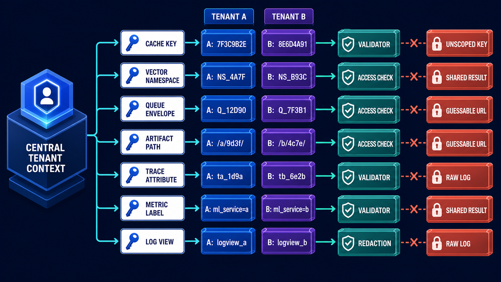
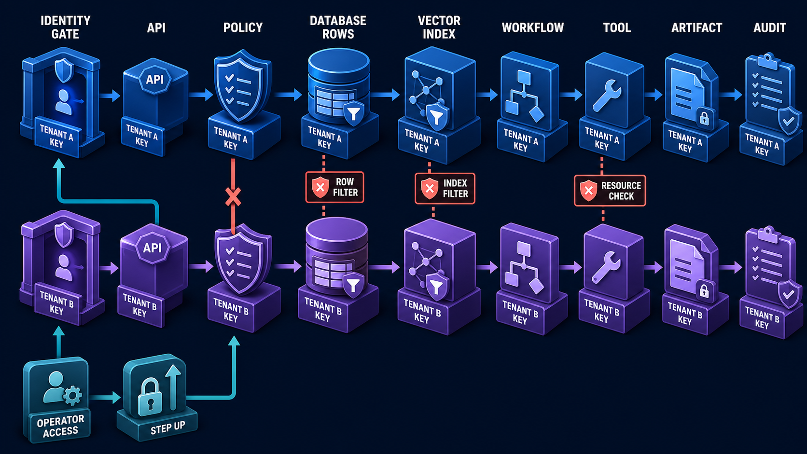

# Diagram 162 — Cache, Index, Queue, Artifact, and Telemetry Isolation

**Diagram number:** 162  
**Slug:** `cache-index-queue-artifact-telemetry-isolation`  
**Module ID:** `module-38`  
**Module:** Isolation, sandboxing, and egress  
**Stability:** Cross-layer isolation pattern  
**Role in the course:** Find the less obvious tenant leaks that survive even when the main database query is correct.  
**Layout:** A central trusted tenant context issues scoped keys to a cache key, a vector namespace, a queue envelope, an artifact path, a trace attribute, a metric label, and a log view. Blue Tenant A and violet Tenant B values stay separate. Coral unscoped keys, shared results, guessable URLs, and raw logs are blocked by a validator, an access check, and redaction.

---

## At a glance

**TRUSTED TENANT CONTEXT → CACHE KEY → VECTOR NAMESPACE → QUEUE ENVELOPE → ARTIFACT PATH → TRACE → METRIC → LOG VIEW**.

The diagram blocks four hidden leaks: **UNSCOPED KEY**, **SHARED RESULT**, **GUESSABLE URL**, and **RAW LOG**.

The rule is the same everywhere: a cached, queued, indexed, stored, or observed object is never reused or displayed outside the tenant and authorization context that created it.

The goal is to make tenant isolation survive the shortcuts that make systems fast.

---

## What the diagram teaches

### 1. Tenant isolation fails in the places you forget to check

Most teams start with row-level security, tenant columns, and scoped API endpoints. That is necessary, but it is not enough. The most dangerous leaks hide in the systems beside the database: the cache, the vector index, the queue, the artifact store, traces, metrics, logs, and support dashboards. The diagram makes those leaks visible by turning each supporting system into an explicit control point.

### 2. A cache key is a trust boundary

A cache is a copy of a previous answer. A copy does not remember the authorization that produced it. If the key contains only the query string, two tenants with the same question can receive the same answer. If it contains the tenant but not the user’s role or the current policy version, a revoked permission can keep returning an old allowed answer.

Build cache keys from tenant, resource, permission-relevant context, data version, and model or policy version. The version matters because a policy change must invalidate old entries. Permission context matters because two members of the same tenant may not see the same result. Resource and data version matter because stale data from another customer or another time is not a safe answer.

### 3. Vector namespaces need tenant filters

A semantic search can find answers that were never stored as exact rows. The same embedding space may hold vectors from many tenants. Without a tenant filter, “my refund” can return a vector that belongs to another customer with a similar case.

Apply server-side tenant filters to every vector and text search, including fallbacks. Fallbacks are especially dangerous. When a tenant-specific search returns nothing, the system may run a global search and filter afterward. That global search has already touched the other tenant’s vectors. Filter before the search, at the namespace or index level, and return a miss if nothing belongs to the caller.

### 4. A queue message is a delayed data request

Work queues decouple producers and consumers. A message created now may be processed later, on a different machine, after the caller has left. If the message does not carry the full tenant, resource, classification, and correlation context, the consumer has no way to enforce isolation at the time it acts.

Put trusted tenant, resource, classification, and correlation fields in validated queue envelopes. These fields must be set by the authenticated server context and protected from tampering while the message waits. A consumer that reads tenant from an unvalidated body, or fills a missing tenant from a default queue, can process one tenant’s work under the wrong identity.

### 5. An artifact URL is a download gate

Agents produce files: refund PDFs, generated images, exported reports, support transcripts. If the artifact store uses predictable, public URLs, an attacker can guess the path to another tenant’s file. If the browser downloads directly from object storage, the application never checks the caller.

Authorize artifact download through an application boundary or a short-lived tenant-bound URL. The user asks the server, the server checks tenant and permission, and only then returns a temporary signed URL or streams the bytes. A public object URL with a long lifetime and a guessable key is not isolation; it is a secret the internet can guess.

### 6. Telemetry is a read channel

Traces, metrics, and logs are easy to treat as internal plumbing, but they are also read channels. A trace may carry a customer case ID, a refund amount, or a sensitive query. A metric label may expose a tenant name. A log line may contain a user prompt or the content of a retrieved document.

Redact telemetry and restrict operator views with purpose, role, step-up, and audit. Redaction happens at collection, indexing, query time, and display time. An operator should see only the fields needed for the case, in the right role, after the right approval. Raw logs should never be the default view.

### 7. This diagram is the close-up of the previous lesson’s lanes

**Diagram 161 — Tenant isolation through every data and workflow layer** shows the high-level lanes: identity, API, policy, database, workflow, tool, artifact, and audit. The current diagram zooms into the half of that picture that is easiest to ignore. Caches, indexes, queues, artifacts, traces, metrics, and logs are the supporting actors behind the main stage, and they are where isolation is most often lost.

The two diagrams belong together. The first shows that tenant identity must travel through every layer. The second shows the specific shapes that travel takes when the layer is not a database or a workflow engine. Together they trace a tenant key from login all the way to a log line.

### 8. The analogy: even good locks fail when the lobby is shared

The analogy for this lesson is an apartment building. Correct apartment locks are important, but they are not enough if the lobby mixes packages, noticeboards, CCTV screens, and maintenance logs. A package with the wrong number, a noticeboard with every tenant’s mail, a CCTV screen pointed at the wrong door, and a maintenance log left on the desk all leak information.

That is exactly what an unscoped cache, a shared vector namespace, a tenant-less queue, a guessable artifact URL, and a raw log have in common. They move data to the wrong place not by breaking the main lock, but by using shared spaces that were never designed to keep tenant context.

### 9. This is a security contract, not a promise that a model will behave

Documents, retrieved text, model output, tool descriptions, remote cards, and external results are data until a trusted control deliberately grants them authority. The same is true for cached, queued, indexed, and observed data. The system must verify the relevant identity and tenant, evaluate narrow authority against the current context, constrain data and destinations, and preserve enough evidence to explain both allowed and denied outcomes.

A security contract means the design does not depend on the model noticing a mistake. If a cache key is scoped correctly, the model does not have to remember which tenant is asking. If a queue envelope carries a trusted tenant key, the consumer does not have to guess. If telemetry is redacted, an operator does not have to be careful.

### 10. Next.js: server-only helpers and typed records

- **Create server-only cache-key and artifact-access helpers that require a `TenantContext` and permission version.** Fail if either is missing. The browser should not compute cache keys, hold artifact URLs, or see object storage paths.
- **Keep tokens, policy decisions, secrets, and privileged mutations in authenticated server code.** Send the browser only the minimum display state.
- **Use typed request, decision, denial, approval, and receipt records so the React interface can explain security state without inventing it.** A denial should return the reason and the missing field, not a generic error.

### 11. Python: wrap every supporting client with tenant-scoped adapters

- **Wrap cache, vector, queue, artifact, and telemetry clients with typed tenant-scoped adapters and reject empty tenant context by construction.** A cache key, vector query, queue envelope, and artifact access should all require a non-optional `TenantContext`.
- **Use Pydantic models plus explicit middleware or service boundaries for identity, tenant, policy, data classification, and audit context.** Every object that crosses a boundary should carry its provenance.
- **Test allow and deny paths with hostile synthetic fixtures and dependency-injected identity, policy, storage, secret, and network adapters.** Prove that a cache key from Tenant B does not satisfy a request from Tenant A, that a vector query without a tenant filter is rejected, that a queue message with a missing tenant is dead-lettered, and that a raw log without redaction cannot reach an operator view.

### 12. The lab and checkpoint: tenant ID is only the start

The lab asks for an isolation matrix. The matrix lists cache, vector database, queue, blob store, traces, metrics, logs, and support UI. For each, it records the tenant key, the authorization check, the redaction rule, the retention policy, the deletion policy, and one negative test.

The checkpoint asks: *“Is adding tenant ID to a cache key always sufficient?”* The answer is no. Permission, resource state, source version, data classification, model or policy version, and user-specific context may also affect safe reuse. A cache key that contains the tenant but ignores the user’s role can still return an answer the user is no longer allowed to see. Tenant ID is the starting point, not the whole scope.

---

## Case study — Acme Refunds, the answer that belonged to someone else

### Situation

Maya asks about her refund. Her question is similar to one another Acme customer asked an hour earlier. The system uses a shared semantic cache to speed up common support answers. The cache is supposed to be scoped, but the team has not reviewed the key design in a while.

### What happened

1. The first customer’s answer is stored under a key that contains only the embedding and a “refund policy answer” flag. It has no tenant, case, permission context, or policy version.
2. Maya asks the same question. The cache lookup matches the previous embedding. Because the key has no tenant, the system considers the answer reusable.
3. The cached answer mentions a refund amount, a case number, and a payment method from the first customer—details that are not Maya’s.
4. Instead of returning it, the new design is in place: the cache key includes tenant, policy context, source version, and classification. The foreign entry cannot match Maya’s scoped key.
5. A cache miss triggers tenant-filtered retrieval instead of a global fallback. The retrieval finds Maya’s own refund status.
6. Telemetry records IDs and safe summaries, not the other tenant’s answer.

### Result

The legitimate refund answer is generated for Maya. The other customer’s details never appear. Performance layers do not silently bypass the authorization model.

### The danger to avoid

An unscoped cache or vector fallback can leak data faster and more consistently than a one-off database bug. A database bug might return one wrong row. A shared cache returns the wrong answer every time the same question is asked, for as long as the entry lives. A global vector fallback can touch every tenant’s embeddings before the system remembers to filter.

### Takeaway

**Isolation includes every place data waits, accelerates, moves, downloads, or gets observed.** A correct database query is the foundation, but caches, indexes, queues, artifacts, traces, metrics, and logs are the walls, pipes, and cameras of the building. If those are shared, the locks do not matter.

---

## Composition

The diagram is organized around one central tenant context and six supporting channels.

- **Center:** `TRUSTED TENANT CONTEXT` is the source of the tenant key and its scope.
- **Top row (six cards):** `CACHE KEY`, `VECTOR NAMESPACE`, `QUEUE ENVELOPE`, `ARTIFACT PATH`, `TRACE ATTRIBUTE`, `METRIC LABEL`, and `LOG VIEW`.
- **Tenant values:** `TENANT A` and `TENANT B` are shown in separate blue and violet values on each card.
- **Coral leak attempts:** `UNSCOPED KEY`, `SHARED RESULT`, `GUESSABLE URL`, and `RAW LOG` approach from the left.
- **Teal controls:** `VALIDATOR`, `ACCESS CHECK`, and `REDACTION` block the leak attempts.

The central placement of the tenant context tells the viewer that every supporting system receives its scope from the same trusted source. The repeated blue and violet values make the separation concrete. The coral paths are the traps; the teal controls are the guards.

---

## Element by element

- **TRUSTED TENANT CONTEXT** — the authenticated, authoritative source of tenant, role, purpose, and policy scope.
- **CACHE KEY** — a composite key with tenant, resource, permission context, data version, and policy or model version.
- **VECTOR NAMESPACE** — the logical partition or filter that keeps one tenant’s embeddings separate from another’s.
- **QUEUE ENVELOPE** — the trusted message wrapper that carries tenant, resource, classification, and correlation fields.
- **ARTIFACT PATH** — the application-controlled route to a stored artifact, not a public object URL.
- **TRACE ATTRIBUTE** — a span or trace field that has been scoped and redacted for observability.
- **METRIC LABEL** — a label that may include tenant context only in a safe, aggregated, or hashed form.
- **LOG VIEW** — the operator-facing view of logs, filtered by role, purpose, and step-up approval.
- **TENANT A** — one customer organization; shown in blue.
- **TENANT B** — another customer organization; shown in violet.
- **UNSCOPED KEY** — a cache, queue, or artifact key that lacks tenant and permission scope.
- **SHARED RESULT** — a cached or vector result reused across callers who should not share it.
- **GUESSABLE URL** — a predictable, public, or long-lived artifact URL that bypasses application access control.
- **RAW LOG** — unredacted telemetry that exposes customer content to operators or other systems.
- **VALIDATOR** — the control that rejects malformed, incomplete, or out-of-scope keys and messages.
- **ACCESS CHECK** — the control that verifies the caller is allowed to see the requested object.
- **REDACTION** — the control that removes, masks, or tokenizes sensitive fields before display or export.

---

## Colour and flow semantics

- **Cobalt platforms** represent the protected tenant context and the control cards that hold it.
- **Cyan arrows** show the intended data path from the trusted tenant context to each supporting system.
- **Teal controls** show the validator, access check, and redaction that make a path safe or prove it should be denied.
- **Coral paths** show the hidden leak attempts: unscoped keys, shared results, guessable URLs, and raw logs.
- **Blue and violet values** represent the two tenants and make the separation visible at every layer.

Cyan and teal are allowed; coral is the warning. The two tenant colors repeat on every card so the viewer cannot mistake a shared result for a scoped one.

---

## How to present it

**Start by asking the room where tenant isolation usually lives.** Most will say the database and the API. Then ask whether the cache, vector index, queue, artifact store, traces, metrics, and logs enforce tenant scope. The diagram is a map of the places they usually forget.

**Trace the central tenant context to each card.** Trusted tenant context → cache key, vector namespace, queue envelope, artifact path, trace attribute, metric label, log view. For each, ask how the system knows which tenant owns the object. If the answer is “we trust the caller to include it,” there is a leak.

**Show the second image, Diagram 161.** Explain that the previous lesson traced tenant identity through identity, API, policy, database, workflow, tool, artifact, and audit. This lesson zooms into the cache, index, queue, artifact, and telemetry lanes. The two diagrams together cover the full journey.

**Point at the four coral leaks.** Unscoped key, shared result, guessable URL, raw log. Ask which the team has seen. A shared cache is often the first; a raw log surprises operations; a guessable URL delights red teams.

**Use the cache-key discussion as a concrete exercise.** Write a sample key, add tenant ID, then ask whether it should also include role, policy version, data version, and classification. The checkpoint answer is that tenant ID alone is not enough. Let the room add fields until the key is truly scoped.

**Tell the Acme refund story.** The shared semantic cache has a similar answer for another tenant. The scoped key prevents reuse. The miss triggers tenant-filtered retrieval. Telemetry records safe summaries. The takeaway is that performance layers must not bypass the authorization model.

**Run the lab as a table exercise.** Have the room fill out an isolation matrix for cache, vector DB, queue, blob store, traces, metrics, logs, and support UI. For each, name the tenant key, authorization check, redaction rule, retention policy, deletion policy, and one negative test.

**Point at the Next.js and Python maps.** Server-only helpers, typed records, and tenant-scoped adapters are the implementation side. Ask which supporting clients require a `TenantContext` by construction. Any client that accepts an empty tenant is a bug waiting to happen.

**Mention the sources in context.** The `OWASP Multi-Tenant Security` cheat sheet covers tenant isolation across application, database, and infrastructure layers. The `OWASP Logging` cheat sheet covers what to log, what not to log, and how to protect log data from disclosure. Both apply directly to the coral paths.

**Connect to related lessons.** `Diagram 161` is the previous lesson on tenant isolation through every data and workflow layer. `Diagram 164` covers network egress, destination allowlists, and DLP, which deepen the artifact and telemetry controls. `Diagram 168` covers tamper-evident audit chains, which explains how to preserve the evidence of every isolation decision.

**Use the checkpoint as a closing question.** *“Is adding tenant ID to a cache key always sufficient?”* Let the room answer, then explain that permission, resource state, source version, data classification, model or policy version, and user-specific context may also affect safe reuse.

**Close on the glossary.**

- **Namespace** — a logical partition in a shared system, such as a vector index namespace or a cache prefix.
- **Semantic cache** — a cache that reuses an answer based on meaning similarity rather than an exact key match.
- **Telemetry** — logs, traces, metrics, and operational events produced by the system.

**Timing.** Twenty minutes for the trace and the story, plus ten minutes for the lab. If the room debates cache-key design or vector namespaces, allow an extra ten minutes.
## Lab and checkpoint

**Lab:** Make an isolation matrix for cache, vector DB, queue, blob store, traces, metrics, logs, and support UI. Add tenant key, auth check, redaction, retention, deletion, and negative test.

**Checkpoint:** Is adding tenant ID to a cache key always sufficient?

**Answer:** No. Permission, resource state, source version, data classification, model or policy version, and user-specific context may also affect safe reuse.

## Glossary

- **Namespace** — logical partition in a shared system
- **Semantic cache** — reused answer based on meaning similarity
- **Telemetry** — logs, traces, metrics, and operational events

## Sources

- OWASP Multi-Tenant Security
- OWASP Logging

