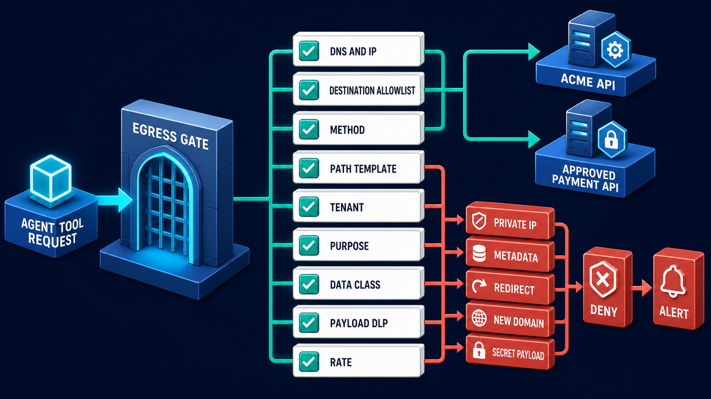
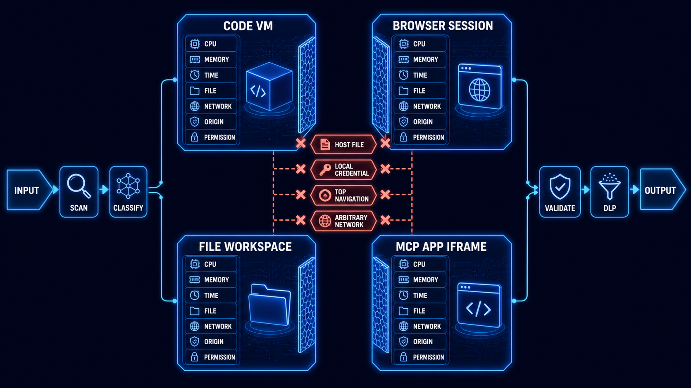

# Diagram 164 — Network Egress, Destination Allowlists, and DLP

**Module:** Isolation, sandboxing, and egress
**Role in the course:** how to broker agent and tool outbound traffic so arbitrary URLs cannot become data leaks, SSRF probes, or uncontrolled callbacks
**Layout:** an egress gate on the left, a vertical policy stack in the middle, allowed teal paths to approved APIs on the right, and denied coral paths to a deny-and-alert box below
**Stability:** Core outbound-control pattern

---

## At a glance

**AGENT TOOL REQUEST → EGRESS GATE → [DNS & IP, DESTINATION ALLOWLIST, METHOD, PATH TEMPLATE, TENANT, PURPOSE, DATA CLASS, PAYLOAD DLP, RATE] → ACME API or APPROVED PAYMENT API.**

The diagram denies five hostile outbound shapes:

- **PRIVATE IP** — internal network probing.
- **METADATA** — cloud metadata service abuse.
- **REDIRECT** — a second destination after a public hop.
- **NEW DOMAIN** — an unapproved or newly registered host.
- **SECRET PAYLOAD** — credentials, tokens, or payment data leaving the trust zone.

Each denied shape becomes **DENY + ALERT**. Allowed calls leave through a policy-aware adapter with a redacted egress receipt.

This is the company-mailroom view of outbound traffic: every package is checked for recipient, address, courier, contents, and return path.

---

## What the diagram teaches

### 1. Egress is a trust boundary, not an open door

Network egress is traffic that leaves a controlled environment. For an agent, that happens when it calls an API, fetches a document, posts a webhook, or follows a link. The diagram treats that moment as a named trust boundary because it is the last point where the organization still controls the request. Once a packet leaves, the organization must trust the destination, the path, and the caller’s intent all at once. Strong egress control makes that trust a policy decision before the call fires.

### 2. No raw URL from a model or document is fetched directly

An agent is surrounded by untrusted or semi-trusted text — retrieved pages, uploaded attachments, tool descriptions, remote Agent Cards, and model outputs. None of that text is a network destination until a trusted control validates it. If a prompt or document can name a URL and the system fetches it, the document becomes an instruction. An attacker only needs the agent to read a URL and act on it.

### 3. Logical connector names beat absolute URLs

The gate maps a logical connector name to a controlled base destination instead of accepting a raw URL. The payment tool, for example, accepts a *logical provider operation* and resolves it to an approved endpoint through a known adapter. The agent never sees the actual endpoint as an editable string. The caller cannot supply `http://169.254.169.254/latest/meta-data/` because the system does not look at arbitrary strings; it looks at a pre-registered name, a known operation, and an approved policy record.

### 4. Destination allowlists are necessary but not sufficient

A destination allowlist is an explicit set of permitted targets, but it is not enough on its own. The diagram lists nine checks because a hostname can hide many destinations. The same host can resolve to a different IP after DNS rebinding. A redirect can land on a private address. An IPv6 form or alternate encoding can bypass string comparison. A port or scheme can change the call’s meaning. The allowlist is the starting gate, not the finish line.

### 5. Resolve and validate every network transition

The gate resolves and validates scheme, host, port, DNS result, IP range, method, path, and redirect behavior. Each is a transition point where the destination can change. DNS tells you what the name currently resolves to. The IP must not be private, loopback, link-local, or a cloud metadata address. The method and path must match the approved operation profile. A redirect is a new destination and must be rechecked from the top.

### 6. Context, tenant, and purpose are policy inputs

The gate evaluates caller, tenant, purpose, data class, payload fields, rate, and expected response limits. An allowed destination for one tenant may be forbidden for another. A retrieval for a refund may be allowed; the same retrieval for marketing may not. Data class matters because a support transcript and a payment token are not equally exportable. Rate matters because quiet, slow exfiltration looks normal until it is measured. The policy is a function of the current request context, not a static host list.

### 7. DLP is the payload gate before the adapter fires

DLP inspects the payload before the adapter sends it. It can block or redact forbidden data classes, detect secret-bearing headers, and stop a tool from forwarding credentials or customer data to an external host. Even an approved destination can receive a wrong body. A payment token, session cookie, or full customer record should never ride along with a routine outbound call. DLP turns the request body into an explicit policy object, not an opaque stream.

The egress gate is one wall of a larger containment design. Diagram 163 shows four separate sandboxes — CODE VM, BROWSER SESSION, FILE WORKSPACE, and MCP APP IFRAME — each with CPU, memory, time, file, network, origin, and permission limits. Egress is the network wall. A sandboxed agent still needs the egress gate because the sandbox blocks host access, while the gate blocks the wrong phone-home destination with the wrong payload.

### 8. The adapter itself is a controlled chokepoint

Approved calls do not exit through a generic HTTP client. They pass through a policy-aware adapter with a short timeout, bounded response size, credential isolation, and safe parsing. The adapter does not forward secret-bearing headers from the caller; it uses its own short-lived credentials, scoped to the approved destination and operation. Safe parsing limits response size and format so a huge or malformed payload cannot crash the consumer or hide exfiltrated data.

### 9. A redirect is a new request, not a continuation

A redirect must be validated again because the new destination may have a different host, IP range, trust level, or permission, and it could receive credentials or protected data. The first hop may be a well-known public service, but the second may point to an internal metadata service, a malicious host, or a different scheme that bypasses TLS. The diagram treats each redirect as a new AGENT TOOL REQUEST that must re-enter the gate. If any hop fails, the chain is denied.

### 10. Allowed and denied calls both need evidence

The diagram ends every decision with a receipt or an alert. Allowed calls receive a redacted egress receipt. Denied calls raise an alert and preserve the destination, reason, and calling context. Repeated probing or sensitive-data attempts are escalated. A denial without evidence is unreviewable; an allowed call without a receipt cannot be audited. The receipt turns an invisible gate into an accountable control.

### 11. The Next.js map keeps adapters server-only and typed

The Next.js implementation uses server-only connector adapters with fixed base URLs and path builders. It rejects client, model, or document-supplied absolute URLs at privileged boundaries. Tokens, policy decisions, secrets, and privileged mutations stay in authenticated server code; the browser receives only the minimum display state. Typed request, decision, denial, approval, and receipt records let the React interface explain security state without inventing it.

If the browser can supply a URL the server fetches, the browser is an egress path. If the model can concatenate a URL the server fetches, the model is an egress path. The adapter must live in server code and be bound to a known connector.

### 12. The Python map uses a hardened client and hostile fixtures

The Python implementation builds a hardened outbound HTTP client that resolves and validates targets, disables unsafe redirect behavior, limits responses, and emits policy-linked receipts. Pydantic models and explicit middleware or service boundaries carry identity, tenant, policy, data classification, and audit context. Tests exercise allow and deny paths with hostile synthetic fixtures and dependency-injected identity, policy, storage, secret, and network adapters.

The lab’s twelve cases — new domain, subdomain trick, DNS rebinding, private IPv4, IPv6 local, metadata IP, redirect, credential forwarding, oversized response, slow response, secret payload, and allowed provider call — are the test list every adapter should pass.

---

## Case study — Acme, the attachment, and the verification URL

A vendor sends Maya an attachment that asks the Acme refund agent to fetch a verification URL. The URL points to a well-known public host, but that host redirects through a chain that ends at a cloud metadata address.

### What they had

The first design used a generic content fetcher. The agent could retrieve any URL whose hostname matched a short approved list. There was no DNS resolution check, no redirect re-validation, no IP filter, and no payload inspection. A `200 OK` from an allowed hostname was treated as success.

### The incident

The attachment’s URL passed the hostname check. The server fetched it and received a `302 Redirect`. The generic fetcher followed the redirect through a second host and then to `http://169.254.169.254/latest/meta-data/iam/security-credentials/`. Because the request was made from the server’s own network position, the cloud provider returned a temporary credential set.

The credential was not immediately useful because the response went to the model context, not a tool. But the attacker had proven that an uploaded document could turn the agent into an internal network probe.

### The egress design

The new design adds an egress gate in front of every outbound call:

1. **AGENT TOOL REQUEST** enters as a typed record with logical connector, operation, tenant, purpose, and data class.
2. **DNS & IP** checks resolved A/AAAA records against private, link-local, and metadata ranges.
3. **DESTINATION ALLOWLIST** matches the connector to a pre-approved base destination.
4. **METHOD** and **PATH TEMPLATE** are checked against the allowed operation profile.
5. **TENANT**, **PURPOSE**, and **DATA CLASS** are evaluated against the request context.
6. **PAYLOAD DLP** scans for tokens, secrets, and forbidden data classes before the body leaves.
7. **RATE** and response limits are checked.
8. A **policy-aware adapter** makes the call with its own short-lived credentials and a short timeout.
9. Any **REDIRECT** is treated as a new request and re-evaluated from step 2.
10. **DENY + ALERT** records the decision and raises an SSRF alert for probing or sensitive-data attempts.

When the same attachment is tested again, the redirect is re-resolved. The metadata IP is rejected, the credential-bearing response never reaches the agent, and security receives a named alert.

### Results

- **SSRF through uploaded documents:** blocked.
- **Internal network probing via redirect:** blocked.
- **Secret payload forwarding:** blocked by DLP.
- **Egress decisions:** auditable with redacted receipts and alerts.
- **New approved provider onboarding:** a connector registry change, not a code deployment.

### The line in their operations standard

*No model-generated or document-supplied URL is fetched directly. Every outbound request is brokered by destination, purpose, payload, tenant, and every network hop.*

---

## Composition

The picture is an egress-control gate. On the left, an **AGENT TOOL REQUEST** enters a cobalt **EGRESS GATE**. Inside, a vertical stack of checks reads from top to bottom: **DNS & IP**, **DESTINATION ALLOWLIST**, **METHOD**, **PATH TEMPLATE**, **TENANT**, **PURPOSE**, **DATA CLASS**, **PAYLOAD DLP**, and **RATE**.

Two teal arrows leave the right side toward **ACME API** and **APPROVED PAYMENT API**. Five coral paths leave the bottom toward **PRIVATE IP**, **METADATA**, **REDIRECT**, **NEW DOMAIN**, and **SECRET PAYLOAD**, each ending at **DENY + ALERT**.

The gate is the central visual element because every outbound request, allowed or denied, passes through it.

## Element by element

- **AGENT TOOL REQUEST** — the typed outbound request from an agent or tool.
- **EGRESS GATE** — the controlled boundary where every outbound call is evaluated.
- **DNS & IP** — resolution and IP-range validation.
- **DESTINATION ALLOWLIST** — the explicit set of permitted logical destinations.
- **METHOD** — the allowed HTTP or protocol method.
- **PATH TEMPLATE** — the approved path shape, not a free-form string.
- **TENANT** — the tenant context that scopes the request.
- **PURPOSE** — the reason the call is being made.
- **DATA CLASS** — the classification of the data involved.
- **PAYLOAD DLP** — content inspection before the body leaves.
- **RATE** — request rate and volume limits.
- **ACME API** — an approved internal or partner API.
- **APPROVED PAYMENT API** — an approved payment-provider endpoint.
- **PRIVATE IP** — an internal address that must not be reached from the gate.
- **METADATA** — a cloud metadata service that can leak credentials.
- **REDIRECT** — a destination change that requires re-validation.
- **NEW DOMAIN** — an unapproved or unreviewed host.
- **SECRET PAYLOAD** — a request body that carries credentials or protected data.
- **DENY + ALERT** — the blocked outcome and security signal.

---

## Colour and flow semantics

The course visual grammar applies directly.

- **Cobalt platform** — a protected boundary or resource. The EGRESS GATE, ACME API, and APPROVED PAYMENT API are cobalt.
- **Cyan arrow** — a request, delegated authority, tool call, or intended data path. The AGENT TOOL REQUEST is cyan.
- **Teal arrow** — a verified identity, allowed decision, safe result, receipt, evidence, or review path. The approved routes are teal.
- **Coral path** — an injection, replay, privilege error, data leak, denial, quarantine, exception, or residual risk. The five denied outbound shapes are coral.
- **White card** — an identity, token, claim, policy, tenant key, approval, artifact, audit event, or evidence record. The policy labels and destination names are white cards.

The overall flow moves left to right for allowed calls and top to bottom for denied ones. The vertical stack is a sequence of checks; the coral paths below it show the most common failure modes.

---

## How to present it

- **Ask how the room currently fetches URLs for agents.** Most teams describe a list of allowed hostnames or a base-URL environment variable. Ask what happens when a remote service redirects.
- **Point at the nine checks in the gate.** DNS & IP, allowlist, method, path, tenant, purpose, data class, payload DLP, rate. Ask which are enforced today.
- **Trace the allowed flow.** AGENT TOOL REQUEST → gate → ACME API or APPROVED PAYMENT API. The teal path only happens after the full stack passes.
- **Trace one denial at a time.** Start with METADATA: a document contains `http://169.254.169.254/...`. Show the resolved IP failing the range check before any call is made.
- **Emphasize the redirect.** Ask whether the fetcher follows redirects blindly. Then show the REDIRECT path to DENY + ALERT. A redirect is a new request.
- **Show Diagram 163 as the containment partner.** The egress gate is the network wall of the sandbox picture. A sandboxed browser, code VM, file workspace, or MCP App still needs the egress gate to prevent phone-home or credential forwarding.
- **Point at PAYLOAD DLP.** Ask what data classes are allowed inside an outbound body. A destination can be approved while the payload is not.
- **Tell the Acme verification-URL story.** A public host redirected to a metadata service. The fix was not a bigger allowlist; it was a gate that re-resolves and re-validates every hop.
- **Use the lab as a test-design exercise.** Have the room write the twelve egress tests for new domain, subdomain trick, DNS rebinding, private IPv4, IPv6 local, metadata IP, redirect, credential forwarding, oversized response, slow response, secret payload, and allowed provider call.
- **Close on the standard.** *No model-generated or document-supplied URL is fetched directly. Every outbound request is brokered by destination, purpose, payload, tenant, and every network hop.*
- **Ask who can add a new outbound connector.** If anyone can update an environment variable, the egress control is not governed. New destinations need review, ownership, and evidence.
- **Mention the sources in context.** MCP security best practices and authorization security considerations both call for controlled tool execution; NIST Zero Trust Architecture treats the network as untrusted and enforces per-request policy.

---

## Lab and checkpoint

**Lab:** Design twelve egress tests covering new domain, subdomain trick, DNS rebinding, private IPv4, IPv6 local, metadata IP, redirect, credential forwarding, oversized response, slow response, secret payload, and allowed provider call.

**Checkpoint:** Why should a redirect be validated again?

**Answer:** Because the new destination may have a different host, IP range, trust level, or permission and could receive credentials or protected data.

---

## Glossary

- **Egress** — outbound network or data flow.
- **SSRF** — a server-side request forgery in which the server is tricked into making an unintended request.
- **Allowlist** — an explicit set of permitted targets.
- **DNS rebinding** — an attack that causes a domain to resolve to a different, often internal, IP address after an initial lookup.
- **Metadata IP** — a well-known cloud address, such as `169.254.169.254`, that can return instance credentials.
- **DLP** — data loss prevention, the inspection and control of data leaving a trust boundary.

---

## Related lessons

- **Diagram 152 — Data exfiltration and unsafe side effects:** maps how agent outputs can leak data before they reach the network.
- **Diagram 160 — Secret managers, short-lived credentials, and rotation:** explains why credentials must not be carried in payloads and how adapters obtain their own scoped tokens.
- **Diagram 163 — Sandboxed code, browser, file, and MCP App execution:** shows the containment walls that surround the agent before the egress gate is even reached.

---

## Sources

- MCP security best practices
- MCP authorization security considerations
- NIST Zero Trust Architecture
