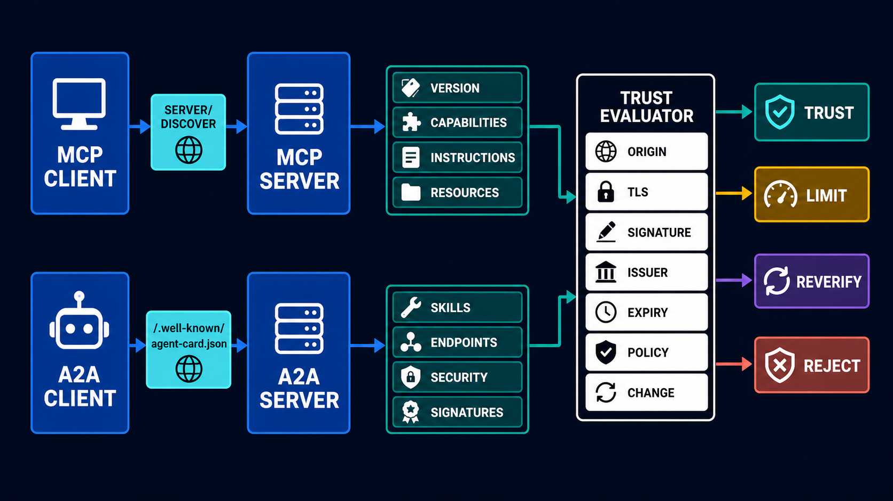
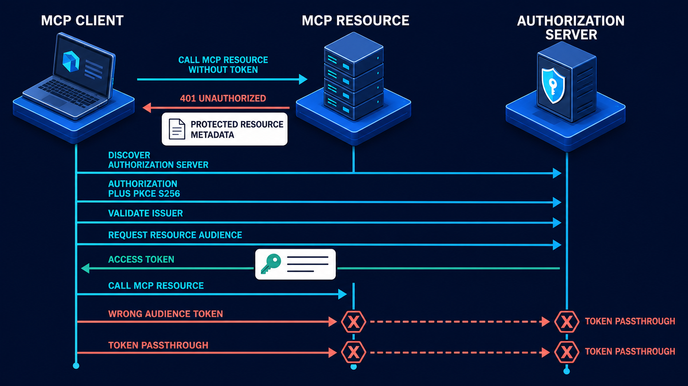

# Diagram 165 — MCP server discovery, A2A Agent Cards, signatures, and trust decisions

**Module:** Supply chain, privacy, and audit evidence  
**Stability:** Current MCP 2026-07-28 · A2A 1.0  
**Role in the course:** how to learn capabilities without mistaking remote metadata for trust or authorization  
**Layout:** two discovery lanes on a dark canvas. The left lane shows an MCP client sending `server/discover` to an MCP server and receiving `VERSION`, `CAPABILITIES`, `INSTRUCTIONS`, and `RESOURCES`. The right lane shows an A2A client fetching `/.well-known/agent-card.json` and receiving `SKILLS`, `ENDPOINTS`, `SECURITY`, and `SIGNATURES`. Both lanes converge on a central `TRUST EVALUATOR` that checks `ORIGIN`, `TLS`, `SIGNATURE`, `ISSUER`, `EXPIRY`, `POLICY`, and `CHANGE`. The evaluator emits one of four decisions: `TRUST`, `LIMIT`, `REVERIFY`, or `REJECT`.

---

## At a glance

**MCP CLIENT → `server/discover` → MCP SERVER** returns `VERSION`, `CAPABILITIES`, `INSTRUCTIONS`, and `RESOURCES`.

**A2A CLIENT → `/.well-known/agent-card.json` → A2A AGENT CARD** returns `SKILLS`, `ENDPOINTS`, `SECURITY`, and `SIGNATURES`.

Both lanes flow into the **TRUST EVALUATOR**, which checks **ORIGIN**, **TLS**, **SIGNATURE**, **ISSUER**, **EXPIRY**, **POLICY**, and **CHANGE**.

From the evaluator, the remote party is either **TRUSTED**, **LIMITED**, sent back for **REVERIFICATION**, or **REJECTED**.

The lesson is the same across both protocols: **a remote party can describe its own interface, but that description is data until independent verification, policy, and caller consent make it usable**.

---

## What the diagram teaches

### 1. Discovery is a claim, not trust or authorization

Discovery is the act of learning what a remote party says it can do. MCP 2026-07-28 answers that with `server/discover`. A2A 1.0 answers it with a well-known `agent-card.json`. Both return useful metadata: supported versions, capabilities, skills, endpoints, instructions, security schemes, and optional signatures. But the diagram places all of that metadata in a **TRUST EVALUATOR** before it can influence a connection, a credential, a tool call, or a delegation.

That placement is the central point. The remote party is making a claim about itself. A claim can be true, false, outdated, or malicious. The system must decide whether to trust the claim, limit its use, reverify it, or reject it. Discovery is therefore the first step in an identity and security conversation, not the last. The language model, the agent, and the calling code must treat the discovered card or server metadata as untrusted data until the evaluator deliberately grants it a trust level.

### 2. MCP `server/discover` is the new stateless handshake

MCP 2026-07-28 retires the older `initialize` handshake and replaces it with `server/discover`. The server returns `VERSION`, `CAPABILITIES`, `INSTRUCTIONS`, and `RESOURCES`. The protocol is stateless and carries version and client capabilities per request.

This change matters because every request can be evaluated on its own. There is no lingering session that silently inherits outdated server claims. If the server updates its capabilities, the next `server/discover` can learn the new state, or the client can compare the response with a pinned or previously approved state and choose to reverify. The diagram draws this as an explicit lane because the client must still authenticate the server, validate the origin, and decide whether the advertised capabilities match its policy before it treats the server as a trusted tool provider.

### 3. A2A Agent Cards are well-known metadata with optional signatures

An A2A Agent Card is usually published at `/.well-known/agent-card.json`. It advertises `SKILLS`, `ENDPOINTS`, `SECURITY` schemes, and `SIGNATURES`. The card tells a would-be client how to speak to the agent, what operations the agent claims to support, and how the client can prove its own identity or authorize a request.

A card is a self-description, which is why the diagram does not let it skip the trust evaluator. The card may be signed with a JWS, which helps the client verify that the card was issued by a known signer and has not been altered in transit. But a signature is not the same as a guarantee that every skill is safe, appropriate for the caller, or authorized for the current case. The signature only adds one more input to the evaluator; it does not automatically produce `TRUST`.

### 4. The trust evaluator is the boundary between description and authority

The **TRUST EVALUATOR** sits in the middle of the diagram and receives both lanes. It is a protected control, drawn as a cobalt platform, because it is the place where remote description gets converted into a trust decision. Inside the evaluator are seven checks: `ORIGIN`, `TLS`, `SIGNATURE`, `ISSUER`, `EXPIRY`, `POLICY`, and `CHANGE`.

- **ORIGIN** — is the metadata coming from the intended party or an attacker-controlled redirect?
- **TLS** — is the transport protected and the certificate valid?
- **SIGNATURE** — is the card or discovery response signed, and can the signature be verified?
- **ISSUER** — is the signer in the approved registry or key set?
- **EXPIRY** — is the card or server state within its validity window?
- **POLICY** — does the advertised interface match the caller's allowed use and the organization's governance rules?
- **CHANGE** — does this version differ from the previously approved state, and if so, has the change been reviewed?

These checks are independent. Failing any one of them can move the decision away from `TRUST`.

### 5. The four trust decisions mean different things

The evaluator emits four outputs, and each has a concrete operational meaning.

- **TRUST** — the metadata is from an approved origin, verified by the right checks, and consistent with policy. The client may proceed, but only within the constraints that the evaluator records.
- **LIMIT** — the metadata is partially acceptable. The client may use some capabilities, but not all. For example, the card may be accepted for information lookup but not for payment skills, or it may be trusted only inside a sandbox.
- **REVERIFY** — the metadata has changed, expired, or come from an unusual context. The client must fetch and evaluate the card again before acting, and possibly route the change through an approval workflow.
- **REJECT** — the origin, transport, signature, issuer, expiry, policy, or change check has failed. No credential, tool call, or delegation should proceed, and the failed attempt should be preserved as evidence.

These four states make trust a managed, reviewable property instead of a single boolean assumption.

### 6. Origin, TLS, and SSRF protection are the first gates

The first three checks in the evaluator are about the network identity of the metadata. The client should fetch discovery only from an intended origin, over TLS, with safe redirect handling and SSRF controls. An attacker can publish a fake card on a similar-looking domain, or they can embed a malicious endpoint inside an uploaded document and trick the agent into treating it as a discovered server.

The diagram rejects the pattern of following a document-supplied endpoint. Fetching `/.well-known/agent-card.json` from a domain that a vendor PDF mentions is not the same as fetching it from an approved partner registry. The `ORIGIN` and `TLS` checks force the client to separate *where the metadata was found* from *who claims to have produced it*. SSRF protection, safe redirects, and strict URL allowlists keep the discovery client from becoming a tool for scanning internal networks or exfiltrating data.

### 7. Discovery is not authorization; the card advertises security schemes, it does not carry credentials

The A2A Agent Card carries `SECURITY` schemes, not credentials. It can say, "This agent supports OAuth 2.0 with a particular authorization server and resource audience." It does not contain the user's access token, refresh token, or any other secret. That is a deliberate separation. Discovery tells the client how to ask for authorization. Authorization, usually through an out-of-band OAuth flow, is what actually issues the token.

The same is true for MCP. `server/discover` may describe supported authorization and security schemes, but the actual access token comes from an OAuth or enterprise-managed authorization flow that the client must complete separately. The diagram makes this separation visible by drawing the discovery lane and the trust evaluator before any credential or delegated work.

**Diagram 154 — OAuth, OpenID Connect, resource metadata, and audiences** shows the next step. An MCP client receives protected-resource metadata, discovers the authorization server, runs an authorization-code flow with PKCE, validates the issuer, and requests a token bound to the resource audience. The MCP resource then validates signature, issuer, audience, expiry, and claims before any policy decision. Discovery and authorization are separate lanes that meet at the trust boundary.

### 8. A signature proves the signer, not the safety of every advertised skill

When an A2A Agent Card is signed, the client can verify that the card was created by the holder of an accepted key and has not been tampered with since signing. That is a strong integrity and provenance control. But the diagram warns against a common mistake: assuming that a valid signature means every skill in the card is safe or appropriate for the current caller.

A signature proves control of a signing key under a policy. It does not prove that the advertised refund skill will not be used to steal money, or that the agent will keep data inside the right tenant, or that the skill is approved for Maya's case. The trust evaluator must still compare the skills, endpoints, security schemes, and instructions with the organization's policy, the caller's entitlements, and the prior approved state. A signed card can still be limited, sent for reverification, or rejected if its contents violate policy.

### 9. Change control and expiry keep trust fresh

Remote interfaces are not static. A server can release a new version, a card can add a new skill, an endpoint can move, or a signing key can rotate. The `CHANGE` and `EXPIRY` checks in the evaluator make these transitions visible rather than automatic.

The client should keep a snapshot of the previously approved metadata and compare the newly discovered version against it. If the version, skills, endpoints, security scheme, or instructions have changed, the client does not silently accept the new state. It emits `REVERIFY` and routes the change through a review or approval process. If the card has expired, the same thing happens. Trust is not a one-time decision made at install time; it is a continuous property that the system re-evaluates whenever the metadata changes or ages out.

### 10. Next.js map — a server-only discovery registry with typed records

In a Next.js application, the discovery and trust logic belongs in authenticated server code. The browser should not fetch remote agent cards or MCP server metadata directly, because the browser cannot hold the full security context and cannot safely evaluate signatures, issuer registries, or policy.

- Create a **server-only discovery registry** that stores fetched metadata, verification evidence, approved changes, trust status, expiry, and last review. The registry is the single place where `TRUST`, `LIMIT`, `REVERIFY`, and `REJECT` decisions are recorded.
- Keep tokens, policy decisions, secrets, and privileged mutations in authenticated server code, and send the browser only the minimum display state. A remote card, a model output, or a discovered capability should never become the basis for a privileged mutation on the client.
- Use typed `request`, `decision`, `denial`, `approval`, and `receipt` records so the React interface can explain the trust state without inventing it. The UI can show the user that a remote agent is `LIMITED` because its card has a new, unreviewed skill, or that an MCP server is `REJECTED` because its issuer is not in the registry.

### 11. Python map — strict versioned models, canonical signatures, and safe fetch adapters

In a Python backend, the same evaluator can be built with Pydantic, strict models, and dependency-injected adapters.

- Use **strict versioned discovery models** that parse the `server/discover` response or the A2A card into typed objects. Unknown fields should not become authoritative; they should be ignored or quarantined for review.
- Apply **canonical signature verification** against an accepted key and signing policy. The verification must use a deterministic canonicalization so that a valid JWS cannot be undermined by whitespace or JSON reordering. If the signature does not verify, the card is rejected.
- Use **safe fetch adapters** that enforce origin, TLS, redirect, and SSRF policy, and test both allowed and deny paths with hostile synthetic fixtures. The tests should cover unsigned partners, changed endpoints, document-supplied unknown agents, and unverifiable signatures.

### 12. The trace is the testable checklist for any remote interface

The diagram's trace is a five-step recipe that applies to both MCP and A2A:

1. Fetch discovery only from an intended origin through TLS and safe redirect plus SSRF controls.
2. Parse versioned metadata strictly and keep unknown fields non-authoritative.
3. For A2A signatures, canonicalize and verify against an accepted key and signing policy when present.
4. Compare skills, endpoints, security schemes, and instructions with prior approved state.
5. Trust, limit, reverify, quarantine, or reject before sending credentials or delegating work.

This trace turns the diagram into a testable contract. Every `TRUST` decision should have evidence for each of the seven checks. Every `REJECT` decision should record which check failed and why. A control that accepts or rejects a remote interface without evidence is only half a control.

---

## Case study — The fake finance agent

### Situation

Maya is still working on the refund case. The vendor attachment she uploaded earlier, which is already labeled as untrusted content, points to a new "finance agent" and says the agent can handle refunds. The attachment includes a URL to a `/.well-known/agent-card.json` that advertises refund skills and asks the client to send Maya's payment token so the agent can process the refund.

This is a classic discovery attack. The attachment is trying to become both a discovery source and an instruction. It wants the client to follow the document-supplied endpoint, trust the fake card, and hand over a credential.

### Walkthrough

The Acme design stops the attack in four places:

1. **Acme does not follow the document-supplied endpoint as trusted discovery.** The URL in the PDF is treated as untrusted data, not as an approved origin. The A2A client fetches cards only from the approved partner registry, and the origin check in the trust evaluator fails.
2. **The origin is not on the approved partner registry and its security scheme differs from policy.** Even if the client visited the URL, the `ORIGIN`, `ISSUER`, and `POLICY` checks would fail. The card is not signed by an accepted key, and the advertised security scheme does not match Acme's approved scheme.
3. **No credential is sent and no A2A task is created.** Because the card is rejected before `TRUST`, the client never begins an OAuth flow, never obtains an access token, and never delegates work to the fake agent.
4. **The card, origin, and attempted redirect are quarantined as evidence.** The rejection is not a silent failure. It produces a decision record with the card content, the origin, the policy that was violated, and the attachment reference. Security can review the quarantine and improve the discovery registry.

### Result

Remote metadata can be inspected without turning attacker-controlled discovery into delegated authority. The legitimate refund continues through the approved Acme payment MCP server, which is already in the discovery registry and has passed the trust evaluator. The fake finance agent is rejected and observable.

### The danger

A signed card only proves that the card was produced by someone who controls a signing key under a policy. It does not prove that every advertised skill is safe, appropriate for Maya's case, or aligned with Acme's governance. If the team treated a signature as full trust, the fake agent could still cause harm. Trust is a multi-factor decision, not a binary result of one successful check.

### Takeaway

**Discover claims first; verify trust and authorize action separately.** The card and the discovery response are data. Origin, transport, signature, issuer, expiry, policy, and change control decide what trust level that data deserves. Only after the trust evaluator has made its decision can the system consider credentials, delegation, or tool calls.

---

## Composition

The diagram is organized as two horizontal discovery lanes that converge on a central trust evaluator and four trust decisions.

- **Left lane — MCP discovery:** `MCP CLIENT` sends `server/discover` to `MCP SERVER`. The server returns `VERSION`, `CAPABILITIES`, `INSTRUCTIONS`, and `RESOURCES` as white cards. A cyan arrow carries the request; teal arrows carry the verified response.
- **Right lane — A2A discovery:** `A2A CLIENT` fetches `/.well-known/agent-card.json` from `A2A AGENT CARD`. The card returns `SKILLS`, `ENDPOINTS`, `SECURITY`, and `SIGNATURES` as white cards. The request is a cyan arrow; the response is teal when verified.
- **Center — TRUST EVALUATOR:** a cobalt platform that receives both lanes. Inside it are seven white-card checks: `ORIGIN`, `TLS`, `SIGNATURE`, `ISSUER`, `EXPIRY`, `POLICY`, and `CHANGE`.
- **Outputs — four decisions:** `TRUST`, `LIMIT`, `REVERIFY`, and `REJECT`. `TRUST` and `LIMIT` are teal because they allow constrained action. `REVERIFY` is a warning state. `REJECT` is coral because it represents a denial, quarantine, or residual risk.
- **Boundaries:** the entire evaluator is a trust boundary. Nothing in either discovery lane is allowed to influence connection, credentials, tools, or delegation until it has passed through the evaluator.

---

## Element by element

- **MCP CLIENT** — the client that uses the Model Context Protocol.
- **`server/discover`** — the MCP 2026-07-28 method that replaces the retired `initialize` handshake.
- **MCP SERVER** — the remote server that advertises version, capabilities, instructions, and resources.
- **VERSION** — the supported protocol or server version.
- **CAPABILITIES** — what the server claims it can do.
- **INSTRUCTIONS** — guidance or constraints the server provides to the client.
- **RESOURCES** — what the server makes available to the client.
- **A2A CLIENT** — the client that wants to interact with another agent.
- **`/.well-known/agent-card.json`** — the A2A well-known endpoint for an Agent Card.
- **A2A AGENT CARD** — the metadata document that describes an A2A agent's skills, endpoints, security schemes, and signatures.
- **SKILLS** — the operations the agent claims to support.
- **ENDPOINTS** — where the agent accepts requests.
- **SECURITY** — the authentication and authorization schemes the agent supports.
- **SIGNATURES** — the JWS signatures that protect the integrity and provenance of the card.
- **TRUST EVALUATOR** — the protected control that converts discovered metadata into a trust decision.
- **ORIGIN** — the source of the metadata, verified against an approved registry or intent.
- **TLS** — the transport security of the discovery fetch.
- **SIGNATURE** — the cryptographic signature on the A2A card.
- **ISSUER** — the signer or key set that the client is willing to trust under a signing policy.
- **EXPIRY** — the validity window of the metadata.
- **POLICY** — the organizational rules that compare the metadata to allowed use.
- **CHANGE** — the difference between the current discovered metadata and the previously approved state.
- **TRUST** — the decision that the metadata is fully acceptable for the intended use.
- **LIMIT** — the decision that only a subset of the metadata may be used.
- **REVERIFY** — the decision that the metadata must be fetched and evaluated again because it has changed or expired.
- **REJECT** — the decision that the metadata is not acceptable and must not be used.

---

## Colour and flow semantics

- **Cyan arrows** carry the request or discovery path. They show the MCP client asking `server/discover` and the A2A client fetching the Agent Card.
- **Teal arrows** carry the verified, allowed, or safe response. The `VERSION`, `CAPABILITIES`, `INSTRUCTIONS`, `RESOURCES`, `SKILLS`, `ENDPOINTS`, `SECURITY`, and `SIGNATURES` cards are data that has been received but not yet trusted. Once the evaluator reaches `TRUST` or `LIMIT`, the flow is teal.
- **Coral** marks denial, quarantine, or residual risk. The `REJECT` output is coral because it represents a failed check. Any path that tries to bypass the evaluator, such as following a document-supplied endpoint, is also coral.
- **Cobalt platforms** represent the protected control points and governance boundaries. The `MCP SERVER`, `A2A AGENT CARD`, and `TRUST EVALUATOR` are all cobalt because they are places where trust changes.
- **White cards** represent identity, token, claim, policy, or evidence records. In this diagram they are the metadata fields and the decision outputs. They are records that must be preserved and attributed.

The visual message is that both lanes start as untrusted claims, pass through the same central evaluator, and only then become a trust decision. There is no shortcut around the evaluator.

---

## How to present it

**Open with the business directory analogy.** A business directory and a signed brochure can help verify who a company claims to be, but neither gives that company permission to enter your bank account. Ask the room what they would check before letting an unknown supplier process a payment. The same checks appear in the diagram as origin, TLS, signature, issuer, expiry, policy, and change.

**Trace the two discovery lanes.** On the left, `MCP CLIENT → server/discover → MCP SERVER`. On the right, `A2A CLIENT → /.well-known/agent-card.json → A2A AGENT CARD`. Ask which protocols the team is using today and where they store the discovered metadata.

**Pause at the trust evaluator.** Name the seven checks: origin, TLS, signature, issuer, expiry, policy, change. For each one, ask whether the current system has an explicit test. Most teams have TLS and origin checks but not policy or change checks. The policy and change gaps are where undetected drift and supply-chain attacks happen.

**Explain the four outputs.** `TRUST` is not the default; it is the result of all checks passing. `LIMIT` is a common and useful state. `REVERIFY` is the safe reaction to change. `REJECT` is a decision with evidence.

**Show Diagram 154 as the next step.** Discovery finds the card; authorization obtains the token. Emphasize that the A2A card carries `SECURITY` schemes, not credentials. The client still has to complete a separate OAuth flow, validate the issuer and audience, and receive a scoped access token before it can call the agent. The trust evaluator and the OAuth flow are independent controls that both must pass.

**Tell the fake-finance-agent story.** The attachment tries to redirect the agent to a new card, advertise refund skills, and obtain Maya's payment token. The origin is not in the registry, the security scheme is wrong, no credential is sent, and the card is quarantined as evidence. The legitimate refund proceeds through the approved MCP server.

**Use the lab as a five-minute exercise.** Ask the room to compare five records: approved unchanged, approved signed update, unsigned partner, changed endpoint, and document-supplied unknown agent. For each, decide `TRUST`, `LIMIT`, `REVERIFY`, or `REJECT` and record the evidence that justifies the decision.

**Pose the checkpoint question.** *"Does an A2A Agent Card carry the user's OAuth credentials?"* Let the room answer. Then explain that the card advertises supported security schemes; credentials are obtained through the appropriate out-of-band authorization process. This is why the discovery lane and the authorization lane are separate.

**Mention the sources in context.** The MCP 2026-07-28 specification and changelog define the `server/discover` method and the retirement of the `initialize` handshake. The A2A Protocol 1.0 specification defines the Agent Card and its well-known endpoint. Both documents emphasize that discovery is a metadata exchange, not a trust decision.

**Connect to related lessons.** `Diagram 154` covers the OAuth, resource metadata, and audience flow that follows discovery. `Diagram 166` will cover build, model, prompt, tool, and configuration provenance, which extends the trust question to the code and runtime that use the discovered interface. `Diagram 172` will pull all of these controls into a complete secure-agent governance architecture.

**Close on the glossary.** Define the three terms in plain English:

- **Discovery** — learning a remote party's claimed interface.
- **Agent Card** — A2A metadata about an agent.
- **JWS** — a signed representation used to verify integrity and signer.

**Timing.** Twenty minutes for the trace and the story, plus ten minutes for the lab. If the room debates the policy and change checks, allow an extra ten minutes.
## Lab and checkpoint

**Lab:** Compare five records: approved unchanged, approved signed update, unsigned partner, changed endpoint, and document-supplied unknown agent. Decide trust, limits, reverification, or rejection with evidence.

**Checkpoint:** Does an A2A Agent Card carry the user's OAuth credentials?

**Answer:** No. It advertises supported security schemes; credentials are obtained through the appropriate out-of-band authorization process.

## Glossary

- **Discovery** — learning a remote party's claimed interface
- **Agent Card** — A2A metadata about an agent
- **JWS** — signed representation used to verify integrity and signer

## Sources

- MCP 2026-07-28 specification
- MCP 2026-07-28 changelog
- A2A Protocol 1.0 specification

