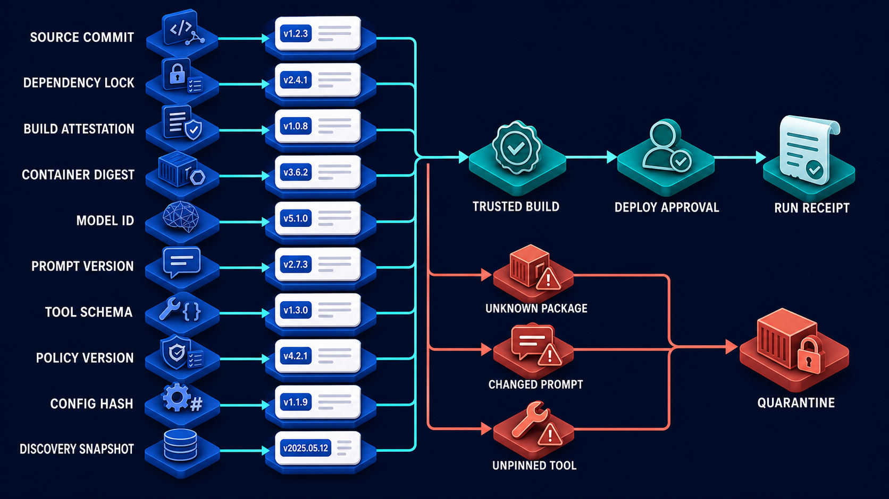

# Diagram 166 — Dependency, Model, Prompt, Tool, and Configuration Provenance

**Module:** Supply chain, privacy, and audit evidence  
**Role in the course:** how to answer exactly which code, dependencies, model, instructions, tools, policies, configuration, and remote metadata produced an agent action  
**Layout:** a provenance graph feeding a central Agent Execution, with Trusted Build and Deploy Approval above, a Run Receipt below, and a Quarantine area for unknown or changed inputs  
**Stability:** Supply-chain assurance pattern

---

## At a glance

A **provenance graph** lists the versioned, integrity-checked inputs that feed one **Agent Execution**.

The inputs are **Source Commit**, **Dependency Lock**, **Build Attestation**, **Container Digest**, **Model ID**, **Prompt Version**, **Tool Schema**, **Policy Version**, **Config Hash**, and **Discovery Snapshot**.

A **Trusted Build** plus a **Deploy Approval** are required before the execution.

The execution produces a **Run Receipt**.

And **unknown packages**, **changed prompts**, and **unpinned tools** go to **Quarantine**.

---

## What the diagram teaches

### 1. Provenance is a graph, not a source commit

Provenance records origin and transformation. For software that means source, dependencies, build, artifacts, signatures, and deployment. For an agent it also means model, prompt, tool, policy, configuration, retrieval sources, discovery snapshots, and approvals.

The diagram shows all ten inputs as distinct cards because each one can change the outcome. Source code is only the first node. If you stop at the commit hash, you cannot answer what really ran.

The analogy is a food label: it traces ingredients, supplier lots, factory line, recipe version, inspection, and best-before date so a problem can be isolated precisely.

### 2. Every high-impact action is attributable to an approved, versioned, integrity-checked set

The **Agent Execution** is the moment when all inputs become a customer-affecting action. The diagram requires that every input is identified, approved by a deploy or policy decision, versioned so it can be named later, and integrity-checked with a hash, digest, signature, or attestation.

This is a **security contract**, not a promise that a model will behave. Provenance cannot stop a model from being wrong, but it stops the team from not knowing what was running when the wrong output happened.

### 3. Pin the source and dependency lock

The first two cards are **Source Commit** and **Dependency Lock**. The source commit identifies the application code. The dependency lock identifies the exact transitive graph, including packages, versions, hashes, and registries.

Two builds from the same commit with different lock files can behave differently. A package can be replaced, a registry poisoned, or a transitive dependency changed under a moving version constraint. Pin source, dependencies, build environment, artifact digest, and deployment identity.

### 4. Build attestation and container digest make the artifact verifiable

The next two cards are **Build Attestation** and **Container Digest**. A build attestation is a signed statement that a trusted builder produced a specific artifact from a specific source and dependency set. A container digest is a content-derived identifier for the exact image that runs.

The attestation says *who built it and from what*. The digest says *what is actually running*. If either is missing, an attacker can substitute a different artifact and the runtime cannot detect the swap.

### 5. Model ID, prompt version, and tool schema capture the agent half of the supply chain

Traditional supply chains stop at the container. Agent systems add three more moving parts.

- **Model ID** names the exact model and provider. A moving alias can silently resolve to a different version.
- **Prompt Version** identifies the template and instruction set. A changed prompt can change what the agent treats as authority.
- **Tool Schema** identifies the interface and implementation of each tool. An unpinned tool can change its arguments or side effects.

Each can change the action independently of the code. Pinned code does not pin model behavior.

### 6. Policy version, config hash, and discovery snapshot capture the runtime control surface

- **Policy Version** is the rule set that decides what the agent may do. A policy change can allow or deny an action.
- **Config Hash** is the runtime configuration. Feature flags, timeouts, rate limits, tenant routing, and secret references live here.
- **Discovery Snapshot** is the versioned view of remote MCP servers, A2A Agent Cards, and other discoverable capabilities. Discovery is a claim, not authority, but the claim the agent saw must be captured.

Version model selection, prompt templates, tool schemas, policies, configuration, and remote discovery snapshots. If any of these move without a version, the run is not reproducible.

### 7. Discovery is a claim, not authority

The **Discovery Snapshot** card reminds us that remote metadata gains no authority just because it is discovered. The discovery step learns a server version, capabilities, instructions, resources, skills, endpoints, and security schemes. It does not learn whether those claims are safe, appropriate, or authorized for this tenant.

This connects directly to the previous lesson on MCP and A2A discovery.

That diagram teaches that discovery output is only one input to the provenance graph. The snapshot is the version the agent saw at the moment of the run. If it is not captured, the team cannot compare what was discovered with what was approved.

### 8. The run receipt is the immutable link for one consequential execution

The **Run Receipt** is the answer to the question, “What exactly produced this action?” It contains the source commit, dependency lock digest, build attestation, container digest, model identifier, prompt version, tool schema digest, policy version, config hash, discovery snapshot, deployment identity, and approval record.

In the Next.js console, expose a server-generated build and policy manifest and stamp action receipts with deploy, prompt, model, tool, and policy identifiers. In the Python back end, create an immutable **RuntimeManifest** loaded at startup, verify digests or signatures, and inject its ID into every high-impact audit and result record.

### 9. Quarantine is the control boundary for unknown, changed, or unverifiable inputs

The right side of the diagram is a **Quarantine** box. Three coral paths lead into it: **Unknown Package**, **Changed Prompt**, and **Unpinned Tool**. These are inputs that fail the approval, version, or integrity check.

A package that is not in the approved lock file, a prompt that does not match the signed prompt version, or a tool with no pinned schema are not allowed to feed the Agent Execution. Quarantine the unknown, unexpectedly changed, revoked, or unverifiable components and rehearse rollback.

### 10. Verification must cover build-time, deploy-time, run-time, remote, secret, public, signed, and retained

The lab asks you to design one **RunManifest** with fifteen identifiers and classify each by lifecycle: build-time, deploy-time, run-time, remote, secret, public, signed, and retained. Source commit and dependency lock are build-time. Build attestation and container digest are deploy-time. Model, prompt, and tool are run-time. Discovery snapshot is remote. Credentials are secret. Package hashes are public. Attestations are signed. The run receipt is retained.

The checkpoint asks: why record a model identifier if the application code is pinned? Because model behavior is an execution input that can change outcomes independently from application code, especially behind moving aliases.

### 11. The transition to customer impact is the boundary to defend

The **Agent Execution** is the point where all versioned inputs become a real action. Before that point the inputs are changeable. After that point the customer is affected.

No consequential flow crosses that boundary without an identified set of executable and decision inputs. Every high-impact action must be attributable. The system must verify identity and tenant, evaluate narrow authority against current context, constrain data and destinations, and preserve enough evidence to explain both allowed and denied outcomes.

### 12. Treat every document, card, prompt, and result as data until a trusted control grants it authority

A prompt version is text. A tool schema is a file. A discovery snapshot is JSON. They become safe execution inputs only when the provenance system has checked their version, digest, signature, and approval status. The graph is the control that turns data into trusted authority.

---

## Case study — Acme Refunds, the change that behaved differently

A refund workflow starts to behave differently after a dependency update and a prompt change. The security team must decide whether the vendor attachment exploited an unauthorized change, or whether the new behavior is the result of an approved update.

### What they had

The team could see the source commit in the deployment log. They could not immediately see the dependency lock, container digest, model identifier, prompt version, tool schema, policy version, runtime config, or discovery snapshot in effect.

### The incident

A refund that previously refused to change a payee now suggested a new payee. The operator suspected prompt injection, but could not separate three possibilities: the source code changed, the prompt or model changed, or the attachment changed the prompt at runtime.

### The provenance investigation

The **Run Receipt** showed the following:

- **Source Commit:** `a1b2c3d`
- **Dependency Lock:** `lock-2026-08-12.json`
- **Build Attestation:** signed by the trusted builder
- **Container Digest:** `sha256:7f9a...`
- **Model ID:** `acme-prod/refund-v3/2026-08-10`
- **Prompt Version:** `refund-prompt-v2.4`
- **Tool Schema:** `payment-tool-schema-v5.1`
- **Policy Version:** `refund-policy-2026-08-11`
- **Config Hash:** `config-2026-08-14a`
- **Discovery Snapshot:** `discovery-2026-08-14T09:00:00Z`

The build attestation proved which trusted process created the deployed artifact. The discovery snapshot showed the exact set of remote MCP and A2A metadata the agent saw. The current snapshot matched the approved version.

The new behavior was traced to the approved prompt version `refund-prompt-v2.4`, deployed after a legitimate product update. The attachment did not alter the prompt; it only contained the same social-engineering text the policy was already trained to ignore.

### The fix

The team rolled forward to the next approved prompt version and added a quarantine rule: any run whose prompt digest does not match a signed prompt version is blocked before the Agent Execution. They also required the Discovery Snapshot to be captured and reviewed before any new MCP server could be used for payment tools.

### Results

- Time to identify the real cause: hours of guessing → minutes of reading the receipt.
- Scope of the change: the entire runtime → the exact prompt version.
- Confidence that the attachment did not exploit the system: low → high.
- Rollback target: the whole deployment → the changed component, with investigation evidence preserved.

### The line in their build standard

*Every high-impact action is attributable to an approved, versioned, integrity-checked set of executable and decision inputs. The run receipt names the source, dependencies, build, container, model, prompt, tools, policy, config, and discovery snapshot that produced it. Unknown or changed inputs are quarantined, not trusted.*

---

## Composition

A provenance graph, a central Agent Execution, a Trusted Build and Deploy Approval gate, a Run Receipt, and a Quarantine area.

**Provenance graph (ten white cards):** Source Commit, Dependency Lock, Build Attestation, Container Digest, Model ID, Prompt Version, Tool Schema, Policy Version, Config Hash, Discovery Snapshot.

**Above the Agent Execution:** Trusted Build and Deploy Approval.

**Center:** Agent Execution.

**Below:** Run Receipt.

**Right side:** Unknown Package, Changed Prompt, and Unpinned Tool lead to the Quarantine box.

Cyan arrows flow from each provenance card into the Agent Execution. Teal arrows flow from Trusted Build and Deploy Approval into the Agent Execution, and from the Agent Execution to the Run Receipt. Coral arrows from the warning cards lead only to Quarantine.

---

## Element by element

**Source Commit** — the application code revision.

**Dependency Lock** — the exact package graph and hashes.

**Build Attestation** — the signed statement from the trusted builder.

**Container Digest** — the content hash of the deployed image.

**Model ID** — the exact model, provider, and version used.

**Prompt Version** — the versioned instruction or template.

**Tool Schema** — the interface and behavior contract for each tool.

**Policy Version** — the rule set that governs the action.

**Config Hash** — the fingerprint of runtime configuration.

**Discovery Snapshot** — the captured view of remote MCP and A2A metadata.

**Trusted Build** — the verified process that produced the artifact.

**Deploy Approval** — the authorization to promote the artifact to production.

**Agent Execution** — the run that combines the provenance inputs into an action.

**Run Receipt** — the immutable record that links the run to its inputs.

**Unknown Package** — a dependency that is not in the approved lock.

**Changed Prompt** — a prompt that does not match the signed version.

**Unpinned Tool** — a tool without a pinned schema or implementation.

**Quarantine** — the safe holding state for inputs that fail verification.

---

## Colour and flow semantics

- **Cyan arrows** carry the provenance inputs from the graph cards into the Agent Execution. They represent the data that must be identified and versioned before the run.
- **Teal arrows** represent verified and approved transitions. They flow from Trusted Build and Deploy Approval into the Agent Execution, and from the Agent Execution to the Run Receipt.
- **Coral paths** mark denied or risky inputs. Unknown Package, Changed Prompt, and Unpinned Tool follow coral arrows to the red Quarantine box.
- **White cards** are the individual provenance identifiers. They are evidence records, not decorative labels.
- **Blue platforms** are protected boundaries. Trusted Build, Deploy Approval, and Agent Execution are treated as controlled gates.
- The **Run Receipt** is teal because it is the safe, reviewable output of the execution.
- The **Quarantine** box is red because it is the fail-safe destination for untrusted inputs.

---

## How to present it

**Ask what the team records when a customer-affecting action goes wrong.** Most will say the source commit, the deployment time, or the model name. Ask where the dependency lock, prompt version, tool schema, config hash, and discovery snapshot are kept.

**Point at the ten provenance cards and read them slowly.** Source Commit, Dependency Lock, Build Attestation, Container Digest, Model ID, Prompt Version, Tool Schema, Policy Version, Config Hash, Discovery Snapshot. Ask which of these the team can name for the last production run.

**Emphasize that the source commit is not enough.** It does not identify the transitive dependency graph, the built artifact, the runtime configuration, the model alias resolution, the prompt, the tool, the policy, or the remote server behavior.

**Point at Trusted Build and Deploy Approval.** These gates turn a versioned graph into an allowed execution. Ask who can approve a deploy and what evidence they require.

**Show the Run Receipt.** It is the answer to “What exactly produced this action?” It is not a log summary. Ask what the receipt would need to contain.

**Point at the Quarantine box.** Unknown Package, Changed Prompt, and Unpinned Tool fail the version, signature, or approval check. Ask what the team does today when a prompt does not match the approved version or a tool is not pinned.

**Tell the Acme story.** The refund changed behavior after a dependency and prompt update. Without the provenance graph, the team could not tell whether the attachment had exploited the change. The run receipt traced it to an approved prompt version and preserved evidence.

**Talk about the RunManifest lab.** Design one manifest with fifteen identifiers and classify each as build-time, deploy-time, run-time, remote, secret, public, signed, and retained.

**Discuss the model identifier question.** If application code is pinned, why record the model identifier? Because model behavior can change outcomes independently from code, especially behind moving aliases.

**Mention the discovery snapshot.** Remote MCP servers and A2A Agent Cards change. The snapshot captures the exact metadata the agent saw at the moment of the run.

**Use the SLSA and OWASP sources in context.** SLSA 1.2 describes supply-chain assurance for artifacts and builds. OWASP Agentic Top 10 2026 includes risks from uncontrolled tools, prompts, and remote capabilities.

**Ask what would happen if one provenance card were missing.** Remove the Dependency Lock and a poisoned package could be hidden. Remove the Prompt Version and an injected instruction could be impossible to distinguish from a product update. Remove the Discovery Snapshot and a changed remote server could not be reconstructed.

**Close on the standard.** *Every high-impact action is attributable to an approved, versioned, integrity-checked set of executable and decision inputs. The run receipt names the source, dependencies, build, container, model, prompt, tools, policy, config, and discovery snapshot that produced it.*

**Timing.** Twenty-five minutes. Thirty if the room maps their last three customer-affecting runs to the ten provenance cards.
## Lab and checkpoint

**Lab:** Design one RunManifest with fifteen identifiers and classify each as build-time, deploy-time, run-time, remote, secret, public, signed, and retained.

**Checkpoint:** Why record a model identifier if the application code is pinned?

**Answer:** Model behavior is an execution input that can change outcomes independently from application code, especially behind moving aliases.

## Glossary

- **Provenance** — origin and transformation history
- **Attestation** — signed statement about a process or artifact
- **Digest** — content-derived integrity identifier

## Sources

- SLSA 1.2 specification
- OWASP Agentic Top 10 2026

