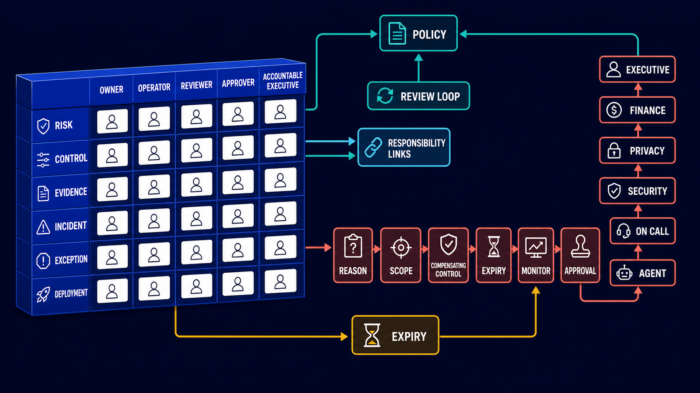
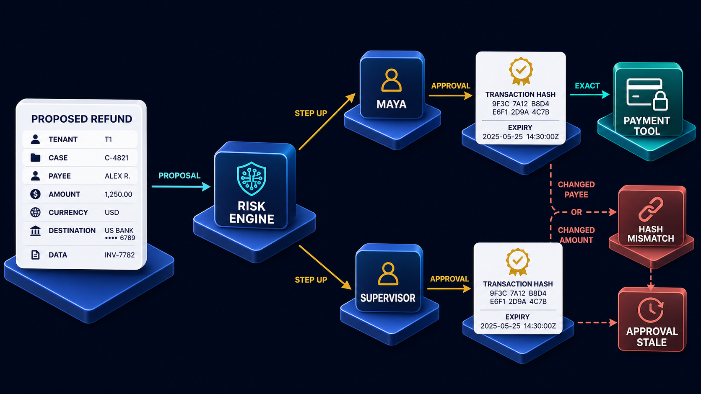

# Diagram 171 — Roles, Exceptions, Escalation, Accountability, and Review

**Module:** Governance and organizational control  
**Stability:** Organizational governance pattern  
**Role in the course:** how to turn technical controls into an organization that knows who operates, reviews, approves, escalates, and accepts risk  
**Layout:** a governance table with rows for **RISK, CONTROL, EVIDENCE, INCIDENT, EXCEPTION,** and **DEPLOYMENT** and columns for **OWNER, OPERATOR, REVIEWER, APPROVER,** and **ACCOUNTABLE EXECUTIVE**; an exception path that demands **REASON, SCOPE, COMPENSATING CONTROL, EXPIRY, MONITOR,** and **APPROVAL**; an escalation ladder rising from **AGENT** to **ON CALL** to **SECURITY / PRIVACY / FINANCE** to **EXECUTIVE**; and a **REVIEW LOOP** that returns evidence and incidents to policy

---

## At a glance

A **GOVERNANCE TABLE** maps every risk, control, evidence bundle, incident, exception, and deployment to the people who own, operate, review, approve, and answer for it.

An **EXCEPTION** is not a hidden bypass. It is a time-bounded, scoped departure from policy that carries a reason, one or more compensating controls, an expiry, a monitor, and an approval.

An **ESCALATION LADDER** rises from the agent that first sees the signal, through the on-call operator, through security, privacy, and finance specialists, to an executive with authority to accept residual risk.

A **REVIEW LOOP** closes the cycle: evidence and incidents feed back into policy so the governance table itself is updated.

The outcome is a system where accountability is as visible as the controls. Technical defenses answer *"is this allowed?"*; the governance layer answers *"who decided, who approved, who will explain it, and when does the decision expire or get reviewed?"* Without those names, a risk register is just a spreadsheet. With those names, it becomes an operating model.

---

## What the diagram teaches

### 1. Accountability is a named role, not a vague job

The diagram does not say *"someone should look at this."* It says the **ACCOUNTABLE EXECUTIVE** column has a name in it. Accountability means a named person or role owns the outcome and cannot delegate away the final decision. They may rely on operators, reviewers, and approvers, but they remain the one who must explain the decision to auditors, customers, regulators, and their own board.

A governance table with empty cells is a governance table that will be ignored during an incident. The first step is not to buy a dashboard. It is to decide who, by role, is answerable for each row.

### 2. Every control needs at least five named roles

The columns are deliberate: **OWNER, OPERATOR, REVIEWER, APPROVER,** and **ACCOUNTABLE EXECUTIVE**. The owner is the role answerable for the control's existence and fitness. The operator runs it day to day. The reviewer independently examines evidence. The approver authorizes changes or exceptions. The accountable executive accepts the residual risk.

These can overlap in small teams, but for material risks the diagram expects separation. One person operating a control, reviewing its evidence, and approving its exception is a single point of failure by design.

### 3. The governance table is an operating model, not an org chart

The rows are **RISK, CONTROL, EVIDENCE, INCIDENT, EXCEPTION,** and **DEPLOYMENT**. These are the moving parts of a live agent system. A risk row names the owner of a threat and its residual risk decision. A control row names the owner of the safeguard. An evidence row names the owner of the proof. An incident row names the owner of the response. An exception row names the owner of the temporary departure. A deployment row names the owner of the change.

This is not the same as the HR org chart. One person may appear in many rows, and one row may require several functions. The table makes the cross-functional seams visible.

### 4. Exceptions are temporary, bounded, and reviewed

The exception path in the diagram is the most important warning. An exception is not a defect that someone quietly works around. It is a first-class governance object with six required fields: **REASON, SCOPE, COMPENSATING CONTROL, EXPIRY, MONITOR,** and **APPROVAL**.

The reason explains why the normal control cannot be met. The scope defines exactly what is being bypassed and for which tenants, transactions, or systems. The compensating control names what extra safeguard is in place while the exception lives. The expiry makes it temporary. The monitor names the telemetry that will detect if the exception is abused. The approval records who authorized it, at what level, and under what residual-risk decision.

Without all six fields, an exception is simply a policy hole with a story attached.

### 5. Escalation is a ladder with named rungs

The **ESCALATION LADDER** rises from **AGENT** to **ON CALL** to **SECURITY / PRIVACY / FINANCE** to **EXECUTIVE**. Each rung is a decision authority, not just a notification target. The agent can detect and report. The on-call operator can pause or contain. Security, privacy, and finance can judge the risk and evidence. The executive can accept residual risk, change policy, or halt the system.

A good escalation path names the trigger for each rung. Not every alert goes to the executive. Not every anomaly can be closed by the agent. The ladder matches the severity, the uncertainty, and the business consequence to the right authority.

### 6. Reviews turn evidence into policy change

The **REVIEW LOOP** is the feedback arrow. Evidence, incidents, exceptions, and deployments are not only inputs to the audit log; they are inputs to the next version of policy. The loop means a denied attack, a narrowly approved exception, a missed control, or a successful red-team test feeds back into the governance table and changes the rules.

A review without a policy update is a meeting. A review that closes, renews, narrows, or revokes exceptions, and that updates controls, is governance in motion. The loop is what keeps the diagram alive after the first day of launch.

### 7. Approval and transaction binding come before any exception can be discussed

An exception should never be the first response to a risky request. The normal path is to bind human approval to the exact transaction that will execute. If the transaction is safe enough to approve, it executes under policy. If it is not, the request is denied or escalated. Only when an urgent, scoped, and approved need cannot meet the normal control does the exception path open.

Diagram 159 shows the same transaction-binding pattern for Acme refunds. Maya and a supervisor approve a hash that covers the exact payee, amount, currency, destination, and case. Any material change makes the approval stale. That binding is the guard the exception path must not weaken. If an exception allows a payment to a new destination before partner verification is complete, the exception itself still needs a hash-bound approval, a named monitor, and an expiry. The exception does not replace the binding; it wraps it in additional compensating controls.

### 8. Separation of duties is what makes an exception trustworthy

The checkpoint for this lesson asks whether the person operating a control can also be its only reviewer and exception approver. For material risks, the answer is no. Separation of duties means the operator cannot hide failure and approve the bypass alone.

The diagram enforces this through the columns. A control operator who can also approve exceptions can turn an incident into a permanent invisible bypass. A reviewer who is also the owner may be too invested to challenge the evidence. The columns are an attempt to keep the incentives honest by keeping the roles distinct.

This does not mean every small team needs five people. It means the system must be able to show that the same individual did not design, operate, review, approve, and accept residual risk for a high-impact exception.

### 9. Evidence and incidents are owned artifacts

The **EVIDENCE** and **INCIDENT** rows in the governance table are not generic. The evidence owner is responsible for the format, retention, redaction, and access of the proof. The incident owner is responsible for the response cadence, containment, communication, and closure.

Evidence includes not only allowed actions but also denials, exceptions, escalations, and review outcomes. An incident is not closed when the alert stops. It is closed when the evidence shows the root cause, the containment, and the policy or control change that will prevent recurrence.

### 10. The Next.js map: role-aware operator pages and immutable decision history

In a Next.js application, governance becomes role-aware operator pages. The platform exposes controls, evidence, incidents, approvals, exceptions, expiry alerts, and reviews with accessible status and immutable decision history. Tokens, policy decisions, secrets, and privileged mutations stay in authenticated server code; the browser receives only the minimum display state.

Typed request, decision, denial, approval, and receipt records let the React interface explain security state without inventing it. A finance approver sees the exception scope and expiry. A security reviewer sees the compensating control and monitor. An accountable executive sees the residual-risk decision. The history cannot be edited; exceptions can only be closed, renewed, narrowed, or revoked.

### 11. The Python map: typed governance workflows, timers, and escalations

In a Python backend, governance is implemented with typed roles, separation-of-duty checks, approval policies, timers, escalations, evidence links, and exception expiry jobs. Pydantic models for Risk, Control, Evidence, Incident, Exception, Owner, Review, and Approval make the boundaries explicit. A governance service can run the review loop: check expiring exceptions, route incidents to the right owner, and assert that the same actor did not operate, review, and approve a high-risk bypass.

Tests use hostile synthetic fixtures and dependency-injected identity, policy, storage, secret, and network adapters to prove that exceptions cannot be created without approval, that expired exceptions are denied, and that escalations reach the correct role.

### 12. Residual risk, review dates, and assumptions must be written down

No governance table eliminates every harm. It makes the residual risk visible and owned. Every material risk, control, incident, exception, and deployment should have a review trigger and an assumption log. A review date that is missed is itself an exception. An assumption that has changed is a signal that the control may no longer be fit.

The diagram forces the team to name what the picture does not eliminate. A compensating control may be weaker than the original. A partner verification may be delayed. A deployment may introduce new risks. Writing these down is part of the operating model.

---

## Case study — Acme, the urgent refund, and the partner verification exception

### The situation

Finance wants to temporarily allow a new payment destination before partner verification is complete because Maya's refund is urgent. The normal control requires the destination to be on the approved partner allowlist. The partner is legitimate but not yet verified. The business asks whether the agent can "just this once" route the refund to the new account.

### The walkthrough

1. **The agent cannot create its own bypass.** The payment tool is narrow and has no capability to edit the destination allowlist. The model can only call the bounded refund tool, not reconfigure policy.

2. **The on-call operator cannot silently edit the allowlist.** Allowlist changes are a deployment or policy change, and the operator role is not the approver for that row in the governance table. The operator can freeze the refund, escalate, or route the request to the exception workflow.

3. **Finance, security, and the accountable owner receive the exact scope and residual risk.** The exception request is a first-class object. It names the single tenant, the one transaction, the one destination, the reason, and the compensating controls.

4. **If approved, a narrow compensating path has one tenant, one transaction, one destination, one monitor, and a short expiry.** The refund is bound to a transaction hash that includes the new destination, the amount, the case, and the exception ID. The monitor watches for any attempt to reuse the exception.

5. **The review either verifies the partner and normalizes policy or closes the exception automatically.** When verification completes, the exception is either converted into a normal allowlist entry or revoked. If the expiry passes first, the exception closes and the transaction is blocked.

### The result

Urgency becomes a visible, accountable decision instead of a permanent security hole. Maya's refund goes through, but only under conditions that are recorded, attributed, and bounded. The governance table, not the agent or the operator, owns the override.

### The danger

An exception without owner, scope, evidence, monitoring, and expiry quietly becomes the real policy. Teams often treat exceptions as one-time favors, then discover months later that the "temporary" path has been used a hundred times. The diagram prevents that by making the exception an object with a lifecycle.

### The takeaway

Every override has a name, a reason, a boundary, a guard, an approver, and an end date. If those are missing, the request is not an exception; it is a policy violation.

---

## Composition

The picture is organized as a governance table on the left, an exception flow in the center, an escalation ladder on the right, and a review loop around the whole.

**Governance table (left):**
- Rows: **RISK, CONTROL, EVIDENCE, INCIDENT, EXCEPTION, DEPLOYMENT**
- Columns: **OWNER, OPERATOR, REVIEWER, APPROVER, ACCOUNTABLE EXECUTIVE**
- Each cell is a white role card showing a named function.

**Exception path (center):**
- **REASON** — why the exception is needed
- **SCOPE** — what exactly is bypassed
- **COMPENSATING CONTROL** — what extra safeguard is applied
- **EXPIRY** — when the exception automatically ends
- **MONITOR** — what telemetry watches for abuse
- **APPROVAL** — who authorized it at the right level

**Escalation ladder (right):**
- **AGENT** — detects and reports
- **ON CALL** — contains and triages
- **SECURITY / PRIVACY / FINANCE** — assess and advise
- **EXECUTIVE** — accept residual risk or halt the system

**Review loop (around):**
- Returns evidence, incidents, exceptions, and deployment outcomes to the governance table and the policy layer.

---

## Element by element

**RISK** — a threat, vulnerability, or failure mode with an impact.

**CONTROL** — a safeguard, policy, or mechanism that reduces risk.

**EVIDENCE** — the proof that a control ran, a decision was made, or an incident was handled.

**INCIDENT** — an event that requires response, containment, communication, and closure.

**EXCEPTION** — an approved, temporary, scoped departure from a control.

**DEPLOYMENT** — a change to code, configuration, model, prompt, tool, or policy.

**OWNER** — the role answerable for the row's existence and fitness.

**OPERATOR** — the role that runs the control or handles the object day to day.

**REVIEWER** — the role that independently examines evidence.

**APPROVER** — the role that authorizes a change, exception, or deployment.

**ACCOUNTABLE EXECUTIVE** — the role that accepts residual risk and answers for the outcome.

**REASON** — the justification for an exception.

**SCOPE** — the exact boundary of what the exception covers.

**COMPENSATING CONTROL** — the extra safeguard applied while the exception is active.

**EXPIRY** — the date or time when the exception ends.

**MONITOR** — the telemetry that detects abuse or drift.

**APPROVAL** — the recorded authorization by an appropriate authority.

**AGENT** — the automated actor that first detects or reports the signal.

**ON CALL** — the human operator who contains and triages.

**SECURITY / PRIVACY / FINANCE** — the specialized functions that assess risk and evidence.

**EXECUTIVE** — the authority that can accept residual risk or stop the system.

**REVIEW LOOP** — the path that feeds experience back into policy.

---

## Colour and flow semantics

The course visual grammar applies directly to this diagram.

- **Cobalt platform** — a protected identity, policy, tenant, resource, sandbox, or governance boundary. The governance table, escalation ladder, and review loop live on cobalt platforms because they are boundaries where authority and ownership are defined.
- **Cyan arrow** — a request, delegated authority, tool call, or intended data path. Escalation arrows are cyan because they carry a signal upward through the ladder.
- **Teal arrow** — a verified identity, allowed decision, safe result, receipt, evidence, or review path. The review loop is teal because it carries approved evidence back into policy.
- **Coral path** — an injection, replay, privilege error, data leak, denial, quarantine, exception, or residual risk. The exception path is drawn in coral because it represents a deliberate departure from normal control; the red tone is a warning that the departure must be tightly bounded.
- **White card** — an identity, token, claim, policy, tenant key, approval, artifact, audit event, or evidence record. The role cells in the governance table and the fields in the exception path are white cards because they are named, attributable records.

The overall flow moves from the governance table through the exception path or escalation ladder, then around the review loop and back into policy. The exception path is not a dead end; it returns to the table for review before it can be renewed.

---

## How to present it

**Assign the rows first.** Ask the room who owns risk, control, evidence, incident, exception, and deployment today. Most teams will have gaps, especially for evidence and exceptions. Do not fill the cells with the same names.

**Read the six exception fields out loud.** Reason, scope, compensating control, expiry, monitor, approval. Ask for the last exception the team granted. Did it have all six? If not, it was probably a bypass.

**Climb the escalation ladder.** Start with the agent. What can it detect? Then the on-call operator. What can they pause? Then security, privacy, and finance. What evidence do they need? Then the executive. What residual risk are they willing to accept? If any rung has no named person, the ladder is broken.

**Emphasize separation of duties.** Ask whether the same person can operate a control, review its evidence, and approve an exception for it. For material risks, the answer must be no. If the team is too small for five distinct roles, at least require two distinct approvers and immutable decision history.

**Trace the review loop.** Show how an incident or exception should change the governance table. If the last three reviews produced no policy or control updates, the reviews were documentation exercises, not governance.

**Show Diagram 159 as the prerequisite.** Exceptions only make sense when the normal approval path is already strong. Diagram 159 binds a refund to an exact transaction hash. Diagram 171 then asks who can approve a departure from that binding, for how long, and under what compensating controls.

**Tell the Acme story.** The urgent refund to an unverified partner becomes a named exception with a hash-bound transaction, a short expiry, a monitor, and an accountable owner. The alternative is an operator editing the allowlist at midnight and forgetting to change it back.

**Pose the checkpoint.** *Can the person operating a control always be its only reviewer and exception approver?* The answer is no for material risks, because one person should not be able to operate, hide failure, and approve the bypass alone.

**Use the lab prompt as a five-minute exercise.** Have the room create a RACI-style matrix for threat model, policy, identity, tenant isolation, secrets, sandbox, egress, privacy, audit, incident, exception, deployment, and model change. Force them to write role names, not just functions.

**Mention the sources in context.** The NIST AI Risk Management Framework places Govern, Map, Measure, and Manage in a continuous loop, and the NIST AI RMF Core provides the core functions that the governance table operationalizes. This lesson is where that loop becomes an assignment of names and dates.

**Close on the standard.** *Every material risk, control, incident, exception, deployment, and overdue review has one accountable owner plus a reachable escalation path.*

**Timing.** Twenty-five minutes. Thirty if the room writes a one-page exception template and escalation ladder for one real material risk.

---

## Glossary

- **Accountable owner** — a role answerable for the outcome.
- **Exception** — an approved temporary departure from policy.
- **Escalation** — a path to higher or specialized authority.

---

## Sources

- NIST AI Risk Management Framework
- NIST AI RMF Core
## Lab and checkpoint

**Lab:** Create a RACI-style matrix for threat model, policy, identity, tenant isolation, secrets, sandbox, egress, privacy, audit, incident, exception, deployment, and model change.

**Checkpoint:** Can the person operating a control always be its only reviewer and exception approver?

**Answer:** For material risks, separation of duties may be needed so one person cannot operate, hide failure, and approve the bypass alone.

