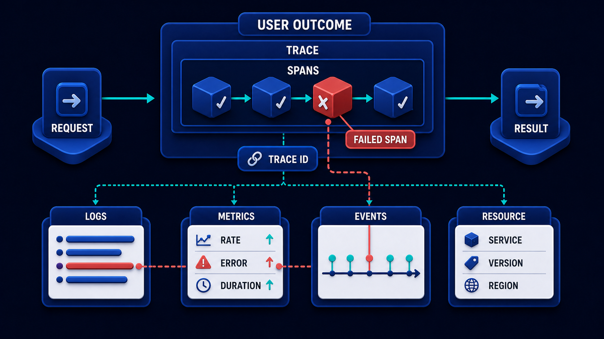

# Diagram 173 — Traces, spans, logs, metrics, events, and resources

**Module:** Telemetry and correlation
**Role in the course:** Follow one business request across every service and protocol while keeping telemetry useful, versioned, and privacy-safe.
**Layout:** The diagram arranges six connected functional objects around one USER OUTCOME: TRACE containing nested SPANS, LOGS linked by TRACE ID, METRICS showing RATE ERROR DURATION, EVENTS on a timeline, and a RESOURCE card naming SERVICE VERSION REGION; it also shows REQUEST entering, RESULT leaving.

---

## At a glance

**Choose the right telemetry signal for a question instead of forcing every fact into logs.**

- Start with one named user outcome and create or continue a trace for that work.
- Create spans only for operations whose timing, status, or evidence helps a real decision.
- Attach the producing service, version, environment, and region as resource identity.
- A FAILED SPAN path shows the failure the design must catch before it reaches the user.

---

## What the diagram teaches

### 1. Choose the right telemetry signal for each question

Observability means being able to ask useful questions about a running system from the evidence it produces. A trace follows one request or workflow across components. A span is one timed operation inside that trace, such as retrieval, policy evaluation, an MCP tool call, an A2A delegation, or model generation. A log is a timestamped record that explains a local event in detail. A metric combines many observations into numbers such as request rate, failure ratio, queue depth, or duration distribution. An event records that something meaningful happened at a point in time. The diagram exists so the team can choose the right telemetry signal for a question instead of forcing every fact into logs.

Diagram 174 — *Context propagation across MCP, A2A, AG-UI, HTTP, and queues* is the next lens on this idea. The same concepts reappear there with different emphasis, so the two diagrams should be read as a pair.

### 2. Start with one named user outcome and create or continue

Start with one named user outcome and create or continue a trace for that work. A trace follows one request or workflow across components. A span is one timed operation inside that trace, such as retrieval, policy evaluation, an MCP tool call, an A2A delegation, or model generation. In the diagram, this is represented by **USER OUTCOME** and **TRACE**. The case study where Maya receives a polished policy answer that is wrong because the retrieval service returned an older document version makes the risk concrete: dumping prompts, documents, headers, and model responses into logs can create a searchable privacy breach while still failing to answer which stage or version caused the outcome. When this step is done well, the team can identify the failing retrieval stage and affected version instead of blaming the language model generally.

### 3. Create spans only for operations whose timing, status, or evidence

In the diagram, this is represented by **SPANS**. Create spans only for operations whose timing, status, or evidence helps a real decision. A trace follows one request or workflow across components. Observability means being able to ask useful questions about a running system from the evidence it produces. The case study where Maya receives a polished policy answer that is wrong because the retrieval service returned an older document version shows the value: the team can identify the failing retrieval stage and affected version instead of blaming the language model generally. Skip it, and dumping prompts, documents, headers, and model responses into logs can create a searchable privacy breach while still failing to answer which stage or version caused the outcome. The takeaway is clear: use each signal for its own job, then connect them with governed correlation and version fields.

### 4. Attach the producing service, version, environment, and region as resource

A resource identifies what produced the signal: service, version, environment, region, process, or deployment. This is why the step is non-negotiable: attach the producing service, version, environment, and region as resource identity. They become powerful when they share trace IDs, stage names, version identifiers, and a small governed vocabulary. In the diagram, this is represented by **RESOURCE**. The case study where Maya receives a polished policy answer that is wrong because the retrieval service returned an older document version proves it: the team can identify the failing retrieval stage and affected version instead of blaming the language model generally. If the team omits this, dumping prompts, documents, headers, and model responses into logs can create a searchable privacy breach while still failing to answer which stage or version caused the outcome.

### 5. Correlate local logs and important events with the active trace

Correlate local logs and important events with the active trace and span IDs. They become powerful when they share trace IDs, stage names, version identifiers, and a small governed vocabulary. Traces explain one journey; metrics reveal population-wide shape; logs add local detail; events mark changes; resources make comparisons attributable. In the diagram, this is represented by **TRACE** and **LOGS**, near **EVENTS**. The case study where Maya receives a polished policy answer that is wrong because the retrieval service returned an older document version makes the risk concrete: dumping prompts, documents, headers, and model responses into logs can create a searchable privacy breach while still failing to answer which stage or version caused the outcome. When this step is done well, the team can identify the failing retrieval stage and affected version instead of blaming the language model generally.

### 6. Aggregate population behavior into bounded-cardinality metrics and inspect both totals

In the diagram, this is represented by **METRICS**. Aggregate population behavior into bounded-cardinality metrics and inspect both totals and distributions. A metric combines many observations into numbers such as request rate, failure ratio, queue depth, or duration distribution. Traces explain one journey; metrics reveal population-wide shape; logs add local detail; events mark changes; resources make comparisons attributable. The case study where Maya receives a polished policy answer that is wrong because the retrieval service returned an older document version shows the value: the team can identify the failing retrieval stage and affected version instead of blaming the language model generally. Skip it, and dumping prompts, documents, headers, and model responses into logs can create a searchable privacy breach while still failing to answer which stage or version caused the outcome. The takeaway is clear: use each signal for its own job, then connect them with governed correlation and version fields.

### 7. Putting it together

Taken together, these steps turn the objective "choose the right telemetry signal for a question instead of forcing every fact into logs" into an operating contract. Start with one named user outcome and create or continue a trace for that work; Create spans only for operations whose timing, status, or evidence helps a real decision; Attach the producing service, version, environment, and region as resource identity. The remaining steps extend this: Correlate local logs and important events with the active trace and span IDs; Aggregate population behavior into bounded-cardinality metrics and inspect both totals and distributions. The case of Maya receives a polished policy answer that is wrong because the retrieval service returned an older document version shows how quickly dumping prompts, documents, headers, and model responses into logs can create a searchable privacy breach while still failing to answer which stage or version caused the outcome. The durable lesson is use each signal for its own job, then connect them with governed correlation and version fields.

### Analogy

A parcel journey has one tracking number, scans at each depot, local notes when something breaks, fleet-wide delivery statistics, and labels naming the vehicle and depot that handled it.

### The Next.js surface

In the Next.js surface, the same contract appears through framework-specific patterns. Use the Next.js instrumentation hook and OpenTelemetry SDK to name server-side request, retrieval, policy, and tool spans while preserving framework-generated HTTP spans. Keep browser telemetry intentionally smaller than server telemetry; send correlation references and user-visible stage state without private prompts, tokens, or hidden reasoning. Attach deployment, route, release, model, prompt, policy, and dataset versions through a governed attribute helper rather than ad hoc strings in every component.

### The Python surface

In the Python surface, the same contract is enforced with typed models and tests. Initialize one OpenTelemetry provider for FastAPI and workers, then add manual spans around business stages that automatic HTTP instrumentation cannot understand. Use context variables so request and workflow correlation survives asynchronous functions without global mutable state. Emit structured logs with trace and span IDs, bounded metrics for aggregate health, and explicit events for approvals, artifacts, fallbacks, and releases.

---

## Case study — Maya and the stale policy answer

Maya receives a polished policy answer that is wrong because the retrieval service returned an older document version.

### The walkthrough

1. The request trace shows browser, Next.js, FastAPI, retrieval, policy, generation, and citation spans.
2. The retrieval span records the selected document identifier and version without copying the private document text.
3. A correlated event shows that the policy index was refreshed after this request used the prior index.
4. A quality metric reveals the same stale-version symptom in several cases after a candidate release.

### The result

The team can identify the failing retrieval stage and affected version instead of blaming the language model generally.

### The danger

Dumping prompts, documents, headers, and model responses into logs can create a searchable privacy breach while still failing to answer which stage or version caused the outcome.

### The takeaway

Use each signal for its own job, then connect them with governed correlation and version fields.

---

## Composition

The diagram places one USER OUTCOME at the center of the dark-midnight field. Six connected functional objects orbit it like a hub-and-spoke map. At the upper left, a TRACE contains nested SPANS; below it, LOGS link by a TRACE ID. To the right, METRICS cards display RATE, ERROR, and DURATION. Beneath the metrics, a timeline of EVENTS runs horizontally. Near the bottom, a RESOURCE card names SERVICE, VERSION, and REGION. A cyan REQUEST arrow enters the scene from the left, passes through the outcome, and a teal RESULT arrow exits to the right. One coral FAILED SPAN branches from the trace and connects to a log and a metric change, showing how a failure in one signal is visible in the others. The overall layout is a telemetry solar system: one user outcome in the middle, six signal types arranged around it, and a single request showing how the signals interact.

## Element by element

- **USER OUTCOME** — The **USER OUTCOME** is the user-visible result that the entire request and its telemetry are organized to explain.
- **TRACE** — The **TRACE** is a connected record of one request or workflow.
- **SPANS** — The **SPANS** are one timed operation inside a trace.
- **LOGS** — The **LOGS** are a timestamped record that explains a local event in detail.
- **TRACE ID** — The **TRACE ID** is the identifier shared by a trace, its spans, logs, and events so they can be correlated.
- **METRICS** — The **METRICS** combines many observations into numbers such as request rate, failure ratio, queue depth, or duration distribution.
- **RATE ERROR DURATION** — The **RATE ERROR DURATION** is the three headline measurements shown on the METRICS card: request rate, error ratio, and duration.
- **EVENTS** — The **EVENTS** records that something meaningful happened at a point in time.
- **RESOURCE** — The **RESOURCE** is an identity of the service or process producing telemetry.
- **SERVICE VERSION REGION** — The **SERVICE VERSION REGION** is the three fields named on the RESOURCE card that identify where a signal was produced.
- **REQUEST** — The **REQUEST** is the incoming operation shown as a cyan path that starts the telemetry chain.
- **RESULT** — The **RESULT** is the outgoing outcome; it is teal when healthy and tied to verified evidence.
- **FAILED SPAN** — The **FAILED SPAN** is the coral branch that marks a timed operation ending in an error, connected to a log and a metric change.

---

## Colour and flow semantics

- **Cyan arrow** — a request, propagated context, telemetry signal, evaluation flow, or candidate release path. In this diagram it appears on **REQUEST**.
- **Teal arrow** — a healthy result, matched evidence, safe promotion, controlled degradation, recovery, or verified learning path. In this diagram it appears on **RESULT**.
- **Coral path** — a broken trace, failed assertion, regression, overload, unsafe outcome, rollback, alert, or incident path. In this diagram it appears on **FAILED SPAN**.
- **White card** — a span, event, metric, log, resource, case, score, budget, version, release, runbook, action, or regression record. In this diagram it appears on **USER OUTCOME**, **TRACE**, **SPANS**, **LOGS**, **TRACE ID**, **METRICS**, **RATE ERROR DURATION**, **EVENTS** and others.

The overall flow moves from the inputs on the left through the telemetry and correlation stages and exits as either a teal healthy path or a coral failure path. White cards carry the records, cobalt platforms hold the boundaries, and the cyan arrows show propagation and requests.

---

## How to present it

- Start with the operational question the team actually needs to answer. Point at the central element and ask what a regulator, evaluator, or support operator would ask about this outcome, and which signal type would best answer it.
- Ask the room what the team would need to know before approving the next release. Point at **USER OUTCOME** and **TRACE** and ask what would change if this step were skipped? Use the case study to make the failure concrete.
- Have the group list the operational decisions this stage informs. Highlight **SPANS** and ask what real decision does this evidence support? Use the case study to make the failure concrete.
- Ask what evidence would change the route a support ticket takes. Trace with your finger **RESOURCE** and ask what would a missing or corrupted value look like here? Use the case study to make the failure concrete.
- Get the room to name the owner who would need this evidence in an incident. Put a marker on **TRACE** and **LOGS** and ask who owns the evidence produced at this step? Use the case study to make the failure concrete.
- Ask what would need to be true for the team to skip this stage safely. Ask the room to locate **METRICS** and ask which downstream stage would fail if this step were wrong? Use the case study to make the failure concrete.
- Use the analogy. A parcel journey has one tracking number, scans at each depot, local notes when something breaks, fleet-wide delivery statistics, and labels naming the vehicle and depot that handled it. Ask the room where the equivalent tracking number, queue, or ledger is in their own system, and where it would first break.
- Tell the case study — Maya and the stale policy answer. Walk through the walkthrough and stop at the moment the failure first becomes visible. Ask what signal, gate, or version field would have caught it earlier.
- Run the lab. Sketch one Acme support request. Add eight spans, three meaningful events, four resource fields, three metrics, and two correlated logs. For every field, write the decision it supports and whether content is captured, hashed, redacted, or omitted. Have each group label the fields that are captured, hashed, redacted, or omitted.
- Pose the checkpoint. Should a trace, a metric, and a log contain exactly the same information? Let the room answer before confirming with the answer. Then ask what the team would change in the next build based on the answer.
- Before moving on, ask the room to trace one healthy teal path and one coral path through the diagram, naming the evidence that flips the colour at each stage.
- Close on the contract. Use each signal for its own job, then connect them with governed correlation and version fields. Make the group write one sentence that ties the lesson to their own system.

---

## Lab and checkpoint

**Lab:** Sketch one Acme support request. Add eight spans, three meaningful events, four resource fields, three metrics, and two correlated logs. For every field, write the decision it supports and whether content is captured, hashed, redacted, or omitted.

**Checkpoint:** Should a trace, a metric, and a log contain exactly the same information?

**Answer:** No. A trace explains one connected journey, a metric summarizes many observations, and a log adds local detail. They should share correlation and version fields, not duplicate all content.

---

## Glossary

- **Trace** — connected record of one request or workflow
- **Span** — one timed operation inside a trace
- **Resource** — identity of the service or process producing telemetry

---

## Sources

- [OpenTelemetry specification overview](https://opentelemetry.io/docs/specs/otel/overview/)
- [OpenTelemetry specification status](https://opentelemetry.io/docs/specs/status/)
- [OpenTelemetry logging](https://opentelemetry.io/docs/specs/otel/logs/)

---

## Related lessons

- Diagram 174 — Context propagation across MCP, A2A, AG-UI, HTTP, and queues
- Diagram 175 — Privacy-safe telemetry and content capture policy
- Diagram 181 — Intent, routing, and retrieval quality

---
