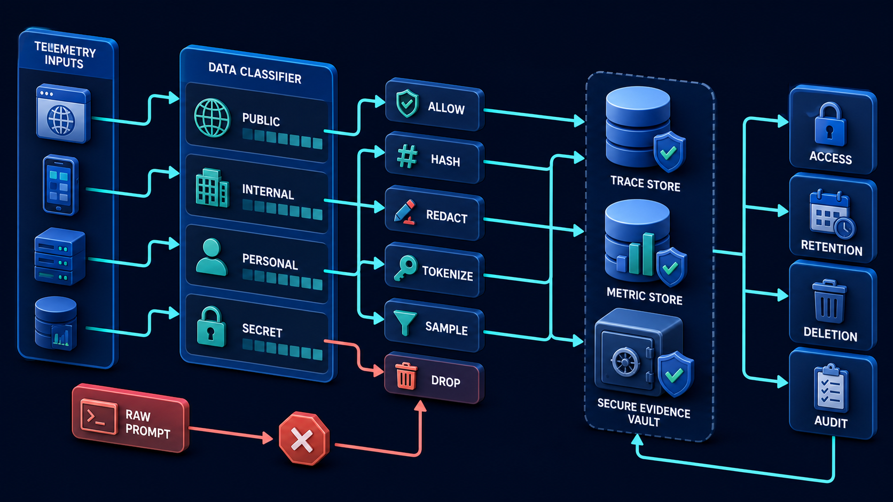
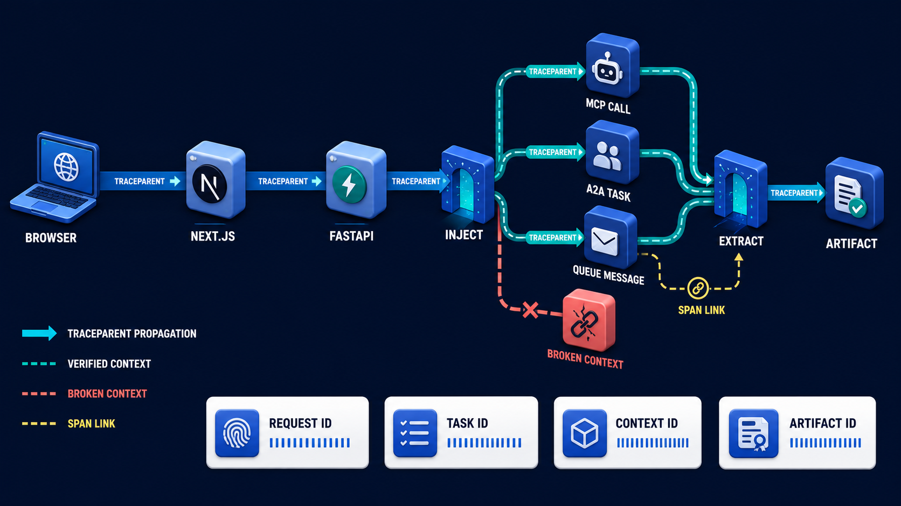

# Diagram 175 — Privacy-safe telemetry and content capture policy

**Module:** Telemetry and correlation
**Role in the course:** Follow one business request across every service and protocol while keeping telemetry useful, versioned, and privacy-safe.
**Layout:** The diagram shows TELEMETRY INPUTS entering a DATA CLASSIFIER with lanes PUBLIC, INTERNAL, PERSONAL, SECRET; it also route fields through ALLOW, HASH, REDACT, TOKENIZE, SAMPLE, and DROP controls into TRACE STORE, METRIC STORE, and SECURE EVIDENCE VAULT.

---

## At a glance

**Design telemetry that answers operational questions without creating an uncontrolled copy of private application content.**

- Inventory every proposed telemetry field and state the operational or evaluation decision it supports.
- Classify the field, choose allow, hash, redact, tokenize, aggregate, sample, secure-store, or drop, and apply the choice before export.
- Separate normal metadata telemetry from tightly controlled content evidence and prohibit secrets in both.
- A RAW PROMPT path shows the failure the design must catch before it reaches the user.

---

## What the diagram teaches

### 1. Design telemetry that answers questions without leaking content

Telemetry is another data product and must have its own purpose, classification, access, retention, deletion, and evidence rules. The safest default is metadata-first: capture stage name, timing, status, bounded error category, model and prompt version, tool name, document identifier, policy decision reference, token counts, and correlation IDs without copying the raw prompt, retrieved passage, customer record, secret, authorization header, or hidden reasoning. When content is genuinely required for a defined evaluation or incident, route it to a more restricted evidence store with explicit access, short retention, approval, audit, and deletion behavior. Hashing can support equality checks but does not automatically anonymize predictable values. Redaction must happen before export, not only in a dashboard. The diagram exists so the team can design telemetry that answers operational questions without creating an uncontrolled copy of private application content.

### 2. Inventory every

Inventory every proposed telemetry field and state the operational or evaluation decision it supports. When content is genuinely required for a defined evaluation or incident, route it to a more restricted evidence store with explicit access. The safest default is metadata-first: capture stage name, timing, status, bounded error category, model and prompt version. In the diagram, this is represented by **TELEMETRY INPUTS**. The case study where Maya's failed answer contains a customer name, account details, an internal policy passage, and a tool error that accidentally includes an authorization header makes the risk concrete: a debug switch that silently records every prompt and response can remain enabled after the incident and create a large, poorly governed breach surface. When this step is done well, the team diagnoses the stale document without turning its observability platform into a second customer database.

### 3. Classify the field, choose allow, hash, redact, tokenize, aggregate, sample,

In the diagram, this is represented by **ALLOW** and **HASH**, near **REDACT**. Classify the field, choose allow, hash, redact, tokenize, aggregate, sample, secure-store, or drop, and apply the choice before export. When content is genuinely required for a defined evaluation or incident, route it to a more restricted evidence store with explicit access. The safest default is metadata-first: capture stage name, timing, status, bounded error category, model and prompt version. The case study where Maya's failed answer contains a customer name, account details, an internal policy passage, and a tool error that accidentally includes an authorization header shows the value: the team diagnoses the stale document without turning its observability platform into a second customer database. Skip it, and a debug switch that silently records every prompt and response can remain enabled after the incident and create a large, poorly governed breach surface. The takeaway is clear: metadata by default; content only for a defined purpose inside a stricter evidence boundary.

### 4. Separate normal metadata telemetry from tightly controlled content evidence

Telemetry is another data product and must have its own purpose, classification, access, retention, deletion, and evidence rules. This is why the step is non-negotiable: separate normal metadata telemetry from tightly controlled content evidence and prohibit secrets in both. When content is genuinely required for a defined evaluation or incident, route it to a more restricted evidence store with explicit access. In the diagram, this is represented by **SECRET**. The case study where Maya's failed answer contains a customer name, account details, an internal policy passage, and a tool error that accidentally includes an authorization header proves it: the team diagnoses the stale document without turning its observability platform into a second customer database. If the team omits this, a debug switch that silently records every prompt and response can remain enabled after the incident and create a large, poorly governed breach surface.

### 5. Set role-based access, region, retention, deletion, legal-hold, vendor, and audit

Set role-based access, region, retention, deletion, legal-hold, vendor, and audit rules for every destination. Telemetry is another data product and must have its own purpose, classification, access, retention, deletion, and evidence rules. When content is genuinely required for a defined evaluation or incident, route it to a more restricted evidence store with explicit access. In the diagram, this is represented by **ACCESS** and **RETENTION**, near **DELETION**. The case study where Maya's failed answer contains a customer name, account details, an internal policy passage, and a tool error that accidentally includes an authorization header makes the risk concrete: a debug switch that silently records every prompt and response can remain enabled after the incident and create a large, poorly governed breach surface. When this step is done well, the team diagnoses the stale document without turning its observability platform into a second customer database.

### 6. Run synthetic leak tests and deletion tests so policy

In the diagram, this is represented by **DELETION**. Run synthetic leak tests and deletion tests so policy is proved by behavior rather than documentation alone. Telemetry is another data product and must have its own purpose, classification, access, retention, deletion, and evidence rules. When content is genuinely required for a defined evaluation or incident, route it to a more restricted evidence store with explicit access. The case study where Maya's failed answer contains a customer name, account details, an internal policy passage, and a tool error that accidentally includes an authorization header shows the value: the team diagnoses the stale document without turning its observability platform into a second customer database. Skip it, and a debug switch that silently records every prompt and response can remain enabled after the incident and create a large, poorly governed breach surface. The takeaway is clear: metadata by default; content only for a defined purpose inside a stricter evidence boundary.

### 7. Putting it together

Taken together, these steps turn the objective "design telemetry that answers operational questions without creating an uncontrolled copy of private application content" into an operating contract. Inventory every proposed telemetry field and state the operational or evaluation decision it supports; Classify the field, choose allow, hash, redact, tokenize, aggregate, sample, secure-store, or drop, and apply the choice before export; Separate normal metadata telemetry from tightly controlled content evidence and prohibit secrets in both. The remaining steps extend this: Set role-based access, region, retention, deletion, legal-hold, vendor, and audit rules for every destination; Run synthetic leak tests and deletion tests so policy is proved by behavior rather than documentation alone. The case of Maya's failed answer contains a customer name, account details, an internal policy passage, and a tool error that accidentally includes an authorization header shows how quickly a debug switch that silently records every prompt and response can remain enabled after the incident and create a large, poorly governed breach surface. The durable lesson is metadata by default; content only for a defined purpose inside a stricter evidence boundary.

### Analogy

A hospital keeps appointment counts on an operations dashboard, medical details in a protected clinical record, and never photocopies a patient's entire chart into the maintenance log.

### The Next.js surface

In the Next.js surface, the same contract appears through framework-specific patterns. Create a server-only telemetry sanitizer that accepts typed fields, rejects unknown keys, removes headers and cookies, and records content only through an explicit elevated mode. Keep client analytics free of prompts and customer records; use opaque run references and coarse product events with consent and retention controls. Place collector/export credentials in server-side secrets and test that preview deployments, error pages, and console logging do not bypass the telemetry policy.

### The Python surface

In the Python surface, the same contract is enforced with typed models and tests. Use logging filters, span processors, and exporter wrappers to redact or reject sensitive keys before data leaves the FastAPI process or worker. Model the capture policy in Pydantic with field class, purpose, action, destination, retention, and allowed roles so configuration is reviewable and testable. Write tests with synthetic secrets, personal fields, long prompts, hostile headers, and deletion requests; fail the pipeline if any prohibited value reaches the test collector.

Diagram 174 — *Context propagation across MCP, A2A, AG-UI, HTTP, and queues* is the next lens on this idea. The same concepts reappear there with different emphasis, so the two diagrams should be read as a pair.

---

## Case study — Maya's failed answer and the telemetry sanitizer

Maya's failed answer contains a customer name, account details, an internal policy passage, and a tool error that accidentally includes an authorization header.

### The walkthrough

1. The normal trace keeps stage, timing, document ID, policy version, bounded error category, and correlation references.
2. The authorization header is rejected by the sanitizer before export and creates a security event.
3. A short-lived diagnostic case stores a redacted passage in the secure evidence vault after approval.
4. The case closes, elevated capture expires automatically, and deletion verification records the affected stores.

### The result

The team diagnoses the stale document without turning its observability platform into a second customer database.

### The danger

A debug switch that silently records every prompt and response can remain enabled after the incident and create a large, poorly governed breach surface.

### The takeaway

Metadata by default; content only for a defined purpose inside a stricter evidence boundary.

---

## Composition

TELEMETRY INPUTS enter from the top into a DATA CLASSIFIER, which sorts fields into four lanes: PUBLIC, INTERNAL, PERSONAL, and SECRET. From each lane, arrows pass through ALLOW, HASH, REDACT, TOKENIZE, SAMPLE, and DROP controls, then descend into three destinations: a TRACE STORE, a METRIC STORE, and a SECURE EVIDENCE VAULT. A set of governance gates—ACCESS, RETENTION, DELETION, and AUDIT—sit between the controls and the stores. On the left, one coral RAW PROMPT path is blocked before it reaches any store, showing that raw prompts should not be exported by default. The composition is a filtering pipeline: inputs at the top, classification in the middle, controlled destinations at the bottom, and a blocked raw path on the side.

## Element by element

- **TELEMETRY INPUTS** — The **TELEMETRY INPUTS** is entering a DATA CLASSIFIER with lanes PUBLIC,.
- **DATA CLASSIFIER** — The **DATA CLASSIFIER** is a cobalt platform or boundary that tELEMETRY INPUTS entering a with lanes PUBLIC,.
- **PUBLIC** — The **PUBLIC** is a cyan request or propagation path that tELEMETRY INPUTS entering a DATA CLASSIFIER with lanes ,.
- **INTERNAL** — The **INTERNAL** is a cyan request or propagation path.
- **PERSONAL** — The **PERSONAL** is a cyan request or propagation path.
- **SECRET** — The **SECRET** is a cyan request or propagation path.
- **ALLOW** — The **ALLOW** is a cyan request or propagation path that route fields through ,.
- **HASH** — The **HASH** is a cyan request or propagation path.
- **REDACT** — The **REDACT** is a cyan request or propagation path.
- **TOKENIZE** — The **TOKENIZE** is a cyan request or propagation path.
- **SAMPLE** — The **SAMPLE** is a cyan request or propagation path.
- **DROP** — The **DROP** is a STORE.
- **TRACE STORE** — The **TRACE STORE** is a STORE.
- **METRIC STORE** — The **METRIC STORE** is a STORE.
- **SECURE EVIDENCE VAULT** — The **SECURE EVIDENCE VAULT** is a VAULT.
- **ACCESS** — The **ACCESS** is a cyan request or propagation path.
- **RETENTION** — The **RETENTION** is a cyan request or propagation path.
- **DELETION** — The **DELETION** is a cyan request or propagation path.
- **AUDIT** — The **AUDIT** is a cyan request or propagation path that gates.
- **RAW PROMPT** — The **RAW PROMPT** is a path blocked before the store.

---

## Colour and flow semantics

- **Cobalt platform** — a service, stage, dataset, quality gate, budget, release lane, or incident-control boundary. In this diagram it appears on **DATA CLASSIFIER**, **TRACE STORE**, **METRIC STORE**, **SECURE EVIDENCE VAULT**.
- **Cyan arrow** — a request, propagated context, telemetry signal, evaluation flow, or candidate release path. In this diagram it appears on **TELEMETRY INPUTS**, **PUBLIC**, **INTERNAL**, **PERSONAL**, **SECRET**, **ALLOW**, **HASH**, **REDACT** and others.
- **Coral path** — a broken trace, failed assertion, regression, overload, unsafe outcome, rollback, alert, or incident path. In this diagram it appears on **RAW PROMPT**.

The overall flow moves from the inputs on the left through the telemetry and correlation stages and exits as either a teal healthy path or a coral failure path. White cards carry the records, cobalt platforms hold the boundaries, and the cyan arrows show propagation and requests.

---

## How to present it

- Start with the operational question the team actually needs to answer. Point at the central element and ask what a regulator, evaluator, or support operator would ask about this outcome, and which signal type would best answer it.
- Ask the room what the team would need to know before approving the next release. Point at **TELEMETRY INPUTS** and ask what would change if this step were skipped? Use the case study to make the failure concrete.
- Have the group list the operational decisions this stage informs. Highlight **ALLOW** and **HASH** and ask what real decision does this evidence support? Use the case study to make the failure concrete.
- Ask what evidence would change the route a support ticket takes. Trace with your finger **SECRET** and ask what would a missing or corrupted value look like here? Use the case study to make the failure concrete.
- Get the room to name the owner who would need this evidence in an incident. Put a marker on **ACCESS** and **RETENTION** and ask who owns the evidence produced at this step? Use the case study to make the failure concrete.
- Ask what would need to be true for the team to skip this stage safely. Ask the room to locate **DELETION** and ask which downstream stage would fail if this step were wrong? Use the case study to make the failure concrete.
- Use the analogy. A hospital keeps appointment counts on an operations dashboard, medical details in a protected clinical record, and never photocopies a patient's entire chart into the maintenance log. Ask the room where the equivalent tracking number, queue, or ledger is in their own system, and where it would first break.
- Tell the case study — Maya's failed answer and the telemetry sanitizer. Walk through the walkthrough and stop at the moment the failure first becomes visible. Ask what signal, gate, or version field would have caught it earlier.
- Run the lab. Build a 20-field telemetry register. Give every field a purpose, classification, cardinality, transform, destination, role, retention, deletion behavior, and synthetic leak test. Reject any field with no decision purpose. Have each group label the fields that are captured, hashed, redacted, or omitted.
- Pose the checkpoint. Does sampling make raw prompts safe to export? Let the room answer before confirming with the answer. Then ask what the team would change in the next build based on the answer.
- Before moving on, ask the room to trace one healthy teal path and one coral path through the diagram, naming the evidence that flips the colour at each stage.
- Close on the contract. Metadata by default; content only for a defined purpose inside a stricter evidence boundary. Make the group write one sentence that ties the lesson to their own system.

---

## Lab and checkpoint

**Lab:** Build a 20-field telemetry register. Give every field a purpose, classification, cardinality, transform, destination, role, retention, deletion behavior, and synthetic leak test. Reject any field with no decision purpose.

**Checkpoint:** Does sampling make raw prompts safe to export?

**Answer:** No. Sampling changes how many records are stored, not how sensitive each stored record is. Classify, minimize, redact, and control access before sampling decisions.

---

## Glossary

- **Data minimization** — collecting only what a defined purpose needs
- **Cardinality** — number of distinct values a field can take
- **Diagnostic capture** — temporary elevated evidence collection under stricter controls

---

## Sources

- [W3C Trace Context](https://www.w3.org/TR/trace-context/)
- [OWASP Logging Cheat Sheet](https://cheatsheetseries.owasp.org/cheatsheets/Logging_Cheat_Sheet.html)
- [NIST Generative AI Profile](https://www.nist.gov/publications/artificial-intelligence-risk-management-framework-generative-artificial-intelligence)

---

## Related lessons

- Diagram 173 — Traces, spans, logs, metrics, events, and resources
- Diagram 174 — Context propagation across MCP, A2A, AG-UI, HTTP, and queues
- Diagram 194 — Red-team, chaos, abuse, and recovery exercises

---
