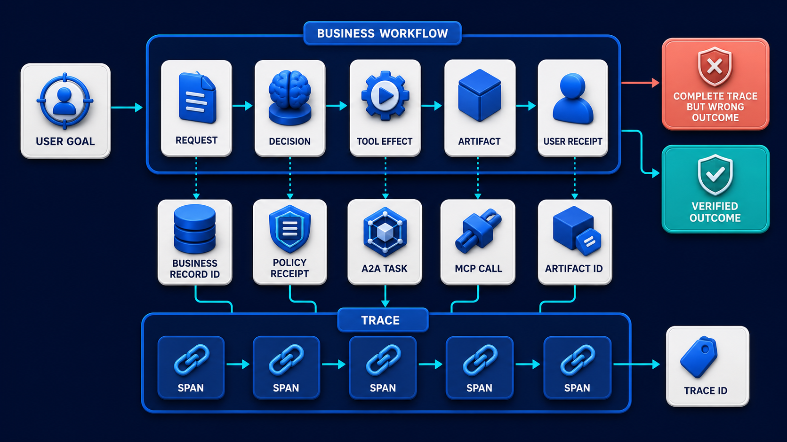

# Diagram 176 — Business outcomes, artifacts, receipts, and trace references

**Module:** Telemetry and correlation
**Role in the course:** Follow one business request across every service and protocol while keeping telemetry useful, versioned, and privacy-safe.
**Layout:** The diagram shows USER GOAL entering a BUSINESS WORKFLOW with stages REQUEST, DECISION, TOOL EFFECT, ARTIFACT, USER RECEIPT; it also beneath it place a connected TRACE with stage SPANS.

---

## At a glance

**Connect technical telemetry to durable user and business evidence without treating a trace as the system of record.**

- Define the user goal, business state transitions, unacceptable outcomes, and the authoritative system of record.
- Create durable request, decision, effect, artifact, and user-receipt records with stable identifiers.
- Attach trace and span references to those records and attach safe business references to telemetry.
- A TRACE path shows the failure the design must catch before it reaches the user.

---

## What the diagram teaches

### 1. Connect durable business records to execution traces

A trace can show what software did, but the business system must still record what was requested, authorized, changed, produced, shown to the user, and finally accepted or reversed. A support artifact, policy-decision receipt, tool-effect receipt, approval record, A2A task, MCP request, user-visible message, and trace each has a different lifecycle. The durable record should contain stable business identifiers and references to the trace or relevant spans. The trace should contain the business identifiers needed for authorized lookup, not the whole business payload. This separation protects recovery: traces may be sampled, delayed, dropped, or retained for a shorter period, while the workflow and artifact must survive. The diagram exists so the team can connect technical telemetry to durable user and business evidence without treating a trace as the system of record.

Diagram 174 — *Context propagation across MCP, A2A, AG-UI, HTTP, and queues* is the next lens on this idea. The same concepts reappear there with different emphasis, so the two diagrams should be read as a pair.

### 2. Define the user goal, business state transitions, unacceptable outcomes,

Define the user goal, business state transitions, unacceptable outcomes, and the authoritative system of record. The durable record should contain stable business identifiers and references to the trace or relevant spans. A trace can show what software did, but the business system must still record what was requested, authorized, changed, produced. In the diagram, this is represented by **USER GOAL**. The case study where Maya sees a success message for a policy answer, but the response used stale evidence and must be corrected after the request trace has already expired makes the risk concrete: using trace search as the only record of approvals, tool effects, or customer-facing outcomes makes recovery depend on sampled operational data. When this step is done well, the team can recover correctly even when the original trace is incomplete or no longer retained.

### 3. Create durable request, decision, effect, artifact, and user-receipt records

In the diagram, this is represented by **REQUEST** and **DECISION**, near **ARTIFACT**. Create durable request, decision, effect, artifact, and user-receipt records with stable identifiers. The durable record should contain stable business identifiers and references to the trace or relevant spans. A support artifact, policy-decision receipt, tool-effect receipt, approval record, A2A task, MCP request, user-visible message, and trace each has a different lifecycle. The case study where Maya sees a success message for a policy answer, but the response used stale evidence and must be corrected after the request trace has already expired shows the value: the team can recover correctly even when the original trace is incomplete or no longer retained. Skip it, and using trace search as the only record of approvals, tool effects, or customer-facing outcomes makes recovery depend on sampled operational data. The takeaway is clear: business records prove the outcome; traces explain the execution; references connect them.

### 4. Attach trace and span references to those records and attach

The durable record should contain stable business identifiers and references to the trace or relevant spans. This is why the step is non-negotiable: attach trace and span references to those records and attach safe business references to telemetry. A trace can show what software did, but the business system must still record what was requested, authorized, changed, produced. In the diagram, this is represented by **TRACE**. The case study where Maya sees a success message for a policy answer, but the response used stale evidence and must be corrected after the request trace has already expired proves it: the team can recover correctly even when the original trace is incomplete or no longer retained. If the team omits this, using trace search as the only record of approvals, tool effects, or customer-facing outcomes makes recovery depend on sampled operational data.

### 5. Treat resumed, retried, and delegated work as linked execution evidence

Treat resumed, retried, and delegated work as linked execution evidence around the durable workflow. The durable record should contain stable business identifiers and references to the trace or relevant spans. For long-running work, store checkpoints and receipts as business data, create new traces for resumed execution when appropriate. In the diagram, this is represented by **BUSINESS WORKFLOW**. The case study where Maya sees a success message for a policy answer, but the response used stale evidence and must be corrected after the request trace has already expired makes the risk concrete: using trace search as the only record of approvals, tool effects, or customer-facing outcomes makes recovery depend on sampled operational data. When this step is done well, the team can recover correctly even when the original trace is incomplete or no longer retained.

### 6. Verify the final business outcome independently of technical completion

In the diagram, this is represented by **BUSINESS WORKFLOW** and **BUSINESS RECORD ID**, near **WRONG OUTCOME**. Verify the final business outcome independently of technical completion and preserve reversal or recovery evidence. The durable record should contain stable business identifiers and references to the trace or relevant spans. A trace can show what software did, but the business system must still record what was requested, authorized, changed, produced. The case study where Maya sees a success message for a policy answer, but the response used stale evidence and must be corrected after the request trace has already expired shows the value: the team can recover correctly even when the original trace is incomplete or no longer retained. Skip it, and using trace search as the only record of approvals, tool effects, or customer-facing outcomes makes recovery depend on sampled operational data. The takeaway is clear: business records prove the outcome; traces explain the execution; references connect them.

### 7. Putting it together

Taken together, these steps turn the objective "connect technical telemetry to durable user and business evidence without treating a trace as the system of record" into an operating contract. Define the user goal, business state transitions, unacceptable outcomes, and the authoritative system of record; Create durable request, decision, effect, artifact, and user-receipt records with stable identifiers; Attach trace and span references to those records and attach safe business references to telemetry. The remaining steps extend this: Treat resumed, retried, and delegated work as linked execution evidence around the durable workflow; Verify the final business outcome independently of technical completion and preserve reversal or recovery evidence. The case of Maya sees a success message for a policy answer, but the response used stale evidence and must be corrected after the request trace has already expired shows how quickly using trace search as the only record of approvals, tool effects, or customer-facing outcomes makes recovery depend on sampled operational data. The durable lesson is business records prove the outcome; traces explain the execution; references connect them.

### Analogy

A bank statement is the durable record of a transfer; security-camera footage helps investigate the visit but is not the account ledger and may be kept for a different period.

### The Next.js surface

In the Next.js surface, the same contract appears through framework-specific patterns. Return a typed receipt to the React interface containing business status, artifact references, approval or denial reference, trace support code, and safe next actions. Store workflow and artifact state in durable server-side data; never reconstruct authoritative business state by searching observability logs. Expose a support lookup that resolves a user-safe receipt to authorized business records and then to traces, with separate access checks for each system.

### The Python surface

In the Python surface, the same contract is enforced with typed models and tests. Model workflow transitions and receipts as durable Pydantic records with idempotency, version, actor, time, policy, effect, artifact, and trace-reference fields. Emit spans around state transitions but commit business state and outbox events transactionally so telemetry failure cannot lose the outcome. Implement recovery commands from durable state, then start or link new traces for resumed work and record the new evidence references.

---

## Case study — Maya's success message and the stale evidence

Maya sees a success message for a policy answer, but the response used stale evidence and must be corrected after the request trace has already expired.

### The walkthrough

1. The durable artifact records the cited policy ID, version, generated answer, review state, and original trace reference.
2. A later freshness check changes the artifact to needs-review and creates a correction task.
3. The recovery workflow starts a new trace linked through the artifact and previous decision receipt.
4. Maya receives a correction receipt that explains the changed evidence and preserves both versions.

### The result

The team can recover correctly even when the original trace is incomplete or no longer retained.

### The danger

Using trace search as the only record of approvals, tool effects, or customer-facing outcomes makes recovery depend on sampled operational data.

### The takeaway

Business records prove the outcome; traces explain the execution; references connect them.

---

## Composition

A USER GOAL enters from the left into a BUSINESS WORKFLOW that runs horizontally across the top: REQUEST, DECISION, TOOL EFFECT, ARTIFACT, and USER RECEIPT. Beneath the workflow sits a connected TRACE with stage SPANS that mirror each business step. Reference links arc between BUSINESS RECORD ID, POLICY RECEIPT, A2A TASK, MCP CALL, ARTIFACT ID, and TRACE ID, showing how business records and telemetry records point to one another. On the right side, a coral COMPLETE TRACE BUT WRONG OUTCOME card warns that a technically green trace does not prove a correct answer, while a teal VERIFIED OUTCOME card shows the durable evidence the user actually received. The overall picture is a two-layer sandwich: business workflow on top, observability trace underneath, and cross-references holding them together.

## Element by element

- **USER GOAL** — The **USER GOAL** is the user-visible objective that begins the workflow and justifies the work.
- **BUSINESS WORKFLOW** — The **BUSINESS WORKFLOW** is the durable sequence of business stages that produces a user-facing result.
- **REQUEST** — The **REQUEST** is the incoming operation shown as a cyan path that starts the telemetry chain.
- **DECISION** — The **DECISION** is a cyan request or propagation path.
- **TOOL EFFECT** — The **TOOL EFFECT** is a cyan request or propagation path.
- **ARTIFACT** — The **ARTIFACT** is a ARTIFACT.
- **USER RECEIPT** — The **USER RECEIPT** is the durable, user-visible record of the completed business outcome.
- **TRACE** — The **TRACE** is a connected record of one request or workflow.
- **SPANS** — The **SPANS** are one timed operation inside a trace.
- **BUSINESS RECORD ID** — The **BUSINESS RECORD ID** is the durable business identifier that links workflow, trace, and evaluation evidence.
- **POLICY RECEIPT** — The **POLICY RECEIPT** is the durable record of a policy decision and its authority.
- **A2A TASK** — The **A2A TASK** is a cyan request or propagation path.
- **MCP CALL** — The **MCP CALL** is a cyan request or propagation path.
- **ARTIFACT ID** — The **ARTIFACT ID** is the durable identifier for an output artifact produced by the workflow.
- **TRACE ID** — The **TRACE ID** is the identifier shared by a trace, its spans, logs, and events so they can be correlated.
- **COMPLETE TRACE** — The **COMPLETE TRACE** is a debugging aid, not a security credential and not proof that every event was recorded.
- **WRONG OUTCOME** — The **WRONG OUTCOME** is a card and a teal VERIFIED OUTCOME card.
- **VERIFIED OUTCOME** — The **VERIFIED OUTCOME** is the teal card showing the durable business result has been independently checked.

---

## Colour and flow semantics

- **Cobalt platform** — a service, stage, dataset, quality gate, budget, release lane, or incident-control boundary. In this diagram it appears on **BUSINESS WORKFLOW**.
- **Cyan arrow** — a request, propagated context, telemetry signal, evaluation flow, or candidate release path. In this diagram it appears on **REQUEST**, **DECISION**, **TOOL EFFECT**, **A2A TASK**, **MCP CALL**.
- **Teal arrow** — a healthy result, matched evidence, safe promotion, controlled degradation, recovery, or verified learning path. In this diagram it appears on **VERIFIED OUTCOME**.
- **Coral path** — a broken trace, failed assertion, regression, overload, unsafe outcome, rollback, alert, or incident path. In this diagram it appears on **TRACE**, **COMPLETE TRACE**, **WRONG OUTCOME**, **COMPLETE TRACE BUT WRONG OUTCOME**.
- **White card** — a span, event, metric, log, resource, case, score, budget, version, release, runbook, action, or regression record. In this diagram it appears on **USER GOAL**, **ARTIFACT**, **USER RECEIPT**, **SPANS**, **BUSINESS RECORD ID**, **POLICY RECEIPT**, **ARTIFACT ID**, **TRACE ID**.

The overall flow moves from the inputs on the left through the telemetry and correlation stages and exits as either a teal healthy path or a coral failure path. White cards carry the records, cobalt platforms hold the boundaries, and the cyan arrows show propagation and requests.

---

## How to present it

- Start with the operational question the team actually needs to answer. Point at the central element and ask what a regulator, evaluator, or support operator would ask about this outcome, and which signal type would best answer it.
- Ask the room what the team would need to know before approving the next release. Point at **USER GOAL** and ask what would change if this step were skipped? Use the case study to make the failure concrete.
- Have the group list the operational decisions this stage informs. Highlight **REQUEST** and **DECISION** and ask what real decision does this evidence support? Use the case study to make the failure concrete.
- Ask what evidence would change the route a support ticket takes. Trace with your finger **TRACE** and ask what would a missing or corrupted value look like here? Use the case study to make the failure concrete.
- Get the room to name the owner who would need this evidence in an incident. Put a marker on **BUSINESS WORKFLOW** and ask who owns the evidence produced at this step? Use the case study to make the failure concrete.
- Ask what would need to be true for the team to skip this stage safely. Ask the room to locate **BUSINESS WORKFLOW** and **BUSINESS RECORD ID** and ask which downstream stage would fail if this step were wrong? Use the case study to make the failure concrete.
- Use the analogy. A bank statement is the durable record of a transfer; security-camera footage helps investigate the visit but is not the account ledger and may be kept for a different period. Ask the room where the equivalent tracking number, queue, or ledger is in their own system, and where it would first break.
- Tell the case study — Maya's success message and the stale evidence. Walk through the walkthrough and stop at the moment the failure first becomes visible. Ask what signal, gate, or version field would have caught it earlier.
- Run the lab. Design an Acme answer receipt with twelve fields. Mark which system owns each field, its retention, who may read it, and how it links to task, artifact, policy, tool effect, and trace evidence without copying private payloads. Have each group label the fields that are captured, hashed, redacted, or omitted.
- Pose the checkpoint. If a trace shows every span succeeded, does that prove the user received a correct outcome? Let the room answer before confirming with the answer. Then ask what the team would change in the next build based on the answer.
- Before moving on, ask the room to trace one healthy teal path and one coral path through the diagram, naming the evidence that flips the colour at each stage.
- Close on the contract. Business records prove the outcome; traces explain the execution; references connect them. Make the group write one sentence that ties the lesson to their own system.

---

## Lab and checkpoint

**Lab:** Design an Acme answer receipt with twelve fields. Mark which system owns each field, its retention, who may read it, and how it links to task, artifact, policy, tool effect, and trace evidence without copying private payloads.

**Checkpoint:** If a trace shows every span succeeded, does that prove the user received a correct outcome?

**Answer:** No. Technical completion is only one kind of evidence. Correctness, freshness, authorization, clarity, and recovery must be checked against durable business records and evaluation rules.

---

## Glossary

- **System of record** — authoritative durable source for business state
- **Receipt** — evidence describing a decision, effect, or user-visible outcome
- **Correlation reference** — identifier that connects records without making them the same object

---

## Sources

- [A2A Protocol 1.0 specification](https://a2a-protocol.org/latest/specification/)
- [MCP 2026-07-28 specification](https://modelcontextprotocol.io/specification/2026-07-28)
- [OpenTelemetry tracing API](https://opentelemetry.io/docs/specs/otel/trace/api/)

---

## Related lessons

- Diagram 174 — Context propagation across MCP, A2A, AG-UI, HTTP, and queues
- Diagram 184 — User outcome, clarity, control, and recovery quality
- Diagram 195 — Postmortems, corrective actions, and regression cases

---
