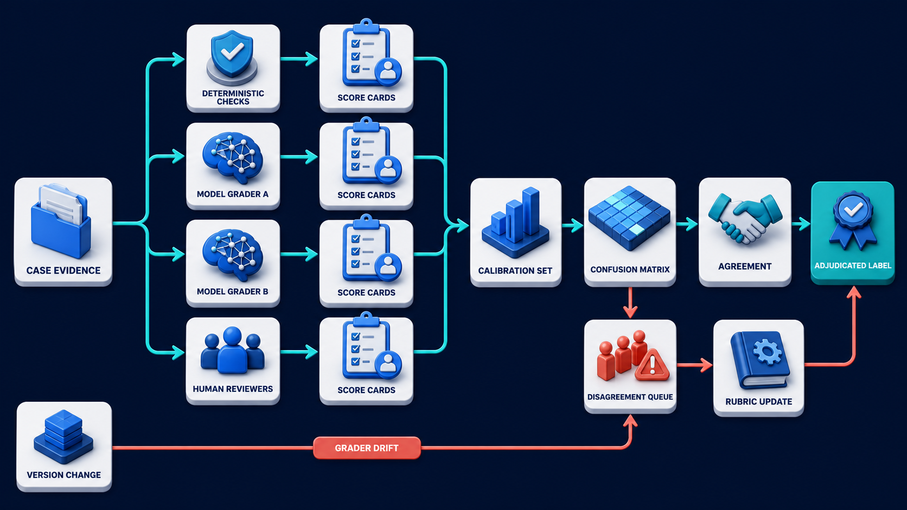
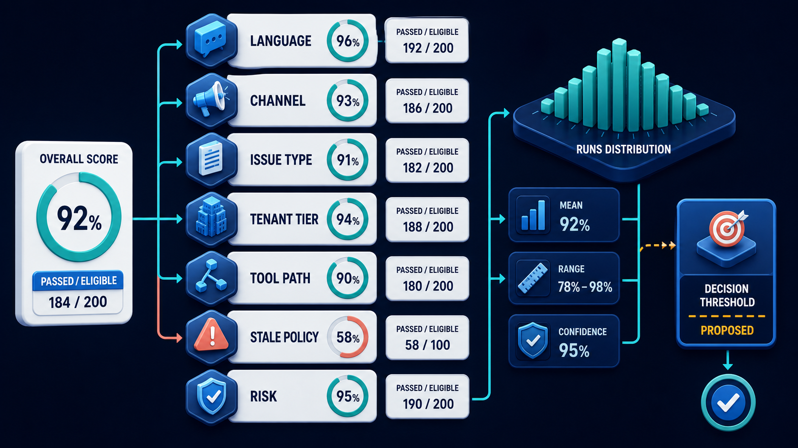

# Diagram 179 — Model graders, human rubrics, calibration, and disagreement

**Module:** Evaluation design
**Role in the course:** Convert vague confidence into repeatable cases, assertions, calibrated judgments, meaningful slices, and honest uncertainty.
**Layout:** The diagram shows the same CASE EVIDENCE sent to DETERMINISTIC CHECKS, MODEL GRADER A, MODEL GRADER B, and HUMAN REVIEWERS; it also their SCORE CARDS flow into CALIBRATION SET, CONFUSION MATRIX, AGREEMENT, DISAGREEMENT QUEUE, and RUBRIC UPDATE.

---

## At a glance

**Treat graders as measuring instruments that need calibration, disagreement handling, and their own evaluation.**

- Define one rubric dimension at a time with clear anchors, automatic failures, and allowed evidence.
- Create a human-reviewed calibration set containing representative, difficult, unsafe, and disagreement cases.
- Measure grader agreement, false passes, false fails, confusion by class, and important slice behavior.
- A GRADER DRIFT path shows the failure the design must catch before it reaches the user.

---

## What the diagram teaches

### 1. Treat graders as measuring instruments that need calibration

A model grader is not an oracle; it is another versioned component with failure modes. It may favor verbosity, copy style from a reference, miss tool evidence, change after a model update, or behave differently across languages and topics. Begin with a clear rubric containing named dimensions, anchors, permitted evidence, automatic failures, and instructions for uncertainty. Build a calibration set judged by qualified humans, including easy examples, boundary cases, disagreements, and unacceptable outcomes. Compare grader decisions with adjudicated labels using more than one number: agreement by class, false-pass and false-fail rates, confusion matrix, and slice behavior. For high-impact safety gates, false passes may matter much more than false fails. The diagram exists so the team can treat graders as measuring instruments that need calibration, disagreement handling, and their own evaluation.

### 2. Define one rubric dimension at a time with clear anchors,

Define one rubric dimension at a time with clear anchors, automatic failures, and allowed evidence. It may favor verbosity, copy style from a reference, miss tool evidence, change after a model update, or behave differently across languages and topics. Begin with a clear rubric containing named dimensions, anchors, permitted evidence, automatic failures, and instructions for uncertainty. In the diagram, this is represented by **CASE EVIDENCE** and **RUBRIC UPDATE**. The case study where The grader marks Maya's stale answer as correct because it is fluent and includes a citation, while human reviewers notice the cited policy version is obsolete makes the risk concrete: replacing every human review with one uncalibrated model judge can automate the same bias and blind spot across the entire dataset. When this step is done well, the system stops treating fluency as correctness and gains a measured boundary for grader trust.

### 3. Create a human-reviewed calibration set containing representative, difficult, unsafe,

In the diagram, this is represented by **CALIBRATION SET** and **AGREEMENT**. Create a human-reviewed calibration set containing representative, difficult, unsafe, and disagreement cases. Begin with a clear rubric containing named dimensions, anchors, permitted evidence, automatic failures, and instructions for uncertainty. Build a calibration set judged by qualified humans, including easy examples, boundary cases, disagreements, and unacceptable outcomes. The case study where The grader marks Maya's stale answer as correct because it is fluent and includes a citation, while human reviewers notice the cited policy version is obsolete shows the value: the system stops treating fluency as correctness and gains a measured boundary for grader trust. Skip it, and replacing every human review with one uncalibrated model judge can automate the same bias and blind spot across the entire dataset. The takeaway is clear: evaluate the grader, preserve disagreement, and escalate uncertainty where consequences matter.

### 4. Measure grader agreement, false passes, false fails, confusion by class,

Compare grader decisions with adjudicated labels using more than one number: agreement by class, false-pass and false-fail rates, confusion matrix, and slice behavior. This is why the step is non-negotiable: measure grader agreement, false passes, false fails, confusion by class, and important slice behavior. For high-impact safety gates, false passes may matter much more than false fails. In the diagram, this is represented by **AGREEMENT**. The case study where The grader marks Maya's stale answer as correct because it is fluent and includes a citation, while human reviewers notice the cited policy version is obsolete proves it: the system stops treating fluency as correctness and gains a measured boundary for grader trust. If the team omits this, replacing every human review with one uncalibrated model judge can automate the same bias and blind spot across the entire dataset.

### 5. Route uncertainty and high-impact disagreements to qualified human adjudication

Route uncertainty and high-impact disagreements to qualified human adjudication and record the reason. Build a calibration set judged by qualified humans, including easy examples, boundary cases, disagreements, and unacceptable outcomes. Send low-confidence cases and important disagreements to human review. In the diagram, this is represented by **AGREEMENT**. The case study where The grader marks Maya's stale answer as correct because it is fluent and includes a citation, while human reviewers notice the cited policy version is obsolete makes the risk concrete: replacing every human review with one uncalibrated model judge can automate the same bias and blind spot across the entire dataset. When this step is done well, the system stops treating fluency as correctness and gains a measured boundary for grader trust.

### 6. Version the grader and rerun calibration after model, prompt, rubric,

In the diagram, this is represented by **CASE EVIDENCE** and **MODEL GRADER**, near **MODEL GRADER B**. Version the grader and rerun calibration after model, prompt, rubric, evidence, or configuration changes. It may favor verbosity, copy style from a reference, miss tool evidence, change after a model update, or behave differently across languages and topics. Record grader model, prompt, rubric, temperature or decoding settings, evidence supplied, and output. The case study where The grader marks Maya's stale answer as correct because it is fluent and includes a citation, while human reviewers notice the cited policy version is obsolete shows the value: the system stops treating fluency as correctness and gains a measured boundary for grader trust. Skip it, and replacing every human review with one uncalibrated model judge can automate the same bias and blind spot across the entire dataset. The takeaway is clear: evaluate the grader, preserve disagreement, and escalate uncertainty where consequences matter.

### 7. Putting it together

Taken together, these steps turn the objective "treat graders as measuring instruments that need calibration, disagreement handling, and their own evaluation" into an operating contract. Define one rubric dimension at a time with clear anchors, automatic failures, and allowed evidence; Create a human-reviewed calibration set containing representative, difficult, unsafe, and disagreement cases; Measure grader agreement, false passes, false fails, confusion by class, and important slice behavior. The remaining steps extend this: Route uncertainty and high-impact disagreements to qualified human adjudication and record the reason; Version the grader and rerun calibration after model, prompt, rubric, evidence, or configuration changes. The case of The grader marks Maya's stale answer as correct because it is fluent and includes a citation, while human reviewers notice the cited policy version is obsolete shows how quickly replacing every human review with one uncalibrated model judge can automate the same bias and blind spot across the entire dataset. The durable lesson is evaluate the grader, preserve disagreement, and escalate uncertainty where consequences matter.

### Analogy

A thermometer must be checked against known temperatures. Two thermometers can agree and still both be wrong, so calibration needs trusted references and attention to where errors matter most.

### The Next.js surface

In the Next.js surface, the same contract appears through framework-specific patterns. Build a review console that hides candidate identity, shows only authorized evidence, captures dimension-level judgments, confidence, rationale category, and adjudication outcome. Keep model grading in server jobs with pinned configuration; never run privileged evidence or grader credentials in the browser. Visualize disagreement and class-specific false-pass rates, not only one average agreement percentage.

### The Python surface

In the Python surface, the same contract is enforced with typed models and tests. Implement grader adapters with a shared typed result schema containing dimension scores, confidence, evidence references, refusal, error, and version manifest. Use a calibration job to compute confusion tables and slice summaries against adjudicated labels while retaining denominators. Queue uncertain or high-risk disagreements for human review and store the adjudication as a new immutable label version.

Diagram 180 — *Slices, denominators, confidence, variance, and significance* is the next lens on this idea. The same concepts reappear there with different emphasis, so the two diagrams should be read as a pair.

---

## Case study — The fluent grader and the obsolete policy

The grader marks Maya's stale answer as correct because it is fluent and includes a citation, while human reviewers notice the cited policy version is obsolete.

### The walkthrough

1. A deterministic freshness assertion is added as an automatic failure before the language rubric.
2. The calibration set gains stale-but-plausible examples across several policy categories.
3. The team measures false passes by freshness slice and revises the grader evidence package and rubric.
4. The updated grader remains advisory until the false-pass rate meets the release rule on the calibration set.

### The result

The system stops treating fluency as correctness and gains a measured boundary for grader trust.

### The danger

Replacing every human review with one uncalibrated model judge can automate the same bias and blind spot across the entire dataset.

### The takeaway

Evaluate the grader, preserve disagreement, and escalate uncertainty where consequences matter.

---

## Composition

The same CASE EVIDENCE sits at the left and is copied to four parallel lanes: DETERMINISTIC CHECKS, MODEL GRADER A, MODEL GRADER B, and HUMAN REVIEWERS. From each lane, SCORE CARDS flow into a downstream calibration chain: CALIBRATION SET, CONFUSION MATRIX, AGREEMENT, DISAGREEMENT QUEUE, and RUBRIC UPDATE. A coral GRADER DRIFT arrow enters from a VERSION CHANGE at the top, warning that graders can change when versions change. A teal ADJUDICATED LABEL path exits to the right, representing trusted resolution. The composition is a measurement workshop: evidence is judged by multiple instruments, then the instruments are judged against one another.

## Element by element

- **CASE EVIDENCE** — The **CASE EVIDENCE** is a white record that same sent to DETERMINISTIC CHECKS,.
- **DETERMINISTIC CHECKS** — The **DETERMINISTIC CHECKS** is a cyan request or propagation path that same CASE EVIDENCE sent to ,.
- **MODEL GRADER** — The **MODEL GRADER** is a not an oracle;.
- **MODEL GRADER B** — The **MODEL GRADER B** is a cyan request or propagation path.
- **HUMAN REVIEWERS** — The **HUMAN REVIEWERS** is a cyan request or propagation path.
- **SCORE CARDS** — The **SCORE CARDS** is a SET.
- **CALIBRATION SET** — The **CALIBRATION SET** is a SET.
- **CONFUSION MATRIX** — The **CONFUSION MATRIX** is a MATRIX.
- **AGREEMENT** — The **AGREEMENT** is a cyan request or propagation path.
- **DISAGREEMENT QUEUE** — The **DISAGREEMENT QUEUE** is a QUEUE.
- **RUBRIC UPDATE** — The **RUBRIC UPDATE** is a white record.
- **GRADER DRIFT** — The **GRADER DRIFT** is the coral change in a grader's output when its model or prompt version changes.
- **VERSION CHANGE** — The **VERSION CHANGE** is a path .
- **ADJUDICATED LABEL** — The **ADJUDICATED LABEL** is the trusted reviewed decision produced by calibrated graders or human reviewers.

---

## Colour and flow semantics

- **Cobalt platform** — a service, stage, dataset, quality gate, budget, release lane, or incident-control boundary. In this diagram it appears on **CONFUSION MATRIX**.
- **Cyan arrow** — a request, propagated context, telemetry signal, evaluation flow, or candidate release path. In this diagram it appears on **DETERMINISTIC CHECKS**, **MODEL GRADER**, **MODEL GRADER B**, **HUMAN REVIEWERS**, **AGREEMENT**, **DISAGREEMENT QUEUE**.
- **Teal arrow** — a healthy result, matched evidence, safe promotion, controlled degradation, recovery, or verified learning path. In this diagram it appears on **ADJUDICATED LABEL**.
- **Coral path** — a broken trace, failed assertion, regression, overload, unsafe outcome, rollback, alert, or incident path. In this diagram it appears on **GRADER DRIFT**.
- **White card** — a span, event, metric, log, resource, case, score, budget, version, release, runbook, action, or regression record. In this diagram it appears on **CASE EVIDENCE**, **SCORE CARDS**, **CALIBRATION SET**, **RUBRIC UPDATE**, **VERSION CHANGE**.

The overall flow moves from the inputs on the left through the evaluation design stages and exits as either a teal healthy path or a coral failure path. White cards carry the records, cobalt platforms hold the boundaries, and the cyan arrows show propagation and requests.

---

## How to present it

- Start with the operational question the team actually needs to answer. Point at the central element and ask what a regulator, evaluator, or support operator would ask about this outcome, and which signal type would best answer it.
- Ask the room what the team would need to know before approving the next release. Point at **CASE EVIDENCE** and **RUBRIC UPDATE** and ask what would change if this step were skipped? Use the case study to make the failure concrete.
- Have the group list the operational decisions this stage informs. Highlight **CALIBRATION SET** and **AGREEMENT** and ask what real decision does this evidence support? Use the case study to make the failure concrete.
- Ask what evidence would change the route a support ticket takes. Trace with your finger **AGREEMENT** and ask what would a missing or corrupted value look like here? Use the case study to make the failure concrete.
- Get the room to name the owner who would need this evidence in an incident. Put a marker on **AGREEMENT** and ask who owns the evidence produced at this step? Use the case study to make the failure concrete.
- Ask what would need to be true for the team to skip this stage safely. Ask the room to locate **CASE EVIDENCE** and **MODEL GRADER** and ask which downstream stage would fail if this step were wrong? Use the case study to make the failure concrete.
- Use the analogy. A thermometer must be checked against known temperatures. Ask the room where the equivalent tracking number, queue, or ledger is in their own system, and where it would first break.
- Tell the case study — The fluent grader and the obsolete policy. Walk through the walkthrough and stop at the moment the failure first becomes visible. Ask what signal, gate, or version field would have caught it earlier.
- Run the lab. Create a 20-case calibration set with adjudicated labels. Define a three-class rubric, then calculate a confusion matrix by hand from sample grader results. Decide which false-pass class blocks release and which disagreements require human review. Have each group label the fields that are captured, hashed, redacted, or omitted.
- Pose the checkpoint. If two model graders agree, is the judgment automatically correct? Let the room answer before confirming with the answer. Then ask what the team would change in the next build based on the answer.
- Before moving on, ask the room to trace one healthy teal path and one coral path through the diagram, naming the evidence that flips the colour at each stage.
- Close on the contract. Evaluate the grader, preserve disagreement, and escalate uncertainty where consequences matter. Make the group write one sentence that ties the lesson to their own system.

---

## Lab and checkpoint

**Lab:** Create a 20-case calibration set with adjudicated labels. Define a three-class rubric, then calculate a confusion matrix by hand from sample grader results. Decide which false-pass class blocks release and which disagreements require human review.

**Checkpoint:** If two model graders agree, is the judgment automatically correct?

**Answer:** No. They may share training biases, prompt defects, or missing evidence. Agreement is useful, but calibration against trusted human-reviewed cases is still required.

---

## Glossary

- **Calibration** — checking a measuring process against trusted examples
- **False pass** — unacceptable behavior incorrectly judged acceptable
- **Adjudication** — reviewed decision that resolves a disagreement

---

## Sources

- [NIST Generative AI Profile](https://www.nist.gov/publications/artificial-intelligence-risk-management-framework-generative-artificial-intelligence)
- [NIST AI Risk Management Framework](https://www.nist.gov/itl/ai-risk-management-framework)

---

## Related lessons

- Diagram 177 — The anatomy of a useful evaluation case
- Diagram 180 — Slices, denominators, confidence, variance, and significance
- Diagram 189 — Offline gates and reproducible evaluation runs

---
