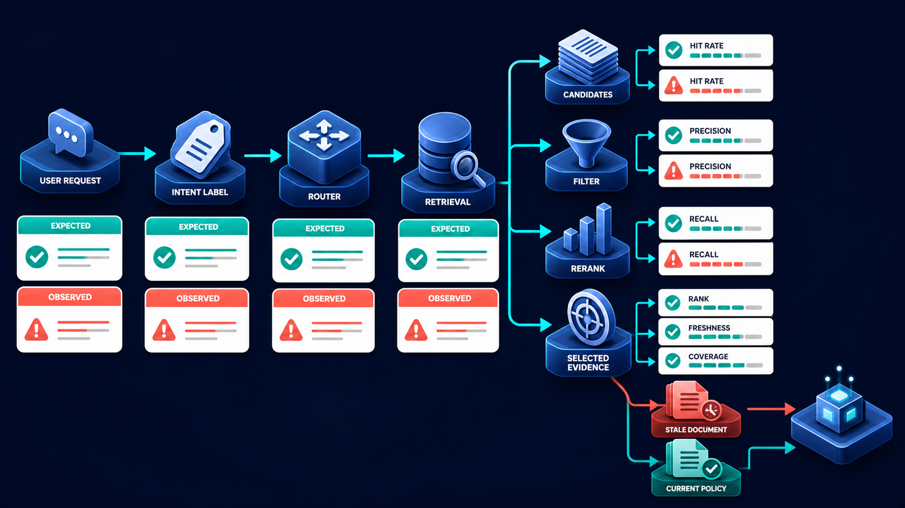

# Diagram 181 — Intent, routing, and retrieval quality

**Module:** Quality at every stage
**Role in the course:** Measure the component that failed instead of grading only the final sentence and guessing where the defect began.
**Layout:** The diagram shows USER REQUEST flowing through INTENT LABEL to ROUTER to RETRIEVAL; it also at each stage place EXPECTED and OBSERVED cards.

---

## At a glance

**Locate whether a bad answer began with misunderstanding, wrong routing, or weak evidence retrieval.**

- Label the user intent, entities, constraints, ambiguity, and required clarification or escalation.
- Record the expected route and compare it with the chosen workflow, specialist, model, and fallback.
- Judge whether relevant current authorized evidence entered the retrieval candidate set.
- A STALE DOCUMENT path shows the failure the design must catch before it reaches the user.

---

## What the diagram teaches

### 1. Measure intent, routing, and retrieval as separate stages

A final answer can fail long before generation. Intent quality asks whether the system correctly understood the user's job, entities, constraints, urgency, risk, and need for clarification. Routing quality asks whether it selected the right workflow, specialist, model, tool set, policy path, or human escalation. Retrieval quality asks whether relevant, current, authorized evidence entered the candidate set, survived filters, ranked high enough, and was actually selected for synthesis. Evaluate these stages separately. For intent, use labeled examples, confusion by class, missing-clarification checks, and high-cost misroute rates. The diagram exists so the team can locate whether a bad answer began with misunderstanding, wrong routing, or weak evidence retrieval.

Diagram 183 — *Planning, delegation, synthesis, and groundedness* is the next lens on this idea. The same concepts reappear there with different emphasis, so the two diagrams should be read as a pair.

### 2. Label the user intent, entities, constraints, ambiguity, and required clarification

Label the user intent, entities, constraints, ambiguity, and required clarification or escalation. Routing quality asks whether it selected the right workflow, specialist, model, tool set, policy path, or human escalation. Intent quality asks whether the system correctly understood the user's job, entities, constraints, urgency, risk, and need for clarification. In the diagram, this is represented by **USER REQUEST** and **INTENT LABEL**. The case study where Maya asks for the current exception policy makes the risk concrete: grading only the final citation can miss that retrieval repeatedly excluded useful evidence and the model merely got lucky on one run. When this step is done well, the team repairs freshness-aware ranking instead of changing the prompt or blaming generation.

### 3. Record the expected route and compare it with the chosen

In the diagram, this is represented by **EXPECTED**. Record the expected route and compare it with the chosen workflow, specialist, model, and fallback. For routing, compare expected and observed destinations, fallback behavior, latency, and cost. Routing quality asks whether it selected the right workflow, specialist, model, tool set, policy path, or human escalation. The case study where Maya asks for the current exception policy shows the value: the team repairs freshness-aware ranking instead of changing the prompt or blaming generation. Skip it, and grading only the final citation can miss that retrieval repeatedly excluded useful evidence and the model merely got lucky on one run. The takeaway is clear: measure understanding, routing, candidates, filters, rank, freshness, and selection as separate stages.

### 4. Judge whether relevant current authorized evidence entered the retrieval candidate

Retrieval quality asks whether relevant, current, authorized evidence entered the candidate set, survived filters, ranked high enough, and was actually selected for synthesis. This is why the step is non-negotiable: judge whether relevant current authorized evidence entered the retrieval candidate set. Routing quality asks whether it selected the right workflow, specialist, model, tool set, policy path, or human escalation. In the diagram, this is represented by **RETRIEVAL**. The case study where Maya asks for the current exception policy proves it: the team repairs freshness-aware ranking instead of changing the prompt or blaming generation. If the team omits this, grading only the final citation can miss that retrieval repeatedly excluded useful evidence and the model merely got lucky on one run.

### 5. Measure filters, ranking, selection, freshness, coverage, and citation resolution

Measure filters, ranking, selection, freshness, coverage, and citation resolution with explicit denominators. Retrieval quality asks whether relevant, current, authorized evidence entered the candidate set, survived filters, ranked high enough, and was actually selected for synthesis. Agent systems also need freshness, authorization, tenant filtering, source diversity, coverage, citation resolution, and no-evidence behavior. In the diagram, this is represented by **FILTER** and **RANK**, near **FRESHNESS**. The case study where Maya asks for the current exception policy makes the risk concrete: grading only the final citation can miss that retrieval repeatedly excluded useful evidence and the model merely got lucky on one run. When this step is done well, the team repairs freshness-aware ranking instead of changing the prompt or blaming generation.

### 6. Test no-evidence and conflicting-evidence cases so the system asks

In the diagram, this is represented by **SELECTED EVIDENCE**. Test no-evidence and conflicting-evidence cases so the system asks or abstains instead of inventing certainty. Retrieval quality asks whether relevant, current, authorized evidence entered the candidate set, survived filters, ranked high enough, and was actually selected for synthesis. Intent quality asks whether the system correctly understood the user's job, entities, constraints, urgency, risk, and need for clarification. The case study where Maya asks for the current exception policy shows the value: the team repairs freshness-aware ranking instead of changing the prompt or blaming generation. Skip it, and grading only the final citation can miss that retrieval repeatedly excluded useful evidence and the model merely got lucky on one run. The takeaway is clear: measure understanding, routing, candidates, filters, rank, freshness, and selection as separate stages.

### 7. Putting it together

Taken together, these steps turn the objective "locate whether a bad answer began with misunderstanding, wrong routing, or weak evidence retrieval" into an operating contract. Label the user intent, entities, constraints, ambiguity, and required clarification or escalation; Record the expected route and compare it with the chosen workflow, specialist, model, and fallback; Judge whether relevant current authorized evidence entered the retrieval candidate set. The remaining steps extend this: Measure filters, ranking, selection, freshness, coverage, and citation resolution with explicit denominators; Test no-evidence and conflicting-evidence cases so the system asks or abstains instead of inventing certainty. The case of Maya asks for the current exception policy shows how quickly grading only the final citation can miss that retrieval repeatedly excluded useful evidence and the model merely got lucky on one run. The durable lesson is measure understanding, routing, candidates, filters, rank, freshness, and selection as separate stages.

### Analogy

A librarian must understand the patron's question, send it to the correct department, find the current edition, and place the useful pages on the desk. Beautiful summarization cannot repair the wrong shelf or old book.

### The Next.js surface

In the Next.js surface, the same contract appears through framework-specific patterns. Capture a typed intent and routing decision on the server, including confidence category, clarification need, selected path, fallback, and version references. Build an evidence inspector that displays authorized document IDs, versions, ranks, filters, and selection reason without leaking inaccessible text. Evaluate search and routing in server jobs against frozen corpora and fixtures; keep React focused on review, comparison, and user control.

### The Python surface

In the Python surface, the same contract is enforced with typed models and tests. Create separate evaluator interfaces for intent classification, route selection, candidate retrieval, filtering, reranking, selection, and freshness. Use frozen query and corpus fixtures with explicit relevance and authorization labels, then compute stage measures with denominators and version manifests. Emit stage results into the trace and evaluation record so the final scorer can identify the earliest failed dependency.

---

## Case study — Maya asks for the current exception policy

Maya asks for the current exception policy. The system understands the request and chooses the policy workflow, but retrieval ranks an older policy above the current one.

### The walkthrough

1. Intent and routing assertions pass, narrowing the investigation.
2. The current policy appears in the candidate set, so candidate recall passes.
3. A freshness-aware reranking assertion fails because the obsolete version is selected first.
4. The fix changes selection policy and adds stale-current document pairs to the regression dataset.

### The result

The team repairs freshness-aware ranking instead of changing the prompt or blaming generation.

### The danger

Grading only the final citation can miss that retrieval repeatedly excluded useful evidence and the model merely got lucky on one run.

### The takeaway

Measure understanding, routing, candidates, filters, rank, freshness, and selection as separate stages.

---

## Composition

A USER REQUEST enters from the left and flows through three cyan stages: INTENT LABEL, ROUTER, and RETRIEVAL. At each stage, EXPECTED and OBSERVED cards sit above and below the path for comparison. RETRIEVAL fans out into CANDIDATES, a FILTER, a RERANK step, and SELECTED EVIDENCE. Around the selected evidence are six measure cards: HIT RATE, PRECISION, RECALL, RANK, FRESHNESS, and COVERAGE. A coral STALE DOCUMENT reaches toward generation on the lower path, while a teal CURRENT POLICY is highlighted on the upper path. The layout is a stage-by-stage conveyor: understand, route, find, filter, rank, select, and compare each step to its expectation.

## Element by element

- **USER REQUEST** — The **USER REQUEST** is the user's original question or task, the first input to the agent pipeline.
- **INTENT LABEL** — The **INTENT LABEL** is the classification of the user's real job and constraints before routing.
- **ROUTER** — The **ROUTER** is the stage that selects the right workflow, specialist, model, or policy path.
- **RETRIEVAL** — The **RETRIEVAL** is the stage where evidence is found, filtered, and ranked; it is where a STALE ANSWER is caught and blocked.
- **EXPECTED** — The **EXPECTED** is a cyan request or propagation path that at each stage place and OBSERVED cards.
- **OBSERVED** — The **OBSERVED** is a cyan request or propagation path that at each stage place EXPECTED and cards.
- **CANDIDATES** — The **CANDIDATES** are the documents or evidence items returned by the initial retrieval step.
- **FILTER** — The **FILTER** is the stage that removes irrelevant or unsafe evidence from the CANDIDATES.
- **RERANK** — The **RERANK** is the stage that reorders the remaining CANDIDATES by relevance and freshness.
- **SELECTED EVIDENCE** — The **SELECTED EVIDENCE** is the evidence that the system actually used to generate an answer.
- **HIT RATE** — The **HIT RATE** is the fraction of requests that return at least one relevant candidate.
- **PRECISION** — The **PRECISION** is the fraction of selected evidence that is actually relevant and current.
- **RECALL** — The **RECALL** is the fraction of all relevant evidence that the retrieval stage finds.
- **RANK** — The **RANK** is a cyan request or propagation path.
- **FRESHNESS** — The **FRESHNESS** is the age and version of the evidence compared to the current policy or source.
- **COVERAGE** — The **COVERAGE** is the breadth of source and language coverage in the selected evidence.
- **STALE DOCUMENT** — The **STALE DOCUMENT** is the outdated evidence that reaches generation and threatens correctness.
- **CURRENT POLICY** — The **CURRENT POLICY** is the current, authorized evidence selected by the retrieval system.

---

## Colour and flow semantics

- **Cobalt platform** — a service, stage, dataset, quality gate, budget, release lane, or incident-control boundary. In this diagram it appears on **INTENT LABEL**, **FILTER**, **RERANK**.
- **Cyan arrow** — a request, propagated context, telemetry signal, evaluation flow, or candidate release path. In this diagram it appears on **USER REQUEST**, **ROUTER**, **RETRIEVAL**, **EXPECTED**, **OBSERVED**, **PRECISION**, **RECALL**, **RANK** and others.
- **Teal arrow** — a healthy result, matched evidence, safe promotion, controlled degradation, recovery, or verified learning path. In this diagram it appears on **CURRENT POLICY**.
- **Coral path** — a broken trace, failed assertion, regression, overload, unsafe outcome, rollback, alert, or incident path. In this diagram it appears on **STALE DOCUMENT**.
- **White card** — a span, event, metric, log, resource, case, score, budget, version, release, runbook, action, or regression record. In this diagram it appears on **CANDIDATES**, **SELECTED EVIDENCE**, **HIT RATE**.

The overall flow moves from the inputs on the left through the quality at every stage stages and exits as either a teal healthy path or a coral failure path. White cards carry the records, cobalt platforms hold the boundaries, and the cyan arrows show propagation and requests.

---

## How to present it

- Start with the operational question the team actually needs to answer. Point at the central element and ask what a regulator, evaluator, or support operator would ask about this outcome, and which signal type would best answer it.
- Ask the room what the team would need to know before approving the next release. Point at **USER REQUEST** and **INTENT LABEL** and ask what would change if this step were skipped? Use the case study to make the failure concrete.
- Have the group list the operational decisions this stage informs. Highlight **EXPECTED** and ask what real decision does this evidence support? Use the case study to make the failure concrete.
- Ask what evidence would change the route a support ticket takes. Trace with your finger **RETRIEVAL** and ask what would a missing or corrupted value look like here? Use the case study to make the failure concrete.
- Get the room to name the owner who would need this evidence in an incident. Put a marker on **FILTER** and **RANK** and ask who owns the evidence produced at this step? Use the case study to make the failure concrete.
- Ask what would need to be true for the team to skip this stage safely. Ask the room to locate **SELECTED EVIDENCE** and ask which downstream stage would fail if this step were wrong? Use the case study to make the failure concrete.
- Use the analogy. A librarian must understand the patron's question, send it to the correct department, find the current edition, and place the useful pages on the desk. Ask the room where the equivalent tracking number, queue, or ledger is in their own system, and where it would first break.
- Tell the case study — Maya asks for the current exception policy. Walk through the walkthrough and stop at the moment the failure first becomes visible. Ask what signal, gate, or version field would have caught it earlier.
- Run the lab. Create ten synthetic policy queries with expected intents, routes, current evidence, forbidden tenant documents, and no-evidence cases. Score candidate recall, selected-evidence freshness, wrong-route rate, and clarification behavior separately. Have each group label the fields that are captured, hashed, redacted, or omitted.
- Pose the checkpoint. If the correct document appears somewhere in the top 20 candidates, is retrieval automatically good enough? Let the room answer before confirming with the answer. Then ask what the team would change in the next build based on the answer.
- Before moving on, ask the room to trace one healthy teal path and one coral path through the diagram, naming the evidence that flips the colour at each stage.
- Close on the contract. Measure understanding, routing, candidates, filters, rank, freshness, and selection as separate stages. Make the group write one sentence that ties the lesson to their own system.

---

## Lab and checkpoint

**Lab:** Create ten synthetic policy queries with expected intents, routes, current evidence, forbidden tenant documents, and no-evidence cases. Score candidate recall, selected-evidence freshness, wrong-route rate, and clarification behavior separately.

**Checkpoint:** If the correct document appears somewhere in the top 20 candidates, is retrieval automatically good enough?

**Answer:** No. The document must survive authorization and freshness filters, rank where the system can use it, cover the question, and be selected or cited appropriately.

---

## Glossary

- **Recall** — fraction of relevant items that were found
- **Precision** — fraction of retrieved items that were relevant
- **Reranker** — component that reorders candidates using additional signals

---

## Sources

- [OpenTelemetry GenAI semantic conventions](https://github.com/open-telemetry/semantic-conventions-genai)
- [NIST Generative AI Profile](https://www.nist.gov/publications/artificial-intelligence-risk-management-framework-generative-artificial-intelligence)

---

## Related lessons

- Diagram 177 — The anatomy of a useful evaluation case
- Diagram 180 — Slices, denominators, confidence, variance, and significance
- Diagram 183 — Planning, delegation, synthesis, and groundedness

---
