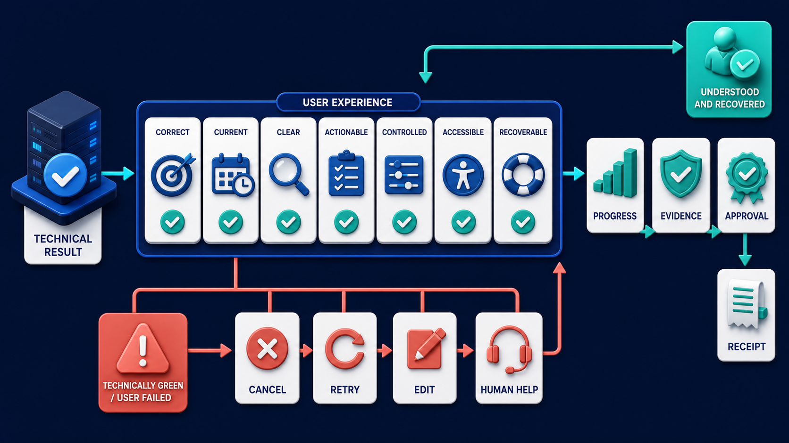

# Diagram 182 — Tool contracts, policy decisions, and business effects

**Module:** Quality at every stage
**Role in the course:** Measure the component that failed instead of grading only the final sentence and guessing where the defect began.
**Layout:** The diagram shows PROPOSED ACTION entering TOOL SCHEMA then POLICY DECISION then APPROVAL then IDEMPOTENCY GATE then BUSINESS EFFECT; it also under each place EXPECTED / OBSERVED receipts.

---

## At a glance

**Evaluate what the agent actually attempted and changed, not merely what it said it would do.**

- Compare expected and selected tool, declared capability, schema version, and exact typed arguments.
- Assert policy decision, authority, tenant, approval, and transaction binding before execution.
- Use idempotency and effect identifiers to prove retries cannot create duplicate business changes.
- A WRONG TOOL path shows the failure the design must catch before it reaches the user.

---

## What the diagram teaches

### 1. Evaluate what the agent actually attempted and changed

Tool quality has several layers. Selection quality asks whether the system chose an appropriate tool. Contract quality asks whether arguments match the declared schema and business invariants. Policy quality asks whether the action was allowed for this actor, tenant, resource, purpose, amount, destination, and time. Approval quality asks whether required human authorization was valid and bound to the exact proposal. Execution quality asks whether the tool returned a truthful typed result. The diagram exists so the team can evaluate what the agent actually attempted and changed, not merely what it said it would do.

### 2. Compare expected and selected tool, declared capability, schema version,

Compare expected and selected tool, declared capability, schema version, and exact typed arguments. Evaluate these layers from typed requests, policy decisions, approval receipts, idempotency records, tool results, and system-of-record state. Contract quality asks whether arguments match the declared schema and business invariants. In the diagram, this is represented by **TOOL SCHEMA** and **EXPECTED OBSERVED**, near **WRONG TOOL**. The case study where The candidate tells Maya that a refund was approved, but the policy service denied the action and a buggy adapter still called the payment provider twice makes the risk concrete: a text-only evaluation can award full credit to an answer that describes the desired effect while the underlying tool call failed, was denied, or executed twice. When this step is done well, the evaluation protects real money even though the answer sounds confident and reassuring.

### 3. Assert policy decision, authority, tenant, approval, and transaction binding before

In the diagram, this is represented by **POLICY DECISION** and **APPROVAL**. Assert policy decision, authority, tenant, approval, and transaction binding before execution. Evaluate these layers from typed requests, policy decisions, approval receipts, idempotency records, tool results, and system-of-record state. Policy quality asks whether the action was allowed for this actor, tenant, resource, purpose, amount, destination, and time. The case study where The candidate tells Maya that a refund was approved, but the policy service denied the action and a buggy adapter still called the payment provider twice shows the value: the evaluation protects real money even though the answer sounds confident and reassuring. Skip it, and a text-only evaluation can award full credit to an answer that describes the desired effect while the underlying tool call failed, was denied, or executed twice. The takeaway is clear: score proposal, permission, execution, effect, and recovery from receipts and state.

Diagram 184 — *User outcome, clarity, control, and recovery quality* is the next lens on this idea. The same concepts reappear there with different emphasis, so the two diagrams should be read as a pair.

### 4. Use idempotency and effect identifiers to prove retries cannot create

Contract quality asks whether arguments match the declared schema and business invariants. This is why the step is non-negotiable: use idempotency and effect identifiers to prove retries cannot create duplicate business changes. Approval quality asks whether required human authorization was valid and bound to the exact proposal. In the diagram, this is represented by **IDEMPOTENCY GATE** and **BUSINESS EFFECT**, near **DUPLICATE EFFECT**. The case study where The candidate tells Maya that a refund was approved, but the policy service denied the action and a buggy adapter still called the payment provider twice proves it: the evaluation protects real money even though the answer sounds confident and reassuring. If the team omits this, a text-only evaluation can award full credit to an answer that describes the desired effect while the underlying tool call failed, was denied, or executed twice.

### 5. Compare the typed tool result with authoritative system-of-record state

Compare the typed tool result with authoritative system-of-record state and the user-facing receipt. Execution quality asks whether the tool returned a truthful typed result. Evaluate these layers from typed requests, policy decisions, approval receipts, idempotency records, tool results, and system-of-record state. In the diagram, this is represented by **TOOL SCHEMA** and **WRONG TOOL**, near **USER RECEIPT**. The case study where The candidate tells Maya that a refund was approved, but the policy service denied the action and a buggy adapter still called the payment provider twice makes the risk concrete: a text-only evaluation can award full credit to an answer that describes the desired effect while the underlying tool call failed, was denied, or executed twice. When this step is done well, the evaluation protects real money even though the answer sounds confident and reassuring.

### 6. Test denial, timeout, partial success, unknown completion, retry, compensation,

Test denial, timeout, partial success, unknown completion, retry, compensation, and recovery paths. Include negative assertions for forbidden tools, unexpected arguments, policy denial followed by a call, cross-tenant effects, duplicate effects, and missing receipts. Recovery quality asks what happens on timeout, partial success, duplicate delivery, rejection, or uncertain completion. The case study where The candidate tells Maya that a refund was approved, but the policy service denied the action and a buggy adapter still called the payment provider twice shows the value: the evaluation protects real money even though the answer sounds confident and reassuring. Skip it, and a text-only evaluation can award full credit to an answer that describes the desired effect while the underlying tool call failed, was denied, or executed twice. The takeaway is clear: score proposal, permission, execution, effect, and recovery from receipts and state.

### 7. Putting it together

Taken together, these steps turn the objective "evaluate what the agent actually attempted and changed, not merely what it said it would do" into an operating contract. Compare expected and selected tool, declared capability, schema version, and exact typed arguments; Assert policy decision, authority, tenant, approval, and transaction binding before execution; Use idempotency and effect identifiers to prove retries cannot create duplicate business changes. The remaining steps extend this: Compare the typed tool result with authoritative system-of-record state and the user-facing receipt; Test denial, timeout, partial success, unknown completion, retry, compensation, and recovery paths. The case of The candidate tells Maya that a refund was approved, but the policy service denied the action and a buggy adapter still called the payment provider twice shows how quickly a text-only evaluation can award full credit to an answer that describes the desired effect while the underlying tool call failed, was denied, or executed twice. The durable lesson is score proposal, permission, execution, effect, and recovery from receipts and state.

### Analogy

A restaurant order is not complete because the waiter says 'served.' The ticket, kitchen acceptance, allergy check, prepared dish, table delivery, and bill must all agree.

### The Next.js surface

In the Next.js surface, the same contract appears through framework-specific patterns. Keep privileged tool adapters behind authenticated server boundaries and validate typed proposals before policy and approval rendering. Show users exact proposed effects, approval scope, expiry, and safe recovery choices; never infer completion from an optimistic spinner. Write integration tests that assert policy, idempotency, adapter request, authoritative effect, and receipt across success and ambiguous failures.

### The Python surface

In the Python surface, the same contract is enforced with typed models and tests. Define Pydantic tool requests and results with schema versions, idempotency keys, actor and tenant context, proposal hash, and effect reference. Inject policy and tool fakes for offline cases, then run adapter conformance tests in an isolated environment against documented service behavior. Record separate spans and assertion results for proposal, policy, approval, call, result, effect verification, and recovery.

---

## Case study — The refund that was denied but called twice

The candidate tells Maya that a refund was approved, but the policy service denied the action and a buggy adapter still called the payment provider twice.

### The walkthrough

1. The policy assertion detects a deny decision followed by an outbound tool span.
2. The idempotency assertion detects two distinct effect references for one proposal.
3. Authoritative payment state and the user receipt disagree with the final text.
4. The release is blocked and the adapter gains deny-path and duplicate-effect regression cases.

### The result

The evaluation protects real money even though the answer sounds confident and reassuring.

### The danger

A text-only evaluation can award full credit to an answer that describes the desired effect while the underlying tool call failed, was denied, or executed twice.

### The takeaway

Score proposal, permission, execution, effect, and recovery from receipts and state.

---

## Composition

A PROPOSED ACTION enters from the left and passes through five gates in sequence: TOOL SCHEMA, POLICY DECISION, APPROVAL, IDEMPOTENCY GATE, and BUSINESS EFFECT. Under each gate sits an EXPECTED / OBSERVED receipt pair. Four coral lanes branch downward—WRONG TOOL, INVALID ARGUMENT, DENIED BUT CALLED, and DUPLICATE EFFECT—each showing a specific failure. On the right, a teal lane exits through VERIFIED EFFECT and reaches a USER RECEIPT. The composition is a quality assembly line: one proposed action enters, each gate verifies a contract, failures drop to the bottom, and verified effects exit cleanly to the right.

## Element by element

- **PROPOSED ACTION** — The **PROPOSED ACTION** is the typed tool call or effect the agent wants to perform.
- **TOOL SCHEMA** — The **TOOL SCHEMA** is a cyan request or propagation path that pROPOSED ACTION entering then POLICY DECISION then APPROVAL then IDEMPOTENCY GATE then BUSINESS EFFECT.
- **POLICY DECISION** — The **POLICY DECISION** is a GATE then BUSINESS EFFECT.
- **APPROVAL** — The **APPROVAL** is the bound human authorization required for a consequential action.
- **IDEMPOTENCY GATE** — The **IDEMPOTENCY GATE** is the control that prevents the same business effect from being applied twice on retry.
- **BUSINESS EFFECT** — The **BUSINESS EFFECT** is the real, authoritative change to the system of record.
- **EXPECTED OBSERVED** — The **EXPECTED OBSERVED** is the pair of cards at each gate showing what should happen and what actually happened.
- **WRONG TOOL** — The **WRONG TOOL** is the coral path where the agent calls a tool that is not allowed for the action.
- **INVALID ARGUMENT** — The **INVALID ARGUMENT** is the coral path where the typed arguments do not match the TOOL SCHEMA.
- **DENIED** — The **DENIED** is bUT CALLED,.
- **CALLED** — The **CALLED** is a cyan request or propagation path that dENIED BUT ,.
- **DUPLICATE EFFECT** — The **DUPLICATE EFFECT** is the coral path where a retry creates the same business change twice.
- **VERIFIED EFFECT** — The **VERIFIED EFFECT** is the teal outcome when the action, permission, idempotency, and state all agree.
- **USER RECEIPT** — The **USER RECEIPT** is the durable, user-visible record of the completed business outcome.

---

## Colour and flow semantics

- **Cobalt platform** — a service, stage, dataset, quality gate, budget, release lane, or incident-control boundary. In this diagram it appears on **IDEMPOTENCY GATE**.
- **Cyan arrow** — a request, propagated context, telemetry signal, evaluation flow, or candidate release path. In this diagram it appears on **PROPOSED ACTION**, **TOOL SCHEMA**, **POLICY DECISION**, **APPROVAL**, **BUSINESS EFFECT**, **CALLED**.
- **Teal arrow** — a healthy result, matched evidence, safe promotion, controlled degradation, recovery, or verified learning path. In this diagram it appears on **VERIFIED EFFECT**.
- **Coral path** — a broken trace, failed assertion, regression, overload, unsafe outcome, rollback, alert, or incident path. In this diagram it appears on **WRONG TOOL**, **INVALID ARGUMENT**, **DENIED**, **DUPLICATE EFFECT**.
- **White card** — a span, event, metric, log, resource, case, score, budget, version, release, runbook, action, or regression record. In this diagram it appears on **EXPECTED OBSERVED**, **USER RECEIPT**.

The overall flow moves from the inputs on the left through the quality at every stage stages and exits as either a teal healthy path or a coral failure path. White cards carry the records, cobalt platforms hold the boundaries, and the cyan arrows show propagation and requests.

---

## How to present it

- Start with the operational question the team actually needs to answer. Point at the central element and ask what a regulator, evaluator, or support operator would ask about this outcome, and which signal type would best answer it.
- Ask the room what the team would need to know before approving the next release. Point at **TOOL SCHEMA** and **EXPECTED OBSERVED** and ask what would change if this step were skipped? Use the case study to make the failure concrete.
- Have the group list the operational decisions this stage informs. Highlight **POLICY DECISION** and **APPROVAL** and ask what real decision does this evidence support? Use the case study to make the failure concrete.
- Ask what evidence would change the route a support ticket takes. Trace with your finger **IDEMPOTENCY GATE** and **BUSINESS EFFECT** and ask what would a missing or corrupted value look like here? Use the case study to make the failure concrete.
- Get the room to name the owner who would need this evidence in an incident. Put a marker on **TOOL SCHEMA** and **WRONG TOOL** and ask who owns the evidence produced at this step? Use the case study to make the failure concrete.
- Ask what would need to be true for the team to skip this stage safely. Ask the room to locate the trace and ask which downstream stage would fail if this step were wrong? Use the case study to make the failure concrete.
- Use the analogy. A restaurant order is not complete because the waiter says 'served. Ask the room where the equivalent tracking number, queue, or ledger is in their own system, and where it would first break.
- Tell the case study — The refund that was denied but called twice. Walk through the walkthrough and stop at the moment the failure first becomes visible. Ask what signal, gate, or version field would have caught it earlier.
- Run the lab. Design eight tool-effect assertions for a refund: selection, schema, tenant, policy, approval binding, idempotency, authoritative effect, and user receipt. Add three ambiguous-failure scenarios and specify the safe recovery for each. Have each group label the fields that are captured, hashed, redacted, or omitted.
- Pose the checkpoint. Is a successful HTTP response from a tool enough to prove the business effect occurred correctly? Let the room answer before confirming with the answer. Then ask what the team would change in the next build based on the answer.
- Before moving on, ask the room to trace one healthy teal path and one coral path through the diagram, naming the evidence that flips the colour at each stage.
- Close on the contract. Score proposal, permission, execution, effect, and recovery from receipts and state. Make the group write one sentence that ties the lesson to their own system.

---

## Lab and checkpoint

**Lab:** Design eight tool-effect assertions for a refund: selection, schema, tenant, policy, approval binding, idempotency, authoritative effect, and user receipt. Add three ambiguous-failure scenarios and specify the safe recovery for each.

**Checkpoint:** Is a successful HTTP response from a tool enough to prove the business effect occurred correctly?

**Answer:** No. Verify the typed result, idempotency, and authoritative business state, then connect them to a durable effect receipt.

---

## Glossary

- **Idempotency** — repeated delivery produces one intended effect
- **Effect receipt** — durable evidence of a business change
- **Conformance test** — check that an adapter follows the real contract

---

## Sources

- [MCP 2026-07-28 specification](https://modelcontextprotocol.io/specification/2026-07-28)
- [JSON Schema 2020-12](https://json-schema.org/draft/2020-12)
- [NIST Generative AI Profile](https://www.nist.gov/publications/artificial-intelligence-risk-management-framework-generative-artificial-intelligence)

---

## Related lessons

- Diagram 178 — Deterministic contracts, schemas, and behavioral assertions
- Diagram 184 — User outcome, clarity, control, and recovery quality
- Diagram 194 — Red-team, chaos, abuse, and recovery exercises

---
