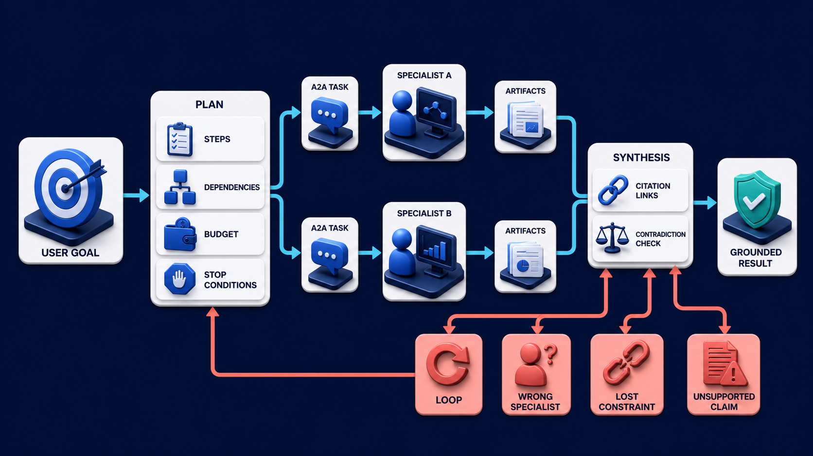
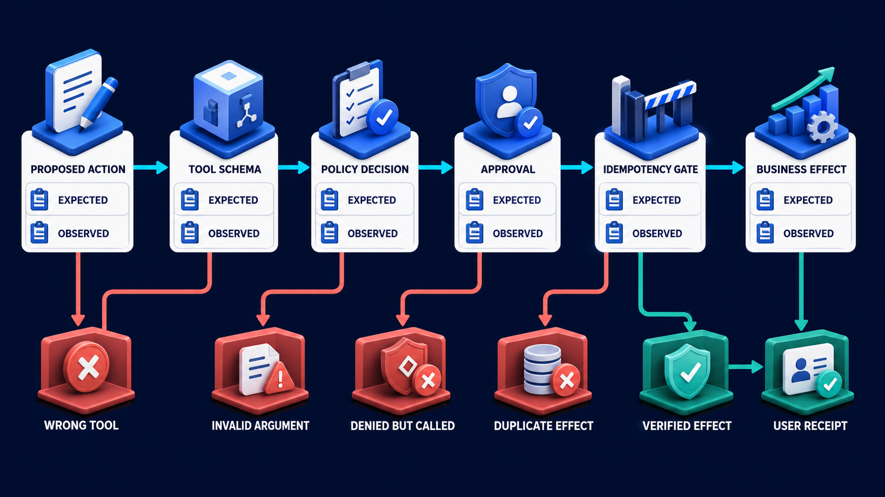

# Diagram 183 — Planning, delegation, synthesis, and groundedness

**Module:** Quality at every stage
**Role in the course:** Measure the component that failed instead of grading only the final sentence and guessing where the defect began.
**Layout:** The diagram shows USER GOAL becoming PLAN with STEPS, DEPENDENCIES, BUDGET, STOP CONDITIONS; it also pLAN delegates to SPECIALIST A and SPECIALIST B through A2A TASK cards.

---

## At a glance

**Measure whether multi-step agent work stays bounded, delegates appropriately, preserves constraints, and synthesizes grounded evidence.**

- Compare the plan with required steps, dependencies, constraints, budgets, approvals, and explicit stop conditions.
- Check specialist capability, authority, task scope, supplied context, deadline, and expected artifact contract.
- Measure retry, parallelism, dependency, duplicate, cancellation, and partial-failure behavior.
- A SPECIALIST path shows the failure the design must catch before it reaches the user.

---

## What the diagram teaches

### 1. Keep multi-step work bounded, delegated, and grounded

Planning quality is not whether a model prints an impressive checklist. A useful plan covers the required work, respects dependencies, keeps user and policy constraints, allocates time and cost, defines approval points, and stops when evidence is insufficient or the budget is exhausted. Delegation quality asks whether the chosen specialist advertises the needed capability, receives the minimum task context, returns a usable artifact, and stays within authority. Coordination quality asks whether retries, parallel work, dependency failures, and duplicated results are handled correctly. Synthesis quality asks whether the final result is supported by the returned artifacts, resolves or exposes contradictions, preserves source and version references, and distinguishes fact from inference. The diagram exists so the team can measure whether multi-step agent work stays bounded, delegates appropriately, preserves constraints, and synthesizes grounded evidence.

Diagram 182 — *Tool contracts, policy decisions, and business effects* is the next lens on this idea. The same concepts reappear there with different emphasis, so the two diagrams should be read as a pair.

### 2. Compare the plan with required steps, dependencies, constraints, budgets, approvals,

Compare the plan with required steps, dependencies, constraints, budgets, approvals, and explicit stop conditions. Evaluate the plan graph, A2A tasks, specialist artifacts, citations, constraint ledger, and stop reasons. A useful plan covers the required work, respects dependencies, keeps user and policy constraints, allocates time and cost. In the diagram, this is represented by **PLAN** and **STEPS**, near **DEPENDENCIES**. The case study where Acme delegates Maya's policy question to a research specialist and a finance specialist makes the risk concrete: rewarding task completion can teach an orchestrator to hide failed specialists and synthesize certainty from incomplete evidence. When this step is done well, maya receives useful partial evidence and an honest next step instead of an unsupported confident answer.

### 3. Check specialist capability, authority, task scope, supplied context, deadline,

In the diagram, this is represented by **SPECIALIST**. Check specialist capability, authority, task scope, supplied context, deadline, and expected artifact contract. Detect loops, unnecessary delegation, wrong specialist selection, context loss, budget overrun, ignored failure, unsupported claims, and accidental mixing of tenant or case data. Delegation quality asks whether the chosen specialist advertises the needed capability, receives the minimum task context, returns a usable artifact, and stays within authority. The case study where Acme delegates Maya's policy question to a research specialist and a finance specialist shows the value: maya receives useful partial evidence and an honest next step instead of an unsupported confident answer. Skip it, and rewarding task completion can teach an orchestrator to hide failed specialists and synthesize certainty from incomplete evidence. The takeaway is clear: a good agent plan is bounded, evidence-aware, failure-aware, and willing to stop.

### 4. Measure retry, parallelism, dependency, duplicate, cancellation, and partial-failure behavior.

Coordination quality asks whether retries, parallel work, dependency failures, and duplicated results are handled correctly. This is why the step is non-negotiable: measure retry, parallelism, dependency, duplicate, cancellation, and partial-failure behavior. Detect loops, unnecessary delegation, wrong specialist selection, context loss, budget overrun, ignored failure, unsupported claims, and accidental mixing of tenant or case data. The case study where Acme delegates Maya's policy question to a research specialist and a finance specialist proves it: maya receives useful partial evidence and an honest next step instead of an unsupported confident answer. If the team omits this, rewarding task completion can teach an orchestrator to hide failed specialists and synthesize certainty from incomplete evidence.

### 5. Trace every synthesized claim to one or more returned artifacts

Trace every synthesized claim to one or more returned artifacts and expose contradictions or missing evidence. A useful plan covers the required work, respects dependencies, keeps user and policy constraints, allocates time and cost. Synthesis quality asks whether the final result is supported by the returned artifacts, resolves or exposes contradictions. In the diagram, this is represented by **ARTIFACTS**. The case study where Acme delegates Maya's policy question to a research specialist and a finance specialist makes the risk concrete: rewarding task completion can teach an orchestrator to hide failed specialists and synthesize certainty from incomplete evidence. When this step is done well, maya receives useful partial evidence and an honest next step instead of an unsupported confident answer.

### 6. Score usefulness, groundedness, efficiency, and safe stopping separately rather than

In the diagram, this is represented by **PLAN**. Score usefulness, groundedness, efficiency, and safe stopping separately rather than rewarding longer plans. Delegation quality asks whether the chosen specialist advertises the needed capability, receives the minimum task context, returns a usable artifact, and stays within authority. A useful plan covers the required work, respects dependencies, keeps user and policy constraints, allocates time and cost. The case study where Acme delegates Maya's policy question to a research specialist and a finance specialist shows the value: maya receives useful partial evidence and an honest next step instead of an unsupported confident answer. Skip it, and rewarding task completion can teach an orchestrator to hide failed specialists and synthesize certainty from incomplete evidence. The takeaway is clear: a good agent plan is bounded, evidence-aware, failure-aware, and willing to stop.

### 7. Putting it together

Taken together, these steps turn the objective "measure whether multi-step agent work stays bounded, delegates appropriately, preserves constraints, and synthesizes grounded evidence" into an operating contract. Compare the plan with required steps, dependencies, constraints, budgets, approvals, and explicit stop conditions; Check specialist capability, authority, task scope, supplied context, deadline, and expected artifact contract; Measure retry, parallelism, dependency, duplicate, cancellation, and partial-failure behavior. The remaining steps extend this: Trace every synthesized claim to one or more returned artifacts and expose contradictions or missing evidence; Score usefulness, groundedness, efficiency, and safe stopping separately rather than rewarding longer plans. The case of Acme delegates Maya's policy question to a research specialist and a finance specialist shows how quickly rewarding task completion can teach an orchestrator to hide failed specialists and synthesize certainty from incomplete evidence. The durable lesson is a good agent plan is bounded, evidence-aware, failure-aware, and willing to stop.

### Analogy

A building contractor needs a dependency-aware schedule, qualified specialists, bounded work orders, inspection records, and a final handover tied to evidence. A long list of tasks is not a safe construction plan.

### The Next.js surface

In the Next.js surface, the same contract appears through framework-specific patterns. Render plan stages, specialist tasks, budgets, approvals, artifacts, failures, and stop reasons from typed server events rather than parsing prose. Keep the authoritative plan and constraint ledger server-side; let users approve, cancel, or steer through explicit commands bound to versions. Build evaluation views that connect each final claim to specialist artifact references and show unresolved contradictions accessibly.

### The Python surface

In the Python surface, the same contract is enforced with typed models and tests. Represent the plan as a typed dependency graph with budget, deadline, authority, expected artifact, retry, and stop fields per node. Wrap A2A clients with evaluation hooks that record selected Agent Card version, task and context IDs, artifact schema, status history, and failure class. Run graph assertions for cycles, missing dependencies, lost constraints, unsupported claims, and completion after a required failure.

---

## Case study — Maya's policy question with a timed-out finance specialist

Acme delegates Maya's policy question to a research specialist and a finance specialist. Research returns the current policy; finance times out after using an older cached rule.

### The walkthrough

1. The plan marks finance evidence as required for a consequential recommendation.
2. The timeout creates a partial result and triggers the defined stop condition instead of silent completion.
3. Synthesis preserves the research artifact, exposes missing finance confirmation, and offers a safe handoff.
4. The case scores constraint preservation and recovery positively while correctly marking the final recommendation incomplete.

### The result

Maya receives useful partial evidence and an honest next step instead of an unsupported confident answer.

### The danger

Rewarding task completion can teach an orchestrator to hide failed specialists and synthesize certainty from incomplete evidence.

### The takeaway

A good agent plan is bounded, evidence-aware, failure-aware, and willing to stop.

---

## Composition

A USER GOAL sits at the upper left and becomes a PLAN with STEPS, DEPENDENCIES, a BUDGET, and STOP CONDITIONS. The plan delegates downward to SPECIALIST A and SPECIALIST B through A2A TASK cards. Their ARTIFACTS move right into a SYNTHESIS stage with CITATION LINKS and a CONTRADICTION CHECK. Four coral paths branch out from the plan—LOOP, WRONG SPECIALIST, LOST CONSTRAINT, and UNSUPPORTED CLAIM—each marking a planning or delegation failure. A teal GROUNDED RESULT exits to the right. The layout is a project-management board: goal, bounded plan, specialists, artifacts, and a final result tied to evidence.

## Element by element

- **USER GOAL** — The **USER GOAL** is the user-visible objective that begins the workflow and justifies the work.
- **PLAN** — The **PLAN** is the bounded set of steps, dependencies, budgets, and stop conditions derived from the user goal.
- **STEPS** — The **STEPS** is a cyan request or propagation path that uSER GOAL becoming PLAN with ,.
- **DEPENDENCIES** — The **DEPENDENCIES** is a cyan request or propagation path.
- **BUDGET** — The **BUDGET** is a white record.
- **STOP CONDITIONS** — The **STOP CONDITIONS** are the criteria that end the exercise immediately if they are met.
- **SPECIALIST** — The **SPECIALIST** is a coral failure, risk, or incident path that wRONG ,.
- **SPECIALIST B** — The **SPECIALIST B** is a cyan request or propagation path that pLAN delegates to SPECIALIST A and through A2A TASK cards.
- **A2A TASK** — The **A2A TASK** is a cyan request or propagation path that pLAN delegates to SPECIALIST A and SPECIALIST B through cards.
- **ARTIFACTS** — The **ARTIFACTS** is a white record that their enter SYNTHESIS with CITATION LINKS and CONTRADICTION CHECK.
- **SYNTHESIS** — The **SYNTHESIS** are the stage that combines specialist artifacts into a final, cited answer.
- **CITATION LINKS** — The **CITATION LINKS** are the references that tie a synthesized claim to its source evidence.
- **CONTRADICTION CHECK** — The **CONTRADICTION CHECK** is the control that exposes conflicts among specialist artifacts before synthesis.
- **LOOP** — The **LOOP** is the coral path where planning returns to an earlier step without making progress.
- **WRONG SPECIALIST** — The **WRONG SPECIALIST** is the coral path where the plan delegates to an agent that cannot do the task.
- **LOST CONSTRAINT** — The **LOST CONSTRAINT** is the coral path where a user requirement is dropped from the plan.
- **UNSUPPORTED CLAIM** — The **UNSUPPORTED CLAIM** is the coral path where a final claim has no evidence or citation.
- **GROUNDED RESULT** — The **GROUNDED RESULT** is the teal output supported by identified artifact evidence and resolved contradictions.

---

## Colour and flow semantics

- **Cyan arrow** — a request, propagated context, telemetry signal, evaluation flow, or candidate release path. In this diagram it appears on **PLAN**, **STEPS**, **DEPENDENCIES**, **STOP CONDITIONS**, **SPECIALIST B**, **A2A TASK**, **SYNTHESIS**, **CITATION LINKS** and others.
- **Teal arrow** — a healthy result, matched evidence, safe promotion, controlled degradation, recovery, or verified learning path. In this diagram it appears on **GROUNDED RESULT**.
- **Coral path** — a broken trace, failed assertion, regression, overload, unsafe outcome, rollback, alert, or incident path. In this diagram it appears on **SPECIALIST**, **LOOP**, **WRONG SPECIALIST**.
- **White card** — a span, event, metric, log, resource, case, score, budget, version, release, runbook, action, or regression record. In this diagram it appears on **USER GOAL**, **BUDGET**, **ARTIFACTS**.

The overall flow moves from the inputs on the left through the quality at every stage stages and exits as either a teal healthy path or a coral failure path. White cards carry the records, cobalt platforms hold the boundaries, and the cyan arrows show propagation and requests.

---

## How to present it

- Start with the operational question the team actually needs to answer. Point at the central element and ask what a regulator, evaluator, or support operator would ask about this outcome, and which signal type would best answer it.
- Ask the room what the team would need to know before approving the next release. Point at **PLAN** and **STEPS** and ask what would change if this step were skipped? Use the case study to make the failure concrete.
- Have the group list the operational decisions this stage informs. Highlight **SPECIALIST** and ask what real decision does this evidence support? Use the case study to make the failure concrete.
- Ask what evidence would change the route a support ticket takes. Trace with your finger the trace and ask what would a missing or corrupted value look like here? Use the case study to make the failure concrete.
- Get the room to name the owner who would need this evidence in an incident. Put a marker on **ARTIFACTS** and ask who owns the evidence produced at this step? Use the case study to make the failure concrete.
- Ask what would need to be true for the team to skip this stage safely. Ask the room to locate **PLAN** and ask which downstream stage would fail if this step were wrong? Use the case study to make the failure concrete.
- Use the analogy. A building contractor needs a dependency-aware schedule, qualified specialists, bounded work orders, inspection records, and a final handover tied to evidence. Ask the room where the equivalent tracking number, queue, or ledger is in their own system, and where it would first break.
- Tell the case study — Maya's policy question with a timed-out finance specialist. Walk through the walkthrough and stop at the moment the failure first becomes visible. Ask what signal, gate, or version field would have caught it earlier.
- Run the lab. Draw a six-node plan for Maya's case with dependencies, two specialists, one approval, one parallel branch, a latency and cost budget, expected artifacts, and three stop conditions. Write assertions for a loop, timeout, contradiction, and missing required evidence. Have each group label the fields that are captured, hashed, redacted, or omitted.
- Pose the checkpoint. Is a longer, more detailed plan necessarily better? Let the room answer before confirming with the answer. Then ask what the team would change in the next build based on the answer.
- Before moving on, ask the room to trace one healthy teal path and one coral path through the diagram, naming the evidence that flips the colour at each stage.
- Close on the contract. A good agent plan is bounded, evidence-aware, failure-aware, and willing to stop. Make the group write one sentence that ties the lesson to their own system.

---

## Lab and checkpoint

**Lab:** Draw a six-node plan for Maya's case with dependencies, two specialists, one approval, one parallel branch, a latency and cost budget, expected artifacts, and three stop conditions. Write assertions for a loop, timeout, contradiction, and missing required evidence.

**Checkpoint:** Is a longer, more detailed plan necessarily better?

**Answer:** No. A good plan is sufficient, dependency-aware, bounded, and testable. Unnecessary steps and agents increase latency, cost, attack surface, and failure opportunities.

---

## Glossary

- **Plan graph** — dependency structure of intended work
- **Stop condition** — rule that ends or pauses work safely
- **Grounded synthesis** — conclusion supported by identified evidence artifacts

---

## Sources

- [A2A Protocol 1.0 specification](https://a2a-protocol.org/latest/specification/)
- [OpenTelemetry GenAI semantic conventions](https://github.com/open-telemetry/semantic-conventions-genai)
- [NIST Generative AI Profile](https://www.nist.gov/publications/artificial-intelligence-risk-management-framework-generative-artificial-intelligence)

---

## Related lessons

- Diagram 181 — Intent, routing, and retrieval quality
- Diagram 182 — Tool contracts, policy decisions, and business effects
- Diagram 188 — Graceful degradation, fallback, and admission control

---
