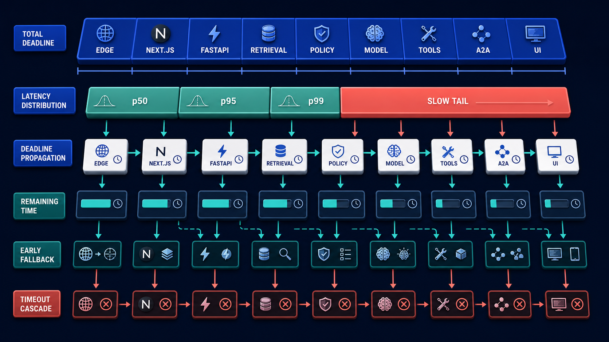
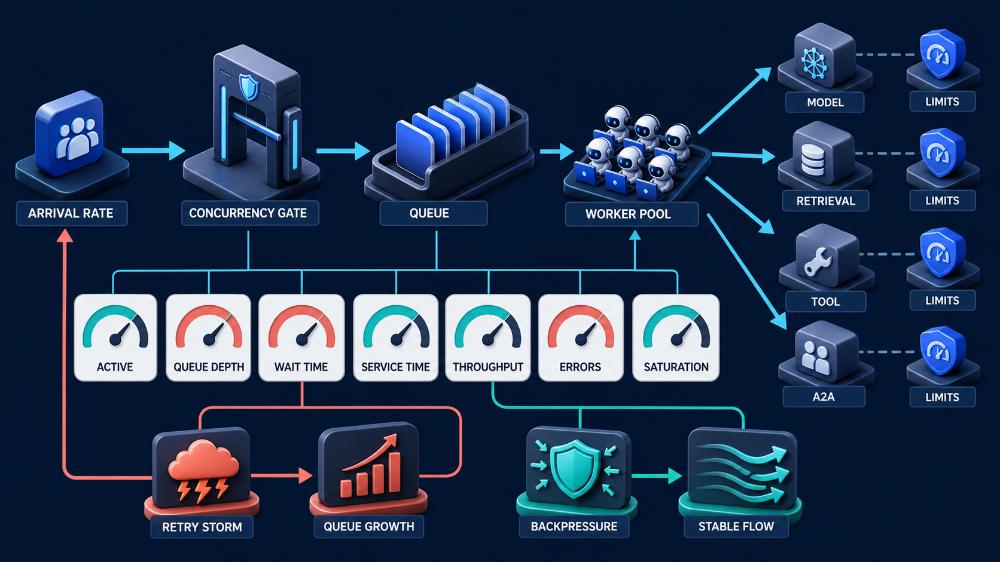

# Diagram 185 — Latency budgets, percentiles, deadlines, and the slow tail

**Module:** Performance, capacity, and economics
**Role in the course:** Treat latency, deadlines, scenario cost, load, queues, capacity, degradation, and admission as explicit design inputs.
**Layout:** The diagram shows TOTAL DEADLINE as a horizontal budget bar divided into EDGE, NEXT.JS, FASTAPI, RETRIEVAL, POLICY, MODEL, TOOLS, A2A, UI; it also under it show LATENCY DISTRIBUTION with p50, p95, p99 and a long coral SLOW TAIL.

---

## At a glance

**Design and measure end-to-end response time as a budget shared by stages rather than one unexplained average.**

- Define the user-visible deadline and separate first update, first evidence, final response, and background completion.
- Allocate a scenario budget to each stage plus network and recovery reserve.
- Propagate the deadline or remaining time across calls, tasks, queues, and retries.
- A SLOW TAIL path shows the failure the design must catch before it reaches the user.

---

## What the diagram teaches

### 1. Design latency as a budget shared across stages

Latency is the time a user or downstream workflow waits, and averages hide the slow tail. Report distributions and percentiles such as p50, p95, and p99 with their measurement window and population. A p95 of two seconds means 95% of eligible observations completed at or below that boundary; it does not describe the worst case and should not be averaged across services. Start from a user-relevant deadline, then allocate a scenario budget across edge, application, retrieval, policy, model, tools, specialists, queues, and interface rendering. Include network overhead and recovery reserve. Propagate remaining time so downstream work can choose a faster path or stop before the caller has already timed out. The diagram exists so the team can design and measure end-to-end response time as a budget shared by stages rather than one unexplained average.

Diagram 187 — *Load, concurrency, queues, capacity, and saturation* is the next lens on this idea. The same concepts reappear there with different emphasis, so the two diagrams should be read as a pair.

### 2. Define the user-visible deadline and separate first update, first evidence,

Define the user-visible deadline and separate first update, first evidence, final response, and background completion. Latency is the time a user or downstream workflow waits, and averages hide the slow tail. Separate time to first useful update, time to first evidence, time to final artifact, and background completion when the product supports progress. In the diagram, this is represented by **TOTAL DEADLINE** and **DEADLINE PROPAGATION**. The case study where Maya waits twelve seconds for a policy answer makes the risk concrete: optimizing average latency can leave the slowest users unchanged or worse, especially when retries and queues amplify the tail. When this step is done well, most users receive useful evidence sooner, and slow cases degrade visibly instead of failing after a silent wait.

### 3. Allocate a scenario budget to each stage plus network

Allocate a scenario budget to each stage plus network and recovery reserve. Include network overhead and recovery reserve. Start from a user-relevant deadline, then allocate a scenario budget across edge, application, retrieval, policy, model, tools, specialists, queues, and interface rendering. The case study where Maya waits twelve seconds for a policy answer shows the value: most users receive useful evidence sooner, and slow cases degrade visibly instead of failing after a silent wait. Skip it, and optimizing average latency can leave the slowest users unchanged or worse, especially when retries and queues amplify the tail. The takeaway is clear: one user deadline flows through every stage; percentiles reveal the slow tail that averages hide.

### 4. Propagate the deadline or remaining time across calls, tasks, queues,

Propagate remaining time so downstream work can choose a faster path or stop before the caller has already timed out. This is why the step is non-negotiable: propagate the deadline or remaining time across calls, tasks, queues, and retries. Latency is the time a user or downstream workflow waits, and averages hide the slow tail. In the diagram, this is represented by **REMAINING TIME**. The case study where Maya waits twelve seconds for a policy answer proves it: most users receive useful evidence sooner, and slow cases degrade visibly instead of failing after a silent wait. If the team omits this, optimizing average latency can leave the slowest users unchanged or worse, especially when retries and queues amplify the tail.

### 5. Measure distributions and percentiles by meaningful route, workload, and version,

Measure distributions and percentiles by meaningful route, workload, and version, not only averages. Latency is the time a user or downstream workflow waits, and averages hide the slow tail. Report distributions and percentiles such as p50, p95, and p99 with their measurement window and population. The case study where Maya waits twelve seconds for a policy answer makes the risk concrete: optimizing average latency can leave the slowest users unchanged or worse, especially when retries and queues amplify the tail. When this step is done well, most users receive useful evidence sooner, and slow cases degrade visibly instead of failing after a silent wait.

### 6. Inspect slow-tail traces and choose optimization, fallback, cancellation, or product

In the diagram, this is represented by **SLOW TAIL** and **EARLY FALLBACK**. Inspect slow-tail traces and choose optimization, fallback, cancellation, or product redesign based on the failing stage. A p95 of two seconds means 95% of eligible observations completed at or below that boundary; it does not describe the worst case and should not be averaged across services. Latency is the time a user or downstream workflow waits, and averages hide the slow tail. The case study where Maya waits twelve seconds for a policy answer shows the value: most users receive useful evidence sooner, and slow cases degrade visibly instead of failing after a silent wait. Skip it, and optimizing average latency can leave the slowest users unchanged or worse, especially when retries and queues amplify the tail. The takeaway is clear: one user deadline flows through every stage; percentiles reveal the slow tail that averages hide.

### 7. Putting it together

Taken together, these steps turn the objective "design and measure end-to-end response time as a budget shared by stages rather than one unexplained average" into an operating contract. Define the user-visible deadline and separate first update, first evidence, final response, and background completion; Allocate a scenario budget to each stage plus network and recovery reserve; Propagate the deadline or remaining time across calls, tasks, queues, and retries. The remaining steps extend this: Measure distributions and percentiles by meaningful route, workload, and version, not only averages; Inspect slow-tail traces and choose optimization, fallback, cancellation, or product redesign based on the failing stage. The case of Maya waits twelve seconds for a policy answer shows how quickly optimizing average latency can leave the slowest users unchanged or worse, especially when retries and queues amplify the tail. The durable lesson is one user deadline flows through every stage; percentiles reveal the slow tail that averages hide.

### Analogy

A traveler has 45 minutes for a connection. Walking, security, a shuttle, and boarding share one clock; each cannot independently assume it has the full 45 minutes.

### The Next.js surface

In the Next.js surface, the same contract appears through framework-specific patterns. Record server timing for Route Handlers and outbound calls while distinguishing streaming first-byte or first-event time from final artifact completion. Pass an explicit deadline through server-side fetch, MCP, A2A, and queue adapters and abort work that cannot produce useful value in time. Show progress and preserved partial results when background work continues, with product state independent from whether the HTTP connection remains open.

### The Python surface

In the Python surface, the same contract is enforced with typed models and tests. Use monotonic clocks, cancellation scopes or timeouts, and deadline context that is passed to FastAPI services, tools, specialists, and workers. Record histograms with appropriate buckets and bounded dimensions; connect exemplar or trace references for slow observations where supported. Test timeout, retry, cancellation, and cleanup behavior with injected delays at every stage, including work that ignores cancellation.

---

## Case study — Maya waits twelve seconds for a policy answer

Maya waits twelve seconds for a policy answer. The average dashboard shows three seconds, but retrieval and one finance specialist create a long p99 tail.

### The walkthrough

1. The team separates time to first progress from time to final answer and inspects p50, p95, and p99 by route.
2. Slow traces show retrieval retrying after the remaining deadline is already too small.
3. The workflow cancels the specialist, preserves current research, and offers an asynchronous completion option.
4. A proposed deadline budget and tail threshold become release evidence, clearly labeled as scenario targets.

### The result

Most users receive useful evidence sooner, and slow cases degrade visibly instead of failing after a silent wait.

### The danger

Optimizing average latency can leave the slowest users unchanged or worse, especially when retries and queues amplify the tail.

### The takeaway

One user deadline flows through every stage; percentiles reveal the slow tail that averages hide.

---

## Composition

A TOTAL DEADLINE bar stretches across the top of the diagram, divided into segments: EDGE, NEXT.JS, FASTAPI, RETRIEVAL, POLICY, MODEL, TOOLS, A2A, and UI. Below the bar, a LATENCY DISTRIBUTION shows p50, p95, p99, and a long coral SLOW TAIL that extends to the right. DEADLINE PROPAGATION and REMAINING TIME cards sit between the bar and the distribution. A teal EARLY FALLBACK path exits downward, while a coral TIMEOUT CASCADE path shows what happens when stages do not share the clock. The layout is a budget-and-distribution chart: time is allocated across the top, real-world latency is shown below, and the slow tail is the warning.

## Element by element

- **TOTAL DEADLINE** — The **TOTAL DEADLINE** is the horizontal bar representing the user-facing latest useful completion time.
- **EDGE** — The **EDGE** is a cyan request or propagation path that tOTAL DEADLINE as a horizontal budget bar divided into ,.
- **NEXT.JS** — The **NEXT.JS** is the TypeScript/React application that receives user-facing requests and continues telemetry context on the server.
- **FASTAPI** — The **FASTAPI** is the Python backend service that processes requests, enforces policy, and emits durable business records.
- **RETRIEVAL** — The **RETRIEVAL** is the stage where evidence is found, filtered, and ranked; it is where a STALE ANSWER is caught and blocked.
- **POLICY** — The **POLICY** is the rules that decide whether an action, retrieval, or disclosure is allowed.
- **MODEL** — The **MODEL** is the language model that generates candidate text, plans, and reasoning.
- **TOOLS** — The **TOOLS** are the external capabilities the agent can invoke with typed arguments and receipts.
- **A2A** — The **A2A** is the agent-to-agent protocol used to delegate tasks, receive artifacts, and coordinate work.
- **UI** — The **UI** is the user interface where progress, evidence, controls, and receipts are shown.
- **LATENCY DISTRIBUTION** — The **LATENCY DISTRIBUTION** is a DISTRIBUTION.
- **p50** — The **p50** is a cyan request or propagation path that show LATENCY DISTRIBUTION with ,.
- **p95** — The **p95** is a cyan request or propagation path.
- **p99** — The **p99** is and a long coral SLOW TAIL.
- **SLOW TAIL** — The **SLOW TAIL** is the coral curve of unusually slow requests that averages hide.
- **DEADLINE PROPAGATION** — The **DEADLINE PROPAGATION** is and REMAINING TIME cards,.
- **REMAINING TIME** — The **REMAINING TIME** is a cyan request or propagation path that dEADLINE PROPAGATION and cards,.
- **EARLY FALLBACK** — The **EARLY FALLBACK** is a teal healthy or verified result path that plus teal and coral TIMEOUT CASCADE paths.
- **TIMEOUT CASCADE** — The **TIMEOUT CASCADE** is a coral failure, risk, or incident path that plus teal EARLY FALLBACK and coral paths.

---

## Colour and flow semantics

- **Cyan arrow** — a request, propagated context, telemetry signal, evaluation flow, or candidate release path. In this diagram it appears on **TOTAL DEADLINE**, **EDGE**, **NEXT.JS**, **FASTAPI**, **RETRIEVAL**, **POLICY**, **MODEL**, **TOOLS** and others.
- **Teal arrow** — a healthy result, matched evidence, safe promotion, controlled degradation, recovery, or verified learning path. In this diagram it appears on **EARLY FALLBACK**.
- **Coral path** — a broken trace, failed assertion, regression, overload, unsafe outcome, rollback, alert, or incident path. In this diagram it appears on **SLOW TAIL**, **TIMEOUT CASCADE**.

The overall flow moves from the inputs on the left through the performance, capacity, and economics stages and exits as either a teal healthy path or a coral failure path. White cards carry the records, cobalt platforms hold the boundaries, and the cyan arrows show propagation and requests.

---

## How to present it

- Start with the operational question the team actually needs to answer. Point at the central element and ask what a regulator, evaluator, or support operator would ask about this outcome, and which signal type would best answer it.
- Ask the room what the team would need to know before approving the next release. Point at **TOTAL DEADLINE** and **DEADLINE PROPAGATION** and ask what would change if this step were skipped? Use the case study to make the failure concrete.
- Have the group list the operational decisions this stage informs. Highlight the trace and ask what real decision does this evidence support? Use the case study to make the failure concrete.
- Ask what evidence would change the route a support ticket takes. Trace with your finger **REMAINING TIME** and ask what would a missing or corrupted value look like here? Use the case study to make the failure concrete.
- Get the room to name the owner who would need this evidence in an incident. Put a marker on the trace and ask who owns the evidence produced at this step? Use the case study to make the failure concrete.
- Ask what would need to be true for the team to skip this stage safely. Ask the room to locate **SLOW TAIL** and **EARLY FALLBACK** and ask which downstream stage would fail if this step were wrong? Use the case study to make the failure concrete.
- Use the analogy. A traveler has 45 minutes for a connection. Ask the room where the equivalent tracking number, queue, or ledger is in their own system, and where it would first break.
- Tell the case study — Maya waits twelve seconds for a policy answer. Walk through the walkthrough and stop at the moment the failure first becomes visible. Ask what signal, gate, or version field would have caught it earlier.
- Run the lab. Create a proposed six-second interactive budget across nine stages with one-second reserve. Add p50, p95, and p99 scenario observations, then decide which stage to cancel or degrade when only 800 milliseconds remain. Label every number proposed. Have each group label the fields that are captured, hashed, redacted, or omitted.
- Pose the checkpoint. Can you add service p95 latencies together to get the end-to-end p95? Let the room answer before confirming with the answer. Then ask what the team would change in the next build based on the answer.
- Before moving on, ask the room to trace one healthy teal path and one coral path through the diagram, naming the evidence that flips the colour at each stage.
- Close on the contract. One user deadline flows through every stage; percentiles reveal the slow tail that averages hide. Make the group write one sentence that ties the lesson to their own system.

---

## Lab and checkpoint

**Lab:** Create a proposed six-second interactive budget across nine stages with one-second reserve. Add p50, p95, and p99 scenario observations, then decide which stage to cancel or degrade when only 800 milliseconds remain. Label every number proposed.

**Checkpoint:** Can you add service p95 latencies together to get the end-to-end p95?

**Answer:** Not reliably. Percentiles are distribution boundaries and generally do not add. Measure the end-to-end distribution and use traces to understand contributing stages.

---

## Glossary

- **Percentile** — boundary below which a percentage of observations falls
- **Deadline** — latest useful completion time
- **Slow tail** — small fraction of unusually slow requests

---

## Sources

- [Prometheus histogram practices](https://prometheus.io/docs/practices/histograms/)
- [Google SRE service-level objectives](https://sre.google/sre-book/service-level-objectives/)
- [OpenTelemetry metrics API](https://opentelemetry.io/docs/specs/otel/metrics/api/)

---

## Related lessons

- Diagram 180 — Slices, denominators, confidence, variance, and significance
- Diagram 187 — Load, concurrency, queues, capacity, and saturation
- Diagram 188 — Graceful degradation, fallback, and admission control

---
