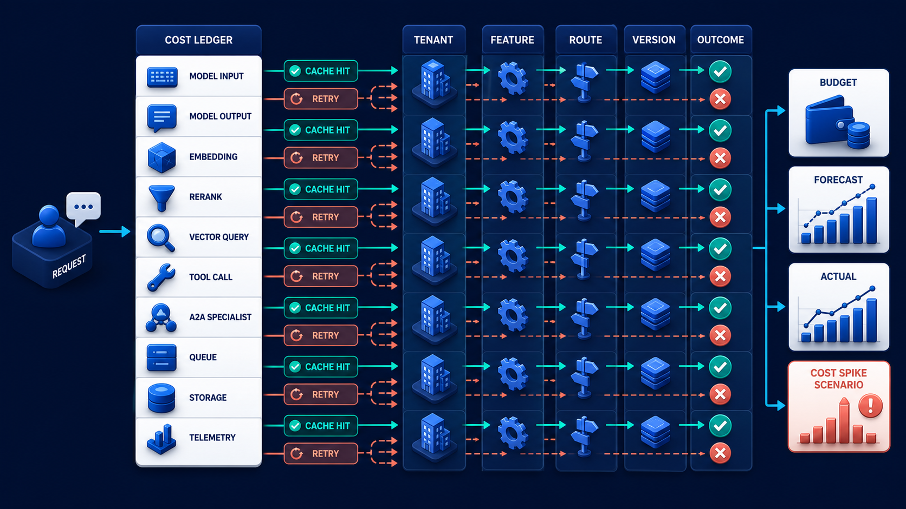

# Diagram 186 — Token, retrieval, tool, specialist, storage, and cache costs

**Module:** Performance, capacity, and economics
**Role in the course:** Treat latency, deadlines, scenario cost, load, queues, capacity, degradation, and admission as explicit design inputs.
**Layout:** The diagram shows one REQUEST opening a COST LEDGER with rows MODEL INPUT, MODEL OUTPUT, EMBEDDING, RERANK, VECTOR QUERY, TOOL CALL, A2A SPECIALIST, QUEUE, STORAGE, TELEMETRY; it also arrows show CACHE HIT reducing work and RETRY multiplying work.

---

## At a glance

**Explain where scenario cost comes from and compare cost with quality, latency, and user outcome instead of chasing one cheap request.**

- Inventory every billable or capacity-consuming stage and record usage quantity separately from price.
- Attach route, feature, version, outcome, and environment using bounded dimensions suitable for aggregation.
- Estimate before work, reserve a scenario budget, update actual usage, and record variance and retry amplification.
- A RETRY path shows the failure the design must catch before it reaches the user.

---

## What the diagram teaches

### 1. Count the whole scenario cost per valuable outcome

Agent cost is a chain, not just model tokens. A scenario ledger can include input and output tokens, cached tokens, embeddings, reranking, vector queries, external APIs, browser or code sandboxes, A2A specialists, queue operations, storage, artifacts, telemetry, retries, and human review. Prices change, discounts differ, and self-hosted systems still consume capacity, so store quantities and price versions separately. Attribute costs using bounded business dimensions such as route, feature, tenant plan, model version, release candidate, outcome class, and environment; keep personal IDs out of metric labels. Compare cost per attempted request, successful outcome, corrected outcome, and retained customer problem, because a cheap wrong answer may create expensive support work. The diagram exists so the team can explain where scenario cost comes from and compare cost with quality, latency, and user outcome instead of chasing one cheap request.

Diagram 185 — *Latency budgets, percentiles, deadlines, and the slow tail* is the next lens on this idea. The same concepts reappear there with different emphasis, so the two diagrams should be read as a pair.

### 2. Inventory every billable or capacity-consuming stage and record usage quantity

Inventory every billable or capacity-consuming stage and record usage quantity separately from price. A scenario ledger can include input and output tokens, cached tokens, embeddings, reranking, vector queries, external APIs. Prices change, discounts differ, and self-hosted systems still consume capacity, so store quantities and price versions separately. The case study where A candidate improves Maya's answer score slightly but invokes three specialists and repeats retrieval after every tool call, multiplying scenario cost and latency makes the risk concrete: a dashboard that labels estimated token cost as total agent cost can hide tools, specialists, storage, telemetry, retries, and expensive failure recovery. When this step is done well, the team preserves meaningful quality while removing work that adds cost without user value.

### 3. Attach route, feature, version, outcome, and environment using bounded dimensions

In the diagram, this is represented by **FEATURE** and **ROUTE**, near **VERSION**. Attach route, feature, version, outcome, and environment using bounded dimensions suitable for aggregation. Compare cost per attempted request, successful outcome, corrected outcome, and retained customer problem, because a cheap wrong answer may create expensive support work. Attribute costs using bounded business dimensions such as route, feature, tenant plan, model version, release candidate, outcome class. The case study where A candidate improves Maya's answer score slightly but invokes three specialists and repeats retrieval after every tool call, multiplying scenario cost and latency shows the value: the team preserves meaningful quality while removing work that adds cost without user value. Skip it, and a dashboard that labels estimated token cost as total agent cost can hide tools, specialists, storage, telemetry, retries, and expensive failure recovery. The takeaway is clear: count the whole work chain, version prices, and judge cost per valuable outcome.

### 4. Estimate before work, reserve a scenario budget, update actual usage,

Record planned budget, estimated cost before execution, actual quantities after execution, and variance reason. This is why the step is non-negotiable: estimate before work, reserve a scenario budget, update actual usage, and record variance and retry amplification. A scenario ledger can include input and output tokens, cached tokens, embeddings, reranking, vector queries, external APIs. In the diagram, this is represented by **RETRY** and **BUDGET**, near **ACTUAL**. The case study where A candidate improves Maya's answer score slightly but invokes three specialists and repeats retrieval after every tool call, multiplying scenario cost and latency proves it: the team preserves meaningful quality while removing work that adds cost without user value. If the team omits this, a dashboard that labels estimated token cost as total agent cost can hide tools, specialists, storage, telemetry, retries, and expensive failure recovery.

### 5. Compare cost per successful user outcome alongside quality, safety, latency,

Compare cost per successful user outcome alongside quality, safety, latency, and recovery measures. Cache measurement needs a correct baseline and must include invalidation, storage, staleness, and missed-quality cost. Compare cost per attempted request, successful outcome, corrected outcome, and retained customer problem, because a cheap wrong answer may create expensive support work. In the diagram, this is represented by **OUTCOME**. The case study where A candidate improves Maya's answer score slightly but invokes three specialists and repeats retrieval after every tool call, multiplying scenario cost and latency makes the risk concrete: a dashboard that labels estimated token cost as total agent cost can hide tools, specialists, storage, telemetry, retries, and expensive failure recovery. When this step is done well, the team preserves meaningful quality while removing work that adds cost without user value.

### 6. Version price inputs and disclose exclusions so forecasts and comparisons

In the diagram, this is represented by **VERSION** and **FORECAST**. Version price inputs and disclose exclusions so forecasts and comparisons can be reproduced later. A scenario ledger can include input and output tokens, cached tokens, embeddings, reranking, vector queries, external APIs. Prices change, discounts differ, and self-hosted systems still consume capacity, so store quantities and price versions separately. The case study where A candidate improves Maya's answer score slightly but invokes three specialists and repeats retrieval after every tool call, multiplying scenario cost and latency shows the value: the team preserves meaningful quality while removing work that adds cost without user value. Skip it, and a dashboard that labels estimated token cost as total agent cost can hide tools, specialists, storage, telemetry, retries, and expensive failure recovery. The takeaway is clear: count the whole work chain, version prices, and judge cost per valuable outcome.

### 7. Putting it together

Taken together, these steps turn the objective "explain where scenario cost comes from and compare cost with quality, latency, and user outcome instead of chasing one cheap request" into an operating contract. Inventory every billable or capacity-consuming stage and record usage quantity separately from price; Attach route, feature, version, outcome, and environment using bounded dimensions suitable for aggregation; Estimate before work, reserve a scenario budget, update actual usage, and record variance and retry amplification. The remaining steps extend this: Compare cost per successful user outcome alongside quality, safety, latency, and recovery measures; Version price inputs and disclose exclusions so forecasts and comparisons can be reproduced later. The case of A candidate improves Maya's answer score slightly but invokes three specialists and repeats retrieval after every tool call, multiplying scenario cost and latency shows how quickly a dashboard that labels estimated token cost as total agent cost can hide tools, specialists, storage, telemetry, retries, and expensive failure recovery. The durable lesson is count the whole work chain, version prices, and judge cost per valuable outcome.

### Analogy

A road trip costs more than fuel: tolls, parking, maintenance, lodging, detours, and time matter. The cheapest route is not best if it reaches the wrong city.

### The Next.js surface

In the Next.js surface, the same contract appears through framework-specific patterns. Create a server-side usage ledger with typed stage, quantity, unit, price-version reference, route, release, and outcome fields; keep price lookup outside UI components. Show scenario estimates and actuals with clear labels, missing-cost warnings, and quality context rather than presenting estimates as invoices. Apply preflight budgets to model, retrieval, tool, and specialist adapters and surface user choices when extra cost requires approval.

### The Python surface

In the Python surface, the same contract is enforced with typed models and tests. Use a context-managed cost ledger that records stage usage from model, retrieval, tool, queue, and storage adapters even when a request fails. Store quantities as durable events, join them with dated price tables for analysis, and recompute forecasts without rewriting historical usage. Test budget exhaustion, missing provider usage, retries, cache hits, partial failure, cancellation, and compensation costs with synthetic rates.

---

## Case study — The candidate that improved the score and tripled the cost

A candidate improves Maya's answer score slightly but invokes three specialists and repeats retrieval after every tool call, multiplying scenario cost and latency.

### The walkthrough

1. The ledger shows which stages and retries created the increase rather than reporting one provider bill.
2. Cost per correct outcome is compared with the baseline, including correction and escalation rates.
3. A planner budget caps redundant delegation and reuses verified retrieval evidence within its freshness window.
4. The release rule requires the quality benefit to justify the scenario cost and tail-latency change.

### The result

The team preserves meaningful quality while removing work that adds cost without user value.

### The danger

A dashboard that labels estimated token cost as total agent cost can hide tools, specialists, storage, telemetry, retries, and expensive failure recovery.

### The takeaway

Count the whole work chain, version prices, and judge cost per valuable outcome.

---

## Composition

One REQUEST opens a COST LEDGER in the center, with rows for MODEL INPUT, MODEL OUTPUT, EMBEDDING, RERANK, VECTOR QUERY, TOOL CALL, A2A SPECIALIST, QUEUE, STORAGE, and TELEMETRY. Arrows show a CACHE HIT reducing work on one row and a RETRY multiplying work on another. The ledger is grouped by TENANT, FEATURE, ROUTE, VERSION, and OUTCOME. A BUDGET card, a FORECAST card, and an ACTUAL card sit at the top, while a coral COST SPIKE card labeled SCENARIO appears on the right. The composition is an accounting spreadsheet made visual: one request produces a row for every cost source, with savings, amplification, and budget comparison visible at a glance.

## Element by element

- **REQUEST** — The **REQUEST** is the incoming operation shown as a cyan path that starts the telemetry chain.
- **COST LEDGER** — The **COST LEDGER** is the visual accounting sheet of scenario cost for one request.
- **MODEL INPUT** — The **MODEL INPUT** is a cyan request or propagation path that one REQUEST opening a COST LEDGER with rows ,.
- **MODEL OUTPUT** — The **MODEL OUTPUT** is a cyan request or propagation path.
- **EMBEDDING** — The **EMBEDDING** is a cyan request or propagation path.
- **RERANK** — The **RERANK** is the stage that reorders the remaining CANDIDATES by relevance and freshness.
- **VECTOR QUERY** — The **VECTOR QUERY** is a cyan request or propagation path.
- **TOOL CALL** — The **TOOL CALL** is a cyan request or propagation path.
- **A2A SPECIALIST** — The **A2A SPECIALIST** is a cyan request or propagation path.
- **QUEUE** — The **QUEUE** is a QUEUE.
- **STORAGE** — The **STORAGE** is a cyan request or propagation path.
- **TELEMETRY** — The **TELEMETRY** is a cyan request or propagation path.
- **CACHE HIT** — The **CACHE HIT** is the teal arrow showing work avoided by cached results.
- **RETRY** — The **RETRY** is the coral arrow showing work multiplied by a repeated attempt.
- **TENANT** — The **TENANT** is a cyan request or propagation path that group by ,.
- **FEATURE** — The **FEATURE** is a cyan request or propagation path.
- **ROUTE** — The **ROUTE** is a cyan request or propagation path.
- **VERSION** — The **VERSION** is a white record.
- **OUTCOME** — The **OUTCOME** is a cyan request or propagation path.
- **BUDGET** — The **BUDGET** is a white record.
- **FORECAST** — The **FORECAST** is a cyan request or propagation path.
- **ACTUAL** — The **ACTUAL** is a cyan request or propagation path.
- **COST SPIKE** — The **COST SPIKE** is a SCENARIO .
- **SCENARIO** — The **SCENARIO** is a SCENARIO.

---

## Colour and flow semantics

- **Cobalt platform** — a service, stage, dataset, quality gate, budget, release lane, or incident-control boundary. In this diagram it appears on **COST LEDGER**, **RERANK**.
- **Cyan arrow** — a request, propagated context, telemetry signal, evaluation flow, or candidate release path. In this diagram it appears on **REQUEST**, **MODEL INPUT**, **MODEL OUTPUT**, **EMBEDDING**, **VECTOR QUERY**, **TOOL CALL**, **A2A SPECIALIST**, **QUEUE** and others.
- **Coral path** — a broken trace, failed assertion, regression, overload, unsafe outcome, rollback, alert, or incident path. In this diagram it appears on **RETRY**, **COST SPIKE**, **SCENARIO**.
- **White card** — a span, event, metric, log, resource, case, score, budget, version, release, runbook, action, or regression record. In this diagram it appears on **VERSION**, **BUDGET**.

The overall flow moves from the inputs on the left through the performance, capacity, and economics stages and exits as either a teal healthy path or a coral failure path. White cards carry the records, cobalt platforms hold the boundaries, and the cyan arrows show propagation and requests.

---

## How to present it

- Start with the operational question the team actually needs to answer. Point at the central element and ask what a regulator, evaluator, or support operator would ask about this outcome, and which signal type would best answer it.
- Ask the room what the team would need to know before approving the next release. Point at the trace and ask what would change if this step were skipped? Use the case study to make the failure concrete.
- Have the group list the operational decisions this stage informs. Highlight **FEATURE** and **ROUTE** and ask what real decision does this evidence support? Use the case study to make the failure concrete.
- Ask what evidence would change the route a support ticket takes. Trace with your finger **RETRY** and **BUDGET** and ask what would a missing or corrupted value look like here? Use the case study to make the failure concrete.
- Get the room to name the owner who would need this evidence in an incident. Put a marker on **OUTCOME** and ask who owns the evidence produced at this step? Use the case study to make the failure concrete.
- Ask what would need to be true for the team to skip this stage safely. Ask the room to locate **VERSION** and **FORECAST** and ask which downstream stage would fail if this step were wrong? Use the case study to make the failure concrete.
- Use the analogy. A road trip costs more than fuel: tolls, parking, maintenance, lodging, detours, and time matter. Ask the room where the equivalent tracking number, queue, or ledger is in their own system, and where it would first break.
- Tell the case study — The candidate that improved the score and tripled the cost. Walk through the walkthrough and stop at the moment the failure first becomes visible. Ask what signal, gate, or version field would have caught it earlier.
- Run the lab. Build a hypothetical ledger for one Acme request with ten cost stages, two retries, one cache hit, and one human review. Separate quantity from price, mark exclusions, and compare attempted-request cost with correct-outcome cost. Do not claim the scenario is measured. Have each group label the fields that are captured, hashed, redacted, or omitted.
- Pose the checkpoint. Is the candidate with the lowest model-token cost automatically the most economical? Let the room answer before confirming with the answer. Then ask what the team would change in the next build based on the answer.
- Before moving on, ask the room to trace one healthy teal path and one coral path through the diagram, naming the evidence that flips the colour at each stage.
- Close on the contract. Count the whole work chain, version prices, and judge cost per valuable outcome. Make the group write one sentence that ties the lesson to their own system.

---

## Lab and checkpoint

**Lab:** Build a hypothetical ledger for one Acme request with ten cost stages, two retries, one cache hit, and one human review. Separate quantity from price, mark exclusions, and compare attempted-request cost with correct-outcome cost. Do not claim the scenario is measured.

**Checkpoint:** Is the candidate with the lowest model-token cost automatically the most economical?

**Answer:** No. It may require more tools, retries, specialists, storage, latency, corrections, or human support. Compare total scenario cost with successful outcomes.

---

## Glossary

- **Cost ledger** — stage-by-stage record of usage quantities
- **Unit price version** — dated pricing input used for calculation
- **Cost per outcome** — total relevant cost divided by successful outcomes

---

## Sources

- [OpenTelemetry metrics API](https://opentelemetry.io/docs/specs/otel/metrics/api/)
- [Google SRE service-level objectives](https://sre.google/sre-book/service-level-objectives/)

---

## Related lessons

- Diagram 183 — Planning, delegation, synthesis, and groundedness
- Diagram 185 — Latency budgets, percentiles, deadlines, and the slow tail
- Diagram 189 — Offline gates and reproducible evaluation runs

---
