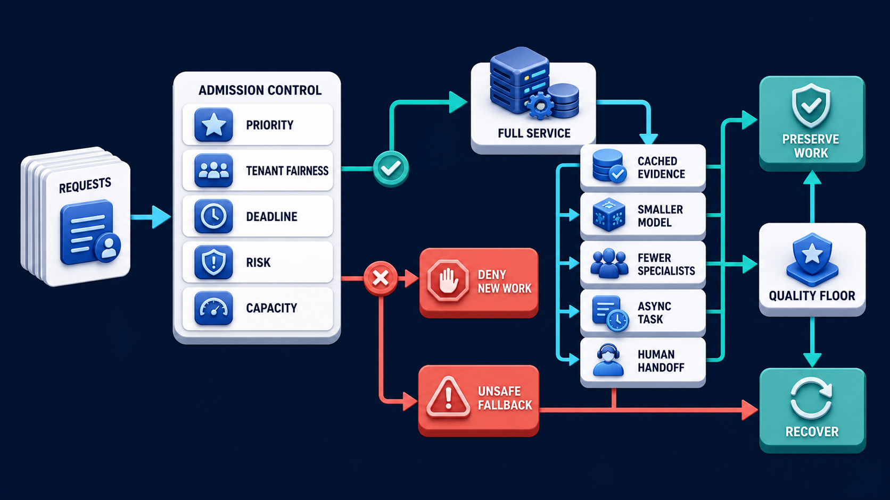

# Diagram 187 — Load, concurrency, queues, capacity, and saturation

**Module:** Performance, capacity, and economics
**Role in the course:** Treat latency, deadlines, scenario cost, load, queues, capacity, degradation, and admission as explicit design inputs.
**Layout:** The diagram shows ARRIVAL RATE entering CONCURRENCY GATE then QUEUE then WORKER POOL; it also gauges display ACTIVE, QUEUE DEPTH, WAIT TIME, SERVICE TIME, THROUGHPUT, ERRORS, SATURATION.

---

## At a glance

**Recognize when an agent system is out of capacity and prevent queues, fan-out, and retries from turning delay into an outage.**

- Describe realistic workload classes, route mix, request size, fan-out, think time, burst pattern, and background work.
- Measure arrival, concurrency, queue depth and age, service time, throughput, errors, and downstream quotas together.
- Raise load gradually and identify the first saturated stage and the user-visible symptom it causes.
- A QUEUE path shows the failure the design must catch before it reaches the user.

---

## What the diagram teaches

### 1. Recognize saturation and prevent load from becoming an outage

Load is incoming work over time. Concurrency is work active at once. A queue holds admitted work waiting for capacity. Capacity is the sustainable work a system can complete while meeting quality and latency objectives. Saturation appears when a constrained resource is nearly or fully occupied and queues, wait time, timeouts, or errors rise. Agent systems amplify load because one user request may generate several model calls, retrievals, tools, specialists, and retries. The diagram exists so the team can recognize when an agent system is out of capacity and prevent queues, fan-out, and retries from turning delay into an outage.

### 2. Describe realistic workload classes, route mix, request size, fan-out, think

Describe realistic workload classes, route mix, request size, fan-out, think time, burst pattern, and background work. Separate interactive work from long-running tasks and use workload-shaped tests rather than one unrealistic request loop. Measure arrival rate, active work, queue depth and age, service time, throughput, timeout and rejection rates, downstream quotas, worker utilization, and fan-out. In the diagram, this is represented by **WORKER POOL** and **WAIT TIME**, near **SERVICE TIME**. The case study where A marketing campaign sends many policy questions makes the risk concrete: increasing worker count blindly can overload model, database, retrieval, or tool dependencies and make the outage larger. When this step is done well, the service stays recoverable and protects existing work instead of collapsing under amplified load.

### 3. Measure arrival, concurrency, queue depth and age, service time, throughput,

In the diagram, this is represented by **QUEUE** and **QUEUE DEPTH**, near **SERVICE TIME**. Measure arrival, concurrency, queue depth and age, service time, throughput, errors, and downstream quotas together. Saturation appears when a constrained resource is nearly or fully occupied and queues, wait time, timeouts, or errors rise. Measure arrival rate, active work, queue depth and age, service time, throughput, timeout and rejection rates, downstream quotas, worker utilization, and fan-out. The case study where A marketing campaign sends many policy questions shows the value: the service stays recoverable and protects existing work instead of collapsing under amplified load. Skip it, and increasing worker count blindly can overload model, database, retrieval, or tool dependencies and make the outage larger. The takeaway is clear: measure the work chain, find the first saturation point, and apply backpressure before queues become failure storage.

### 4. Raise load gradually and identify the first saturated stage

Increase load gradually, hold it long enough to reach steady behavior, and test bursts, provider throttling, slow dependencies, retry storms, and recovery after load drops. This is why the step is non-negotiable: raise load gradually and identify the first saturated stage and the user-visible symptom it causes. Agent systems amplify load because one user request may generate several model calls, retrievals, tools, specialists, and retries. The case study where A marketing campaign sends many policy questions proves it: the service stays recoverable and protects existing work instead of collapsing under amplified load. If the team omits this, increasing worker count blindly can overload model, database, retrieval, or tool dependencies and make the outage larger.

### 5. Inject slow dependencies, throttling, retry storms, worker loss, and recovery

Inject slow dependencies, throttling, retry storms, worker loss, and recovery while checking backpressure. Use per-stage concurrency limits and backpressure so a slow dependency cannot consume every worker. Increase load gradually, hold it long enough to reach steady behavior, and test bursts, provider throttling, slow dependencies, retry storms, and recovery after load drops. In the diagram, this is represented by **RETRY STORM** and **BACKPRESSURE**. The case study where A marketing campaign sends many policy questions makes the risk concrete: increasing worker count blindly can overload model, database, retrieval, or tool dependencies and make the outage larger. When this step is done well, the service stays recoverable and protects existing work instead of collapsing under amplified load.

### 6. Record the sustainable operating region and admission rules by version

Diagram 188 — *Graceful degradation, fallback, and admission control* is the next lens on this idea. The same concepts reappear there with different emphasis, so the two diagrams should be read as a pair.

Record the sustainable operating region and admission rules by version instead of publishing one permanent capacity claim. Capacity is the sustainable work a system can complete while meeting quality and latency objectives. Capacity is not one number: it depends on route mix, context size, model, tool behavior, region, cache state, and release version. The case study where A marketing campaign sends many policy questions shows the value: the service stays recoverable and protects existing work instead of collapsing under amplified load. Skip it, and increasing worker count blindly can overload model, database, retrieval, or tool dependencies and make the outage larger. The takeaway is clear: measure the work chain, find the first saturation point, and apply backpressure before queues become failure storage.

### 7. Putting it together

Taken together, these steps turn the objective "recognize when an agent system is out of capacity and prevent queues, fan-out, and retries from turning delay into an outage" into an operating contract. Describe realistic workload classes, route mix, request size, fan-out, think time, burst pattern, and background work; Measure arrival, concurrency, queue depth and age, service time, throughput, errors, and downstream quotas together; Raise load gradually and identify the first saturated stage and the user-visible symptom it causes. The remaining steps extend this: Inject slow dependencies, throttling, retry storms, worker loss, and recovery while checking backpressure; Record the sustainable operating region and admission rules by version instead of publishing one permanent capacity claim. The case of A marketing campaign sends many policy questions shows how quickly increasing worker count blindly can overload model, database, retrieval, or tool dependencies and make the outage larger. The durable lesson is measure the work chain, find the first saturation point, and apply backpressure before queues become failure storage.

### Analogy

A supermarket can have many shoppers arriving, a limited number at checkout, and a growing line. Adding shoppers does not increase completed purchases once every register is saturated.

### The Next.js surface

In the Next.js surface, the same contract appears through framework-specific patterns. Protect server routes with per-user and global limits, short request work, explicit background-task handoff, and honest retry-after or queued status. Avoid holding many browser connections solely to represent durable work; reconnect the interface to authoritative task state and progress events. Tag load-test traffic and candidate versions safely, then compare user-facing latency and errors without mixing synthetic traffic into business analytics.

### The Python surface

In the Python surface, the same contract is enforced with typed models and tests. Set explicit worker, semaphore, connection-pool, queue, model, tool, and specialist concurrency limits instead of relying on unlimited task creation. Export queue depth and age, active work, service time, rejection, timeout, retry, and completion metrics with bounded workload labels. Build load fixtures that control arrival patterns and dependency delays, then verify cleanup and recovery after the test stops.

---

## Case study — The marketing campaign that caused a retry storm

A marketing campaign sends many policy questions. Each request fans out to three specialists, the finance provider slows, and retries double the queue every minute.

### The walkthrough

1. Metrics show arrival rate is stable while queue age and active finance calls rise toward their limit.
2. Trace samples reveal retry fan-out after caller deadlines have expired.
3. Per-specialist limits, deadline-aware cancellation, and queue admission stop the retry storm.
4. The interface preserves accepted work and tells later requests when capacity is unavailable.

### The result

The service stays recoverable and protects existing work instead of collapsing under amplified load.

### The danger

Increasing worker count blindly can overload model, database, retrieval, or tool dependencies and make the outage larger.

### The takeaway

Measure the work chain, find the first saturation point, and apply backpressure before queues become failure storage.

---

## Composition

ARRIVAL RATE enters from the left through a CONCURRENCY GATE and then into a QUEUE before reaching a WORKER POOL. Around the pool, gauges display ACTIVE, QUEUE DEPTH, WAIT TIME, SERVICE TIME, THROUGHPUT, ERRORS, and SATURATION. Fan-out arrows reach four downstream systems—MODEL, RETRIEVAL, TOOL, and A2A—each with its own LIMITS. A coral path on the bottom shows a RETRY STORM and QUEUE GROWTH, while a teal path below that shows BACKPRESSURE and STABLE FLOW. The layout is a load-and-flow diagram: traffic enters on the left, waits and workers are in the center, downstream limits fan out, and two colored paths show failure versus control.

## Element by element

- **ARRIVAL RATE** — The **ARRIVAL RATE** is a new work entering per unit time.
- **CONCURRENCY GATE** — The **CONCURRENCY GATE** is a QUEUE then WORKER POOL.
- **QUEUE** — The **QUEUE** is dEPTH,.
- **WORKER POOL** — The **WORKER POOL** is a POOL.
- **ACTIVE** — The **ACTIVE** is a cyan request or propagation path that gauges display ,.
- **QUEUE DEPTH** — The **QUEUE DEPTH** is a cyan request or propagation path.
- **WAIT TIME** — The **WAIT TIME** is a cyan request or propagation path.
- **SERVICE TIME** — The **SERVICE TIME** is a cyan request or propagation path.
- **THROUGHPUT** — The **THROUGHPUT** is a cyan request or propagation path.
- **ERRORS** — The **ERRORS** is a white record.
- **SATURATION** — The **SATURATION** is a constrained resource near full useful capacity.
- **MODEL** — The **MODEL** is the language model that generates candidate text, plans, and reasoning.
- **RETRIEVAL** — The **RETRIEVAL** is the stage where evidence is found, filtered, and ranked; it is where a STALE ANSWER is caught and blocked.
- **TOOL** — The **TOOL** is a cyan request or propagation path.
- **A2A** — The **A2A** is the agent-to-agent protocol used to delegate tasks, receive artifacts, and coordinate work.
- **LIMITS** — The **LIMITS** is a cyan request or propagation path that a2A with separate .
- **RETRY STORM** — The **RETRY STORM** is the coral pattern where retries multiply faster than work completes.
- **QUEUE GROWTH** — The **QUEUE GROWTH** is the coral rise in waiting work that signals saturation or backpressure failure.
- **BACKPRESSURE** — The **BACKPRESSURE** is the teal control that slows or rejects upstream work to protect downstream limits.
- **STABLE FLOW** — The **STABLE FLOW** is the teal state where admitted work proceeds within capacity.

---

## Colour and flow semantics

- **Cobalt platform** — a service, stage, dataset, quality gate, budget, release lane, or incident-control boundary. In this diagram it appears on **CONCURRENCY GATE**, **WORKER POOL**.
- **Cyan arrow** — a request, propagated context, telemetry signal, evaluation flow, or candidate release path. In this diagram it appears on **ACTIVE**, **QUEUE DEPTH**, **WAIT TIME**, **SERVICE TIME**, **THROUGHPUT**, **SATURATION**, **MODEL**, **RETRIEVAL** and others.
- **Teal arrow** — a healthy result, matched evidence, safe promotion, controlled degradation, recovery, or verified learning path. In this diagram it appears on **BACKPRESSURE**, **STABLE FLOW**.
- **Coral path** — a broken trace, failed assertion, regression, overload, unsafe outcome, rollback, alert, or incident path. In this diagram it appears on **QUEUE**, **RETRY STORM**, **QUEUE GROWTH**.
- **White card** — a span, event, metric, log, resource, case, score, budget, version, release, runbook, action, or regression record. In this diagram it appears on **ARRIVAL RATE**, **ERRORS**.

The overall flow moves from the inputs on the left through the performance, capacity, and economics stages and exits as either a teal healthy path or a coral failure path. White cards carry the records, cobalt platforms hold the boundaries, and the cyan arrows show propagation and requests.

---

## How to present it

- Start with the operational question the team actually needs to answer. Point at the central element and ask what a regulator, evaluator, or support operator would ask about this outcome, and which signal type would best answer it.
- Ask the room what the team would need to know before approving the next release. Point at **WORKER POOL** and **WAIT TIME** and ask what would change if this step were skipped? Use the case study to make the failure concrete.
- Have the group list the operational decisions this stage informs. Highlight **QUEUE** and **QUEUE DEPTH** and ask what real decision does this evidence support? Use the case study to make the failure concrete.
- Ask what evidence would change the route a support ticket takes. Trace with your finger the trace and ask what would a missing or corrupted value look like here? Use the case study to make the failure concrete.
- Get the room to name the owner who would need this evidence in an incident. Put a marker on **RETRY STORM** and **BACKPRESSURE** and ask who owns the evidence produced at this step? Use the case study to make the failure concrete.
- Ask what would need to be true for the team to skip this stage safely. Ask the room to locate the trace and ask which downstream stage would fail if this step were wrong? Use the case study to make the failure concrete.
- Use the analogy. A supermarket can have many shoppers arriving, a limited number at checkout, and a growing line. Ask the room where the equivalent tracking number, queue, or ledger is in their own system, and where it would first break.
- Tell the case study — The marketing campaign that caused a retry storm. Walk through the walkthrough and stop at the moment the failure first becomes visible. Ask what signal, gate, or version field would have caught it earlier.
- Run the lab. Design a synthetic three-workload load test with interactive, background, and high-risk tasks. Define arrival shapes, fan-out, downstream limits, queue policy, saturation indicators, recovery checks, and stop conditions. Keep all target values labeled proposed. Have each group label the fields that are captured, hashed, redacted, or omitted.
- Pose the checkpoint. If CPU is low, does that prove an agent service has spare capacity? Let the room answer before confirming with the answer. Then ask what the team would change in the next build based on the answer.
- Before moving on, ask the room to trace one healthy teal path and one coral path through the diagram, naming the evidence that flips the colour at each stage.
- Close on the contract. Measure the work chain, find the first saturation point, and apply backpressure before queues become failure storage. Make the group write one sentence that ties the lesson to their own system.

---

## Lab and checkpoint

**Lab:** Design a synthetic three-workload load test with interactive, background, and high-risk tasks. Define arrival shapes, fan-out, downstream limits, queue policy, saturation indicators, recovery checks, and stop conditions. Keep all target values labeled proposed.

**Checkpoint:** If CPU is low, does that prove an agent service has spare capacity?

**Answer:** No. It may be saturated on model quotas, connections, queues, external tools, database locks, memory, workers, or deadlines while CPU remains low.

---

## Glossary

- **Arrival rate** — new work entering per unit time
- **Saturation** — constrained resource near full useful capacity
- **Backpressure** — slowing or rejecting upstream work when downstream capacity is limited

---

## Sources

- [Google SRE monitoring distributed systems](https://sre.google/sre-book/monitoring-distributed-systems/)
- [OpenTelemetry metrics API](https://opentelemetry.io/docs/specs/otel/metrics/api/)
- [OpenTelemetry messaging semantic conventions](https://opentelemetry.io/docs/specs/semconv/messaging/)

---

## Related lessons

- Diagram 185 — Latency budgets, percentiles, deadlines, and the slow tail
- Diagram 188 — Graceful degradation, fallback, and admission control
- Diagram 193 — Alerts, ownership, triage, and runbooks

---
