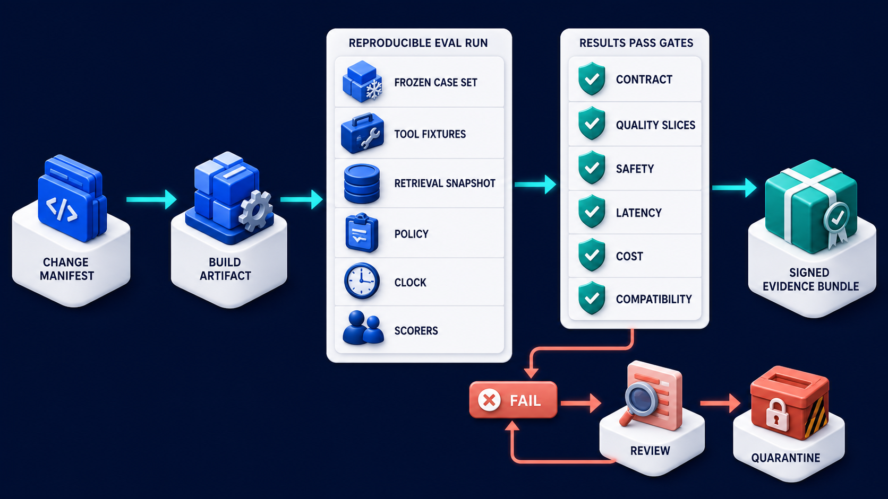
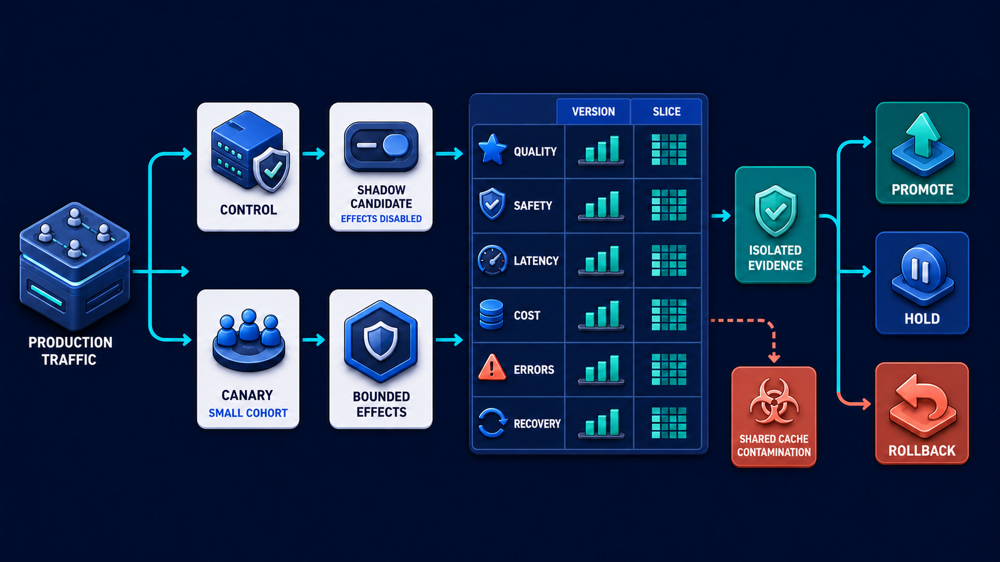

# Diagram 189 — Offline gates and reproducible evaluation runs

**Module:** Release engineering
**Role in the course:** Promote changes only when reproducible offline and production evidence says the candidate is safer or better.
**Layout:** The diagram shows CHANGE MANIFEST entering BUILD ARTIFACT then REPRODUCIBLE EVAL RUN with frozen CASE SET, TOOL FIXTURES, RETRIEVAL SNAPSHOT, POLICY, CLOCK, SCORERS; it also results pass gates CONTRACT, QUALITY SLICES, SAFETY, LATENCY, COST, COMPATIBILITY.

---

## At a glance

**Make candidate comparisons repeatable enough that a release decision can be explained and rerun.**

- Create a complete candidate manifest and verify every version and configuration input is resolvable.
- Select a versioned eligible case set and controlled fixtures for tools, retrieval, policy, identity, time, and failures.
- Run baseline and candidate with the same harness, record every attempt, and preserve missing or invalid evidence.
- A FAIL path shows the failure the design must catch before it reaches the user.

---

## What the diagram teaches

### 1. Make candidate comparisons repeatable before production

An offline gate is a release decision made from controlled evaluation evidence before production exposure. Reproducibility begins with a change manifest: code, model, prompt, policy, tool, schema, Agent Card, MCP capability snapshot, retrieval corpus, index, dataset, scorer, rubric, runtime, and configuration versions. Freeze or emulate time, external tools, authorization, and provider responses where the test requires deterministic comparison. Record seeds and decoding settings when supported, but do not pretend they eliminate every source of variation. Run the same eligible cases against baseline and candidate, preserve missing and failed runs, and compare deterministic contracts, quality slices, forbidden outcomes, latency distributions, scenario costs, and compatibility fixtures. The diagram exists so the team can make candidate comparisons repeatable enough that a release decision can be explained and rerun.

Diagram 190 — *Shadow traffic, canaries, and side-by-side comparison* is the next lens on this idea. The same concepts reappear there with different emphasis, so the two diagrams should be read as a pair.

### 2. Create a complete candidate manifest and verify every version

Create a complete candidate manifest and verify every version and configuration input is resolvable. An offline gate is a release decision made from controlled evaluation evidence before production exposure. Reproducibility begins with a change manifest: code, model, prompt, policy, tool, schema, Agent Card, MCP capability snapshot. In the diagram, this is represented by **CHANGE MANIFEST**. The case study where Acme proposes a new model and reranker to fix Maya's stale answer, but the prompt, policy, and evaluation dataset also changed during development makes the risk concrete: comparing two runs that use different datasets, scorers, corpora, tools, or policies can attribute a change to the model when the test itself changed. When this step is done well, the team can explain exactly what improved, what regressed, and which evidence must change before release.

### 3. Select a versioned eligible case set and controlled fixtures

In the diagram, this is represented by **CASE SET** and **POLICY**, near **FAIL**. Select a versioned eligible case set and controlled fixtures for tools, retrieval, policy, identity, time, and failures. Freeze or emulate time, external tools, authorization, and provider responses where the test requires deterministic comparison. Reproducibility begins with a change manifest: code, model, prompt, policy, tool, schema, Agent Card, MCP capability snapshot. The case study where Acme proposes a new model and reranker to fix Maya's stale answer, but the prompt, policy, and evaluation dataset also changed during development shows the value: the team can explain exactly what improved, what regressed, and which evidence must change before release. Skip it, and comparing two runs that use different datasets, scorers, corpora, tools, or policies can attribute a change to the model when the test itself changed. The takeaway is clear: pin the whole system, run the same evidence, and let offline success earn only the next controlled stage.

### 4. Run baseline and candidate with the same harness, record every

Run the same eligible cases against baseline and candidate, preserve missing and failed runs, and compare deterministic contracts. This is why the step is non-negotiable: run baseline and candidate with the same harness, record every attempt, and preserve missing or invalid evidence. Freeze or emulate time, external tools, authorization, and provider responses where the test requires deterministic comparison. In the diagram, this is represented by **SIGNED EVIDENCE BUNDLE**. The case study where Acme proposes a new model and reranker to fix Maya's stale answer, but the prompt, policy, and evaluation dataset also changed during development proves it: the team can explain exactly what improved, what regressed, and which evidence must change before release. If the team omits this, comparing two runs that use different datasets, scorers, corpora, tools, or policies can attribute a change to the model when the test itself changed.

### 5. Evaluate contracts, slices, safety, latency, scenario cost, and compatibility against

Evaluate contracts, slices, safety, latency, scenario cost, and compatibility against predefined gate rules. An offline gate is a release decision made from controlled evaluation evidence before production exposure. Run the same eligible cases against baseline and candidate, preserve missing and failed runs, and compare deterministic contracts. In the diagram, this is represented by **CONTRACT** and **SAFETY**, near **LATENCY**. The case study where Acme proposes a new model and reranker to fix Maya's stale answer, but the prompt, policy, and evaluation dataset also changed during development makes the risk concrete: comparing two runs that use different datasets, scorers, corpora, tools, or policies can attribute a change to the model when the test itself changed. When this step is done well, the team can explain exactly what improved, what regressed, and which evidence must change before release.

### 6. Publish an immutable evidence bundle with decision, owner, exceptions, hashes,

In the diagram, this is represented by **SIGNED EVIDENCE BUNDLE**. Publish an immutable evidence bundle with decision, owner, exceptions, hashes, and the next allowed release stage. Keep the raw evidence and normalized scorecard immutable enough for later audit. An offline gate is a release decision made from controlled evaluation evidence before production exposure. The case study where Acme proposes a new model and reranker to fix Maya's stale answer, but the prompt, policy, and evaluation dataset also changed during development shows the value: the team can explain exactly what improved, what regressed, and which evidence must change before release. Skip it, and comparing two runs that use different datasets, scorers, corpora, tools, or policies can attribute a change to the model when the test itself changed. The takeaway is clear: pin the whole system, run the same evidence, and let offline success earn only the next controlled stage.

### 7. Putting it together

Taken together, these steps turn the objective "make candidate comparisons repeatable enough that a release decision can be explained and rerun" into an operating contract. Create a complete candidate manifest and verify every version and configuration input is resolvable; Select a versioned eligible case set and controlled fixtures for tools, retrieval, policy, identity, time, and failures; Run baseline and candidate with the same harness, record every attempt, and preserve missing or invalid evidence. The remaining steps extend this: Evaluate contracts, slices, safety, latency, scenario cost, and compatibility against predefined gate rules; Publish an immutable evidence bundle with decision, owner, exceptions, hashes, and the next allowed release stage. The case of Acme proposes a new model and reranker to fix Maya's stale answer, but the prompt, policy, and evaluation dataset also changed during development shows how quickly comparing two runs that use different datasets, scorers, corpora, tools, or policies can attribute a change to the model when the test itself changed. The durable lesson is pin the whole system, run the same evidence, and let offline success earn only the next controlled stage.

### Analogy

A food batch is tested against the same recipe, ingredients, equipment settings, hygiene rules, and lab checks. Passing the factory tests permits a controlled shipment, not an instant worldwide release.

### The Next.js surface

In the Next.js surface, the same contract appears through framework-specific patterns. Trigger eval jobs from trusted server-side release workflows and display immutable run manifests, progress, evidence completeness, and gate decisions in React. Prevent the browser from editing finished results; corrections create new case, scorer, or decision versions with visible lineage. Require candidate artifact digest and evaluation bundle reference before a deployment action becomes available.

### The Python surface

In the Python surface, the same contract is enforced with typed models and tests. Build a runner that resolves a manifest, creates isolated fixtures, executes cases, records structured evidence, and closes every result even after errors. Use content hashes for datasets and artifacts, explicit environment metadata, and deterministic fake adapters where appropriate. Implement gate policies as versioned pure functions over normalized results, with separate human exception records and expiry.

---

## Case study — The model, prompt, and dataset all change at once

Acme proposes a new model and reranker to fix Maya's stale answer, but the prompt, policy, and evaluation dataset also changed during development.

### The walkthrough

1. The manifest separates each changed component and pins the candidate combination.
2. Baseline and candidate run the same reviewed dataset and retrieval snapshot under the same tool and time fixtures.
3. The candidate improves freshness but fails a Spanish clarification slice and exceeds the proposed p95 scenario budget.
4. The gate returns review rather than allowing the overall score to hide those changes.

### The result

The team can explain exactly what improved, what regressed, and which evidence must change before release.

### The danger

Comparing two runs that use different datasets, scorers, corpora, tools, or policies can attribute a change to the model when the test itself changed.

### The takeaway

Pin the whole system, run the same evidence, and let offline success earn only the next controlled stage.

---

## Composition

A CHANGE MANIFEST enters from the left into a BUILD ARTIFACT, then into a REPRODUCIBLE EVAL RUN. Inside the run, frozen inputs are shown: CASE SET, TOOL FIXTURES, RETRIEVAL SNAPSHOT, POLICY, CLOCK, and SCORERS. Results pass through six gates—CONTRACT, QUALITY SLICES, SAFETY, LATENCY, COST, and COMPATIBILITY—arranged across the right. A teal path exits downward as a SIGNED EVIDENCE BUNDLE. Three coral paths—FAIL, REVIEW, and QUARANTINE—branch down from the gates. The layout is a release laboratory: one manifest enters, controlled evidence runs through it, and gates either sign the bundle or reject it.

## Element by element

- **CHANGE MANIFEST** — The **CHANGE MANIFEST** is the versioned list of what changed in a candidate build.
- **BUILD ARTIFACT** — The **BUILD ARTIFACT** is the compiled or packaged output of the candidate build.
- **REPRODUCIBLE EVAL RUN** — The **REPRODUCIBLE EVAL RUN** is the controlled run of cases with frozen inputs so the result can be repeated.
- **CASE SET** — The **CASE SET** is the versioned collection of cases used for the offline evaluation.
- **TOOL FIXTURES** — The **TOOL FIXTURES** are the frozen tool and environment settings that make the eval repeatable.
- **RETRIEVAL SNAPSHOT** — The **RETRIEVAL SNAPSHOT** is the frozen view of the retrieval index and corpus used during the eval.
- **POLICY** — The **POLICY** is the rules that decide whether an action, retrieval, or disclosure is allowed.
- **CLOCK** — The **CLOCK** is the frozen time boundary that prevents the eval from depending on wall-clock time.
- **SCORERS** — The **SCORERS** are the instruments that evaluate case evidence against a rubric or assertions.
- **CONTRACT** — The **CONTRACT** is the offline gate that checks exact assertions and schema against the evidence.
- **QUALITY SLICES** — The **QUALITY SLICES** are the offline gate that checks behavior across meaningful subgroups.
- **SAFETY** — The **SAFETY** is the offline gate that checks dangerous or unacceptable outcomes.
- **LATENCY** — The **LATENCY** is a cyan request or propagation path.
- **COST** — The **COST** is a cyan request or propagation path.
- **COMPATIBILITY** — The **COMPATIBILITY** is the offline gate that checks protocol and schema compatibility before release.
- **SIGNED EVIDENCE BUNDLE** — The **SIGNED EVIDENCE BUNDLE** is the teal immutable output of an offline gate run.
- **FAIL** — The **FAIL** is the coral gate outcome where the candidate fails an offline contract check.
- **REVIEW** — The **REVIEW** is the coral gate outcome where a candidate needs more evidence before release.
- **QUARANTINE** — The **QUARANTINE** is the coral gate outcome where a candidate is held for investigation.

---

## Colour and flow semantics

- **Cobalt platform** — a service, stage, dataset, quality gate, budget, release lane, or incident-control boundary. In this diagram it appears on **CONTRACT**, **QUALITY SLICES**, **COMPATIBILITY**.
- **Cyan arrow** — a request, propagated context, telemetry signal, evaluation flow, or candidate release path. In this diagram it appears on **CHANGE MANIFEST**, **REPRODUCIBLE EVAL RUN**, **TOOL FIXTURES**, **RETRIEVAL SNAPSHOT**, **POLICY**, **CLOCK**, **LATENCY**, **COST**.
- **Teal arrow** — a healthy result, matched evidence, safe promotion, controlled degradation, recovery, or verified learning path. In this diagram it appears on **SAFETY**, **SIGNED EVIDENCE BUNDLE**.
- **Coral path** — a broken trace, failed assertion, regression, overload, unsafe outcome, rollback, alert, or incident path. In this diagram it appears on **FAIL**, **REVIEW**, **QUARANTINE**.
- **White card** — a span, event, metric, log, resource, case, score, budget, version, release, runbook, action, or regression record. In this diagram it appears on **BUILD ARTIFACT**, **CASE SET**, **SCORERS**.

The overall flow moves from the inputs on the left through the release engineering stages and exits as either a teal healthy path or a coral failure path. White cards carry the records, cobalt platforms hold the boundaries, and the cyan arrows show propagation and requests.

---

## How to present it

- Start with the operational question the team actually needs to answer. Point at the central element and ask what a regulator, evaluator, or support operator would ask about this outcome, and which signal type would best answer it.
- Ask the room what the team would need to know before approving the next release. Point at **CHANGE MANIFEST** and ask what would change if this step were skipped? Use the case study to make the failure concrete.
- Have the group list the operational decisions this stage informs. Highlight **CASE SET** and **POLICY** and ask what real decision does this evidence support? Use the case study to make the failure concrete.
- Ask what evidence would change the route a support ticket takes. Trace with your finger **SIGNED EVIDENCE BUNDLE** and ask what would a missing or corrupted value look like here? Use the case study to make the failure concrete.
- Get the room to name the owner who would need this evidence in an incident. Put a marker on **CONTRACT** and **SAFETY** and ask who owns the evidence produced at this step? Use the case study to make the failure concrete.
- Ask what would need to be true for the team to skip this stage safely. Ask the room to locate **SIGNED EVIDENCE BUNDLE** and ask which downstream stage would fail if this step were wrong? Use the case study to make the failure concrete.
- Use the analogy. A food batch is tested against the same recipe, ingredients, equipment settings, hygiene rules, and lab checks. Ask the room where the equivalent tracking number, queue, or ledger is in their own system, and where it would first break.
- Tell the case study — The model, prompt, and dataset all change at once. Walk through the walkthrough and stop at the moment the failure first becomes visible. Ask what signal, gate, or version field would have caught it earlier.
- Run the lab. Write a 15-field release manifest and six gate rules for an Acme candidate. Include evidence completeness, exact contracts, two critical slices, one forbidden outcome, latency and scenario-cost budgets, and a compatibility fixture. Define pass, fail, review, and quarantine. Have each group label the fields that are captured, hashed, redacted, or omitted.
- Pose the checkpoint. Does a fixed random seed make an agent evaluation fully reproducible? Let the room answer before confirming with the answer. Then ask what the team would change in the next build based on the answer.
- Before moving on, ask the room to trace one healthy teal path and one coral path through the diagram, naming the evidence that flips the colour at each stage.
- Close on the contract. Pin the whole system, run the same evidence, and let offline success earn only the next controlled stage. Make the group write one sentence that ties the lesson to their own system.

---

## Lab and checkpoint

**Lab:** Write a 15-field release manifest and six gate rules for an Acme candidate. Include evidence completeness, exact contracts, two critical slices, one forbidden outcome, latency and scenario-cost budgets, and a compatibility fixture. Define pass, fail, review, and quarantine.

**Checkpoint:** Does a fixed random seed make an agent evaluation fully reproducible?

**Answer:** No. It can reduce one source of variation, but providers, models, tools, concurrency, retrieval, runtime, and external systems may still vary. Pin and record the whole environment and report uncertainty.

---

## Glossary

- **Manifest** — complete version list for one candidate or run
- **Offline gate** — pre-production decision from controlled evidence
- **Evidence bundle** — preserved inputs, results, versions, and decision

---

## Sources

- [NIST Generative AI Profile](https://www.nist.gov/publications/artificial-intelligence-risk-management-framework-generative-artificial-intelligence)
- [Google SRE canarying releases](https://sre.google/workbook/canarying-releases/)
- [OpenTelemetry GenAI semantic conventions](https://github.com/open-telemetry/semantic-conventions-genai)

---

## Related lessons

- Diagram 177 — The anatomy of a useful evaluation case
- Diagram 180 — Slices, denominators, confidence, variance, and significance
- Diagram 190 — Shadow traffic, canaries, and side-by-side comparison

---
