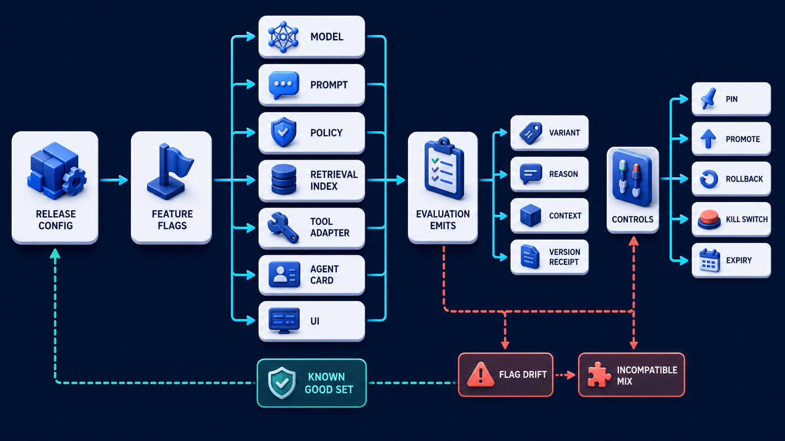

# Diagram 191 — Feature flags, version pinning, rollback, and kill switches

**Module:** Release engineering
**Role in the course:** Promote changes only when reproducible offline and production evidence says the candidate is safer or better.
**Layout:** The diagram shows RELEASE CONFIG selecting MODEL, PROMPT, POLICY, RETRIEVAL INDEX, TOOL ADAPTER, AGENT CARD, UI through FEATURE FLAGS; it also each evaluation emits VARIANT, REASON, CONTEXT, VERSION RECEIPT.

---

## At a glance

**Control independent agent-system changes without creating an untraceable mixture of versions or an untested emergency switch.**

- Resolve every behavior-changing component into one recorded version manifest for the request or task.
- Evaluate flags from governed non-sensitive context and record variant, reason, provider, configuration version, and trace reference.
- Define compatible version sets, dependency rules, safe defaults, owner, expiry, and removal plan.
- A FLAG DRIFT path shows the failure the design must catch before it reaches the user.

---

## What the diagram teaches

### 1. Control version bundles without creating untraceable mixtures

Agent behavior can change when code, model alias, prompt, policy, retrieval index, embedding, reranker, tool adapter, Agent Card, schema, or interface changes. A release should resolve these into an explicit version set and record it on evaluation and production evidence. Feature flags can separate deployment from exposure and target a candidate by environment, cohort, workload, or risk. OpenFeature provides a vendor-neutral API concept with evaluation context, providers, hooks, reasons, variants, events, and observability mappings. Treat flag evaluation as a decision: record flag key, variant, reason, provider, context categories, and configuration version without logging sensitive targeting data. Flags need owners, defaults, expiry, dependency rules, and cleanup. The diagram exists so the team can control independent agent-system changes without creating an untraceable mixture of versions or an untested emergency switch.

### 2. Resolve every behavior-changing component into one recorded version manifest

Resolve every behavior-changing component into one recorded version manifest for the request or task. A rollback returns to a known-good compatible version set; it is not simply 'model previous' if the index or schema already changed. A release should resolve these into an explicit version set and record it on evaluation and production evidence. In the diagram, this is represented by **VERSION RECEIPT**. The case study where Acme rolls back the model after a stale-answer incident but leaves the candidate retrieval index and prompt active, producing a combination never evaluated offline makes the risk concrete: an undocumented flag with no owner or expiry can remain active for years, create hidden behavior, and make incidents impossible to reproduce. When this step is done well, recovery returns the whole system to a tested state and retains useful low-risk capability.

### 3. Evaluate flags from governed non-sensitive context and record variant, reason,

In the diagram, this is represented by **VARIANT** and **REASON**, near **CONTEXT**. Evaluate flags from governed non-sensitive context and record variant, reason, provider, configuration version, and trace reference. A release should resolve these into an explicit version set and record it on evaluation and production evidence. Treat flag evaluation as a decision: record flag key, variant, reason, provider, context categories, and configuration version without logging sensitive targeting data. The case study where Acme rolls back the model after a stale-answer incident but leaves the candidate retrieval index and prompt active, producing a combination never evaluated offline shows the value: recovery returns the whole system to a tested state and retains useful low-risk capability. Skip it, and an undocumented flag with no owner or expiry can remain active for years, create hidden behavior, and make incidents impossible to reproduce. The takeaway is clear: pin the whole behavior set; make flags observable; rehearse rollback and kill switches as real controls.

### 4. Define compatible version sets, dependency rules, safe defaults, owner, expiry,

Flags need owners, defaults, expiry, dependency rules, and cleanup. This is why the step is non-negotiable: define compatible version sets, dependency rules, safe defaults, owner, expiry, and removal plan. A release should resolve these into an explicit version set and record it on evaluation and production evidence. In the diagram, this is represented by **EXPIRY**. The case study where Acme rolls back the model after a stale-answer incident but leaves the candidate retrieval index and prompt active, producing a combination never evaluated offline proves it: recovery returns the whole system to a tested state and retains useful low-risk capability. If the team omits this, an undocumented flag with no owner or expiry can remain active for years, create hidden behavior, and make incidents impossible to reproduce.

### 5. Test rollback against current data and schemas and rehearse kill-switch

Test rollback against current data and schemas and rehearse kill-switch activation, authorization, and recovery. A kill switch stops or narrows hazardous capability quickly and should fail safe, be authorized, auditable, rehearsed, and independent enough to work during an incident. Test activation and recovery regularly. In the diagram, this is represented by **ROLLBACK**. The case study where Acme rolls back the model after a stale-answer incident but leaves the candidate retrieval index and prompt active, producing a combination never evaluated offline makes the risk concrete: an undocumented flag with no owner or expiry can remain active for years, create hidden behavior, and make incidents impossible to reproduce. When this step is done well, recovery returns the whole system to a tested state and retains useful low-risk capability.

### 6. Limit combinations, detect drift between services, and remove stale flags

In the diagram, this is represented by **FEATURE FLAGS** and **FLAG DRIFT**. Limit combinations, detect drift between services, and remove stale flags after the rollout decision is complete. Feature flags can separate deployment from exposure and target a candidate by environment, cohort, workload, or risk. Too many interacting flags create combinations that were never evaluated, so constrain allowed matrices and promote bundles when components must move together. The case study where Acme rolls back the model after a stale-answer incident but leaves the candidate retrieval index and prompt active, producing a combination never evaluated offline shows the value: recovery returns the whole system to a tested state and retains useful low-risk capability. Skip it, and an undocumented flag with no owner or expiry can remain active for years, create hidden behavior, and make incidents impossible to reproduce. The takeaway is clear: pin the whole behavior set; make flags observable; rehearse rollback and kill switches as real controls.

### 7. Putting it together

Taken together, these steps turn the objective "control independent agent-system changes without creating an untraceable mixture of versions or an untested emergency switch" into an operating contract. Resolve every behavior-changing component into one recorded version manifest for the request or task; Evaluate flags from governed non-sensitive context and record variant, reason, provider, configuration version, and trace reference; Define compatible version sets, dependency rules, safe defaults, owner, expiry, and removal plan. The remaining steps extend this: Test rollback against current data and schemas and rehearse kill-switch activation, authorization, and recovery; Limit combinations, detect drift between services, and remove stale flags after the rollout decision is complete. The case of Acme rolls back the model after a stale-answer incident but leaves the candidate retrieval index and prompt active, producing a combination never evaluated offline shows how quickly an undocumented flag with no owner or expiry can remain active for years, create hidden behavior, and make incidents impossible to reproduce. The durable lesson is pin the whole behavior set; make flags observable; rehearse rollback and kill switches as real controls.

### Analogy

An aircraft cockpit has labeled controls, guarded emergency switches, checklists, and known configurations. Random switches scattered across the cabin would not make the aircraft safer or easier to reverse.

### The Next.js surface

In the Next.js surface, the same contract appears through framework-specific patterns. Evaluate server-side flags with OpenFeature-style clients and stable context; send React the resolved UI state and safe reason category, not provider credentials or full targeting rules. Attach model, prompt, policy, index, tool, schema, release, and flag variants to server traces and durable receipts. Build an operator control that requires authorization, confirmation, scope, reason, expiry, and audit evidence for rollback or kill-switch changes.

### The Python surface

In the Python surface, the same contract is enforced with typed models and tests. Wrap feature evaluation behind an application interface so providers can change while typed variants and defaults remain stable. Validate the resolved version manifest before work begins and reject incompatible model, index, tool, policy, or schema combinations. Implement rollback and kill-switch runbooks as tested commands that emit decisions, update control state safely, and verify observed traffic moved.

Diagram 190 — *Shadow traffic, canaries, and side-by-side comparison* is the next lens on this idea. The same concepts reappear there with different emphasis, so the two diagrams should be read as a pair.

---

## Case study — The rollback that left the candidate index active

Acme rolls back the model after a stale-answer incident but leaves the candidate retrieval index and prompt active, producing a combination never evaluated offline.

### The walkthrough

1. The version manifest detector marks the mixed combination incompatible.
2. Rollback selects a known-good bundle rather than one component alias.
3. A kill switch temporarily disables autonomous policy recommendations while preserving evidence lookup.
4. The operator verifies the resolved variants on live traces and sets the temporary switch to expire after review.

### The result

Recovery returns the whole system to a tested state and retains useful low-risk capability.

### The danger

An undocumented flag with no owner or expiry can remain active for years, create hidden behavior, and make incidents impossible to reproduce.

### The takeaway

Pin the whole behavior set; make flags observable; rehearse rollback and kill switches as real controls.

---

## Composition

A RELEASE CONFIG sits at the top and selects seven components through FEATURE FLAGS: MODEL, PROMPT, POLICY, RETRIEVAL INDEX, TOOL ADAPTER, AGENT CARD, and UI. Each flag evaluation emits a VARIANT, a REASON, a CONTEXT, and a VERSION RECEIPT. On the right, controls include PIN, PROMOTE, ROLLBACK, KILL SWITCH, and EXPIRY. A coral path in the lower left shows FLAG DRIFT and INCOMPATIBLE MIX, while a teal path in the lower right returns a KNOWN GOOD SET. The layout is a version-control panel: one release configuration at the top selects a bundle of components, records why each was chosen, and supports promotion, rollback, or emergency shutdown.

## Element by element

- **RELEASE CONFIG** — The **RELEASE CONFIG** is selecting MODEL,.
- **MODEL** — The **MODEL** is the language model that generates candidate text, plans, and reasoning.
- **PROMPT** — The **PROMPT** is the instruction and context sent to the model for a given request.
- **POLICY** — The **POLICY** is the rules that decide whether an action, retrieval, or disclosure is allowed.
- **RETRIEVAL INDEX** — The **RETRIEVAL INDEX** is the indexed corpus and version used to find current evidence.
- **TOOL ADAPTER** — The **TOOL ADAPTER** is the code that translates a typed agent proposal into a real tool call and back.
- **AGENT CARD** — The **AGENT CARD** is the advertised capabilities, metadata, and version of an A2A agent.
- **UI** — The **UI** is the user interface where progress, evidence, controls, and receipts are shown.
- **FEATURE FLAGS** — The **FEATURE FLAGS** are a runtime decision controlling behavior exposure.
- **VARIANT** — The **VARIANT** is a resolved flag value or named treatment.
- **REASON** — The **REASON** is a cyan request or propagation path.
- **CONTEXT** — The **CONTEXT** is a cyan request or propagation path.
- **VERSION RECEIPT** — The **VERSION RECEIPT** is the durable record of why a specific component version was selected.
- **PIN** — The **PIN** is a cyan request or propagation path that controls include ,.
- **PROMOTE** — The **PROMOTE** is a cyan request or propagation path.
- **ROLLBACK** — The **ROLLBACK** returns to a known-good compatible version set; it is not simply 'model previous' if the index or schema already changed.
- **KILL SWITCH** — The **KILL SWITCH** is the emergency control that stops exposure to a bad version immediately.
- **EXPIRY** — The **EXPIRY** is a cyan request or propagation path.
- **FLAG DRIFT** — The **FLAG DRIFT** is a coral failure, risk, or incident path that coral path shows and INCOMPATIBLE MIX;.
- **INCOMPATIBLE MIX** — The **INCOMPATIBLE MIX** is a coral failure, risk, or incident path that coral path shows FLAG DRIFT and ;.
- **KNOWN GOOD SET** — The **KNOWN GOOD SET** is the teal bundle of tested, compatible versions to which rollback can return.

---

## Colour and flow semantics

- **Cobalt platform** — a service, stage, dataset, quality gate, budget, release lane, or incident-control boundary. In this diagram it appears on **RELEASE CONFIG**, **RETRIEVAL INDEX**.
- **Cyan arrow** — a request, propagated context, telemetry signal, evaluation flow, or candidate release path. In this diagram it appears on **MODEL**, **PROMPT**, **POLICY**, **UI**, **FEATURE FLAGS**, **VARIANT**, **REASON**, **CONTEXT** and others.
- **Teal arrow** — a healthy result, matched evidence, safe promotion, controlled degradation, recovery, or verified learning path. In this diagram it appears on **TOOL ADAPTER**, **KNOWN GOOD SET**.
- **Coral path** — a broken trace, failed assertion, regression, overload, unsafe outcome, rollback, alert, or incident path. In this diagram it appears on **FLAG DRIFT**, **INCOMPATIBLE MIX**.
- **White card** — a span, event, metric, log, resource, case, score, budget, version, release, runbook, action, or regression record. In this diagram it appears on **AGENT CARD**, **VERSION RECEIPT**.

The overall flow moves from the inputs on the left through the release engineering stages and exits as either a teal healthy path or a coral failure path. White cards carry the records, cobalt platforms hold the boundaries, and the cyan arrows show propagation and requests.

---

## How to present it

- Start with the operational question the team actually needs to answer. Point at the central element and ask what a regulator, evaluator, or support operator would ask about this outcome, and which signal type would best answer it.
- Ask the room what the team would need to know before approving the next release. Point at **VERSION RECEIPT** and ask what would change if this step were skipped? Use the case study to make the failure concrete.
- Have the group list the operational decisions this stage informs. Highlight **VARIANT** and **REASON** and ask what real decision does this evidence support? Use the case study to make the failure concrete.
- Ask what evidence would change the route a support ticket takes. Trace with your finger **EXPIRY** and ask what would a missing or corrupted value look like here? Use the case study to make the failure concrete.
- Get the room to name the owner who would need this evidence in an incident. Put a marker on **ROLLBACK** and ask who owns the evidence produced at this step? Use the case study to make the failure concrete.
- Ask what would need to be true for the team to skip this stage safely. Ask the room to locate **FEATURE FLAGS** and **FLAG DRIFT** and ask which downstream stage would fail if this step were wrong? Use the case study to make the failure concrete.
- Use the analogy. An aircraft cockpit has labeled controls, guarded emergency switches, checklists, and known configurations. Ask the room where the equivalent tracking number, queue, or ledger is in their own system, and where it would first break.
- Tell the case study — The rollback that left the candidate index active. Walk through the walkthrough and stop at the moment the failure first becomes visible. Ask what signal, gate, or version field would have caught it earlier.
- Run the lab. Create a compatibility table for two models, two prompts, two indexes, and two tool schemas. Allow only evaluated combinations. Define one rollout flag, one emergency kill switch, safe defaults, owner, expiry, audit fields, and a verification query proving rollback took effect. Have each group label the fields that are captured, hashed, redacted, or omitted.
- Pose the checkpoint. Is changing a model alias back to its previous value always a complete rollback? Let the room answer before confirming with the answer. Then ask what the team would change in the next build based on the answer.
- Before moving on, ask the room to trace one healthy teal path and one coral path through the diagram, naming the evidence that flips the colour at each stage.
- Close on the contract. Pin the whole behavior set; make flags observable; rehearse rollback and kill switches as real controls. Make the group write one sentence that ties the lesson to their own system.

---

## Lab and checkpoint

**Lab:** Create a compatibility table for two models, two prompts, two indexes, and two tool schemas. Allow only evaluated combinations. Define one rollout flag, one emergency kill switch, safe defaults, owner, expiry, audit fields, and a verification query proving rollback took effect.

**Checkpoint:** Is changing a model alias back to its previous value always a complete rollback?

**Answer:** No. Prompts, policies, indexes, schemas, tools, caches, and data migrations may also have changed. Roll back to a tested compatible version set.

---

## Glossary

- **Feature flag** — runtime decision controlling behavior exposure
- **Variant** — resolved flag value or named treatment
- **Kill switch** — emergency control that quickly disables or narrows capability

---

## Sources

- [OpenFeature specification](https://openfeature.dev/specification/)
- [OpenFeature observability appendix](https://openfeature.dev/specification/appendix-d/)
- [OpenTelemetry feature-flag semantic conventions](https://opentelemetry.io/docs/specs/semconv/feature-flags/)

---

## Related lessons

- Diagram 189 — Offline gates and reproducible evaluation runs
- Diagram 190 — Shadow traffic, canaries, and side-by-side comparison
- Diagram 192 — Protocol conformance, compatibility, and migration gates

---
