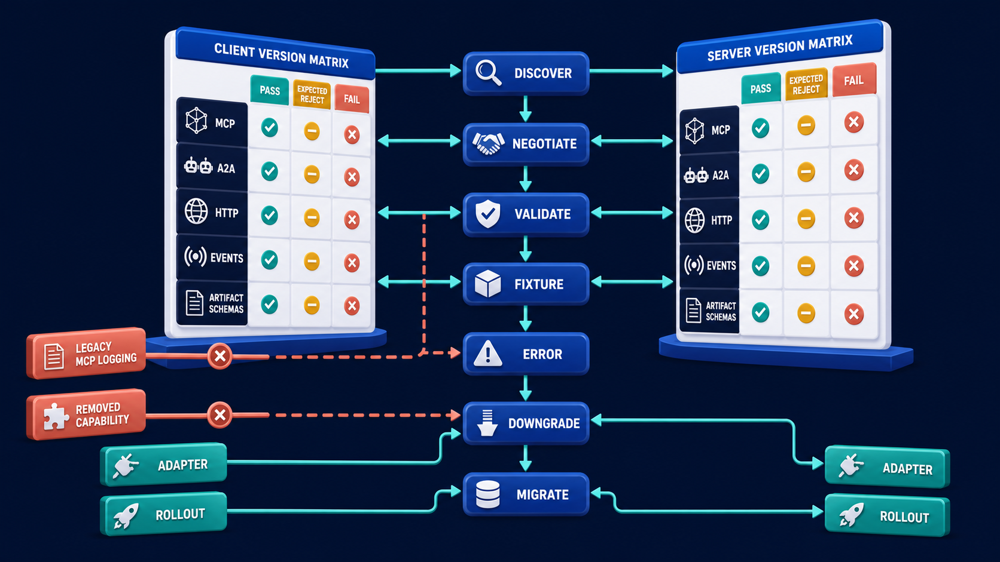

# Diagram 192 — Protocol conformance, compatibility, and migration gates

**Module:** Release engineering
**Role in the course:** Promote changes only when reproducible offline and production evidence says the candidate is safer or better.
**Layout:** The diagram shows CLIENT VERSION MATRIX facing SERVER VERSION MATRIX for MCP, A2A, HTTP, EVENTS, ARTIFACT SCHEMAS; it also gates DISCOVER, NEGOTIATE, VALIDATE, FIXTURE, ERROR, DOWNGRADE, MIGRATE.

---

## At a glance

**Release protocol and schema changes only when supported combinations, expected rejection, and migration behavior are proved.**

- Inventory supported client, server, protocol, binding, schema, card, extension, and capability versions.
- Create positive, negative, unknown-field, unsupported-capability, malformed, authorization, cancellation, and error fixtures.
- Run the full supported compatibility matrix and distinguish pass, expected reject, and unexpected failure.
- A MCP path shows the failure the design must catch before it reaches the user.

---

## What the diagram teaches

### 1. Release protocol and schema changes with proven compatibility

Conformance asks whether an implementation follows a specification. Compatibility asks whether two specific versions and capability sets work together safely. Migration asks how a fleet moves between them without confusing partial rollout. Test discovery, version negotiation, capability advertisement, request and response schemas, errors, cancellation, tasks, artifacts, streaming or subscription behavior, authorization boundaries, and unknown fields using official specifications and your own versioned fixtures. Expected rejection is a valid result when a client requests an unsupported or unsafe combination. MCP 2026-07-28 is stateless and deprecated legacy roots, sampling, logging, and HTTP+SSE behavior should not be introduced into new designs merely because an old client still knows them. The diagram exists so the team can release protocol and schema changes only when supported combinations, expected rejection, and migration behavior are proved.

### 2. Inventory supported client, server, protocol, binding, schema, card, extension,

Inventory supported client, server, protocol, binding, schema, card, extension, and capability versions. A2A 1.0 has its own task, context, binding, card, and error contracts. Compatibility asks whether two specific versions and capability sets work together safely. In the diagram, this is represented by **CLIENT VERSION MATRIX** and **SERVER VERSION MATRIX**, near **ARTIFACT SCHEMAS**. The case study where One Acme service adopts MCP 2026-07-28 while an older client expects session behavior and protocol logging; an A2A specialist changes its artifact schema during the same rollout makes the risk concrete: testing only the newest client against the newest server misses mixed fleets, capability gaps, malformed input, and rollback compatibility. When this step is done well, the fleet changes deliberately, with expected rejection and adapter behavior visible instead of silent partial breakage.

Diagram 191 — *Feature flags, version pinning, rollback, and kill switches* is the next lens on this idea. The same concepts reappear there with different emphasis, so the two diagrams should be read as a pair.

### 3. Create positive, negative, unknown-field, unsupported-capability, malformed, authorization, cancellation, and error

In the diagram, this is represented by **FIXTURE** and **ERROR**. Create positive, negative, unknown-field, unsupported-capability, malformed, authorization, cancellation, and error fixtures. Compatibility asks whether two specific versions and capability sets work together safely. Test discovery, version negotiation, capability advertisement, request and response schemas, errors, cancellation, tasks. The case study where One Acme service adopts MCP 2026-07-28 while an older client expects session behavior and protocol logging; an A2A specialist changes its artifact schema during the same rollout shows the value: the fleet changes deliberately, with expected rejection and adapter behavior visible instead of silent partial breakage. Skip it, and testing only the newest client against the newest server misses mixed fleets, capability gaps, malformed input, and rollback compatibility. The takeaway is clear: conformance proves the contract; a version matrix proves combinations; migration evidence proves the fleet can move.

### 4. Run the full supported compatibility matrix and distinguish pass, expected

Compatibility asks whether two specific versions and capability sets work together safely. This is why the step is non-negotiable: run the full supported compatibility matrix and distinguish pass, expected reject, and unexpected failure. During migration, measure clients and servers by negotiated version and capability, run dual-read or adapter behavior only where defined, and set removal criteria for legacy paths. In the diagram, this is represented by **PASS** and **EXPECTED REJECT**, near **FAIL**. The case study where One Acme service adopts MCP 2026-07-28 while an older client expects session behavior and protocol logging; an A2A specialist changes its artifact schema during the same rollout proves it: the fleet changes deliberately, with expected rejection and adapter behavior visible instead of silent partial breakage. If the team omits this, testing only the newest client against the newest server misses mixed fleets, capability gaps, malformed input, and rollback compatibility.

### 5. Plan staged migration, adapters, telemetry, rollback, legacy removal criteria,

Plan staged migration, adapters, telemetry, rollback, legacy removal criteria, and data or artifact compatibility. Compatibility asks whether two specific versions and capability sets work together safely. During migration, measure clients and servers by negotiated version and capability, run dual-read or adapter behavior only where defined, and set removal criteria for legacy paths. In the diagram, this is represented by **ADAPTER**. The case study where One Acme service adopts MCP 2026-07-28 while an older client expects session behavior and protocol logging; an A2A specialist changes its artifact schema during the same rollout makes the risk concrete: testing only the newest client against the newest server misses mixed fleets, capability gaps, malformed input, and rollback compatibility. When this step is done well, the fleet changes deliberately, with expected rejection and adapter behavior visible instead of silent partial breakage.

### 6. Gate release on current specification evidence and convert every production

In the diagram, this is represented by **FIXTURE**. Gate release on current specification evidence and convert every production incompatibility into a permanent fixture. MCP 2026-07-28 is stateless and deprecated legacy roots, sampling, logging, and HTTP+SSE behavior should not be introduced into new designs merely because an ol. Conformance asks whether an implementation follows a specification. The case study where One Acme service adopts MCP 2026-07-28 while an older client expects session behavior and protocol logging; an A2A specialist changes its artifact schema during the same rollout shows the value: the fleet changes deliberately, with expected rejection and adapter behavior visible instead of silent partial breakage. Skip it, and testing only the newest client against the newest server misses mixed fleets, capability gaps, malformed input, and rollback compatibility. The takeaway is clear: conformance proves the contract; a version matrix proves combinations; migration evidence proves the fleet can move.

### 7. Putting it together

Taken together, these steps turn the objective "release protocol and schema changes only when supported combinations, expected rejection, and migration behavior are proved" into an operating contract. Inventory supported client, server, protocol, binding, schema, card, extension, and capability versions; Create positive, negative, unknown-field, unsupported-capability, malformed, authorization, cancellation, and error fixtures; Run the full supported compatibility matrix and distinguish pass, expected reject, and unexpected failure. The remaining steps extend this: Plan staged migration, adapters, telemetry, rollback, legacy removal criteria, and data or artifact compatibility; Gate release on current specification evidence and convert every production incompatibility into a permanent fixture. The case of One Acme service adopts MCP 2026-07-28 while an older client expects session behavior and protocol logging; an A2A specialist changes its artifact schema during the same rollout shows how quickly testing only the newest client against the newest server misses mixed fleets, capability gaps, malformed input, and rollback compatibility. The durable lesson is conformance proves the contract; a version matrix proves combinations; migration evidence proves the fleet can move.

### Analogy

A plug adapter is useful only when voltage, frequency, grounding, and device limits also match. A shape that fits physically does not prove electrical compatibility.

### The Next.js surface

In the Next.js surface, the same contract appears through framework-specific patterns. Centralize protocol adapters and generated or validated schemas on the server so React components consume stable application types rather than raw wire formats. Record negotiated version, capability set, binding, remote card or discovery version, and adapter version on traces and error receipts. Build fixture-driven contract tests for supported and expected-reject paths before deploying a client or server change.

### The Python surface

In the Python surface, the same contract is enforced with typed models and tests. Use typed protocol clients and servers with strict boundary validation, explicit unknown-field policy, and fixtures derived from current specification examples. Parameterize tests across version and capability matrices and assert both successful behavior and correct error semantics. Instrument adapter and legacy-path usage so removal decisions use evidence and rollback can restore a known compatible path.

---

## Case study — MCP logging and A2A artifact schema change at the same time

One Acme service adopts MCP 2026-07-28 while an older client expects session behavior and protocol logging; an A2A specialist changes its artifact schema during the same rollout.

### The walkthrough

1. Discovery and negotiation identify the supported MCP version and reject the obsolete assumption explicitly.
2. Application telemetry replaces any new dependency on deprecated MCP logging.
3. The A2A artifact fixture detects the schema incompatibility before the specialist reaches the canary.
4. The migration gate holds the rollout until the adapter and compatible artifact versions pass the matrix.

### The result

The fleet changes deliberately, with expected rejection and adapter behavior visible instead of silent partial breakage.

### The danger

Testing only the newest client against the newest server misses mixed fleets, capability gaps, malformed input, and rollback compatibility.

### The takeaway

Conformance proves the contract; a version matrix proves combinations; migration evidence proves the fleet can move.

---

## Composition

A CLIENT VERSION MATRIX faces a SERVER VERSION MATRIX across the center of the diagram, with rows and columns for MCP, A2A, HTTP, EVENTS, and ARTIFACT SCHEMAS. Between the matrices, gates—DISCOVER, NEGOTIATE, VALIDATE, FIXTURE, ERROR, DOWNGRADE, and MIGRATE—run diagonally. Compatibility cells show PASS, EXPECTED REJECT, and FAIL. Two coral lanes on the left are blocked: LEGACY MCP LOGGING and REMOVED CAPABILITY. Two teal lanes on the right continue: ADAPTER and ROLLOUT. The composition is a version-matching board: clients on one side, servers on the other, gates in the middle, and the matrix cells tell you whether a combination is safe.

## Element by element

- **CLIENT VERSION MATRIX** — The **CLIENT VERSION MATRIX** is the rows and columns that show which client protocol and schema versions exist.
- **SERVER VERSION MATRIX** — The **SERVER VERSION MATRIX** is the rows and columns that show which server protocol and schema versions exist.
- **MCP** — The **MCP** is the Model Context Protocol connection to tool capabilities and resources.
- **A2A** — The **A2A** is the agent-to-agent protocol used to delegate tasks, receive artifacts, and coordinate work.
- **HTTP** — The **HTTP** is a cyan request or propagation path.
- **EVENTS** — The **EVENTS** records that something meaningful happened at a point in time.
- **ARTIFACT SCHEMAS** — The **ARTIFACT SCHEMAS** is a white record.
- **DISCOVER** — The **DISCOVER** is a cyan request or propagation path that gates ,.
- **NEGOTIATE** — The **NEGOTIATE** is a cyan request or propagation path.
- **VALIDATE** — The **VALIDATE** is a white record.
- **FIXTURE** — The **FIXTURE** is the controlled test environment and data used to prove compatibility.
- **ERROR** — The **ERROR** is a white record.
- **DOWNGRADE** — The **DOWNGRADE** is a cyan request or propagation path.
- **MIGRATE** — The **MIGRATE** is the path that moves a client or server to a newer, compatible version.
- **PASS** — The **PASS** is a cyan request or propagation path that compatibility cells ,.
- **EXPECTED REJECT** — The **EXPECTED REJECT** is the teal matrix result when an unsafe combination is correctly refused.
- **FAIL** — The **FAIL** is the coral gate outcome where the candidate fails an offline contract check.
- **LEGACY MCP LOGGING** — The **LEGACY MCP LOGGING** is a coral failure, risk, or incident path that coral and REMOVED CAPABILITY lanes are blocked;.
- **REMOVED CAPABILITY** — The **REMOVED CAPABILITY** is a coral failure, risk, or incident path that coral LEGACY MCP LOGGING and lanes are blocked;.
- **ADAPTER** — The **ADAPTER** is the teal migration path that translates between old and new protocol versions.
- **ROLLOUT** — The **ROLLOUT** is the teal path that gradually exposes a new compatible version to clients.

---

## Colour and flow semantics

- **Cobalt platform** — a service, stage, dataset, quality gate, budget, release lane, or incident-control boundary. In this diagram it appears on **CLIENT VERSION MATRIX**, **SERVER VERSION MATRIX**.
- **Cyan arrow** — a request, propagated context, telemetry signal, evaluation flow, or candidate release path. In this diagram it appears on **A2A**, **HTTP**, **DISCOVER**, **NEGOTIATE**, **FIXTURE**, **DOWNGRADE**, **MIGRATE**, **PASS** and others.
- **Teal arrow** — a healthy result, matched evidence, safe promotion, controlled degradation, recovery, or verified learning path. In this diagram it appears on **ADAPTER**, **ROLLOUT**.
- **Coral path** — a broken trace, failed assertion, regression, overload, unsafe outcome, rollback, alert, or incident path. In this diagram it appears on **MCP**, **FAIL**, **LEGACY MCP LOGGING**, **REMOVED CAPABILITY**.
- **White card** — a span, event, metric, log, resource, case, score, budget, version, release, runbook, action, or regression record. In this diagram it appears on **EVENTS**, **ARTIFACT SCHEMAS**, **VALIDATE**, **ERROR**.

The overall flow moves from the inputs on the left through the release engineering stages and exits as either a teal healthy path or a coral failure path. White cards carry the records, cobalt platforms hold the boundaries, and the cyan arrows show propagation and requests.

---

## How to present it

- Start with the operational question the team actually needs to answer. Point at the central element and ask what a regulator, evaluator, or support operator would ask about this outcome, and which signal type would best answer it.
- Ask the room what the team would need to know before approving the next release. Point at **CLIENT VERSION MATRIX** and **SERVER VERSION MATRIX** and ask what would change if this step were skipped? Use the case study to make the failure concrete.
- Have the group list the operational decisions this stage informs. Highlight **FIXTURE** and **ERROR** and ask what real decision does this evidence support? Use the case study to make the failure concrete.
- Ask what evidence would change the route a support ticket takes. Trace with your finger **PASS** and **EXPECTED REJECT** and ask what would a missing or corrupted value look like here? Use the case study to make the failure concrete.
- Get the room to name the owner who would need this evidence in an incident. Put a marker on **ADAPTER** and ask who owns the evidence produced at this step? Use the case study to make the failure concrete.
- Ask what would need to be true for the team to skip this stage safely. Ask the room to locate **FIXTURE** and ask which downstream stage would fail if this step were wrong? Use the case study to make the failure concrete.
- Use the analogy. A plug adapter is useful only when voltage, frequency, grounding, and device limits also match. Ask the room where the equivalent tracking number, queue, or ledger is in their own system, and where it would first break.
- Tell the case study — MCP logging and A2A artifact schema change at the same time. Walk through the walkthrough and stop at the moment the failure first becomes visible. Ask what signal, gate, or version field would have caught it earlier.
- Run the lab. Build a 4-by-4 compatibility matrix spanning two MCP clients, two MCP servers, two A2A artifact versions, and two capability sets. Add ten positive and negative fixtures, expected rejection rules, adapter telemetry, rollout order, rollback, and legacy removal criteria. Have each group label the fields that are captured, hashed, redacted, or omitted.
- Pose the checkpoint. Is an expected protocol rejection a failed compatibility test? Let the room answer before confirming with the answer. Then ask what the team would change in the next build based on the answer.
- Before moving on, ask the room to trace one healthy teal path and one coral path through the diagram, naming the evidence that flips the colour at each stage.
- Close on the contract. Conformance proves the contract; a version matrix proves combinations; migration evidence proves the fleet can move. Make the group write one sentence that ties the lesson to their own system.

---

## Lab and checkpoint

**Lab:** Build a 4-by-4 compatibility matrix spanning two MCP clients, two MCP servers, two A2A artifact versions, and two capability sets. Add ten positive and negative fixtures, expected rejection rules, adapter telemetry, rollout order, rollback, and legacy removal criteria.

**Checkpoint:** Is an expected protocol rejection a failed compatibility test?

**Answer:** No. If the combination is unsupported or unsafe, a clear standards-compliant rejection is the correct compatible behavior.

---

## Glossary

- **Conformance** — following a specification's rules
- **Compatibility matrix** — tested combinations of versions and capabilities
- **Migration gate** — evidence rule controlling movement between versions

---

## Sources

- [MCP 2026-07-28 specification](https://modelcontextprotocol.io/specification/2026-07-28)
- [MCP 2026-07-28 changelog](https://modelcontextprotocol.io/specification/2026-07-28/changelog)
- [MCP 2026-07-28 release notes](https://blog.modelcontextprotocol.io/posts/2026-07-28/)
- [A2A Protocol 1.0 specification](https://a2a-protocol.org/latest/specification/)

---

## Related lessons

- Diagram 174 — Context propagation across MCP, A2A, AG-UI, HTTP, and queues
- Diagram 189 — Offline gates and reproducible evaluation runs
- Diagram 191 — Feature flags, version pinning, rollback, and kill switches

---
